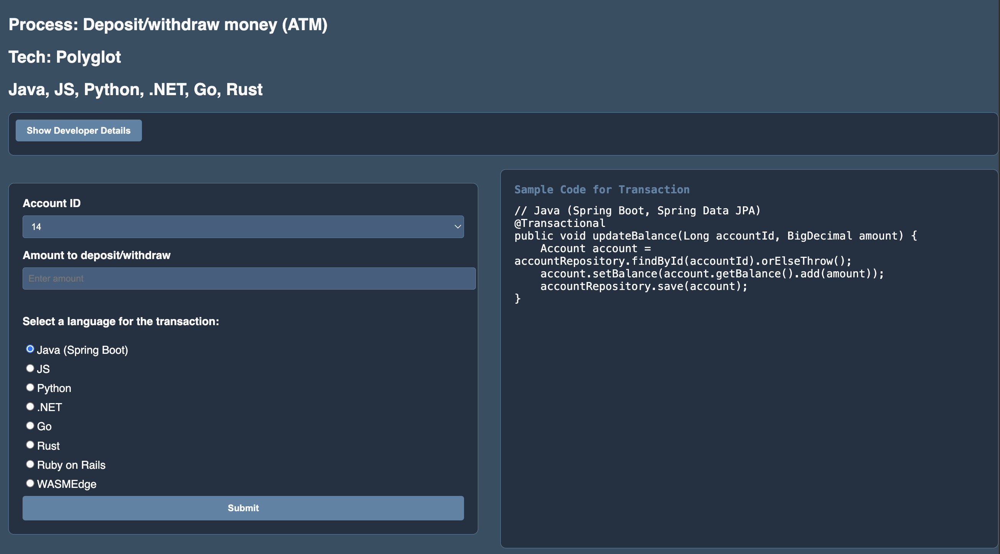

# Mobile check deposit

## Introduction

### Objectives

-  Understand how to make basic connection and operations for any language you are working with.

### Prerequisites

This lab assumes you have already completed the earlier labs.

## Task 1: Review source code

1. See source code under `financial/atm-polyglot` directory of the Github repos

## Task 2: Run the application

1. Follow the steps in the README.md in the same source directory

You may now proceed to the next lab.

## Learn More

* [Oracle Database](https://bit.ly/mswsdatabase)
* [Prevent and Detect Fraud with Immutable and Blockchain Tables on Oracle Autonomous Database workshop](https://livelabs.oracle.com/pls/apex/dbpm/r/livelabs/view-workshop?wid=4142)

## Acknowledgements
* **Authors** - Paul Parkinson, Architect and Developer Advocate
* **Last Updated By/Date** - Paul Parkinson, 2025

