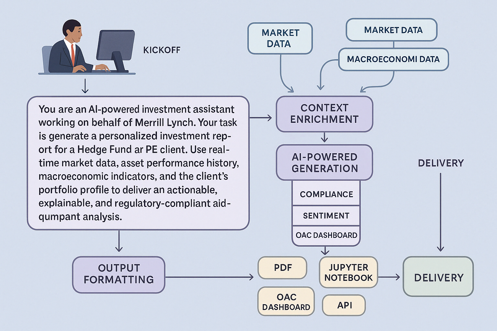

# Bank Account Statement and Portfolio Analysis

## Introduction

Goal: Generate a basic PDF report analyzing Oracle's recent stock data for a generic institutional client.

MVP Flow:

Data Ingestion (RAG Agent focusing on Web Data):
- Action: The RAG Agent will be primarily focused on fetching the latest Oracle (ORCL) stock data directly from Yahoo Finance. For this MVP, we'll skip ingesting data from local PDF files to keep it simple.
- Tool/Method: Use a basic web scraping library (if allowed and feasible within a day) or a direct API call to Yahoo Finance (if they provide one with free tier access and easy integration).

Basic Prompt-Driven Analysis (Analytic Agent):
- Action: The Analytic Agent will take the raw stock data fetched by the RAG Agent and analyze it based on a predefined, simple prompt.
- Example Prompt: "Analyze the recent stock data for Oracle (ORCL) from Yahoo Finance. Identify key trends like the latest closing price, daily change, and any significant volume changes. Provide a brief summary of these observations."

Minimal Narrative Generation (Narrative Generation Agent - Basic PDF Output):
- Action: The Narrative Generation Agent will take the output of the Analytic Agent and generate a very basic PDF report.
- PDF Structure: The PDF will have a title (e.g., "Oracle Stock Analysis"), a section for the raw data (maybe a small table of the fetched information), and a section for the analysis summary provided by the Analytic Agent. Keep formatting extremely basic.

Elementary Output/Consumption (Personalization Agent - Very Basic):
- Action: For this MVP, personalization will be minimal. The report will be geared towards a generic institutional client interested in high-level Oracle stock information. The "personalization" is simply focusing the analysis on Oracle.

Direct Delivery (Client Communication Agent - Packaging):
- Action: The output PDF from the Narrative Generation Agent will be the deliverable. For this MVP, the "packaging and delivery" can be as simple as saving the PDF to a designated location.

Accuracy Check (Integrated into Analytic Agent for MVP):
- Action: Due to the time constraint, the Accuracy and Quality Assurance Agent's role will be very basic and likely integrated into the Analytic Agent. The prompt could include instructions for the Analytic Agent to double-check the fetched data (e.g., ensuring the date is current) and the analysis for logical consistency. A quick manual review by Paul after the report generation is also recommended.

Agents and their Roles in the Simplest MVP:
- RAG Agent: Fetch Oracle stock ticker data from Yahoo Finance (web).
- Data Ingestion Agents (One and Two): Their roles are merged into the RAG Agent for fetching web data. Ingesting PDFs is skipped for this MVP.
- Analytic Agent: Analyze the fetched stock data based on a simple predefined prompt.
- Accuracy and Quality Assurance Agent: Basic checks integrated into the Analytic Agent and a quick manual review.
- Narrative Generation Agent: Generate a very basic PDF report with raw data and analysis summary.
- Personalization Agent: Focus analysis on Oracle for a generic institutional client (minimal personalization).
- Client Communication Agent: Save the generated PDF as the final deliverable.

### Objectives

-  Understand 

### Product Management And Other Contacts

- 

### Prerequisites

This lab assumes you have already completed the earlier labs.

## Task 1: setup .....

1. setup...

other notes
apache arabac datatype, python numpy, 0 cost converstion , so readonly into dataframes parquay delta lake - chris jones blog on medium

You may now proceed to the next lab.

## Learn More

* [Oracle Database](https://bit.ly/mswsdatabase)
* [python-oracledb 3.0 Data Frames — a new way to query data](https://medium.com/oracledevs/python-oracledb-3-0-data-frames-a-new-way-to-query-data-4139418bef82)
* [Writing to Parquet and Delta Lake files from Oracle Database using Python](https://levelup.gitconnected.com/writing-to-parquet-and-delta-lake-files-from-oracle-database-using-python-5f7382bfcdc6)

## Acknowledgements
* **Authors** - Paul Parkinson, Architect and Developer Advocate
* **Last Updated By/Date** - Paul Parkinson, 2025

