# Setup

## Introduction

In this lab, we will provision and setup the resources to execute microservices in your tenancy.  

Estimated Time: 25 minutes

Watch the video below for a quick walk through of the lab.
** Note the steps to create or use your own Kubernetes cluster may very and so the documentation should be followed.

[](youtube:KB9q2ADkjBc) 

### Objectives

* Clone the setup and microservices code
* Bring your own Kubernetes cluster or create an OKE cluster
* Execute setup

## Task 1: Log in to the Oracle Cloud Console and Select the Home Region

1. If you haven't already, sign in to your account.

2. Be sure to select the **home region** of your tenancy. Setup will only work in the home region.

  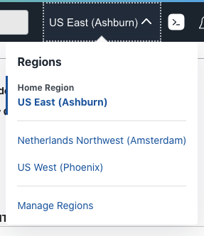


## Task 2: Check Your Tenancy Service Limits

If you have a **fresh** free trial account with credits then you can be sure that you have enough quota and you can proceed to the next step.

If, however, you have already used up some quota on your tenancy, perhaps while completing other workshops, there may be insufficient quota left to run this workshop. The most likely quota limits you may reach are summarized in the following table.

| Service          | Scope  | Resource                                             | Available | Free Account Limit |
|------------------|:------:|------------------------------------------------------|:---------:|:------------------:|
| Compute          | AD-1   | Cores for Standard.E2 based VM and BM Instances      | **3**     | 6                  |
| Container Engine | Region | Cluster Count                                        | **1**     | 1                  |
| Database         | Region | Autonomous Transaction Processing Total Storage (TB) | **2**     | 2                  |
|                  | Region | Autonomous Transaction Processing OCPU Count         | **4**     | 8                  |
| LbaaS            | Region | 100Mbps Load Balancer Count                           | **3**     | 3                  |

1. Quota usage and limits can be check through the console: **Limits, Quotas and Usage** in the **Governance & Administration** section , For example:

  

2. The Tenancy Explorer is used to locate existing resources: **Governance & Administration** --> **Governance** --> **Tenancy Explorer**. Use the "Show resources in subcompartments" feature to locate all the resources in your tenancy:

  

  It may be necessary to delete some resources to make space to run the workshop. Once you have enough space you may proceed to the next step.

## Task 3: If necessary, create a compartment and OKE Kubernetes cluster. Then insure the Kubernetes config for the cluster is setup in (Cloud) Shell properly.

You will need to create a compartment unless you have one that you will use already.

The workshop is meant to run on any Kubernetes cluster on any cloud. 
If you do have a cluster, simply make sure you have either the default context of your ~/.kube/config file or $KUBECONFIG set appropriately to point to the cluster you want to use (eg by issuing `kubectl get pods --all-namespaces`). You can then proceed to the next task, Task 5.
If you do not have a cluster, you can create an OKE cluster to use using the following steps

1. Open the OCI console and select `Identity and Security` from the left-hand side dropdown menu and then select `Compartments`
   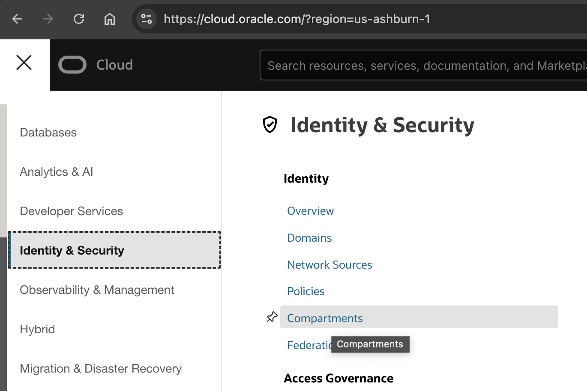
2. Click the `Create Compartment` button, enter a name for the compartment (any name will do) and description, and click `Create Compartment`
   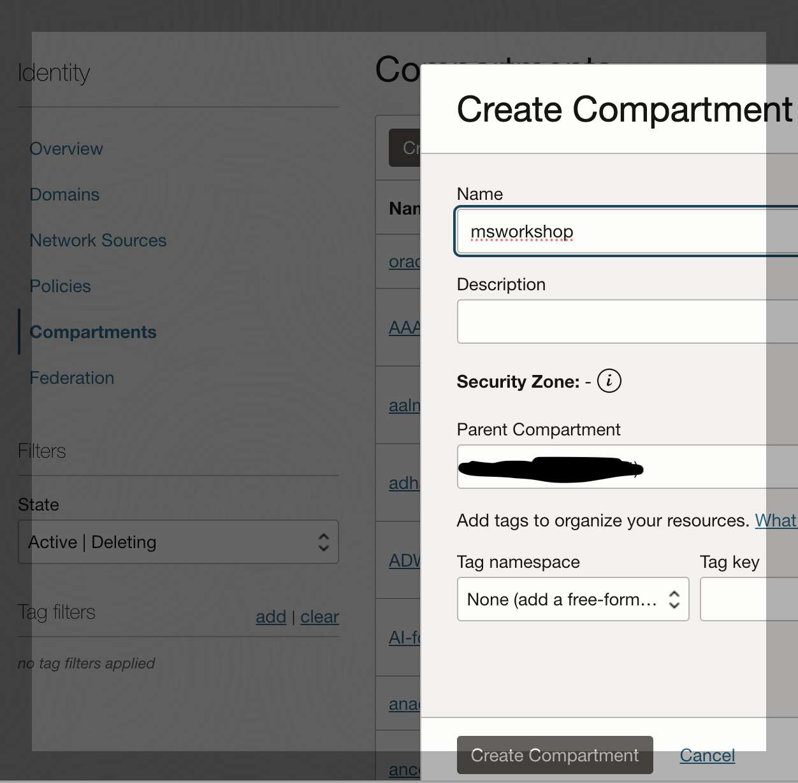
3. Select the compartment and copy the OCID of the compartment. You will provide this OCID when prompted during setup later.
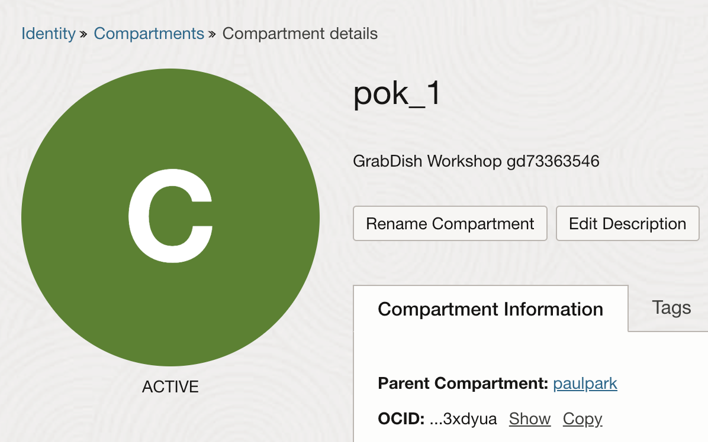

The workshop is meant to run on any Kubernetes cluster on any cloud.
  - If you do have a cluster, verify you can access it from Cloud Shell (eg by issuing `kubectl get pods --all-namespaces`) and that either you have the default context of your ~/.kube/config file or $KUBECONFIG set appropriately to point to the config of the cluster you want to use. You can then proceed to the next task, Task 5.
  - If you do not have a cluster, you can create an OKE cluster to use using the following steps...

1. Open the OCI console and select `Developer Services` from the left-hand side dropdown menu and then select `Kubernetes Cluster (OKE)`
   
2. Click the `Create Cluster` button, enter a name for the cluster (any name will do) and description, and click `Create Compartment`
   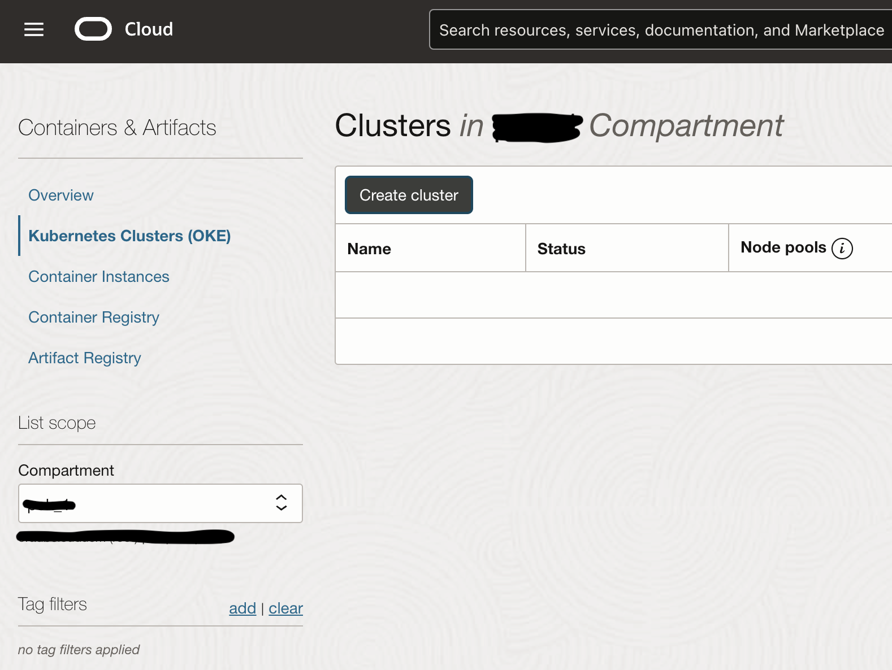
3. Select the `Quick create` option and `Submit`
   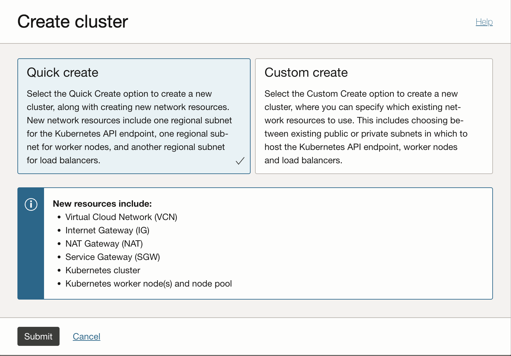
4. Enter the name (any name will do), compartment, and version to be used. Default values are acceptable.
   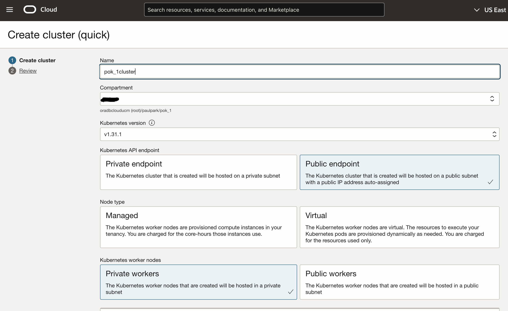
5. Enter the shape and image to be used. Default values are acceptable. Click `Next`
   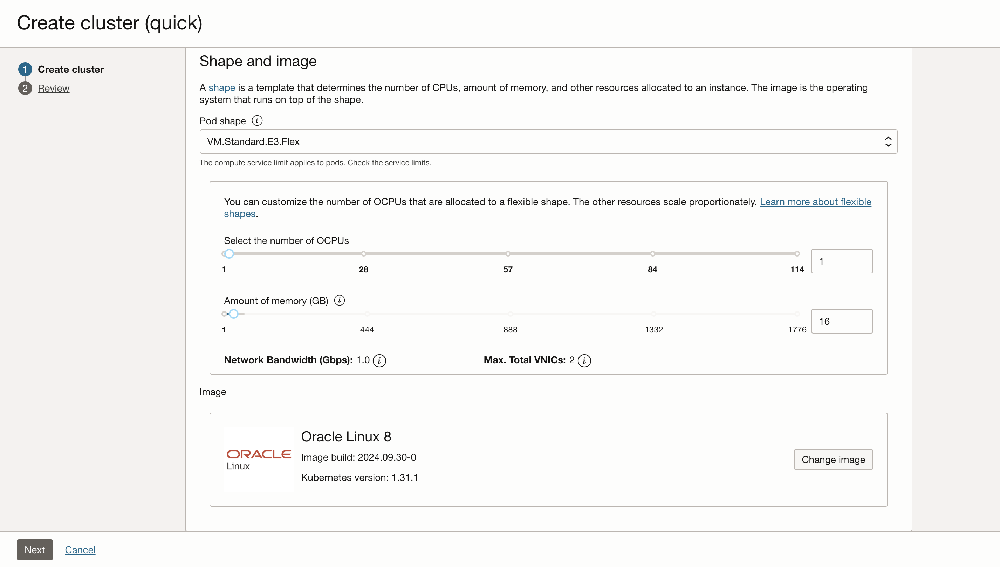
6. You will see the list of resources that will be created for you. Click `Create Cluster` to see them provisioned
   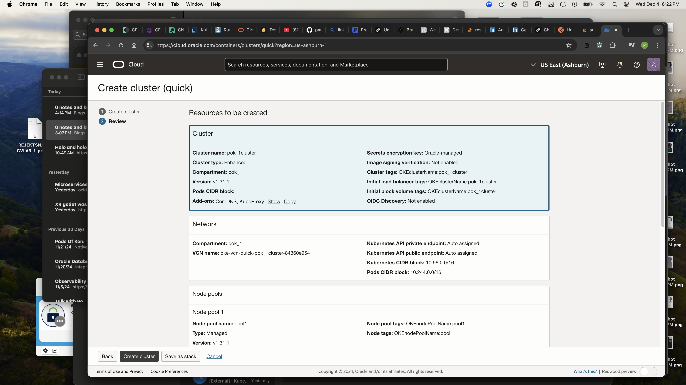
   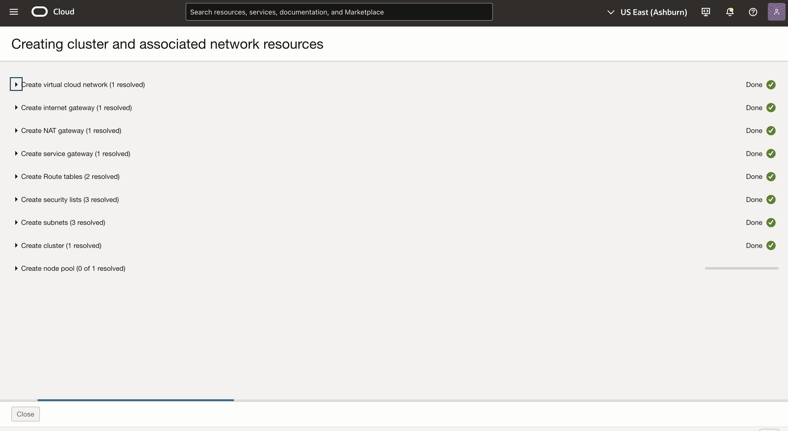
7. You can check the status of the provisioning of the cluster (generally takes around 5 minutes).  
   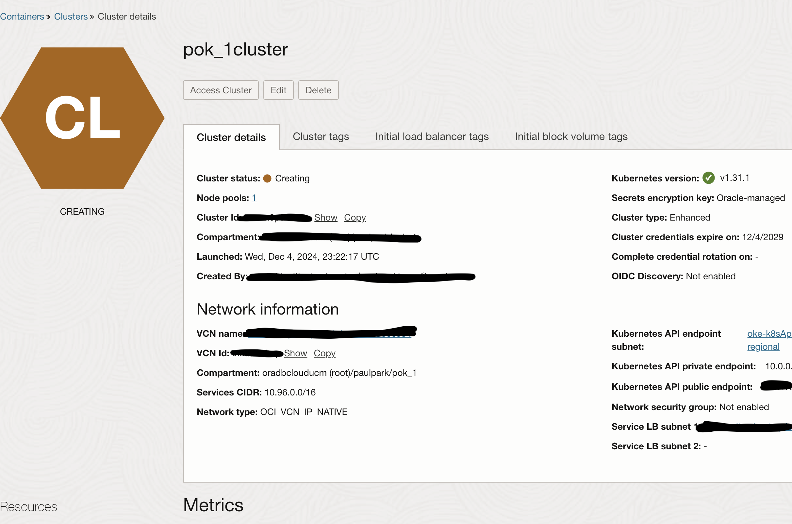
8. You can conduct the rest of the setup for the workshop in parallel. Check back to see when the Kubernetes cluster is provisioned and ready as you will issue the `state_set_done K8S_THREAD` command for setup to continue.  More on this in the following tasks... 

## Task 4: Launch Cloud Shell

Cloud Shell is a small virtual machine running a "bash" shell which you access through the Oracle Cloud Console. Cloud Shell comes with a pre-authenticated command line interface in the tenancy region. It also provides up-to-date tools and utilities.

1. Click the Cloud Shell icon in the top-right corner of the Console.


Select the x86 architecture for the shell by going to the upper left of the shell and clicking `Architecture`

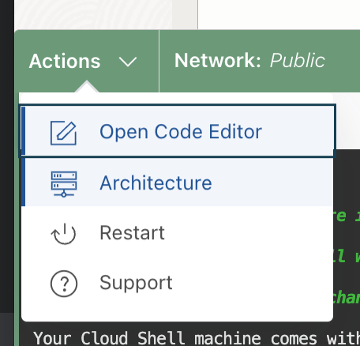

Then select the x86 architecture for the shell and restart.

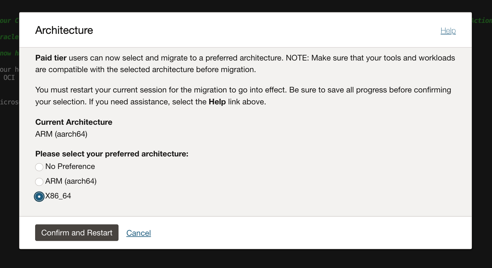

> **Note:** Cloud Shell uses websockets to communicate between your browser and the service. If your browser has websockets disabled or uses a corporate proxy that has websockets disabled you will see an error message ("An unexpected error occurred") when attempting to start Cloud Shell from the console. You also can change the browser cookies settings for a specific site to allow the traffic from *.oracle.com


## Task 5: Create a Folder to Contain the Workshop Code And Clone the Source Code

1. (Re)open Cloud Shell terminal and create a directory to contain the workshop code. The directory name is used to create a compartment of the same name in your tenancy. The directory name must have between 1 and 13 characters, contain only letters or numbers, and start with a letter. Make sure that a compartment of the same name does not already exist in your tenancy or the setup will fail. For example:

	```
	<copy>
	mkdir grabdish
	</copy>
	```

   All the resources created by the setup are created in this compartment. This will let you to quickly delete and cleanup afterward.  

2. Change directory to the directory that you have created. The setup will fail if you do not complete this step. For example:

	```
	<copy>
	cd grabdish
	</copy>
	```

3. Clone from the GitHub repository using the following command.  

	```
	<copy>
	git clone https://github.com/oracle-devrel/microservices-datadriven.git
	</copy>
	```
    You should now see the directory `microservices-datadriven` in the directory that you created.

## Task 6: Verify Kubernetes cluster exists and is accessible from Cloud Shell

As mentioned in the earlier task, the workshop is meant to run on any Kubernetes cluster on any cloud.
- If you brought an existing cluster, verify you can access it from Cloud Shell (eg by issuing `kubectl get pods --all-namespaces`) and that either you have the default context of your ~/.kube/config file or $KUBECONFIG set appropriately to point to the config of the cluster you want to use. You can then proceed to the next task, Task 5.
- If you provisioned an OKE Kubernetes cluster, do the following... 
  *Note that this can be done in parallel with Task 7 setup.
1. Verify the OKE Kubernetes cluster is in provisioned and running state.
2. Click the `Access Cluster` button and then click the `Copy` to copy the oci CLI command for `Cloud Shell Access`
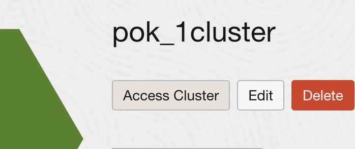
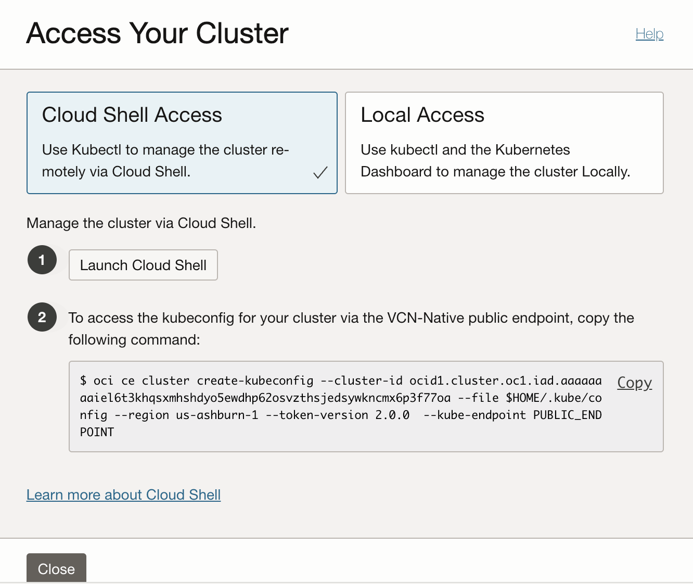
3. Back in the Cloud Shell, paste the command you just copied. This will add an entry in your ~/.kube/config file so you can access the cluster.
4. Test it by running the following kubectl in the terminal. You should see a list of pods.
```
<copy>
kubectl get pods --all-namespaces
</copy>
```
5. Once verified, run the following state_set_done command in the Cloud Shell.  This will let the setup know the Kubernetes cluster is ready and the setup can proceed.
```
<copy>
state_set_done K8S_THREAD
</copy>
```
6. *If you are running Task 7 setup in parallel you can run the command in a separate/second Cloud Shell or you can stop (eg ctrl+C) the setup , run the `state_set_done` command, and then run `setup` to continue.

## Task 7: Start the Setup

1. Execute the following sequence of commands to start the setup.  

    ```
	<copy>
	source microservices-datadriven/workshops/dcms-oci/source.env
	setup
	</copy>
	```

    > **Note:** Cloud shell may disconnect after a period of inactivity. If that happens, you can reconnect and then run the command to resume the setup.

    The setup process will typically take less than 20 minutes to complete.  

2. The setup will ask you to confirm that there are no other un-terminated OKE clusters exist in your tenancy.

    ```text
	  You are limited to only one OKE cluster in this tenancy. This workshop will create one additional OKE cluster and so any other OKE clusters must be terminated.
	  Please confirm that no other un-terminated OKE clusters exist in this tenancy and then hit [RETURN]?
	```
    To confirm that there are no other un-terminated OKE clusters, click the Navigation Menu in the upper left of Oracle Cloud Console, navigate to Developer Services and click on Kubernetes Clusters (OKE).

    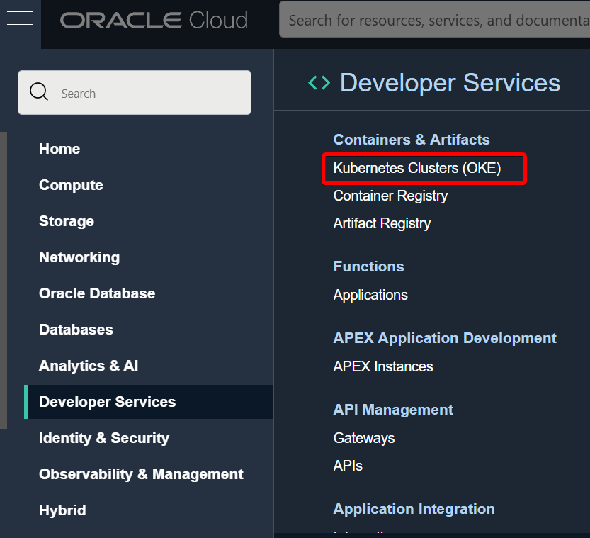

    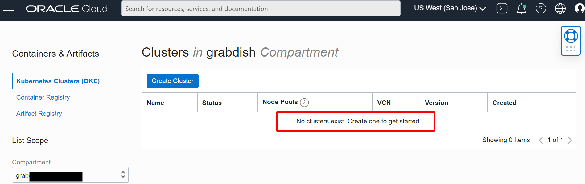

    If there are any un-terminated OKE clusters, please delete them and continue with setup steps.

    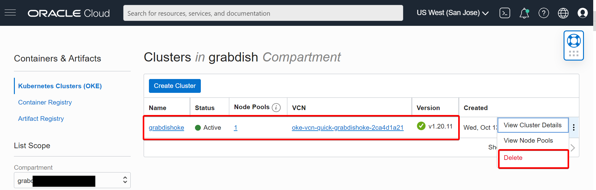


3. The setup will create the workshop resources in a compartment within your tenancy. You will be prompted to enter the compartment information.  You may choose to use an existing compartment or create a new one.

    To use an existing compartment, enter the OCID of the compartment.

    To create a new compartment, enter the name you would like to use.

    If you chose to create a new compartment, you will also be asked to enter the OCID of the parent compartment in which the new compartment is to be created.  Enter the parent compartment OCID or hit enter to use the root compartment of your tenancy.

    To get the OCID of an existing compartment, click on the Navigation Menu in the upper left of Cloud Console, navigate to **Identity & Security** and click on **Compartments**:

	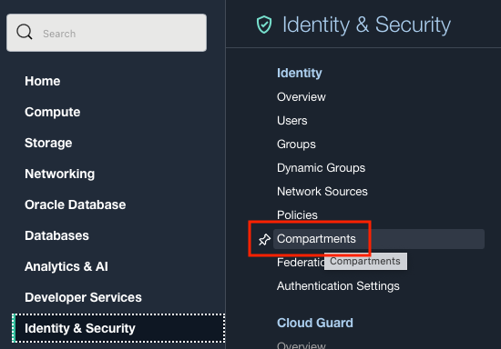

	Click on the link in the **OCID column** of the compartment, and click **Copy**:

	

4. The setup will ask for you to enter your user's OCID.

	Be sure to provide the user OCID and not the user name or tenancy OCID. The user OCID will look something like:

	`ocid1.user.oc1....<unique_ID>`

	> **Note:** Notice the format of "ocid1.user" prefix.

	Locate your menu bar in the Cloud Console and click the person icon at the far upper right.

	From the drop-down menu, select your user's name or My Profile. Note, sometimes the name link is missing in which case select the **User Settings** link. Do not select the **Tenancy** link.

	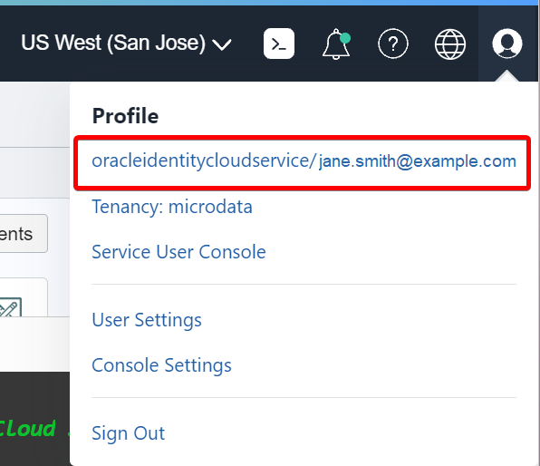

	Alternative:

	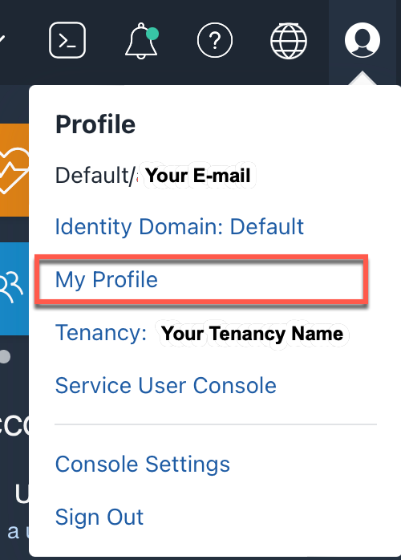

	Click Show to see the details and then click Copy to copy the user OCID to the clipboard, paste in the copied data in console.

	

5. The setup will automatically upload an Auth Token to your tenancy so that docker can log in to the Oracle Cloud Infrastructure Registry. If there is no space for a new Auth Token, the setup will ask you to remove an existing token to make room. This is done through the Oracle Cloud Console.

	Locate your menu bar and click the person icon at the far upper right. From the drop-down menu, select your user's name.

	

	On the User Details console, click Auth Tokens under Resources.

	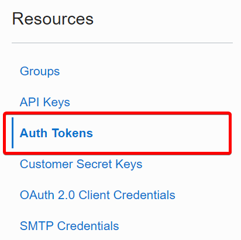

	On the Auth Tokens screen, highlight the existing token(s) and delete by clicking Delete from the drop-down menu.

	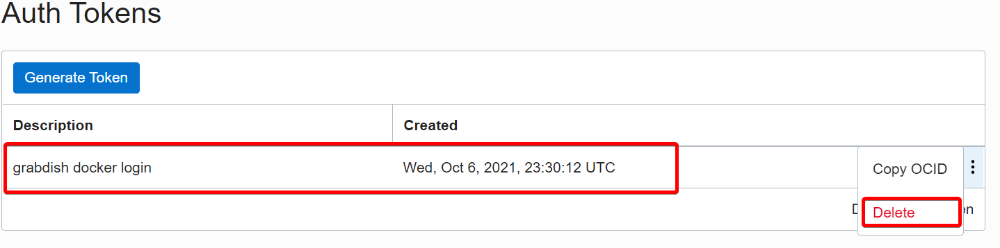

6. The setup will ask you to enter an admin password for the databases. For simplicity, the same password will be used for both the order and inventory databases. Database passwords must be 12 to 30 characters and contain at least one uppercase letter, one lowercase letter, and one number. The password cannot contain the double quote (") character or the word "admin".

7. The setup will also ask you to enter a UI password that will be used to enter the microservice frontend user interface. Make a note of the password as you will need it later.  The UI password must be 8 to 30 characters.

## Task 8: Monitor the Setup

The setup will provision the following resources in your tenancy:

| Resources              | Oracle Cloud Console Navigation                                               |
|------------------------|-------------------------------------------------------------------------------|
| Object Storage Buckets | Storage --> Object Storage --> Buckets                                        |
| Databases (2)          | Oracle Database -- Autonomous Database -- Autonomous Transaction Processing   |
| OKE Cluster            | Developer Services -- Containers -- Kubernetes Clusters (OKE)                 |
| Registry Repositories  | Developer Services -- Containers -- Container Registry                        |

1. You should monitor the setup progress from a different browser window or tab.  It is best not to use the original browser window or not to refresh it as this may disturb the setup or you might lose your shell session. Most browsers have a "duplicate" feature that will allow you to quickly created a second window or tab.

	

2. From the new browser window or tab, navigate around the console to view the resources within the new compartment. The table includes the console navigation for each resource. For example, here we show the database resources:

	

	> **Note:** Cloud Shell sessions have a maximum length of 24 hours, and time out after 20 minutes of inactivity.

## Task 9: Complete the Setup

1. The setup will provide a summary of the setup status as it proceeds. Once everything has completed you will see the message: **SETUP COMPLETED**.

2. While the background setup jobs are running you can monitor their progress with the following command.

	```
	<copy>
	ps -ef
	</copy>
	```

3. You can monitor log files located in the $GRABDISH_LOG directory.

	```
	<copy>
	ls -al $GRABDISH_LOG
	</copy>
	```

   	Once the setup has completed you are ready to [move on to Lab 2](#next).

   	> **Note:** Builds may continue to run even after the setup has completed.

4. The status of the builds can be monitored with this command:

	```
	<copy>
	status
	</copy>
	```


## Scaling, Sizing, and Performance


## Task 1: Install a Load Testing Tool and Start an External Load Balancer for the Order Service

1. Start an external load balancer for the order service.

    ```
    <copy>cd $GRABDISH_HOME/order-helidon; kubectl create -f ext-order-ingress.yaml -n msdataworkshop</copy>
    ```

   Check the ext-order LoadBalancer service and make note of the external IP address. This may take a few minutes to start.

    ```
    <copy>services</copy>
    ```

   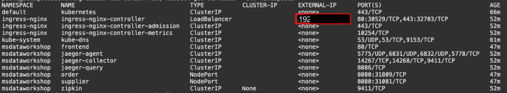

   Set the LB environment variable to the external IP address of the ingress-nginx-controller service. Replace 123.123.123.123 in the following command with the external IP address.

    ```
    <copy>export LB='123.123.123.123'</copy>
    ```

<if type="multicloud-freetier">
+ `export LB=$(kubectl get gateway msdataworkshop-order-helidon-appconf-gw -n msdataworkshop -o jsonpath='{.spec.servers[0].hosts[0]}')`
</if>

2. Install a load testing tool.

   You can use any web load testing tool to drive load. Here is an example of how to install the k6 tool ((licensed under AGPL v3). Or, you can use artillery and the script for that is also provided below. To see the scaling impacts we prefer doing this lab with k6.

   ```
   <copy>cd $GRABDISH_HOME/k6; wget https://github.com/loadimpact/k6/releases/download/v0.27.0/k6-v0.27.0-linux64.tar.gz; tar -xzf k6-v0.27.0-linux64.tar.gz; ln k6-v0.27.0-linux64/k6 k6</copy>
   ```

   

   (Alternatively) To install artillery:

   ```
   <copy>cd $GRABDISH_HOME/artillery; npm install artillery@1.6</copy>
   ```

## Task 2: Load Test and Scale the Application Tier

1.  Execute a load test using the load testing tool you have installed.

    Here is an example using k6:

    ```
    <copy>cd $GRABDISH_HOME/k6; ./test.sh</copy>
    ```

    Note the request rate. This is the number of http requests per second that were processed.

    

    (Or) Using artillery:

    ```
    <copy>cd $GRABDISH_HOME/artillery; ./test.sh</copy>
    ```

2. Scale to **2 service replicas**.

    ```
    <copy>kubectl scale deployment.apps/order-helidon --replicas=2 -n msdataworkshop</copy>
    ```

   List the running pods.

    ```
    <copy>pods</copy>
    ```

   Note there are now two order-helidon replicas. Keep polling until both replicas are ready.

   

3. Execute the load test again.

   For example:

    ```
    <copy>cd $GRABDISH_HOME/k6; ./test.sh</copy>
    ```

   Note the average response time for the requests. Throughput has increased and response time has returned to normal.

   

   (Or) Using artillery:

    ```
    <copy>cd $GRABDISH_HOME/artillery; ./test.sh</copy>
    ```

4. Scale to **3 Replicas**.

    ```
    <copy>kubectl scale deployment.apps/order-helidon --replicas=3 -n msdataworkshop</copy>
    ```

   List the running pods.

    ```
    <copy>pods</copy>
    ```

   Note there are now three order-helidon replicas. Keep polling until all replicas are ready.

   

5. Execute the load test again.

   For example:
    ```
    <copy>cd $GRABDISH_HOME/k6; ./test.sh</copy>
    ```

   Note the median response time for the requests and the request rate. Note how the response time is still degraded and the request rate has not improved significantly.

   

   (Or) Using artillery:

    ```
    <copy>cd $GRABDISH_HOME/artillery; ./test.sh</copy>
    ```

## Task 3: Load Test and Scale the Database Tier

1. To scale the Order DB Autonomous Transaction Processing database to **2 OCPUs**, click the navigation icon in the top-left corner of the Console and go to Autonomous Transaction Processing.

   

2. Select DB1, the database that contains the order schema, click **Manage Scaling**. Enter 2 in the OCPU field. Click **Apply**.

   

   

3. Wait until the scaling has completed (Lifecycle State: Available).

   

4. Execute the load test again.

   For example:

    ```
    <copy>cd $GRABDISH_HOME/k6; ./test.sh</copy>
    ```

   Note the request rate.  Throughput has increased.

   

   (Or) Using artillery:

    ```
    <copy>cd $GRABDISH_HOME/artillery; ./test.sh</copy>
    ```

## Task 4: Scale Down the Application and Database Tiers

1. To scale the Order database down to **1 OCPUs**, click the hamburger icon in the top-left corner of the Console and go to Autonomous Transaction Processing.

   

2. Click **Manage Scaling** and enter 1 in the OCPU field. Click **Apply**.

   

   

3. Scale the order-helidon service back to **1 replica**.

    ```
    <copy>kubectl scale deployment.apps/order-helidon --replicas=1 -n msdataworkshop</copy>
    ```


You may now proceed to the next lab.

## Learn More

* [Oracle Database](https://bit.ly/mswsdatabase)

## Acknowledgements
* **Authors** - Paul Parkinson, Architect and Developer Advocate
* **Last Updated By/Date** - Paul Parkinson, 2024


