# Setup

## Introduction

In this lab, we will provision and setup the resources to execute microservices in your tenancy.  

Estimated Time: 25 minutes

Watch the video below for a quick walk through of the lab.
** Note the steps to create or use your own Kubernetes cluster may very and so the documentation should be followed.

[](youtube:KB9q2ADkjBc) 

### Objectives

* Setup Oracle Database, Kubernetes, etc.


NOTE: Currently True Cache is not supported on autonomous database and so labs that use True Cache will require appropriate database.

## Task 1: Optionally setup Oracle Backend for Microservices and AI

1. This a convenient option to provision an Oracle Autonomous Database and Kubernetes with a number of preconfigured components for microservices, etc.  
    Follow the directions found here: https://docs.oracle.com/en/database/oracle/backend-for-microservices-and-ai/index.html
    
    You can also use a resource manager stack to setup Oracle Backend for Microservices and AI but accessing OCI Marketplace

## Task 2: If you have not done so, create an Oracle Database

1. See https://www.oracle.com/database/free/
2. All features and products in the labs can run on ADB (Autonomous Database) except for the True Cache 

## Task 3: If you have not done so, create Kubernetes cluster 

1. Whether it is Oracle OKE cluster, or another cloud vendor's Kubernetes, on-prem, on laptop installed via Kind, etc. as long as kubectl commands can be executed against it.


#  Scaling, Sizing, and Performance

** Note that these scaling and scaling, sizing, and performance procedures can be run for any lab and product as so the generic "financial-service" term is used throughout this doc.

## Task 1: Install a Load Testing Tool and Expose an Endpoint for Testing

1. Expose and endpoint to test the financial-service.

    This is the endpoint that will receive stress loading, etc., whatever it may be.

2. Install a load testing tool.

   You can use any web load testing tool to drive load. Here is an example of how to install the k6 tool ((licensed under AGPL v3). Or, you can use artillery and the script for that is also provided below. To see the scaling impacts we prefer doing this lab with k6.

   ```
   <copy>cd $WORKSHOP_HOME/k6; wget https://github.com/loadimpact/k6/releases/download/v0.27.0/k6-v0.27.0-linux64.tar.gz; tar -xzf k6-v0.27.0-linux64.tar.gz; ln k6-v0.27.0-linux64/k6 k6</copy>
   ```

   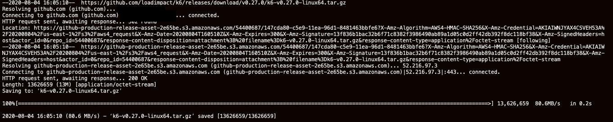

   (Alternatively) To install artillery:

   ```
   <copy>cd $WORKSHOP_HOME/artillery; npm install artillery@1.6</copy>
   ```

## Task 2: Load Test and Scale the Application Tier

1.  Execute a load test using the load testing tool you have installed.

    Here is an example using k6:

    ```
    <copy>cd $WORKSHOP_HOME/k6; ./test.sh</copy>
    ```

    Note the request rate. This is the number of http requests per second that were processed.

    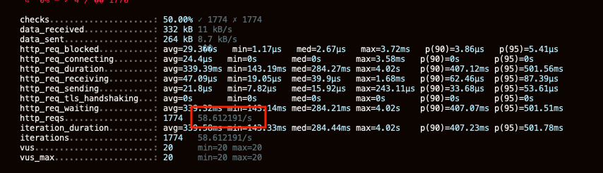

    (Or) Using artillery:

    ```
    <copy>cd $WORKSHOP_HOME/artillery; ./test.sh</copy>
    ```

2. Scale the financial-service to **2 service replicas**.

    ```
    <copy>kubectl scale deployment.apps/financial-service --replicas=2 -n msdataworkshop</copy>
    ```

   List the running pods.

    ```
    <copy>pods</copy>
    ```

   Note there are now two financial-service replicas. Keep polling until both replicas are ready.

   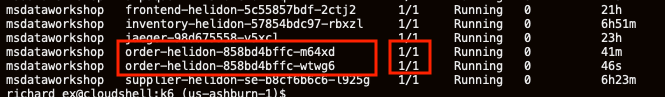

3. Execute the load test again.

   For example:

    ```
    <copy>cd $WORKSHOP_HOME/k6; ./test.sh</copy>
    ```

   Note the average response time for the requests. Throughput has increased and response time has returned to normal.

   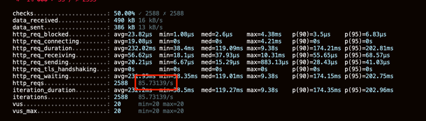

   (Or) Using artillery:

    ```
    <copy>cd $WORKSHOP_HOME/artillery; ./test.sh</copy>
    ```

4. Scale to **3 Replicas**.

    ```
    <copy>kubectl scale deployment.apps/financial-service --replicas=3 -n msdataworkshop</copy>
    ```

   List the running pods.

    ```
    <copy>pods</copy>
    ```

   Note there are now three financial-service replicas. Keep polling until all replicas are ready.

   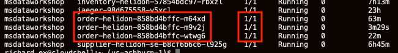

5. Execute the load test again.

   For example:
    ```
    <copy>cd $WORKSHOP_HOME/k6; ./test.sh</copy>
    ```

   Note the median response time for the requests and the request rate. Note how the response time is still degraded and the request rate has not improved significantly.

   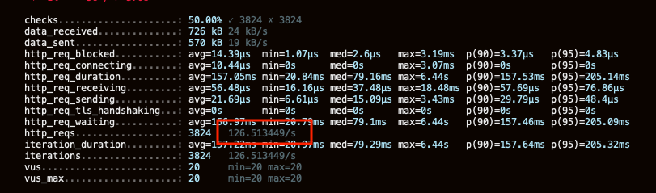

   (Or) Using artillery:

    ```
    <copy>cd $WORKSHOP_HOME/artillery; ./test.sh</copy>
    ```

## Task 3: Load Test and Scale the Database Tier

1. To scale the Autonomous Database to **2 OCPUs**, click the navigation icon in the top-left corner of the Console and go to Autonomous Transaction Processing.

   

2. Select the database and click **Manage Scaling**. Enter 2 in the OCPU field. Click **Apply**.

   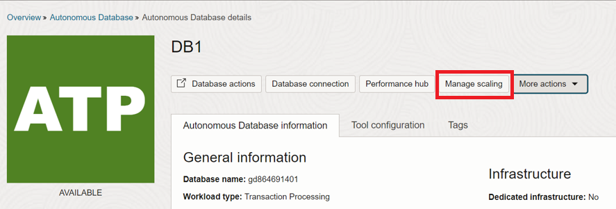

   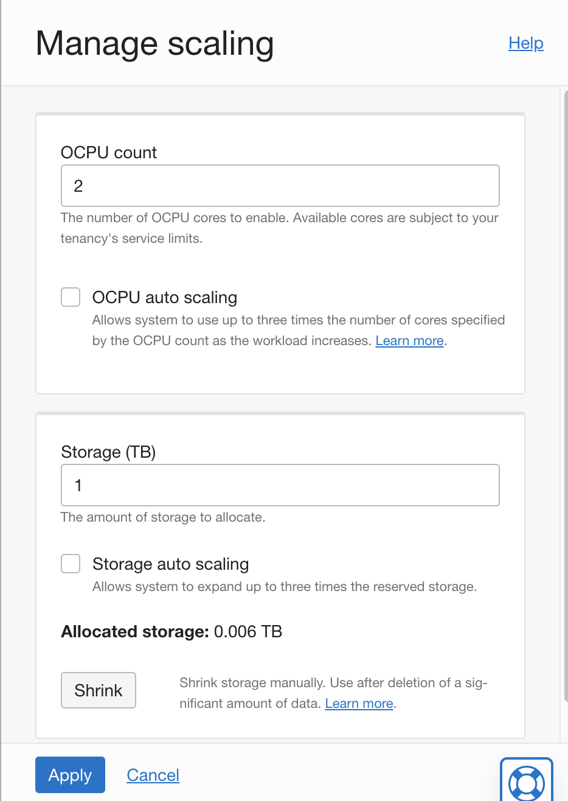

3. Wait until the scaling has completed (Lifecycle State: Available).

   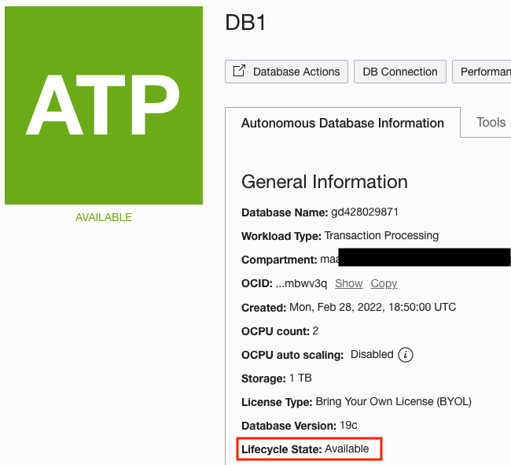

4. Execute the load test again.

   For example:

    ```
    <copy>cd $WORKSHOP_HOME/k6; ./test.sh</copy>
    ```

   Note the request rate.  Throughput has increased.

   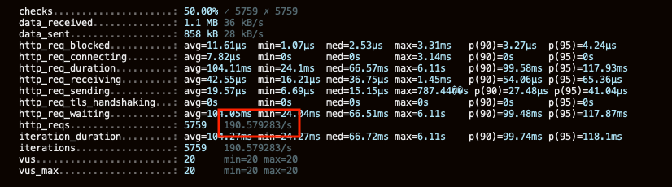

   (Or) Using artillery:

    ```
    <copy>cd $WORKSHOP_HOME/artillery; ./test.sh</copy>
    ```

## Task 4: Scale Down the Application and Database Tiers

1. To scale the database down to **1 OCPUs**, click the hamburger icon in the top-left corner of the Console and go to Autonomous Transaction Processing.

   

2. Click **Manage Scaling** and enter 1 in the OCPU field. Click **Apply**.

   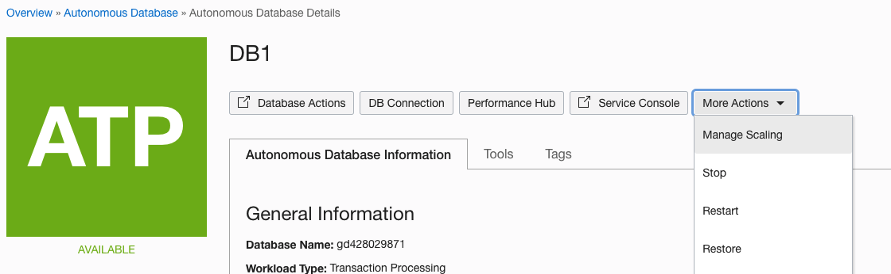

   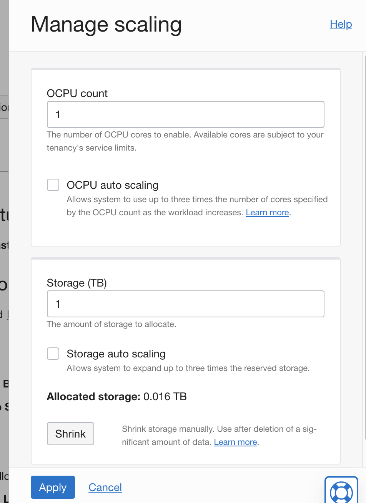

3. Scale the financial-service service back to **1 replica**.

    ```
    <copy>kubectl scale deployment.apps/financial-service --replicas=1 -n msdataworkshop</copy>
    ```


You may now proceed to the next lab.

## Learn More

* [Oracle Database](https://bit.ly/mswsdatabase)
https://docs.oracle.com/en/database/oracle/backend-for-microservices-and-ai/index.html
https://oracle.github.io/microservices-datadriven/spring/
https://oracle.github.io/microservices-datadriven/cloudbank/devenv/oractl/index.html

## Acknowledgements
* **Authors** - Paul Parkinson, Architect and Developer Advocate
* **Last Updated By/Date** - Paul Parkinson, 2024


