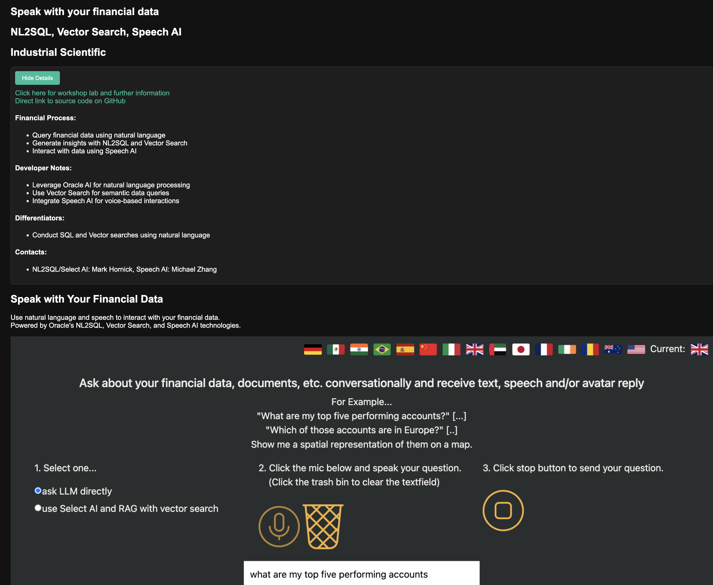

# Transfer money to internal and brokerage accounts

## Introduction

### Prerequisites

This lab only requires that you have completed the setup lab.

## Task 1: Follow the Readme

Follow the readme at [this location](https://github.com/paulparkinson/oracle-ai-for-sustainable-dev/tree/main/financial/graph-circular-payments).

## Video Tutorial

*Click the image above to watch the tutorial video*

1. Follow the steps found here on the AI Hub here: https://www.oracle.com/artificial-intelligence/speak-with-ai-about-data-using-real-time/

You may now proceed to the next lab.

## Learn More

* [Oracle Database](https://bit.ly/mswsdatabase)

## Acknowledgements
* **Authors** - Paul Parkinson, Architect and Developer Advocate
* **Last Updated By/Date** - Paul Parkinson, 2025
