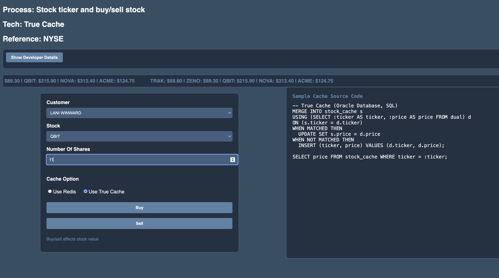

# Stock Ticker and Purchase

## Introduction

### Objectives

-  Understand True Cache and how to use it to create a sample financial service (stock ticker)

### Prerequisites

This lab only requires that you have completed the setup lab.

## Task 1: Follow the Readme

Follow the readme at [this location](https://github.com/paulparkinson/oracle-ai-for-sustainable-dev/tree/main/financial/graph-circular-payments).

## Video Tutorial

*Click the image above to watch the tutorial video*

## Task 1: Setup True Cache and try various applications such as a stocker ticker

1. Follow [Improve application performance with True Cache workshop](https://apexapps.oracle.com/pls/apex/r/dbpm/livelabs/view-workshop?wid=3933)

2. Understand True Cache by studying the [User Guide](https://docs.oracle.com/en/database/oracle/oracle-database/23/odbtc/overview-true-cache-configuration.html)

3. Follow the steps in the README.md in `financial/stock-ticker-true-cache` directory of the Github repos

You may now proceed to the next lab.

## Learn More

* [Oracle Database](https://bit.ly/mswsdatabase)
* [Oracle True Cache on OraTech YouTube](https://www.youtube.com/watch?v=ecxflHglhJo)
* https://dineshbandelkar.com/oracle-23ai-true-cache/

## Acknowledgements
* **Authors** - Paul Parkinson, Architect and Developer Advocate
* **Last Updated By/Date** - Paul Parkinson, 2025

