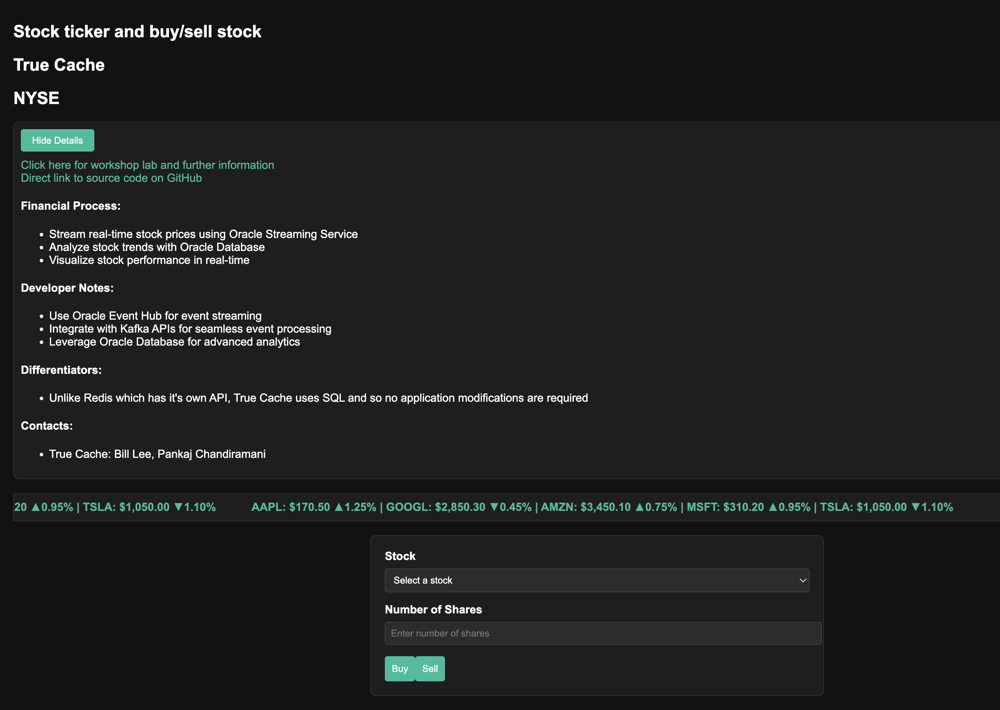

# Stock Ticker and Purchase

## Introduction

### Objectives

-  Understand True Cache and how to use it to create a sample financial service (stock ticker)

### Prerequisites

This lab assumes you have already completed the earlier labs.

## Task 1: Create and visualize a graph of transactions

1. Follow [Improve application performance with True Cache workshop](https://apexapps.oracle.com/pls/apex/r/dbpm/livelabs/view-workshop?wid=3933)

2. Understand True Cache 

You may now proceed to the next lab.

## Learn More

* [Oracle Database](https://bit.ly/mswsdatabase)
* [Oracle True Cache on OraTech YouTube](https://www.youtube.com/watch?v=ecxflHglhJo)
* https://dineshbandelkar.com/oracle-23ai-true-cache/

## Acknowledgements
* **Authors** - Paul Parkinson, Architect and Developer Advocate
* **Last Updated By/Date** - Paul Parkinson, 2025

