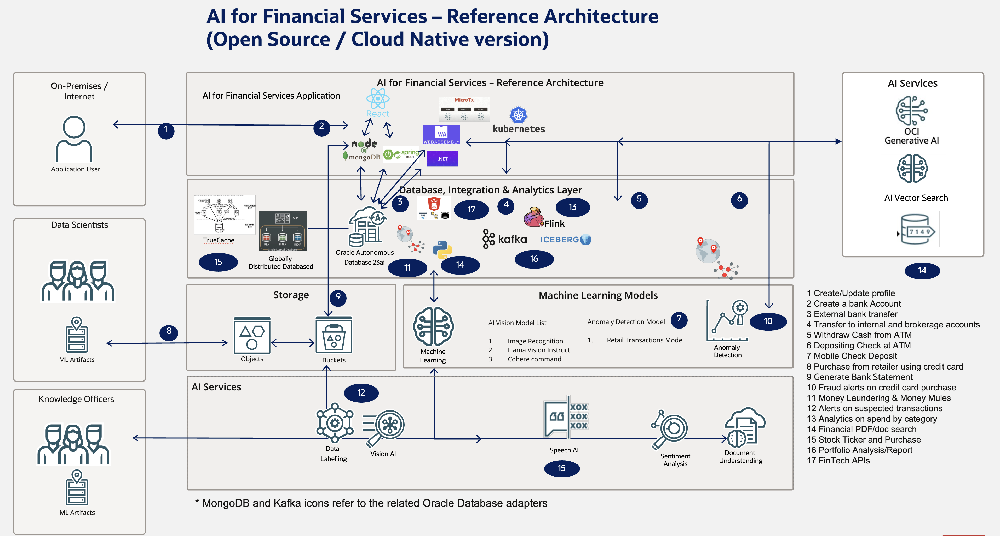

# Introduction

## About this Workshop

This workshop will help you understand the technical capabilities of the Oracle Database in the Cloud Native / Open Source Space, focusing on financial verticals

Estimated Workshop Time: Each lab ranges from 30 to 120 minutes and most do not depend on other labs (ie are modular). Entire workshop takes ~5 hours.

### About Product/Technology

See table below for labs and corresponding technology used.
NOTE: More financial personas will be added (analyst vs customer vs data scientist vs (perhaps rename knowledge officer)....)

[//]: # (If you would like to watch us do the workshop, click [here]&#40;https://youtu.be/yLBEPjOWaz0&#41;.)

### Objectives

- Learn how to develop, migrate, scale, etc. financial solutions using Oracle Database 
- Learn about microservices, Kubernetes, and Cloud Native using Java, Python, JavaScript, .NET, Go, Rust, and PL/SQL, and Rest
- Learn about Oracle features in depth and how the facilitate financial sector (eg https://www.oracle.com/a/ocom/docs/database/fintech-transformation-with-globally-distributed-database.pdf)

  <strong>Priority:</strong>
   Highest
   Mid
   Lower

<table>
  <thead>
    <tr>
      <th>Lab</th>
      <th>Financial Process</th>
      <th>Oracle and other tech used</th>
      <th>Company using</th>
      <th>% complete/ETA</th>
    </tr>
  </thead>
  <tbody>
    <tr><td>1</td><td>Infra Setup</td><td>Kubernetes, Oracle Database, Observability/Otel, Backend for MS and AI</td><td>LOLC</td><td>90% 4/14</td></tr>
    <tr><td>2</td><td>Create profile and bank account</td><td>React, Spring Boot, JPA     based on documents</td><td></td><td>90% 4/19</td></tr>
    <tr><td>3</td><td>External bank transfer</td><td>MicroTx, Lock-free reservations, Spring Boot</td><td>Early Warning, U of Naples, Shinhan Securities</td><td>60% 4/17</td></tr>
    <tr><td>4</td><td>Transfer to internal and brokerage accounts</td><td>Kafka vs TxEventQ using Spring Boot- Python, ADT TxEventQ</td><td>Responsys, FSGBU</td><td>90% 4/20</td></tr>
    <tr><td>5</td><td>Withdraw/Deposit Cash from ATM</td><td>Polyglot</td><td></td><td>30% 4/21</td></tr>
    <tr><td>6</td><td>Mobile Check Deposit</td><td>OCI Vision/document</td><td></td><td>10% 4/22</td></tr>
    <tr><td>7</td><td>Purchase from retailer using credit card</td><td>MongoDB relational duality, distributed db</td><td>Santander, ANZ Bank, Amex, BoA</td><td>30% 4/23</td></tr>
    <tr><td>8</td><td>Bank Account Statement and Portfolio Analysis</td><td>Kafka, Flink, Iceberg, Data import, Redash/Metabase/Superset, etc.</td><td>ANZ Bank, Bankinter</td><td>20% 4/23</td></tr>
    <tr style="background-color: #d4edda;"><td>9</td><td>Fraud alerts on credit card purchases</td><td>OML, Graph, Knative Eventing, CloudEvents, Spatial</td><td>Caixabank</td><td>60% 4/23</td></tr>
    <tr><td>10</td><td>Money Laundering</td><td>Graph</td><td>PaySafe, Garanti Bank, Mercardolibre</td><td>80% 4/19</td></tr>
    <tr><td>11</td><td>Financial PDF/doc search, live contracts</td><td>Vector Search, RAG, MCP and AI Agents (onedrive source, ...)</td><td>recent customer reference just announced</td><td>70% 4/23</td></tr>
    <tr><td>12</td><td>Stock Ticker and Stock Purchases</td><td>TrueCache, lock-free reservations, priority txs, session-less</td><td>NYSE</td><td>20% 4/18</td></tr>
    <tr><td>13</td><td>FinTech APIs ORDS OpenAPI</td><td>ORDS OpenAPI</td><td>Financiera Maestra, Bank of India</td><td>80% 4/16</td></tr>
    <tr><td>14</td><td>"Speak with your (financial) data"</td><td>Select AI, Vector Search (AI Explorer for Apps), Speech AI</td><td></td><td>80% 4/15</td></tr>
    <tr style="background-color: #d4edda;"><td>15</td><td>personal investment, wealth advisement</td><td></td><td>Merrill Lynch</td><td>80% 4/15</td></tr>
    <tr style="background-color: #d4edda;"><td>16</td><td>Insurance premium leakage</td><td>ML</td><td></td><td>80% 4/15</td></tr>
  </tbody>
</table>

Oracle Sharding: Hyperscale Globally Distributed Database
https://apexapps.oracle.com/pls/apex/r/dbpm/livelabs/run-workshop?p210_wid=866

Oracle Globally Distributed Database with RAFT
https://apexapps.oracle.com/pls/apex/r/dbpm/livelabs/run-workshop?p210_wid=835

Oracle Sharding Quick Start
https://apexapps.oracle.com/pls/apex/r/dbpm/livelabs/run-workshop?p210_wid=854

https://docs.oracle.com/en/database/oracle/backend-for-microservices-and-ai/index.html
https://oracle.github.io/microservices-datadriven/spring/
https://oracle.github.io/microservices-datadriven/cloudbank/devenv/oractl/index.html

BaA and Amex distributed db as described in https://www.oracle.com/a/ocom/docs/database/fintech-transformation-with-globally-distributed-database.pdf

apache arabac datatype, python numpy, 0 cost converstion , so readonly into dataframes parquay delta lake - chris jones blog on medium 

### Prerequisites

 - An Oracle Cloud Account - Please view this workshop's LiveLabs landing page to see which environments are supported.

## Learn More

* [Oracle Database](https://bit.ly/mswsdatabase)

## Acknowledgements
* **Authors** - Paul Parkinson, Architect and Developer Advocate
* **Last Updated By/Date** - Paul Parkinson, 2024
