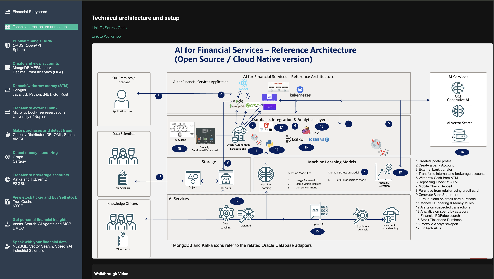

# Introduction

## About this Workshop

Audience: This workshop is meant for both specialists in line of business for financial verticals as well as developers, and also to connect the two.  
For example, the labs of the workshop are named by the financial process with additional information on tech involved, developer notes, etc..

#### All labs can be run individually or wish shared database and can be run either stand alone or on Kubernetes as microservices (all yaml, etc. required are included)

Each lab contains
- Introduction
- Objectives
- Customer References
- Product Management And Other Contacts
- Prerequisites
- Low-level, code-level side by side comparison with alternatives
- Migration
- Scaling, Sizing, and Performance
- Walk-through script and video

Estimated Workshop Time: Each lab ranges from 30 to 120 minutes and most do not depend on other labs. Entire workshop takes ~5 hours.

### About Product/Technology

See application scr below for labs and corresponding technology used.

### Objectives

- Learn about Oracle Database and AI features in depth and how they facilitate various financial services
- Learn how to develop, migrate, scale, etc. financial solutions using Oracle Database

### Prerequisites

 - As mentioned, there a multiple environments that can be used for this workshops and each lab has different requirements, with most module to the point where they can be run independently of others. See individual lab pages for instructions.
 - Cloud (any cloud) compute instances and/or sufficient local compute. "sufficient" is dependent on which labs are conducted and so varies)

## Learn More

* [Oracle Database](https://bit.ly/mswsdatabase)

## Acknowledgements
* **Authors** - Paul Parkinson, Architect and Developer Advocate
* **Last Updated By/Date** - Paul Parkinson, 2025
