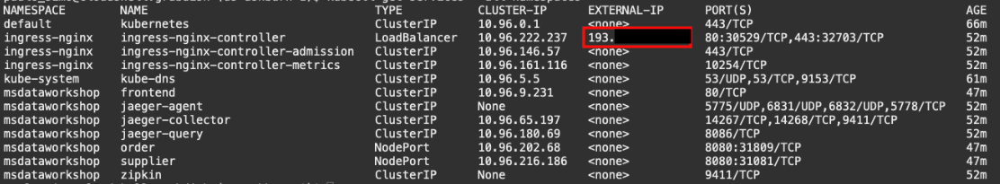
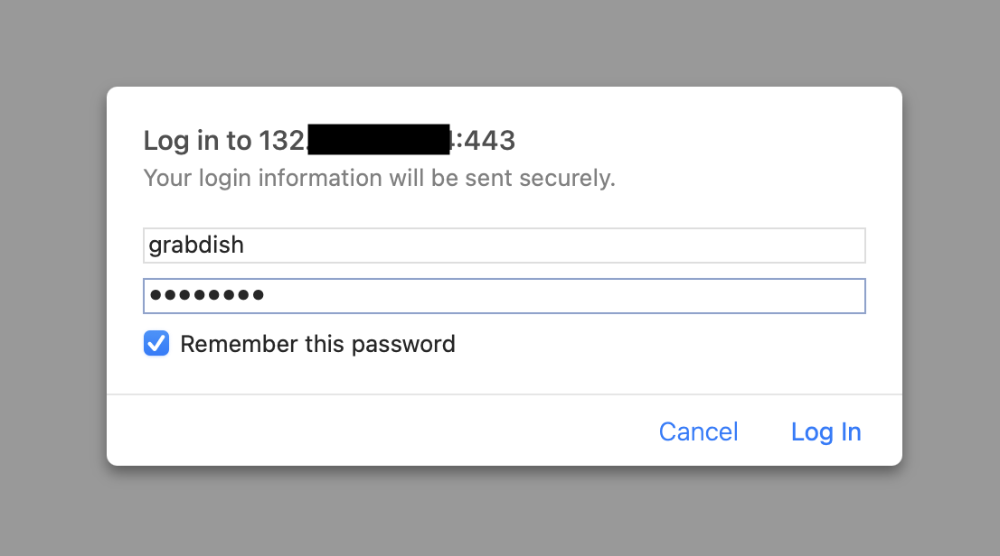
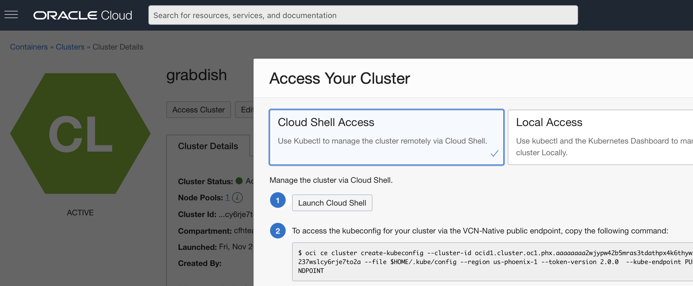

# Data-Centric Microservices Walkthrough

## Introduction

This lab will show you how to deploy the microservices on your Kubernetes cluster, walk through the functionality and explain how it works.

Estimated Time: 20 minutes

Quick walk through on how to deploy the microservices on your Kubernetes cluster.

[](youtube:8gMmjbXSR68)

### Objectives

-   Deploy and access the microservices
-   Learn how they work

### Prerequisites

* An Oracle Cloud paid account.
* The OKE cluster and the Autonomous Transaction Processing databases that you created in Lab 1

## Task 1: Deploy All the Microservices and the FrontEnd UI

1.  Check the image build status for this lab:

    ```
    <copy>status</copy>
    ```

    Keep checking until all the images for this lab have completed (status "Completed").

2.  Run the deploy script. This will create the deployment and pod for all the java images in the OKE cluster `msdataworkshop` namespace:

    ```
    <copy>cd $GRABDISH_HOME;./deploy.sh</copy>
    ```

    

3.  Once successfully created, verify deployment pods are running:

    ```
    <copy>kubectl get pods --all-namespaces</copy>
    ```

    

    Or, you can execute the shortcut command:

    ```
    <copy>pods</copy>
    ```

4. Verify the **ingress-nginx-controller** load balancer service is running, and write down the external IP address.

    ```
    <copy>kubectl get services --all-namespaces</copy>
    ```

   


    Or, you can execute the shortcut command:

    ```
    <copy>services</copy>
    ```


## Task 2: Access the FrontEnd UI

1. You are ready to access the frontend page. Open a new browser tab and enter the external IP URL:

   `https://<EXTERNAL-IP>`

   > **Note:** For convenience a self-signed certificate is used to secure this https address and so it is likely you will be prompted by the browser to allow access.

2. You will be prompted to authenticate to access the Front End microservices. The user is `grabdish` and the password is the one you entered in Lab 1.

   

3. You should then see the Front End home page. You've now accessed your first microservice of the lab!

   

   We created a self-signed certificate to protect the frontend-helidon service. This certificate will not be recognized by your browser and so a warning is displayed. It will be necessary to instruct the browser to trust this site to display the frontend. In a production implementation a certificate that is officially signed by a certificate authority should be used.


## Task 3: Understand Easy Development Process and Shortcut Commands

A number of shortcut commands are provided to analyze and debug the workshop kubernetes environment including the following:

- `msdataworkshop` - Lists all of the kubernetes resources (deployments, pods, services, secrets) involved in the workshop

- `describepod` - Gives information on a given pod and can use abbreviated names for arguments, such as `describepod inventory` or `describepod order`

- `logpod` - Provides the logs for a given pod/container and can use abbreviated names for arguments, such as `logpod inventory` or `logpod order`

- `deletepod` - Deletes a given pod/container and can use abbreviated names for arguments, such as `deletepod inventory` or `deletepod order`

As the deployments in the workshop are configured with `imagePullPolicy: Always` , once you have finished the workshop, you can develop and test changes to a microservice using the following sequence.

1. Modify microservice source
2. Run `./build.sh` to build and push the newly modified microservice image to the repository
3. Run `deletepod` (for example `deletepod order`) to delete the old pod and start a new pod with the new image
4. Verify changes

If changes have been made to the deployment yaml then re-run `./deploy.sh` in the appropriate microservice's directory.

## Task 4: Develop, Build, Deploy in your Own Environment, Outside Cloud Shell  

The Cloud Shell is extremely convenient for development as it has various software pre-installed as well as software installed by the workshop, however it is certainly possible to do development outside the Cloud Shell. The following are the major considerations in doing so.

- Building microservices will of course require the software required for a particular service to be installed. For example maven, GraalVM, etc.

- Pushing microservices to the OCI repository will require logging into the repos via docker and for this you will need an authtoken. You can re-use the auth token created in the workshop or easily create a new one (see setup lab doc).
  Using the auth token you can then login to docker using the following format (replacing values as appropriate)...

    ```
    <copy>
    docker login -u yourtenancyname/oracleidentitycloudservice/youraccountuser@email.com us-ashburn-1.ocir.io
    </copy>
    ```
  You should then set the DOCKER_REGISTRY value in your environment like this...

    ```
    <copy>
    export DOCKER_REGISTRY=us-ashburn-1.ocir.io/yourtenancyname/yourcompartmentname
    </copy>
    ```
- Deploying microservices to your Kubernetes cluster will require you to install the OCI CLI and kubectl, and run the command found in the OCI console to create the kubeconfig file tha will give you access to the cluster.
  This can be found under `Developer Services->Kubernetes Clusters` where you will select your cluster and see the following page where you can copy the necessary command.

  
  You should then set the ORDER\_PDB\_NAME and INVENTORY\_PDB\_NAME values in your environment like this (note the value does not include the suffix of the service type, only the db name).

    ```
    <copy>export ORDER_PDB_NAME=grabdisho</copy>
    ```

    ```
    <copy>export INVENTORY_PDB_NAME=grabdishi</copy>
    ```

You may now proceed to the next lab.

## Want to Learn More?

* [Oracle Database](https://bit.ly/mswsdatabase)

## Acknowledgements
* **Authors** - Paul Parkinson, Architect and Developer Advocate
* **Last Updated By/Date** - Paul Parkinson, 2024
