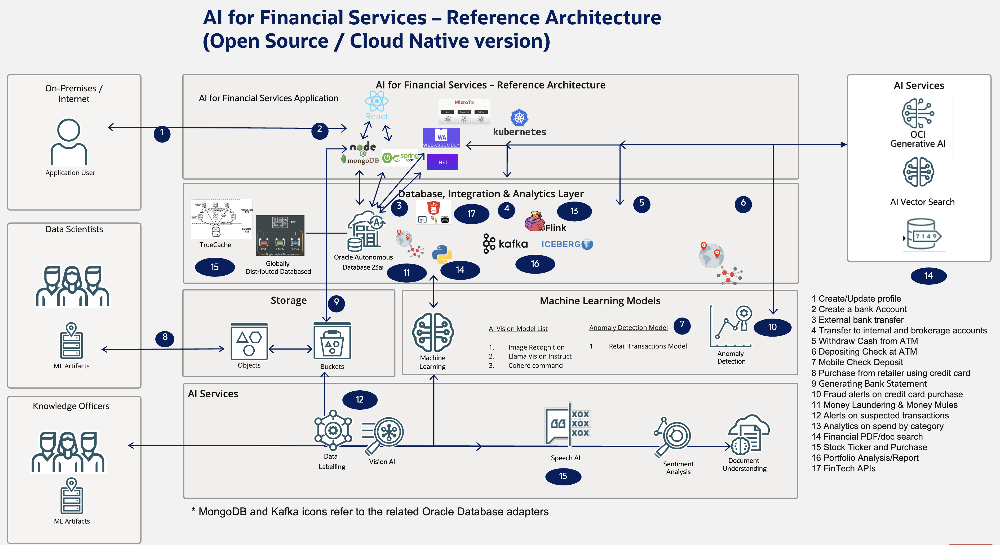

# Introduction

## About this Workshop

This workshop will help you understand the technical capabilities of the Oracle Database in the Cloud Native / Open Source Space, focusing on financial verticals

Estimated Workshop Time: 180 minutes

### About Product/Technology

See table below for labs and corresponding technology used.

[//]: # (If you would like to watch us do the workshop, click [here]&#40;https://youtu.be/yLBEPjOWaz0&#41;.)

### Objectives

- Learn how to develop, migrate, scale, etc. financial solutions using Oracle Database 
- Learn about microservices, Kubernetes, and Cloud Native using Java, Python, JavaScript, .NET, Go, Rust, and PL/SQL, and Rest
- Learn about Oracle features in depth and how the facilitate financial sector (eg https://www.oracle.com/a/ocom/docs/database/fintech-transformation-with-globally-distributed-database.pdf)

| Lab | Financial Process                             | Oracle and other tech used                                      | Company using                                  | 
|-----|-----------------------------------------------|-----------------------------------------------------------------|------------------------------------------------|
| 1   | Infra Setup                                   | Kubernetes, Oracle Database, Vault, AC, DataGuard (used by all) | LOLC                                           |    
| 2   | Create profile and bank account               | React, Spring Boot,                                             |                                                |    
| 3   | External bank transfer                        | MicroTx, Lock-free reservations, Spring Boot                    | Early Warning, U of Naples, Shinhan Securities | 
| 4   | Transfer to internal and brokerage accounts   | Kafka vs TxEventQ using Spring Boot                             | Responsys, FSGBU                               |
| 5   | Withdraw/Deposit Cash from ATM                | Rust or C++ (polyglot)                                          |                                                |
| 6   | Mobile Check Deposit                          | OCI Vision/document                                             |                                                |
| 7   | Purchase from retailer using credit card      | MongoDB relational duality, distributed db                      | Santander, Amex, ANZ Bank, BoA                 |
| 8   | Bank Account Statement and Portfolio Analysis | Kafka, Apache Flink, Iceberg Data import, etc.                  | ANZ Bank                                       |
| 9   | Fraud alerts on credit card purchases         | OML, Graph, Knative Eventing, CloudEvents, Spatial              | Caixabank                                      |
| 10  | Money Laundering                              | Graph                                                           | PaySafe, Garanti Bank,Mercardolibre            |
| 11  | Financial PDF/doc search                      | Vector                                                          | recent customer reference just announced       |
| 12  | Stock Ticker and Stock Purchases              | TrueCache, lock-free reservations, priority txs,session-less    | NYSE                                           |
| 13  | Portfolio analysis (across accounts)          | Kafka, Apache Flink, Iceberg Data import, etc.                  | Bankinter                                      |
| 14  | FinTech APIs ORDS OpenAPI                     | ORDS OpenAPI                                                    | Financiera Maestra, Bank of India              |

### Prerequisites

 - An Oracle Cloud Account - Please view this workshop's LiveLabs landing page to see which environments are supported.

## Learn More

* [Oracle Database](https://bit.ly/mswsdatabase)

## Acknowledgements
* **Authors** - Paul Parkinson, Architect and Developer Advocate
* **Last Updated By/Date** - Paul Parkinson, 2024
