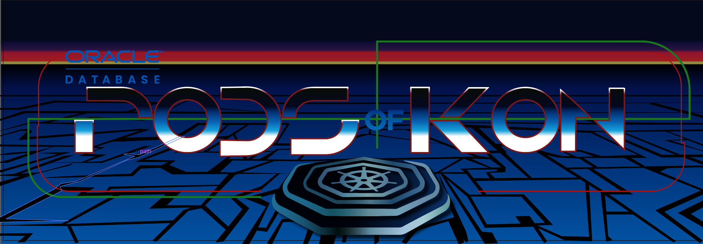

# Introduction

## About this Workshop

This workshop will help you learn how to develop games using Oracle Database.
Estimated Workshop Time: variable depending on the game, from 45 minutes to 2 hours.

### About Product/Technology

Choose any of the following games and techniques to learn how to develop games using Oracle Database...

[Develop with Kubernetes and Oracle Database, `Pods Of Kon`](https://github.com/paulparkinson/podsofkon)

[Develop with WasmEdge, Wasmtime, and Wasmer Invoking MongoDB, Kafka, and Oracle: `WASI Cycles`, an Open Source, 3D WebXR Game](https://www.linkedin.com/pulse/develop-wasmedge-wasmtime-wasmer-invoking-mongodb-kafka-parkinson-wajde)

[Develop a `Geocaching Multiplayer Game` Using Flutter, Spring Boot, Oracle Database Free Spatial, and OpenStreetMap](https://dzone.com/articles/develop-a-geocaching-multiplayer-game-using-flutte)

[Develop a `Mobile Multiplayer Game` in Minutes With Unity and Oracle Backend for Parse](https://dzone.com/articles/develop-games-with-oracle-ep1-a-mobile-multiplayer)

### Objectives

- Learn how to develop games using Oracle Database

### Prerequisites

- An Oracle Cloud Account.

## Learn More

* [Oracle Database](https://bit.ly/mswsdatabase)

## Acknowledgements
* **Authors** - Paul Parkinson, Architect and Developer Advocate
* **Last Updated By/Date** - Paul Parkinson, 2025
