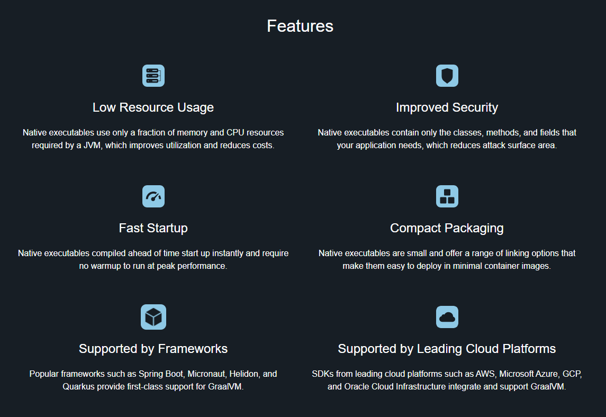

# Introduction

## About this Workshop

This workshop will help you understand more about developing with GraalVM and Oracle Database

Estimated Workshop Time: 30 minutes

### About Product/Technology

GraalVM is an advanced JDK with ahead-of-time Native Image compilation...

### Objectives

- Learn how to develop and connect to Oracle Database using GraalVM and popular Java framework(s).

### Prerequisites

- An Oracle Cloud Account - Please view this workshop's LiveLabs landing page.

## Learn More

* [Oracle Database](https://bit.ly/mswsdatabase)

## Acknowledgements
* **Authors** - Paul Parkinson, Architect and Developer Advocate
* **Last Updated By/Date** - Paul Parkinson, 2024
