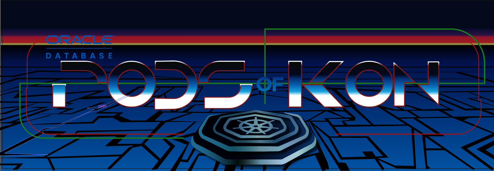

# Introduction

## About this Workshop

This workshop will help you understand more about Kubernetes, Open Source, Oracle Database and AI Services

The Livelabs workshop `Simplify Microservices with Converged Oracle Database` uses the same architecture and setup, but goes into more detail on different aspects used by the game and this workshop, such as scaling on both the Kubernetes and database, observability, transaction processing and messaging, spatial, etc. and so can be referenced to expand up this workshop/architecture/game further.

Estimated Workshop Time: 45 minutes

### About Product/Technology

### Objectives

- Learn how to 

### Prerequisites

- An Oracle Cloud Account.

## Learn More

* [Oracle Database](https://bit.ly/mswsdatabase)

## Acknowledgements
* **Authors** - Paul Parkinson, Architect and Developer Advocate
* **Last Updated By/Date** - Paul Parkinson, 2024
