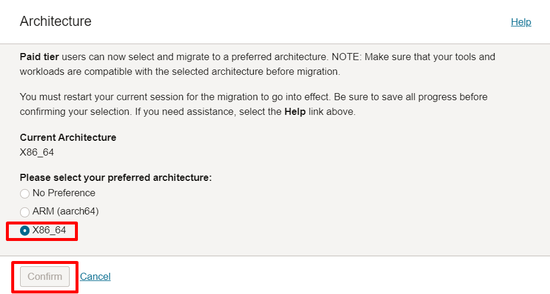
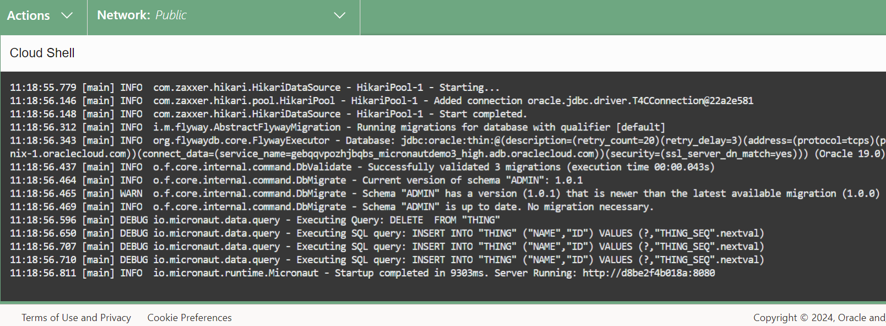

# Develop with Oracle Database 23ai and GraalVM using Micronaut

## Introduction

This lab walks you through the steps to develop with Oracle Database 23ai and GraalVM using Micronaut.

Micronaut is an open-source JVM-based framework for building Java microservices. It is designed to avoid reflection, thus reducing memory consumption and improving start times. Features are pre-computed at compile time with Ahead of Time (AOT) compilation instead of doing so at runtime as with other Java frameworks.

Micronaut Data is a database access toolkit that uses Ahead of Time (AOT) compilation to pre-compute queries for repository interfaces. A thin, lightweight runtime layer executes those queries. That’s a killer feature if positioned in combination with GraalVM!

Micronaut Data JDBC is a Micronaut extension, part of the Micronaut Data project, which comprises other options like Reactive, JPA, and so on. However, Micronaut Data JDBC focuses on data access and persistence using the Java Database Connectivity (JDBC) API.

At last but not least, GraalVM is a high-performance Java runtime that provides significant improvements in application performance and efficiency by integrating a state-of-the-art just-in-time (JIT) compiler and an ahead-of-time (AOT) compiler as well, being a great complement to Micronaut.
It allows developers to compile Java applications into native executables, resulting in faster startup times and lower memory utilization. This makes it an ideal choice for modern, cloud-native applications.

Estimated Time: 30 minutes

### Objectives

In this lab, you will:
- Develop with Oracle Database 23ai and GraalVM using Spring Boot

### Prerequisites

This lab assumes you have:
- Provisioned environment with Git and Maven (Cloud Shell).


## Task 1: Download and install the Micronaut CLI

1. The Cloud Shell is a small virtual machine running a Bash shell which you access through the OCI Console. It comes with a pre-authenticated CLI pre-installed and configured so you can immediately start working in your tenancy without spending time on installation and configuration!

   Click the Cloud Shell icon in the top-right corner of the Console.

   

2. Make sure you're using X86_64 as your target architecture. Click Actions, then click Architecture.

    

3. Select the *X86_64* radio button, then click the *Confirm* button if it was not already selected as the default architecture.

    

4. To install the Micronaut CLI on Linux, you can use SDKMAN!. Open a terminal and run:

    ```
    <copy>   
    curl -s https://get.sdkman.io | bash
    source "$HOME/.sdkman/bin/sdkman-init.sh" 
    sdk install micronaut  
    </copy>
    ```

    If everything goes well, you will see confirmation messages as shown below.

    

    You can now verify your instalation and the installed Micronaut CLI version:

    ```
    <copy>   
    mn --version    
    </copy>
    ```    
    You should see `Micronaut Version: 4.6.2` as the installed Micronaut CLI version.


## Task 2: Clone and build the project

1. Create a new directory of your choice, then clone the workshop code into it. As an example, the new directory below will be created at the root of your user's $HOME directory:

    ```
    <copy>   
    mkdir micronaut-graalvm-oracledb
    cd micronaut-graalvm-oracledb    
    git clone https://github.com/juarezjuniorgithub/micronaut-guide.git
    </copy>
    ```   

2. You must switch to GraalVM Java version 22 using SDKMAN!:

    ```
    <copy>   
    csruntimectl java set graalvmjdk-17
    </copy>
    ```  
    
    If everything goes well, you will see confirmation messages as shown below.

    


3. Next, upgrade Maven:

    Micronaut 4.6.2 requires Maven version 3.6.3. Run the command below to upgrade your Maven version accordingly:

    ```
    <copy>   
    cd ./micronaut-guide/src/maven_upgrade
    chmod +x *.sh
    ./maven-upgrade.sh
    </copy>
    ```  
    Once again, if everything goes well, you will see the related upgrade messages as shown below.

      

4. Build the project.

   Now you have to navigate back to the root directory of your project where the Maven build file (pom.xml) is located, then use SDKMAN! to switch to GraalVM Java version 22:

    ```
    <copy>
    cd $HOME/micronaut-graalvm-oracledb/micronaut-guide         
    sdk install java 22.0.2-graal
    sdk use java 22.0.2-graal
    </copy>
    ```  
   **Note: You must end your current Cloud Shell session, and start a new session to have it reflected after running the commands above. You can do this by selecting `Actions` in the upper left of the Cloud Shell and `Restart`. Then, run the commands below to confirm Java 22 as your current version.

    ```
    <copy>
    cd $HOME/micronaut-graalvm-oracledb/micronaut-guide         
    sdk current 
    java -version
    </copy>
    ```  

      
   

4. Build the project.
   
   Run the commands below to build the project as required. Note that this is not using the GraalVM plugin yet but just a plain old Java build.

    ```
    <copy>
    cd $HOME/micronaut-graalvm-oracledb/micronaut-guide          
    $HOME/mvn-upgrade/apache-maven-3.9.8/bin/mvn clean package -DskipTests
    </copy>
    ```  
   Provided that everything is correct, the project will be built successfully as expected.

     


## Task 3: Provision an Oracle Autonomous Database instance with Terraform

1. Now let's provision the ADB DB instance with Terraform. Navigate to the directory with the Terraform scripts located under `$HOME//micronaut-graalvm-oracledb/micronaut-guide/src/terraform/adb-standard` where you will find the related Terraform (*.tf) files.

   You must modify the `variables.tf` file to reflect your choices. Note that you have to replace the placeholders `<YOUR_COMPARTMENT_OCID>, <YOUR_DB_ADMIN_PW> and <YOUR_EMAIL_ADDRESS>` with your custom values.

   So, you must edit the files to provide the 3 (three) minimum required inputs as usual: [OCI Compartment](https://docs.oracle.com/en-us/iaas/Content/Identity/Tasks/managingcompartments.htm), Oracle DB ADMIN’s (defined by you), and your email address. Make sure the [password](https://docs.oracle.com/en/database/oracle/oracle-database/23/rilin/requirements-for-database-passwords.html) has at least 12 characters and follow Oracle’s requirements for DB passwords. Otherwise, an error related to your listener will happen during the instance provisioning process.

     

   Save the files, as you will run the Terraform scripts to provision the database on the next step.

2. Initialize Terraform by running the commands below:

    ```
    <copy>
    cd $HOME//micronaut-graalvm-oracledb/micronaut-guide/src/terraform/adb-standard         
    terraform init
    terraform plan
    terraform apply
    </copy>
    ```  
    You will receive the usual notification from the Oracle Cloud as soon as your database instance is provisioned successfully.

     

3. Using the OCI Console, navigate to the Oracle Autonomous Database ATP instance you just created, copy its OCID as shown below, and save it. You will need it to configure the database connection in the application.properties file.

     

   Next, adjust the command below, and run it to generate the required database wallet as required.

    ```
    <copy>
    oci db autonomous-database generate-wallet --autonomous-database-id ocid1.autonomousdatabase.oc1..xxxx --file /path/to/download/wallet.zip --password "your_wallet_password"  
    </copy>
    ```

## Task 4: Configure Micronaut Data with your Oracle ADB instance details

1. We’ll use an application properties file. Below is an example with the relevant details you must provide. Navigate to your `application.properties` file under `$HOME//micronaut-graalvm-oracledb/micronaut-guide/src/main/resources`:  

    ```
    <copy>
    micronaut.application.name=micronautguide

    flyway.datasources.default.enabled=true
    flyway.datasources.default.baseline-on-migrate=true
    flyway.datasources.default.baseline-version=1.0.0

    datasources.default.dialect=ORACLE
    datasources.default.ocid=<YOUR_DB_OCID>
    datasources.default.username=<YOUR_DB_ADMIN_USERNAME>
    datasources.default.password=<YOUR_PASSWORD>
    datasources.default.walletPassword=<YOUR_WALLET_PASSWORD>

    # use these properties if running from OCI Console with Cloud Shell (https://rb.gy/64ebxw)
    # technical reference at https://micronaut-projects.github.io/micronaut-oracle-cloud/snapshot/guide/
    oci.fingerprint=<FINGERPRINT_VALUE>
    # example private key file path + file extension pattern
    # oci.private-key-file=file:/home/juarez/pk.pem
    oci.private-key-file=file:<ABSOLUTE_KEY_FILE_PATH><FILE_NAME.pem>
    oci.region=<REGION>
    oci.tenant-id=<OCI_TENANCY_OCID>
    oci.user-id=<OCI_USER_OCID>

    # uncomment if not using oci console with cloud shell
    # oci.config.profile=DEFAULT    
    </copy>
    ```  
    Please check [Required Keys and OCIDs](https://docs.oracle.com/en-us/iaas/Content/API/Concepts/apisigningkey.htm) if you need an introduction to [OCI Identity and Access Management (IAM)](https://docs.oracle.com/en-us/iaas/Content/Identity/home.htm) concerning the OCI properties above.
    
    Adjust it to reflect your Oracle ADB instance details, that is, replace the placeholders shown above with your actual (custom) values as required.

    ```
    <copy>
    cd $HOME//micronaut-graalvm-oracledb/micronaut-guide/src/main/resources         
    vi application.properties    
    </copy>
    ```  

    At last, note that the above file uses [Micronaut Flyway](https://micronaut-projects.github.io/micronaut-flyway/latest/guide/) to populate the target database table for you, so you do not have to execute any SQL statements at all, it will automatically do it to add the sample data for you.

    Nevertheless, the related SQL script can be found under the `$HOME//micronaut-graalvm-oracledb/micronaut-guide/src/main/resources/db/migration` directory, as shown below.

     

## Task 5: A first run with VS Code only and the JIT (C2) compiler

1. The Micronaut application is now finished and ready to be executed. So, you can compile, build, and run it with Maven from the command-line.

    ```
    <copy>
    cd $HOME/micronaut-graalvm-oracledb/micronaut-guide          
    $HOME/mvn-upgrade/apache-maven-3.9.8/bin/mvn clean package -DskipTests
    $HOME/mvn-upgrade/apache-maven-3.9.8/bin/mvn mn:run
    </copy>
    ```  
    The Micronaut application will be launched and after a few seconds, you will be able to access it. Note that this time we’re just running a Java application with Maven and the JVM JIT compiler (C2).

    Besides, note that you will be able to see the records that were inserted by the `DataPopulator.java` class as a startup process, as we defined it.

     

   Now you can use curl to send a HTTP GET request to the URL http://[HOST_ID]:8080/things/

   As you're running from Cloud Shell, open another browser tab and start another Cloud Shell session,
   then use the `curl` command with a HTTP GET request below:

    ```
    <copy>
    curl -X GET "http://[HOST_ID]:8080/things"    
    </copy>
    ``` 
   
   You will see JSON returned as a HTTP response. 
   
   

   Now we can proceed to work with GraalVM and generate our native executable!


## Task 6: Native image with GraalVM

1. Now, we’ll be able to use GraalVM to create a native executable for our application. Run the following commands:

    ```
    <copy>
    cd $HOME/micronaut-graalvm-oracledb/micronaut-guide          
    $HOME/mvn-upgrade/apache-maven-3.9.8/bin/mvn package -DskipTests -Dpackaging=native-image    
    </copy>
    ``` 
    The native compilation process will start and take a few minutes to complete. Meanwhile, you might want to read about Native Image.

    

    After reading about Native Image, you can now understand that the process is quite elaborate, with many steps and verifications to be performed. The screenshot below provides a glimpse of it.

2. After a while, you will see another message with a confirmation that your native executable file has been generated. 

    

3. The last step is to find and run the native executable file and execute it, so you can just navigate to the /target directory to find the native executable of your application, so you can run it.
    
    ```
    <copy>
    cd $HOME/micronaut-graalvm-oracledb/micronaut-guide/target   
    ./micronaut-guide 
    </copy>
    ``` 

        
    
    You will notice that it has a faster startup time, among many things. 
    We will leave such exploration as a gift for you and an exercise so you can proceed to learn more about combining all these fantastic technologies — GraalVM, Micronaut Data, and the Oracle Autonomous Database.

## Acknowledgements
* **Author** - Paul Parkinson, Architect and Developer Advocate; Juarez Barbosa, Sr. Principal Java Developer Evangelist, Java Database Access
* **Last Updated By/Date** - Paul Parkinson, 2024
