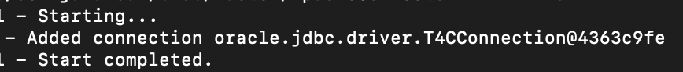

# Develop with Oracle Database 23ai and GraalVM using Micronaut

## Introduction

This lab walks you through the steps to develop with Oracle Autonomous Database and GraalVM using Micronaut.

Micronaut is an open-source JVM-based framework for building Java microservices. It is designed to avoid reflection, thus reducing memory consumption and improving start times. Features are pre-computed at compile time with Ahead of Time (AOT) compilation instead of doing so at runtime as with other Java frameworks.

Micronaut Data is a database access toolkit that uses Ahead of Time (AOT) compilation to pre-compute queries for repository interfaces. A thin, lightweight runtime layer executes those queries. That’s a killer feature if positioned in combination with GraalVM!

Micronaut Data JDBC is a Micronaut extension, part of the Micronaut Data project, which comprises other options like Reactive, JPA, and so on. However, Micronaut Data JDBC focuses on data access and persistence using the Java Database Connectivity (JDBC) API.

At last but not least, GraalVM is a high-performance Java runtime that provides significant improvements in application performance and efficiency by integrating a state-of-the-art just-in-time (JIT) compiler and an ahead-of-time (AOT) compiler as well, being a great complement to Micronaut.
It allows developers to compile Java applications into native executables, resulting in faster startup times and lower memory utilization. This makes it an ideal choice for modern, cloud-native applications.

Estimated Time: 10 minutes

### Objectives

In this lab, you will:
- Develop with Oracle Database 23ai and GraalVM using Spring Boot

### Prerequisites

This lab assumes you have:
- Provisioned environment with Git and Maven (Cloud Shell).


## Task 1: Cd to project dir and build the project

1. Open Cloud Shell and make sure you're using X86_64 as your target architecture as was done during the setup lab

2. Cd to the following directory of the repos you cloned during setup. For example, if you cloned to your user's $HOME directory:

    ```
    <copy>   
    cd $HOME/microservices-datadriven/graalvm-nativeimage/micronaut
    </copy>
    ``` 

## Task 2: Configure Micronaut Data with your Oracle ADB instance details

1.  Edit (using `vi` or similar tool) `src/main/resources/META-INF/microprofile-config.properties` to provide appropriate values for URL, user, and password such as the following.
    Replace values with those found in the workshop `Reservation Information` page and the explicit (eg don't use "~") home directory path as appropriate...
    ```
    <copy>   
    vi src/main/resources/application.properties
    </copy>
   ```
   
   ```properties
     datasources.default.username=ADMIN
     datasources.default.password=<password>
     datasources.default.URL=jdbc:oracle:thin:@<tnsServiceName>_high?TNS_ADMIN=/home/<myhomedir>/myatpwallet
     datasources.default.walletPassword=<YOUR_WALLET_PASSWORD>
   ```  
    
   *Again note that the values of the password and path to wallet are those that were collected during setup.

## Task 3: Build and run with Java

1. Build and run the following and notice the connection object output after startup, indicating a connection has been made to the ATP instance.

    ```
    <copy>
    mvn clean package -DskipTests
    mvn mn:run
   
    </copy>
    ```

## Task 4: Build and run Native Image

1. Now Build the same application into a native image and run it to see the same behavior/output but with faster startup, etc.

    ```
    <copy>
    mvn package -DskipTests -Dpackaging=native-image ;
    ./target/micronaut-graalvm
    </copy>
    ```


   
 
2. 


Congratulations on connecting your Micronaut app to Oracle Autonomous Database!

You can learn more about Micronaut and native image builds at https://micronaut.io/ 

Please try it out in your favorite development environment and explore the source code, configuration, and Oracle Database features to learn more about how to enhance this application.

## Acknowledgements
* **Author** - Paul Parkinson, Architect and Developer Advocate; Juarez Barbosa, Sr. Principal Java Developer Evangelist, Java Database Access
* **Last Updated By/Date** - Paul Parkinson, 2024
