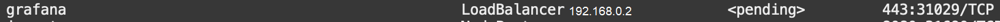

# Unified Observability

## Introduction

This lab will show you how to view metrics, etc. in a Grafana console.

Please see the  [Unified Observability in Grafana with converged Oracle Database Workshop](http://bit.ly/unifiedobservability) 
for an more in-depth look at this topic including details of the metrics, logs, and tracing exporters.
and correlattion of them across application and data tiers in a single Grafana dashboard.

Estimated Time: 10 minutes


### Objectives

* Install and configure Grafana and Prometheus

### Prerequisites

- This lab presumes you have already completed the earlier labs.
 

## Task 1: Install and Configure Observability Software and Metrics 

1. Run the install script to install Jaeger, Prometheus, Loki, Promtail, Grafana and an SSL secured LoadBalancer for Grafana

    ```
    <copy>cd $GRABDISH_HOME/observability;./install.sh</copy>
    ```

You will see some warning messages related to versions, etc. that may safely be ignored.


2. Run the `/createMonitorsAndExporters.sh` script. This will do the following:
   - Create Prometheus ServiceMonitors to scrape the Frontend, Order, and Inventory microservices.
   - Create Prometheus ServiceMonitors to scrape the Order PDB, and Inventory PDB metric exporter services.
   - Create configmaps, deployments, and services for PDB metrics exporters.

    ```
    <copy>cd $GRABDISH_HOME/observability;./createMonitorsAndExporters.sh</copy>
    ```

You will see some warning messages related to configmaps not existing as this is the initial setup that may safely be ignored.

## Task 2: Launch Grafana Dashboard

1. Identify the EXTERNAL-IP address of the Grafana LoadBalancer by executing the following command:

       ```
       <copy>services</copy>
       ```

     

     Note, it will take a few minutes for the LoadBalancer to provision during which time it will be in a `pending` state

2. Open a new browser tab and enter the external IP URL:

     `https://<EXTERNAL-IP>`

      Note, for convenience a self-signed certificate is used to secure this https address and so you will be prompted by the browser to allow access.

3. Login using the default username `admin` and password `prom-operator`

      

4. Install the GrabDish Dashboard

     Select the `+` icon on the left-hand side and select `Import`

      

     Copy the contents of the [GrabDish Dashboard JSON](https://raw.githubusercontent.com/oracle/microservices-datadriven/main/grabdish/observability/dashboards/grabdish-dashboard.json)

     Paste the contents in the `Import via panel json` text field and click the `Load` button
      

     Confirm upload and click `Import` button.
      


## Task 3: Open and Study the Main GrabDish Grafana Dashboard Screen and Metrics

1. Select the four squares icon on the left-hand side and select 'Dashboards'
      

2. In the `Dashboards` panel select `GrabDish Dashboard`

      

3. Notice the collapsible panels for each microservices and their content which includes
    - Metrics about the kubernetes microservice runtime (CPU load, etc.)
    - Metrics about the kubernetes microservice specific to that microservice (`PlaceOrder Count`, etc.)
  
    Again, please see the  [Unified Observability in Grafana with converged Oracle Database Workshop](http://bit.ly/unifiedobservability) 
for an more in-depth look at this topic including details of the metrics, logs, and tracing exporters, including info for panels with...

    - Metrics about the PDB used by the microservice (open sessions, etc.)
    - Metrics about the PDB specific to that microservice (inventory count)

      
      
      

You may now proceed to the next lab.

## Learn More

* Ask for help and connect with developers on the [Oracle DB Microservices Slack Channel](https://bit.ly/oracle-database-microservices-slack)   
Search for and join the `oracle-db-microservices` channel.

## Acknowledgements
* **Author** - Paul Parkinson, Developer Evangelist
* **Last Updated By/Date** - Irina Granat, March 2022