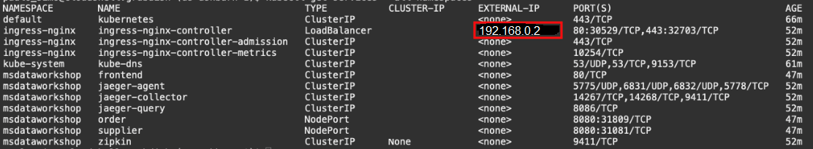
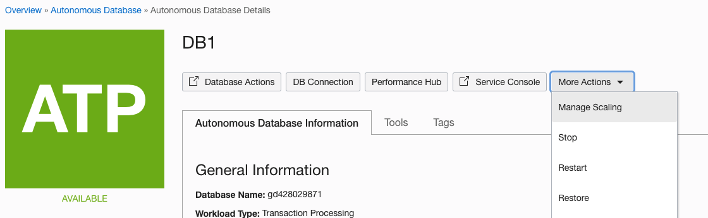
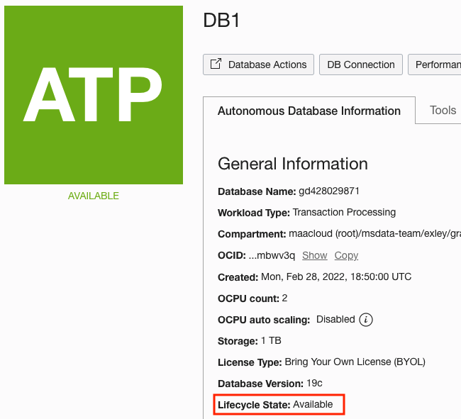

# Scale the Application

## Introduction

This lab will show how the application can scale at the application and database tiers to achieve optimal performance.

Estimates Time: 10 minutes

[](youtube:95cW9eH_os4)

### Objectives
-   Start the external load balancer for the order-helidon microservice
-   Install a load testing tool
-   Test the performance of the existing deployment and identify the point at which performance begins to degrade
-   Scale the application tier to improve performance and identify the point at which further application tier scaling does not help
-   Scale the database tier and demonstrate how performance improves

### Prerequisites

This lab assumes that you have already completed the earlier labs.

## Task 1: Install a Load Testing Tool and Start an External Load Balancer for the Order Service

1. Start an external load balancer for the order service.

    ```
    <copy>cd $GRABDISH_HOME/order-helidon; kubectl create -f ext-order-ingress.yaml -n msdataworkshop</copy>
    ```

    Check the ext-order LoadBalancer service and make note of the external IP address. This may take a few minutes to start.

    ```
    <copy>services</copy>
    ```

    

    Set the LB environment variable to the external IP address of the ingress-nginx-controller service. Replace 123.123.123.123 in the following command with the external IP address.

    ```
    <copy>export LB='123.123.123.123'</copy>
    ```

<if type="multicloud-freetier">
+ `export LB=$(kubectl get gateway msdataworkshop-order-helidon-appconf-gw -n msdataworkshop -o jsonpath='{.spec.servers[0].hosts[0]}')`
</if>

2. Install a load testing tool.  

    You can use any web load testing tool to drive load. Here is an example of how to install the k6 tool ((licensed under AGPL v3). Or, you can use artillery and the script for that is also provided below. To see the scaling impacts we prefer doing this lab with k6.

	```
	<copy>cd $GRABDISH_HOME/k6; wget https://github.com/loadimpact/k6/releases/download/v0.27.0/k6-v0.27.0-linux64.tar.gz; tar -xzf k6-v0.27.0-linux64.tar.gz; ln k6-v0.27.0-linux64/k6 k6</copy>
	```

	

	(Alternatively) To install artillery:

	```
	<copy>cd $GRABDISH_HOME/artillery; npm install artillery@1.6</copy>
	```

## Task 2: Load Test and Scale the Application Tier

1.  Execute a load test using the load testing tool you have installed.  

    Here is an example using k6:

    ```
    <copy>cd $GRABDISH_HOME/k6; ./test.sh</copy>
    ```

    Note the request rate. This is the number of http requests per second that were processed.

    

    (Or) Using artillery:

    ```
    <copy>cd $GRABDISH_HOME/artillery; ./test.sh</copy>
    ```

2. Scale to **2 service replicas**.

    ```
    <copy>kubectl scale deployment.apps/order-helidon --replicas=2 -n msdataworkshop</copy>
    ```

   List the running pods.

    ```
    <copy>pods</copy>
    ```

   Note there are now two order-helidon replicas. Keep polling until both replicas are ready.

   

3. Execute the load test again.

   For example:

    ```
    <copy>cd $GRABDISH_HOME/k6; ./test.sh</copy>
    ```

   Note the average response time for the requests. Throughput has increased and response time has returned to normal.

   

   (Or) Using artillery:

    ```
    <copy>cd $GRABDISH_HOME/artillery; ./test.sh</copy>
    ```

4. Scale to **3 Replicas**.

    ```
    <copy>kubectl scale deployment.apps/order-helidon --replicas=3 -n msdataworkshop</copy>
    ```

    List the running pods.

    ```
    <copy>pods</copy>
    ```

    Note there are now three order-helidon replicas. Keep polling until all replicas are ready.

    

5. Execute the load test again.

    For example:
    ```
    <copy>cd $GRABDISH_HOME/k6; ./test.sh</copy>
    ```

    Note the median response time for the requests and the request rate. Note how the response time is still degraded and the request rate has not improved significantly.

    

    (Or) Using artillery:

    ```
    <copy>cd $GRABDISH_HOME/artillery; ./test.sh</copy>
    ```

## Task 3: Load Test and Scale the Database Tier

1. To scale the Order DB Autonomous Transaction Processing database to **2 OCPUs**, click the navigation icon in the top-left corner of the Console and go to Autonomous Transaction Processing.

	

2. Select DB1, the database that contains the order schema, click **More Actions**, then **Manage Scaling**. Enter 2 in the OCPU field. Click **Apply**.

    

    

3. Wait until the scaling has completed (Lifecycle State: Available).

    

4. Execute the load test again.

    For example:

    ```
    <copy>cd $GRABDISH_HOME/k6; ./test.sh</copy>
    ```

    Note the request rate.  Throughput has increased.

    

    (Or) Using artillery:

    ```
    <copy>cd $GRABDISH_HOME/artillery; ./test.sh</copy>
    ```

## Task 4: Scale Down the Application and Database Tiers

1. To scale the Order database down to **1 OCPUs**, click the hamburger icon in the top-left corner of the Console and go to Autonomous Transaction Processing.

	

2. Click **Manage Scaling** and enter 1 in the OCPU field. Click **Apply**.

    

    

3. Scale the order-helidon service back to **1 replica**.

    ```
    <copy>kubectl scale deployment.apps/order-helidon --replicas=1 -n msdataworkshop</copy>
    ```

You may now proceed to the next lab.

## Learn More

* Ask for help and connect with developers on the [Oracle DB Microservices Slack Channel](https://bit.ly/oracle-database-microservices-slack)  
Search for and join the `oracle-db-microservices` channel. 

## Acknowledgements
* **Authors** - Richard Exley, Maximum Availability Architecture; Curtis Dinkel, Maximum Availability Architecture; Rena Granat, Maximum Availability Architecture;
* **Adapted for Cloud by** -  Nenad Jovicic, Enterprise Strategist, North America Technology Enterprise Architect Solution Engineering Team
* **Documentation** - Lisa Jamen, User Assistance Developer - Helidon
* **Contributors** - Jaden McElvey, Technical Lead - Oracle LiveLabs Intern
* **Last Updated By/Date** - Irina Granat, March 2022
