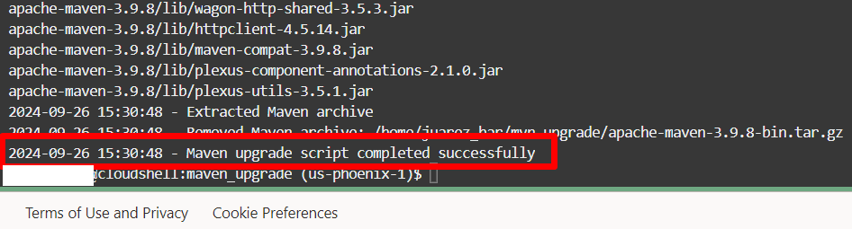

# Setup

## Introduction

In this lab, we will do the basic setup required for GraalVM Native Image. 
Once done, you can select the lab of the Java platform you'd like to develop and test on.

Estimates Time: 20 minutes

### Objectives

* Create an Oracle Autonomous Database (23ai). Note https://www.oracle.com/database/free/
* Obtain wallet either via OCI CLI command or by downloading from OCI console.
* Start Cloud Shell or Terminal
* Download wallet for ATP instance


## Task 1: Decide whether to use Oracle Autonomous Database on Oracle Cloud Infrastructure (OCI) or using container image.

- If you would like to use a container image, please refer to documentation and setup steps here: https://www.oracle.com/database/free/
- If you would like to use Oracle Autonomous Database on OCI/cloud, continue to follow the tasks below.

## Task 2: Create an Oracle Autonomous Database (ATP) in OCI console 

Obtain a free OCI Cloud instance if you have not already and open the console page: https://cloud.oracle.com

Get the ATP_OCID and also download the wallet zip from the console. 

In the next task, you will see how you can use an OCI CLI command to download the wallet by providing the ATP_OCID.

If you would prefer to user your own terminal and/or not use the OCI CLI, you can simply download the wallet from the console.


## Task 3: Launch the Cloud Shell or other terminal and download the wallet

   Cloud Shell is a small virtual machine running a "bash" shell which you access through the Oracle Cloud Console. Cloud Shell comes with a pre-authenticated command line interface connected to the tenancy. It also provides up-to-date tools and utilities.

   Depending on the framework, application, and your personal preference, you may want to use your own terminal in which case you can skip to step 5. 

   1. Verify you are in the correct region and compartment.

   2. Click the Cloud Shell icon in the top-right corner of the Console.

      

   3. Make sure you're using X86_64 as your target architecture. Click Actions, then click Architecture.

      

   4. Select the *X86_64* radio button, then click the *Confirm* button if it was not already selected as the default architecture.

      

      > **Note:** Cloud Shell sessions have a maximum length of 24 hours, and time out after 20 minutes of inactivity.
      
   5. Create a directory to hold the wallet files... 

    ```
    <copy>
    mkdir ~/myatpwallet
    </copy>
    ```


   6. Copy the database ocid from the workshop reservation page described in the "Get Started" lab and issue the following command in the Cloud Shell. 
      Provide the ocid for the `autonomous-database-id` value and an arbitrary wallet-password (such as "Welcome12345"). You can leave the default file path.

    ```
    <copy>
    oci db autonomous-database generate-wallet --autonomous-database-id <ATP_OCID> --file ~/myatpwallet/myatpwallet.zip --password <wallet-password>
    </copy>
    ```

   7. Finally, unzip it the wallet file to a directory such as...

    ```
    <copy>
    cd ~/myatpwallet ; unzip myatpwallet.zip ; cd ~
    </copy>
    ```

## Task 4: Clone the GitHub source code repos

1. Clone the src and cd into directory... Note that the rest of the documentation assumes this repos has been cloned to the $HOME directory

    ```
    <copy>
    git clone https://github.com/paulparkinson/microservices-datadriven-devrel.git microservices-datadriven ; 
    cd microservices-datadriven/graalvm-nativeimage
   
    </copy>
    ```


## Task 5: Upgrade Maven:

1. Insure you have maven installed and a recent version. 3.9.8 was used in this workshop which can be installed by Run the command below to upgrade your Maven version accordingly:

    ```
    <copy>   
    chmod +x *.sh
    ./maven-upgrade.sh
    echo 'export PATH=$HOME/mvn-upgrade/apache-maven-3.9.8/bin:$PATH' >> ~/.bashrc

    </copy>
    ```  


      


## Task 5: Install SDKMAN! use it to install GraalVM 

1. Install SDKMAN! 


    ```
    <copy>   
    curl -s https://get.sdkman.io | bash
    source "$HOME/.sdkman/bin/sdkman-init.sh" 
    </copy>
    ```


2. We use GraalVM 21.0.5 in this workshop which can be installed by running the following

    ```
    <copy>   
    sdk install java 21.0.5-graal
    sdk use java 21.0.5-graal
    sdk current
    </copy>
    ```


You may now proceed to the next lab.

## Learn More

* [Oracle Database](https://bit.ly/mswsdatabase)

## Acknowledgements
* **Authors** - Paul Parkinson, Architect and Developer Advocate
* **Last Updated By/Date** - Paul Parkinson, 2024

