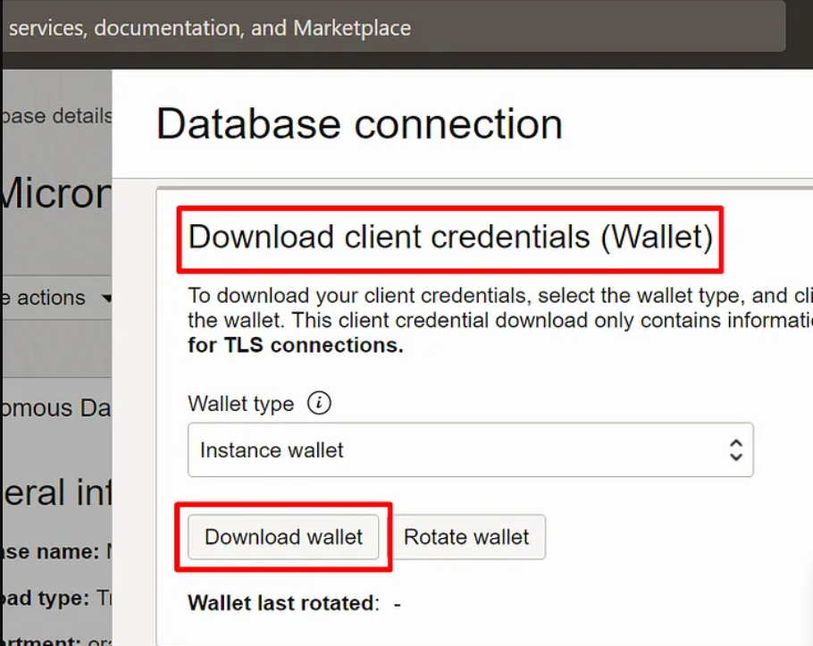
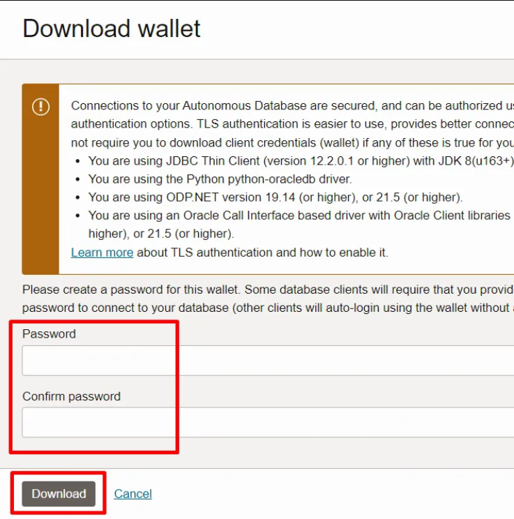

# Setup

## Introduction

In this lab, we will select

Estimates Time: 20 minutes

### Objectives

* Clone the setup and microservices code
* Execute setup

## Task 1: Select Your Compartment

Your own Oracle Cloud Infrastructure compartment for running this workshop has been assigned to you. The name of the compartment appears on the Launch page.

1. Copy the compartment name (not OCID) from the workshop reservation page.

   

2. Select the navigation menu from the top left corner of the Oracle Cloud Console and navigate to the Instances page in the Compute section.

   

3. Search for compartment using the compartment name from step#1 in the "Compartment" field under "List Scope".

   

4. Select your compartment name from the drop down list.

   

   

## Task 2: Launch the Cloud Shell

Cloud Shell is a small virtual machine running a "bash" shell which you access through the Oracle Cloud Console. Cloud Shell comes with a pre-authenticated command line interface connected to the tenancy. It also provides up-to-date tools and utilities.

1. Click the Cloud Shell icon in the top-right corner of the Console.

   

   >**Note**: Cloud Shell uses websockets to communicate between your browser and the service. If your browser has websockets disabled or uses a corporate proxy that has websockets disabled you will see an error message ("An unexpected error occurred") when attempting to start Cloud Shell from the console. You also can change the browser cookies settings for a specific site to allow the traffic from *.oracle.com

## Task 3: Locate the pre-provisioned ATP instance and download the wallet from it.

1. Using the OCI Console, navigate to the Oracle Autonomous Database ATP instance you just created, copy its OCID as shown below, and save it. You will need it to configure the database connection in the application.properties file.

   

   Next, click the Database connection button highlighted in the screenshot below.

   

   Finally, specify a password for your wallet, provide it again to reconfirm it, and click the Download button.

   

   Save your wallet file to your preferred local directory - an example file name is Wallet_MICRONAUTDEMO.zip. Next, use a utility such as `scp` to upload it to a directory under your $HOME directory in Cloud Shell, then unzip it.

   > **Note:** Cloud Shell sessions have a maximum length of 24 hours, and time out after 20 minutes of inactivity.

You may now proceed to the next lab.

## Learn More

* [Oracle Database](https://bit.ly/mswsdatabase)

## Acknowledgements
* **Authors** - Paul Parkinson, Architect and Developer Advocate
* **Last Updated By/Date** - Paul Parkinson, 2024

