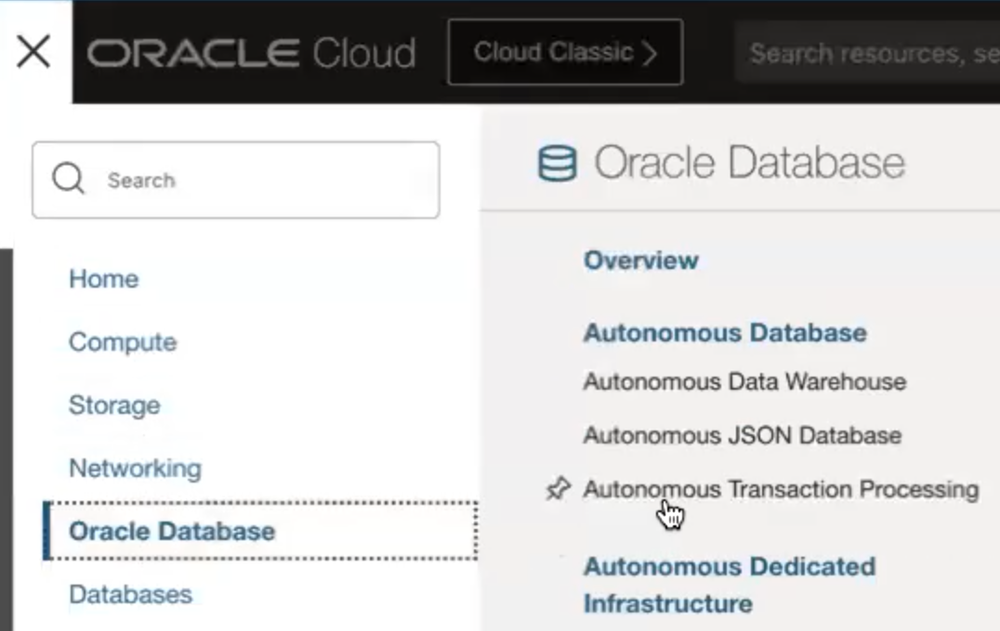
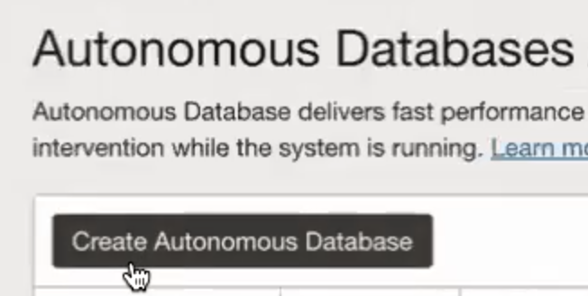
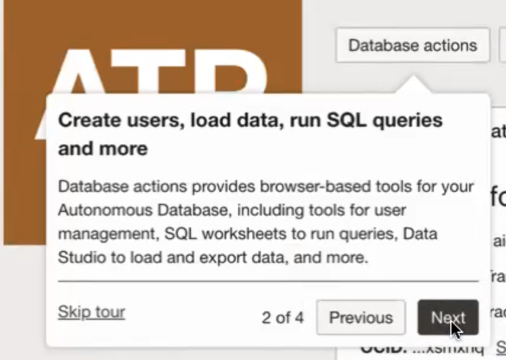

# Setup

## Introduction

In this lab, we will do the basic setup required for GraalVM Native Image. 
Once done, you can select the lab of the Java platform you'd like to develop and test on.

Estimates Time: 20 minutes

### Objectives

* Create an Oracle Autonomous Database (23ai). Note https://www.oracle.com/database/free/
* Obtain wallet either via OCI CLI command or by downloading from OCI console.
* Start Cloud Shell or Terminal
* Download wallet for ATP instance


## Task 1: Decide whether to use Oracle Autonomous Database on Oracle Cloud Infrastructure (OCI) or using container image.

- If you would like to use a container image, please refer to documentation and setup steps here: https://www.oracle.com/database/free/
- If you would like to use Oracle Autonomous Database on OCI/cloud, continue to follow the tasks below.

## Task 2: Create an Oracle Autonomous Database (ATP) and download the wallet

If you have a database instance already, you may skip this task.

1. From the OCI console select `Oracle Database` and then `Autonmous Transaction Processing`.
   
2. Click the `Create Autonomous Database` button.
   
3. Select the appropriate compartment to place the database in and provide a database name (any name will suffice).
   
4. Provide a password for the `ADMIN` user.
   
5. Click the `Create Autonomous Database` button.
   
6. The database will begin provisioning. Notice the `Database actions` button.
   
7. Click the `Database Connections` button and download the instance wallet.  You will be asked to provide a wallet password - this is not the same thing as a database user password and will not be used in this workshop but is required for download.
   
8. As an option to downloading via the console as mentioned in step 7, if you have the OCI CLI installed, you can copy the database ocid (which can be found in the console) and use the following command to download
 
    ```
    <copy>
    oci db autonomous-database generate-wallet --autonomous-database-id <ATP_OCID> --file ~/myatpwallet/myatpwallet.zip --password <wallet-password>
    </copy>
    ```

9. Finally, unzip the wallet file to a directory and not the directory location as you will need it later.

    ```
    <copy>
    cd ~/myatpwallet ; unzip myatpwallet.zip ; cd ~
    </copy>
    ```

## Task 3: Clone the GitHub source code repos

1. Clone the src and cd into directory... 

    ```
    <copy>
    git clone https://github.com/oracle-devrel/microservices-datadriven.git  ; 
    cd microservices-datadriven/graalvm-nativeimage
   
    </copy>
    ```


## Task 4: Install/Upgrade Maven if necessary

1. Insure you have maven installed and a recent version. 3.9.8 was used in this workshop which can be installed by running the convenience script below:

    ```
    <copy>   
    chmod +x *.sh
    ./maven-upgrade.sh
    echo 'export PATH=$HOME/mvn-upgrade/apache-maven-3.9.8/bin:$PATH' >> ~/.bashrc

    </copy>
    ```  


      


## Task 5: Install SDKMAN! and use it to install GraalVM 

1. Install SDKMAN! 


    ```
    <copy>   
    curl -s https://get.sdkman.io | bash
    source "$HOME/.sdkman/bin/sdkman-init.sh" 
    </copy>
    ```


2. We use GraalVM version 21.0.3-graal in this workshop which can be installed by running the following

    ```
    <copy>   
    sdk install java 21.0.3-graal
    sdk use java 21.0.3-graal
    sdk current
    </copy>
    ```


You may now proceed to the next lab.

## Learn More

* [Oracle Database](https://bit.ly/mswsdatabase)

## Acknowledgements
* **Authors** - Paul Parkinson, Architect and Developer Advocate
* **Last Updated By/Date** - Paul Parkinson, 2024

