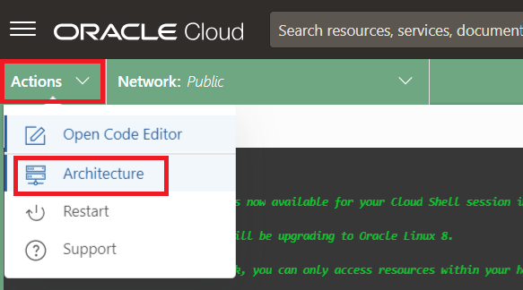

# Setup

## Introduction

In this lab, we will select

Estimates Time: 20 minutes

### Objectives

* Select the correct compartment and view Oracle Autonomous Database (ATP) screen
* Start Cloud Shell
* Download wallet for ATP instance


## Task 1: Select the correct compartment and view Oracle Autonomous Database (ATP) screen in OCI console

Your own Oracle Cloud Infrastructure compartment for running this workshop has been assigned to you. The name of the compartment appears on the Launch page.

1. Copy the compartment name (not OCID) from the workshop reservation page.

   

2. Select the navigation menu from the top left corner of the Oracle Cloud Console and navigate to "Oracle Database" and then, on the right, click "Autonomous Transaction Processing" (ATP) .

   

3. Search for compartment using the compartment name from step#1 in the "Compartment" field under "List Scope".

   

4. Select your compartment name from the drop down list.

   

   

5. Select your pre-provisioned database from the list and explore!


## Task 2: Launch the Cloud Shell

   Cloud Shell is a small virtual machine running a "bash" shell which you access through the Oracle Cloud Console. Cloud Shell comes with a pre-authenticated command line interface connected to the tenancy. It also provides up-to-date tools and utilities.

   1. Verify you are in the correct compartment (this was done as part of Task 1).

   2. Click the Cloud Shell icon in the top-right corner of the Console.

      

   3. Make sure you're using X86_64 as your target architecture. Click Actions, then click Architecture.

      

   4. Select the *X86_64* radio button, then click the *Confirm* button if it was not already selected as the default architecture.

      

      >**Note**: Cloud Shell uses websockets to communicate between your browser and the service. If your browser has websockets disabled or uses a corporate proxy that has websockets disabled you will see an error message ("An unexpected error occurred") when attempting to start Cloud Shell from the console. You also can change the browser cookies settings for a specific site to allow the traffic from *.oracle.com

## Task 3: Download the wallet of your pre-provisioned ATP instance (used to make connections in the Java/GraalVM app)

   1. Create a directory to hold the wallet files... 

    ```
    <copy>
    mkdir ~/myatpwallet
    </copy>
    ```


   2. Copy the database ocid from the workshop reservation page described in the "Get Started" lab and issue the following command in the Cloud Shell. Use the ocid as the `autonomous-database-id` and arbitrary values for the `file` and (wallet) `password`.

    ```
    <copy>
    oci db autonomous-database generate-wallet --autonomous-database-id <ATP_OCID> --file ~/myatpwallet/myatpwallet.zip --password <wallet-password>
    </copy>
    ```

   3. Finally, unzip it the wallet file to a directory such as...

    ```
    <copy>
    cd ~/myatpwallet ; unzip myatpwallet.zip ; cd ~
    </copy>
    ```

   > **Note:** Cloud Shell sessions have a maximum length of 24 hours, and time out after 20 minutes of inactivity.

## Task 4: Clone the GitHub source code repos

1. Clone the src...

    ```
    <copy>
    git clone https://github.com/paulparkinson/microservices-datadriven-devrel.git
    </copy>
    ```


## Task 5: Install SDKMAN! and GraalVM 22

1. Install SDKMAN! 


    ```
    <copy>   
    curl -s https://get.sdkman.io | bash
    source "$HOME/.sdkman/bin/sdkman-init.sh" 
    </copy>
    ```


2. Execute the following to install and use GraalVM 22

    ```
    <copy>   
    sdk install java 22.0.2-graal
    sdk use java 22.0.2-graal
    sdk current
    </copy>
    ```   
   
3. IMPORTANT: Restart the cloud shell for this to take effect.


You may now proceed to the next lab.

## Learn More

* [Oracle Database](https://bit.ly/mswsdatabase)

## Acknowledgements
* **Authors** - Paul Parkinson, Architect and Developer Advocate
* **Last Updated By/Date** - Paul Parkinson, 2024

