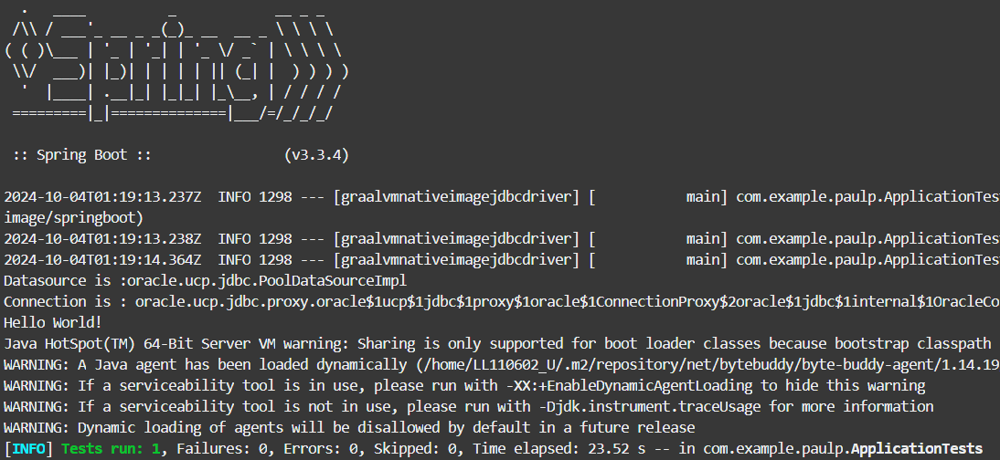

# Develop a Spring Boot GraalVM Native Image app that connects to Oracle Autonomous Database

## Introduction

This lab walks you through the steps to develop with Oracle AI Database 26ai and GraalVM using Spring Boot
Estimated Time: 30 minutes

### Objectives

In this lab, you will:
- Develop a Spring Boot GraalVM Native Image app that connects to Oracle Autonomous Database

### Prerequisites

This lab assumes you have completed the setup lab.


## Task 1: Cd to project dir and build the project

1. Cd to the following directory of the repos you cloned during setup. For example:

    ```
    <copy>   
    cd $HOME/microservices-datadriven/graalvm-nativeimage/springboot
    </copy>
    ``` 


## Task 2: Build and run

1. Edit (using `vi` or similar tool) `src/main/resources/application.yaml` to provide appropriate values for URL, user, and password such as the following.
   Replace values with those found in the workshop `Reservation Information` page and the explicit (eg don't use "~") home directory path as appropriate...
    ```
    <copy>   
    vi src/main/resources/application.yaml
    </copy>
    ```   
   
    ```properties
      url: url: jdbc:oracle:thin:@<ATP Name>_high?TNS_ADMIN=/home/<myhomedir>/myatpwallet
      username: ADMIN
      password: <password>
    ```

   *Again note that the values of the password and path to wallet are those that were collected during setup.

2. Build and run the following and notice the `Hello World!` output after startup, indicating a connection has been made to the ATP instance

    ```
    <copy>   
    mvn clean package 
    </copy>
    ```  

   

   

3. Now build and run the native image. This will take some time (up to 10 minutes)

    ```
    <copy>   
    mvn clean -Pnative native:compile -DskipTests
    </copy>
    ```  
     When complete, run the native image generated...

    ```
    <copy>   
    target/springboot-graalvm
    </copy>
    ```  

Congratulations on connecting your Spring Boot app to Oracle Autonomous Database!
Please explore the source code, configuration, and Oracle Database features to learn more about how to enhance this application.

## Acknowledgements
* **Author** - Paul Parkinson, Architect and Developer Advocate, Andy Tael, Developer Advocate
* **Last Updated By/Date** - Paul Parkinson, 2024
