# Transactional Tests: Compare MongoDB, Postgres, and Kafka to Oracle DB with TEQ/AQ

## Introduction

This lab will show you how to test different failure scenarios and compare the behavior when using different resources.

Estimated Time: 10 minutes

Watch the video below for a quick walk-through of the lab.

[](youtube:ivyPwQDl7GQ)

### Objectives

-   Test the three failure scenarios shown in the following table:


   


### Prerequisites

* Completion of Lab 1: Setup and Lab 2: Microservices Walk-through

## Task 1: Install MongoDB, Postgres, and Kafka, and Deploy Order and Inventory Services that Use Them

1. Install MongoDB, Postgres, and Kafka

    ```
    <copy>cd $GRABDISH_HOME/mongodb-kafka-postgres;./install-all.sh</copy>
    ```

2. Verify all pods and services are running by running the `pods` and `services` shortcut commands.

    ```
    <copy>pods</copy>
    ```

    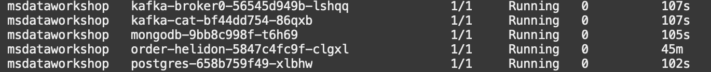

    ```
    <copy>services</copy>
    ```

    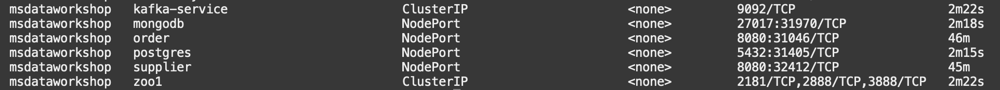

3. Undeploy any existing Order, Inventory, and Supplier Services and deploy the MongoDB, Postgres, and Kafka backed Order and Inventory implementations by copying and running the following commands.

    ```
    <copy>
    for i in order-helidon inventory-helidon inventory-helidon-se inventory-python inventory-nodejs inventory-dotnet inventory-go supplier-helidon-se; do cd $GRABDISH_HOME/$i; ./undeploy.sh; done
    cd $GRABDISH_HOME/order-mongodb-kafka ; ./deploy.sh
    cd $GRABDISH_HOME/inventory-postgres-kafka ; ./deploy.sh
    cd $GRABDISH_HOME

    </copy>
    ```

4. Verify all pods and services are running by running the `msdataworkshop` command.

    ```
    <copy>msdataworkshop</copy>
    ```

    

## Task 2: Run Tests on MongoDB, Postgres, Kafka Implementations


1. Add Inventory until there is a value of 10 for sushi.

    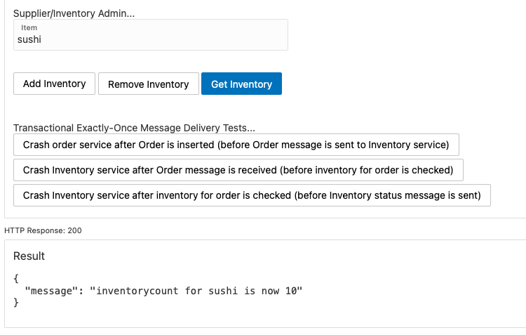

2. Click the `Crash order service after Order is inserted (before Order message is sent to Inventory service)` button.

    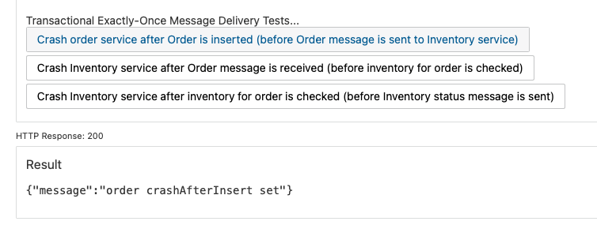

3. Click the `Place Order` button to place order `66`

    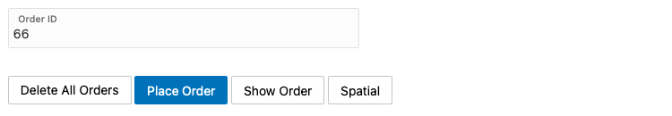

4. The request will hang due to the failure. Refresh the browser, return to the `Transactional` page, and click the `Show Order` button for order `66`.  
    You may see a "connection refused" message as the Order service has crashed and is restarting.

    

5. Click the `Show Order` button until the order is present. Notice the order is in a pending state and will remain in this state, requiring explicit handling.

    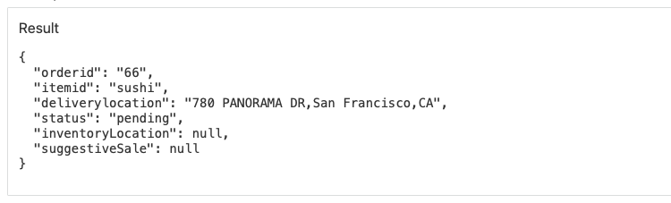

6. Click the `Get Inventory` button and notice inventory remains at 10 as expected.

    

7. Click the `Crash Inventory service after Order message is received (before inventory for order is checked)` button.

    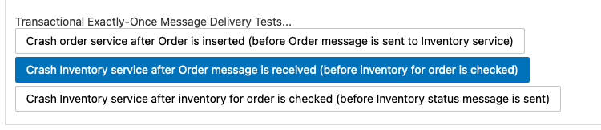
    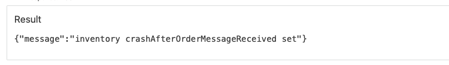

8. Enter order number `67` and click the `Place Order` button.

    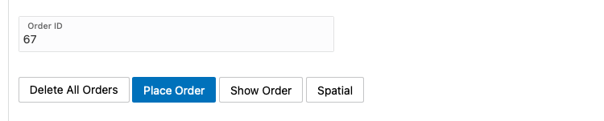

9. Notice the pending order status. The order will remain pending until the Inventory service restarts and receives the duplicate message deliver for the order.

    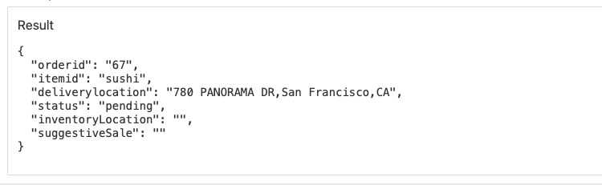

10. Continue to click the `Show Order` button until the successful order status appears.
    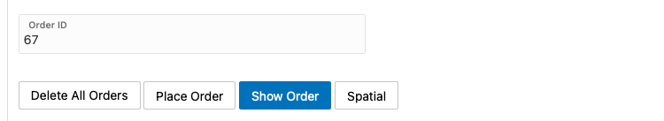

11. Notice the successful order status due to duplicate message delivery.
    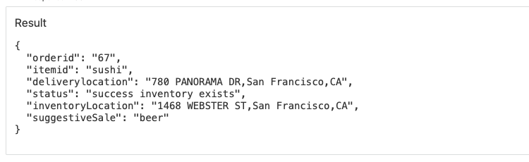

12. Click the `Get Inventory` button and notice inventory has been reduced to correct value of 9.
    

13. Click  the `Crash Inventory service after inventory for order is checked (before Inventory status message is sent)` button.
    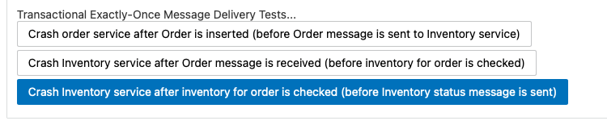
    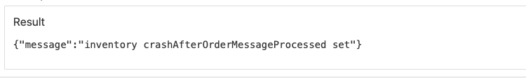

14. Enter order number `68` and click the `Place Order` button.
    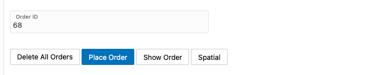

15. Notice the pending order status. The order will remain pending until the Inventory service restarts and receives the duplicate message deliver for the order
    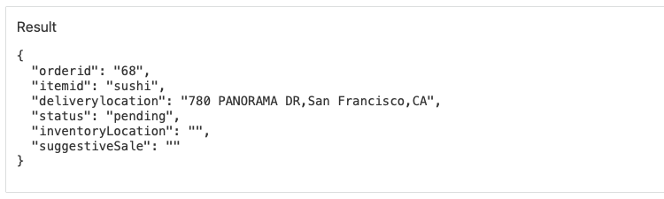

16. Continue to click the `Show Order` button until the successful order status is shown.
    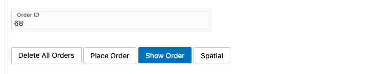

17. Notice the successful order status due to duplicate message being delivered.
    

18. Click the `Get Inventory` button and notice inventory has been reduced to an incorrect value of 7 as the duplicate message delivery has reduced inventory twice for the same order.
    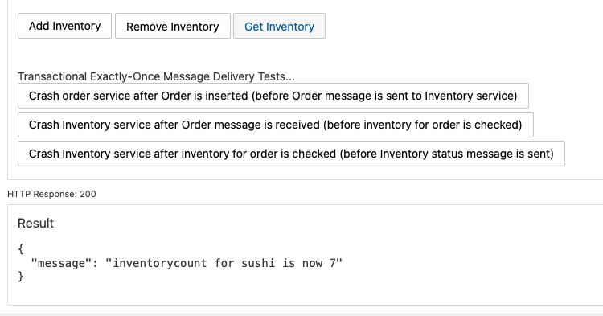

## Task 3: Deploy Order and Inventory Services that Use Oracle and AQ/TEQ

1. Undeploy MongoDB, Postgres, and Kafka backed Order and Inventory implementations and deploy the Oracle + TEQ/AQ backed Order and Inventory implementations by copying and running the following commands.

    ```
    <copy>
    for i in order-mongodb-kafka inventory-postgres-kafka; do cd $GRABDISH_HOME/$i; ./undeploy.sh; done
    cd $GRABDISH_HOME/order-helidon ; ./deploy.sh
    cd $GRABDISH_HOME/inventory-helidon ; ./deploy.sh
    cd $GRABDISH_HOME/supplier-helidon-se ; ./deploy.sh
    cd $GRABDISH_HOME

    </copy>
    ```

3. Verify all pods and services are running by running the `msdataworkshop` command.

    ```
    <copy>msdataworkshop</copy>
    ```

## Task 4: Run Tests Against Oracle DB + AQ Implementations

   ()

1. Click `Delete All Orders` button and then click `Add Inventory` until there is a value of 10 for sushi.

    

2. Click the `Crash order service after Order is inserted (before Order message is sent to Inventory service)` button.
    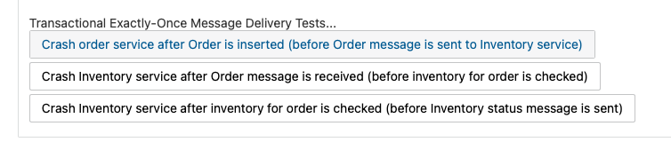
    

3. Click the `Place Order` button to place order `66`

    

4. The request will hang due to the failure. Refresh the browser, return to the `Transactional` page, and click the `Show Order` button for order `66`.  
   You may see a "connection refused" message as the Order service has crashed and is restarting.
   

5. Click the `Show Order` button until the order is present. Notice the order is null as order `66` was correctly automatically rolled back.
   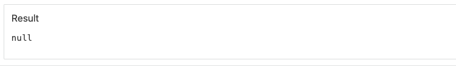

6. Click the `Get Inventory` button and notice inventory remains at 10 as expected.
   

7. Click the `Crash Inventory service after Order message is received (before inventory for order is checked)` button.
   
   

8. Enter order number `67` and click the `Place Order` button.

   

9. Notice the pending order status. The order will remain pending until the Inventory service restarts and receives the re-delivery of the message from the Order service.
   

10. Continue to click the `Show Order` button until the successful order status appears.
   

11. Notice the successful order status due to transactional exactly-once message delivery (of the message that was put back on the queue due to implicit rollback resulting from Inventory service crash).
   

12. Click the `Get Inventory` button and notice inventory has dropped to the correct value of 9.
   

13. Click  the `Crash Inventory service after inventory for order is checked (before Inventory status message is sent)` button.
   
   

14. Enter order number `68` and click the `Place Order` button.
   

15. Notice the pending order status. The order will remain pending until the Inventory service restarts and receives the re-delivery of the message from the Order service.
   

16. Continue to click the `Show Order` button until the successful order status appears.
   

17. Notice the successful order status due to transactional exactly-once message delivery (of the message that was put back on the queue due to implicit rollback resulting from Inventory service crash).
   

18. Click the `Get Inventory` button and notice inventory has dropped to correct value of 8 as the order message was delivered exactly once..
   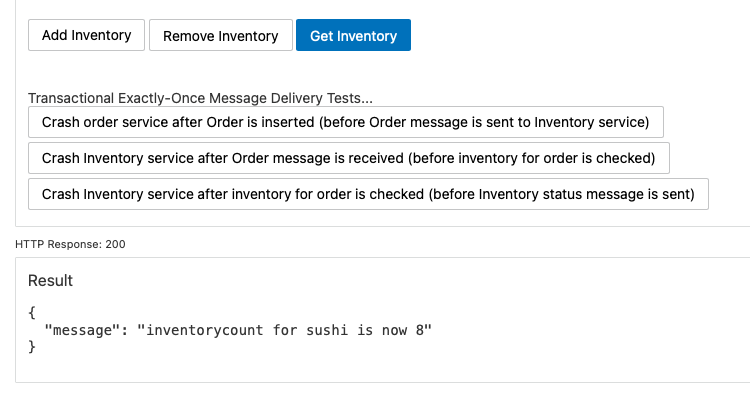

## Learn More

* Ask for help and connect with developers on the [Oracle DB Microservices Slack Channel](https://bit.ly/oracle-database-microservices-slack)  
Search for and join the `oracle-db-microservices` channel. 

## Acknowledgements
* **Author** - Paul Parkinson, Developer Evangelist
* **Last Updated By/Date** - Irina Granat, March 2022
