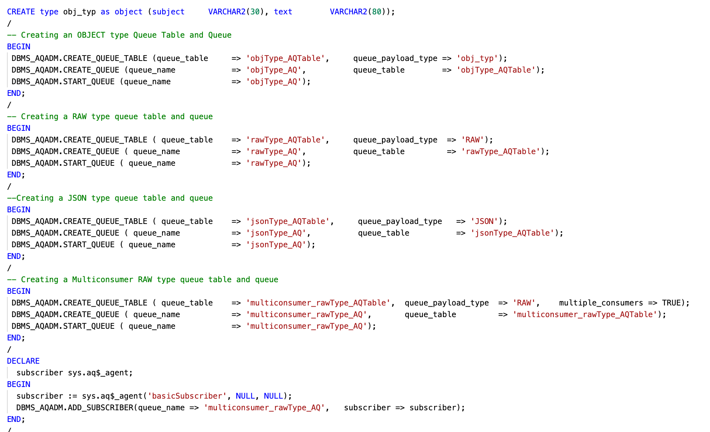
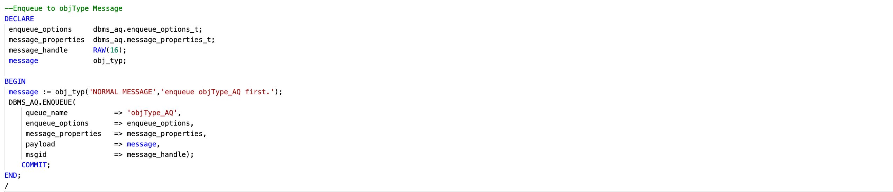
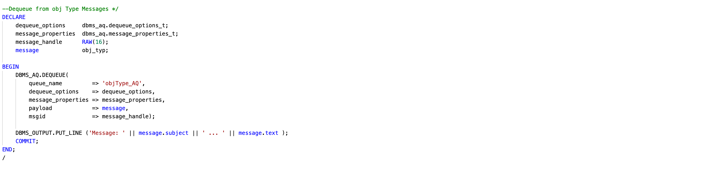
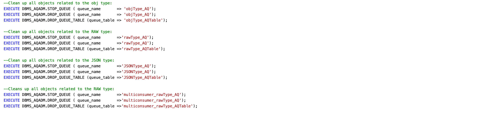

# Understand Advanced Queues

## Introduction

This lab will give an understanding of Advanced Queues creation using different payloads, enqueue AQ, dequque AQ, and cleanups.

- Estimated Time: 10 minutes

### Objectives

- Create Advanced Queues
- Enqueue for Advanced Queues
- Dequeue for Advanced Queues

### Prerequisites

- This workshop assumes you have an Oracle cloud account and configured setup in Lab 1.

## Task 1: Create Advanced Queues(AQ)

1. Below are the code samples to create AQ:

    

    - Single consumer classic queue with Payload as ADT, RAW and JSON using PL/SQL.

    - Multi-Consumer classic queue with Payload as RAW using PL/SQL.  

2. Execute the following sequence of commands into cloud shell:

    ```bash
    <copy>cd $ORACLEAQ_HOME; source createAQ.sh;
    </copy>
    ```

## Task 2: AQ Enqueue

1. Below are the code samples to Enqueue AQ:

    

    - Enqueue for Single consumer classic queue with Payload as ADT and RAW using PL/SQL.

    - Enqueue for multi-consumer classic queue with Payload as RAW using PL/SQL.

2. Execute the following sequence of commands into cloud shell:

    ```bash
    <copy>cd $ORACLEAQ_HOME; source enqueueAQ.sh;
    </copy>
    ```

## Task 3: Basic Dequeue

1. Below are the code samples to dequeue AQ

    

    - Dequeue for Single consumer classic queue with Payload as ADT and RAW using PL/SQL.

    - Dequeue for multi-consumer classic queue with Payload as RAW using PL/SQL.

2. Execute the following sequence of commands into cloud shell:

    ```bash
    <copy>cd $ORACLEAQ_HOME; source dequeueAQ.sh;
    </copy>
    ```

## Task 4: Create AQ, Enqueue and Dequeue using Java

1. Point to Point
    - Execute the following sequence of commands into cloud shell:

        ```bash
        <copy> curl http://localhost:8081/oracleAQ/pointToPointAQ 
        </copy>
        ```

2. Publisher Subscriber
    - Execute the following sequence of commands into cloud shell:

        ```bash
        <copy> curl http://localhost:8081/oracleAQ/pubSubAQ 
        </copy>
        ```

    You can view the source code for this lab [here.](https://github.com/oracle/microservices-datadriven/tree/main/workshops/oracleAQ/aqJava/src/main/java/com/examples/enqueueDequeueAQ/EnqueueDequeueAQ.java)

## Task 5: Create AQ, Enqueue and Dequeue using Python

1. Create AQ using PLSQL

      - Execute the following sequence of commands into cloud shell:

        ```bash
        <copy>cd $ORACLEAQ_HOME; source createAQPython.sh;
        </copy>
        ```

2. Enqueue, Dequeue AQ for Payload ADT, RAW and JMS using Python

      - Execute the following sequence of commands into cloud shell:

        ```bash
        <copy>cd $ORACLEAQ_HOME; pyhton3 PythonAQ.py;
        </copy>
        ```

3. Clean up for Python AQ

      - Execute the following sequence of commands into cloud shell:

        ```bash
        <copy>cd $ORACLEAQ_HOME; source cleanupAQPython.sh;
        </copy>
        ```

## Task 6: Drop queues

1. Below are the code samples to cleanup AQ

    

    - Stop classic Queues

    - Drop classic Queues

    - Drop Queue Tables

2. Execute the following sequence of commands into cloud shell:

    ```bash
    <copy>cd $ORACLEAQ_HOME; source cleanupAQ.sh;
    </copy>
    ```

You may now **proceed to the next lab.**

## Acknowledgements

- **Author** - Mayank Tayal, Developer Advocate
- **Contributors** - Sanjay Goil, VP Microservices and Oracle Database; Paul Parkinson, Developer Evangelist; Paulo Simoes, Developer Evangelist; Richard Exley, Maximum Availability Architecture; Shivani Karnewar, Senior Member Technical Staff
- **Last Updated By/Date** - Mayank Tayal, February 2022
