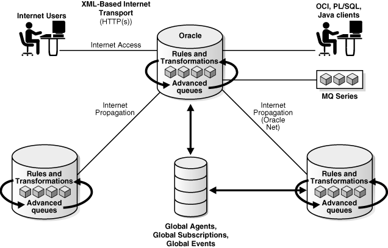
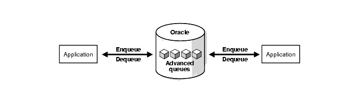
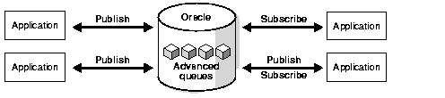

# Introduction

## About this Workshop

This workshop will help you understand the technical capabilities of Advanced Queuing and Transactional Event Queues with the usage of Second-factor Authentication workflow. 

- Estimated Time: 30 minutes

### About Product/Technology

PL/SQL, Java, and Python AQ/ TEQ Workflow examples will be demonstrated.

### Objectives

- Learn about Oracle's Advanced Queues and Transactional Event Queue Messaging working and sample examples.

### Prerequisites

- An Oracle Cloud Account- Please view this workshop's LiveLabs landing page to see which environments are supported.

>**Note:** If you have a **Free Trial** account, when your Free Trial expires, your account will be converted to an **Always Free** account. You will not be able to conduct Free Tier workshops unless the Always Free environment is available.
**[Click here for the Free Tier FAQ page.](https://www.oracle.com/cloud/free/faq.html)**

**What is Queuing?**

Transactional Event Queue (TEQ) and Advanced Queuing (AQ) stores user messages in abstract storage units called queues. When web, mobile, IoT, and other data-driven and event-driven applications stream events or communicate with each other as part of a workflow, producer applications enqueue messages and consumer applications dequeue messages.

**Introduction to Transactional Event Queues and Advanced Queuing**

Transactional Event Queues (TEQ) are highly optimized implementations of AQ previously called AQ Sharded Queues. Both TEQ and AQ in the Oracle database address the requirements from data-driven and event-driven architectures in modern enterprise applications.
 

**Transactional Event Queues Leverage Oracle Database**

Oracle Transactional Event Queues (TEQ) provide database-integrated message queuing functionality. This highly optimized and partitioned implementation leverages the functions of Oracle database so that producers and consumers can exchange messages with high throughput, by storing messages persistently, and propagating messages between queues on different databases.
Oracle Transactional Event Queues (TEQ) are a high-performance partitioned implementation with multiple event streams per queue, while Advanced Queuing (AQ) is a disk-based implementation for simpler workflow use cases. Naming nomenclature for TEQ and AQ in Oracle Database Release 21c are as follows:

| Message type        | Old Name          | New Name           |
|---------------------|:-----------------:|--------------------|
| Persistent messages | AQ classic queues | AQ queues          |
| Persistent messages | AQ Sharded queues | TEQ queues         |
| Buffered messages   | AQ classic queues | AQ buffered queues |

**Transactional Event Queues and Advanced Queuing Implementation**

- Point-to-Point Messaging
    A point-to-point message is aimed at a specific target. Senders and receivers decide on a common queue in which to exchange messages. Each message is consumed by only one receiver.
    

- Publish/Subscribe Mode
    A publish/subscribe message can be consumed by multiple receivers. Publish/subscribe describes a situation in which a publisher application enqueues messages to a queue anonymously (no recipients specified). The messages are then delivered to subscriber applications based on rules specified by each application. The rules can be defined on message properties, message data content, or both.
    

You may now **proceed to the next lab.**

## Want to Learn More?

- [Advanced Queuing User's Guide](https://docs.oracle.com/en/database/oracle/oracle-database/19/adque/)
- [Advanced Queuing Java API Reference (Javadoc)](https://docs.oracle.com/en/database/oracle/oracle-database/19/jajms/)
- [PL/SQL Packages and Types Reference](https://docs.oracle.com/en/database/oracle/oracle-database/19/arpls/)
- [https://developer.oracle.com/](https://developer.oracle.com/)

## Acknowledgements

- **Author** - Mayank Tayal, Developer Advocate
- **Contributors** - Sanjay Goil, VP Microservices and Oracle Database; Paul Parkinson, Developer Evangelist; Paulo Simoes, Developer Evangelist; Richard Exley, Maximum Availability Architecture; Shivani Karnewar, Senior Member Technical Staff
- **Last Updated By/Date** - Mayank Tayal, February 2022
