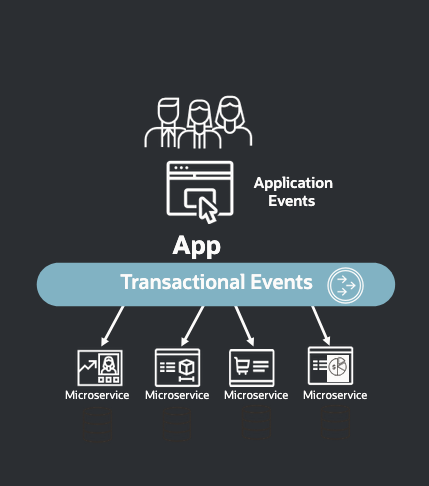

# Introduction

## About this Workshop

This workshop is designed to help you get started with [Oracle Database Transactional Event Queues (TxEventQ)](https://www.oracle.com/database/advanced-queuing/), a messaging platform designed for application workflows, microservices, and event-driven architectures that runs within Oracle Database.

Estimated Workshop Time: 30 minutes

### About Product/Technology

* [Oracle Database Transactional Event Queues (TxEventQ)](https://docs.oracle.com/en/database/oracle/oracle-database/23/adque/aq-introduction.html) is a high-throughput, reliable messaging in event-driven microservices and workflow applications that runs within Oracle Database. TxEventQ supports multiple publishers and consumers, exactly-once message delivery, transactional messaging, and robust event streaming capabilities.

### Objectives

In this workshop, you will gain first-hand experience of how Oracle Database can be used as event streaming system.

Once you complete your setup, the next lab will cover:

* The [DBMS_AQADM PL/SQL package](https://docs.oracle.com/en/database/oracle/oracle-database/23/arpls/DBMS_AQADM.html), which provides procedures to manage Transactional Event Queues
* Database permissions for users of Transactional Event Queues
* Creating and starting Transactional Event Queues
* Queue payload types

The following labs will cover enqueue and dequeue operations with queues, and additional messaging features of Transactional Event Queues.

### Prerequisites

* An Oracle Cloud Account - Please view this workshop's LiveLabs landing page to see which environments are supported

*Note: If you have a **Free Trial** account, when your Free Trial expires your account will be converted to an **Always Free** account. You will not be able to conduct Free Tier workshops unless the Always Free environment is available. **[Click here for the Free Tier FAQ page.](https://www.oracle.com/cloud/free/faq.html)***

You may now **proceed to the next lab**

## Want to Learn More?

* [Oracle Database Transactional Event Queues Homepage](https://docs.oracle.com/en/database/oracle/oracle-database/23/adque/index.html)
* [Transactional Event Queues Developer Guide](https://oracle.github.io/microservices-datadriven/transactional-event-queues/)
* [Microservices Architecture with the Oracle Database](https://www.oracle.com/technetwork/database/availability/trn5515-microserviceswithoracle-5187372.pdf)
* [https://developer.oracle.com/](https://developer.oracle.com/)

## Acknowledgements

* **Authors** - Anders Swanson, Developer Evangelist;
* **Contributors** - 
* **Last Updated By/Date** - Anders Swanson, Feb 2024
