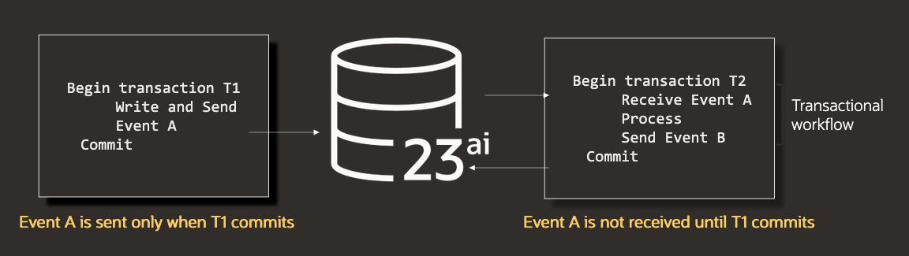

# Messaging

## Introduction

In this lab, we'll learn how to enqueue and dequeue messages using the PL/SQL API for Transactional Event Queues. You'll learn how to process messages using both the JSON and JMS queue message payload types.

Estimated Time: 10 minutes

### Objectives

- Enqueue and dequeue JSON messages
- Enqueue and dequeue JMS messages
- Combine database operations (DML) with enqueue or dequeue to implement transactional messaging

### Prerequisites

This lab assumes you have:

- A Free Tier, Paid or LiveLabs Oracle Cloud account
- You have completed the introduction and lab setup
- Completion of the Intro and Lab 1

## **Task 1:** Enqueue and dequeue JSON messages

This task demonstrates how to enqueue and dequeue JSON messages to and from a queue using the JSON payload type and the PL/SQL API.

First, we'll create a queue using the JSON payload type, which will be used use to send and receive JSON messages.

Run the following PL/SQL statement to create and start the queue:

```sql
<copy>
begin
    dbms_aqadm.create_transactional_event_queue(
        queue_name         => 'json_queue',
        queue_payload_type => 'JSON'
    );
    dbms_aqadm.start_queue(
        queue_name         => 'json_queue'
    );
end;
/
</copy>
```

Next, we'll enqueue a JSON message to the queue using the [dbms_aq.enqueue procedure](https://docs.oracle.com/en/database/oracle/oracle-database/21/arpls/DBMS_AQ.html#GUID-E262FFC1-2B21-425A-914C-B58238198455). Note the presence of the [enqueue options](https://docs.oracle.com/en/database/oracle/oracle-database/21/arpls/advanced-queuing-AQ-types.html#GUID-E6AFAEEA-3ADE-48B1-A636-A3F8C22DF995) and [message properties](https://docs.oracle.com/en/database/oracle/oracle-database/21/arpls/advanced-queuing-AQ-types.html#GUID-7232160F-22CF-4DF7-BAAF-96EDCC5CB452). These types may be used to customize the enqueue behavior. A message ID handle is passed to the enqueue call, and is populated on a successful enqueue.

Run the following PL/SQL statement to enqueue a JSON message to the `json_queue` queue:

```sql
<copy>
declare
    enqueue_options dbms_aq.enqueue_options_t;
    message_properties dbms_aq.message_properties_t;
    msg_id raw(16);
    message json;
    body varchar2(200) := '{"content": "my first JSON message"}';
begin
    select json(body) into message;
    dbms_aq.enqueue(
        queue_name => 'json_queue',
        enqueue_options => enqueue_options,
        message_properties => message_properties,
        payload => message,
        msgid => msg_id
    );
    commit;
end;
/
</copy>
```

Run the following queue to verify the message was enqueued successfully to the `json_queue` queue, viewing the JSON message ID and user data:

```sql
<copy>
select msgid, user_data from json_queue;
</copy>
```

Next, we'll dequeue the message using the [dbms_aq.dequeue procedure](https://docs.oracle.com/en/database/oracle/oracle-database/21/arpls/DBMS_AQ.html#GUID-E262FFC1-2B21-425A-914C-B58238198455). The [dequeue options type](https://docs.oracle.com/en/database/oracle/oracle-database/21/arpls/advanced-queuing-AQ-types.html#GUID-DB3EC41E-02A4-4975-A685-438DD7BCBE0C) can be used to customize the dequeue. In this case, we set the dequeue to consume the first message, with no wait.

Run the following PL/SQL statement to dequeue the message and print it to the console:

```sql
<copy>
declare
    dequeue_options dbms_aq.dequeue_options_t;
    message_properties dbms_aq.message_properties_t;
    msg_id raw(16);
    message json;
    message_buffer varchar2(500);
begin
    dequeue_options.navigation := dbms_aq.first_message;
    dequeue_options.wait := dbms_aq.no_wait;
    
    dbms_aq.dequeue(
        queue_name => 'json_queue',
        dequeue_options => dequeue_options,
        message_properties => message_properties,
        payload => message,
        msgid => msg_id
    );
    select json_value(message, '$.content') into message_buffer;
    dbms_output.put_line('message: ' || message_buffer);
    commit;
end;
/
</copy>
```

## **Task 2:** Enqueue and dequeue JMS messages

This task demonstrates how to enqueue and dequeue JMS messages to and from a queue using the JMS payload type and the PL/SQL API.

First, we'll create a queue using the JMS payload type, which we'll use to send and receive messages. Note that JMS is the default payload type if not specified using the `queue_payload_type` parameter.

```sql
<copy>
begin
    dbms_aqadm.create_transactional_event_queue(
        queue_name         => 'jms_queue',
        queue_payload_type => DBMS_AQADM.JMS_TYPE
    );
    dbms_aqadm.start_queue(
        queue_name         => 'jms_queue'
    );
end;
/
</copy>
```

Next, we'll enqueue a JMS message. This looks similar to the JSON enqueue task, except we use a [sys.aq$_jms_text_message type](https://docs.oracle.com/en/database/oracle/oracle-database/23/arpls/JMS-Types.html#GUID-A4482CE1-7DCA-4457-ADFE-9FA1C841AABF) instances for the `payload` parameter. The use of a JMS object type is necessary, as the `jms_queue` queue processes JMS messages.

```sql
<copy>
declare
    enqueue_options dbms_aq.enqueue_options_t;
    message_properties dbms_aq.message_properties_t;
    message_handle raw(16);
    message sys.aq$_jms_text_message;
begin
    message := sys.aq$_jms_text_message.construct();
    message.set_text('this is my first JMS message');

    dbms_aq.enqueue(
            queue_name => 'jms_queue',
            enqueue_options => enqueue_options,
            message_properties => message_properties,
            payload => message,
            msgid => message_handle
    );
    commit;
end;
/
</copy>
```

Now, we'll dequeue the JMS message using the [`dbms_aq.dequeue procedure`](https://docs.oracle.com/en/database/oracle/oracle-database/21/arpls/DBMS_AQ.html#GUID-E262FFC1-2B21-425A-914C-B58238198455). This is similar to the JSON dequeue, except we use [`sys.aq$_jms_text_message type`](https://docs.oracle.com/en/database/oracle/oracle-database/23/arpls/JMS-Types.html#GUID-A4482CE1-7DCA-4457-ADFE-9FA1C841AABF) to retrieve the message type. 

Run the following PL/SQL statement to dequeue the message and print it to the console:

```sql
<copy>
declare
    dequeue_options dbms_aq.dequeue_options_t;
    message_properties dbms_aq.message_properties_t;
    msg_id raw(16);
    message sys.aq$_jms_text_message;
    payload varchar2(1000);
begin
    dequeue_options.navigation := dbms_aq.first_message;
    dequeue_options.wait := dbms_aq.no_wait;

    dbms_aq.dequeue(
            queue_name => 'jms_queue',
            dequeue_options => dequeue_options,
            message_properties => message_properties,
            payload => message,
            msgid => msg_id
    );

    message.get_text(payload);
    dbms_output.put_line('message: ' || payload);
    commit;
end;
/
</copy>
```

You may write similar procedures to enqueue and dequeue messages from queues using the RAW or Abstract Data Type (ADT) payload types, with the main difference being the `payload` parameter type and its associated data processing.

## **Task 3:** Combine DML with an enqueue

Because enqueue and dequeue operations occur within database transactions, developers may combine DML with messaging operations to implement **transactional messaging**. Transactional messaging is particularly useful when a message contains data relevant to other tables or services within your schema, allowing you to atomically insert or update data as part of a message transaction. 



In the following example, DML (an INSERT statement) is combined with an enqueue operation as part of the same transaction. If the enqueue or DML fails, the both operations are rolled back.

To illustrate this example, we'll create an `orders` table that will be used to store product records during the enqueue operation.

Run the following SQL statement to create the `orders` table:

```sql
<copy>
create table orders
(
    id         raw(16) default sys_guid() primary key,
    product_id number,
    quantity   number,
    msg_id      raw(16),
    order_date date default sysdate
);
</copy>
```

Next, we enqueue a JSON order. The JSON order is parsed and inserted into the `orders` table as part of the enqueue's database transaction.

Run the following PL/SQL statement to enqueue a message and insert a record into the `orders` table as part of the same transaction:

```sql
<copy>
declare
    enqueue_options dbms_aq.enqueue_options_t;
    message_properties dbms_aq.message_properties_t;
    msg_id raw(16);
    message json;
    body varchar2(200) := '{"product_id": 1, "quantity": 5}';
    product_id number;
    quantity number;
begin
    -- Convert the JSON string to a JSON object
    message := json(body);

    -- Enqueue the message
    dbms_aq.enqueue(
        queue_name => 'json_queue',
        enqueue_options => enqueue_options,
        message_properties => message_properties,
        payload => message,
        msgid => msg_id
    );

    -- Extract product_id and quantity from the JSON object
    product_id := json_value(message, '$.product_id' returning number);
    quantity := json_value(message, '$.quantity' returning number);

    -- Insert data into the orders table
    insert into orders (product_id, quantity, msg_id)
    values (product_id, quantity, msg_id);
    commit;
exception
    when others then
        -- Rollback the transaction on error
        rollback;
        dbms_output.put_line('error dequeuing message: ' || sqlerrm);
end;
/
</copy>
```

Finally, query the orders table. You should see a similar output, indicating the product order was successfully inserted as part of the enqueue.

```sql
<copy>
select * from orders;
</copy>
```

| ID                               | PRODUCT_ID | QUANTITY | MSG_ID                           | ORDER_DATE          |
|----------------------------------|------------|----------|----------------------------------|---------------------|
| 2DCF980BBD4D02BBE063020011AC4AFC | 1          | 5        | 00000000000000000000000004660200 | 2025-02-10T19:49:44 |

Transactional messaging is applicable to both enqueue and dequeue operations. The DML may be applied before or after the enqueue or dequeue operation, as needed. For example, if you require access to the message id, you should apply your DML after message operation.


You may now **proceed to the next lab**

## Acknowledgements

- **Authors** - Anders Swanson, Developer Evangelist;
- **Contributors** - 
- **Last Updated By/Date** - Anders Swanson, Feb 2025
