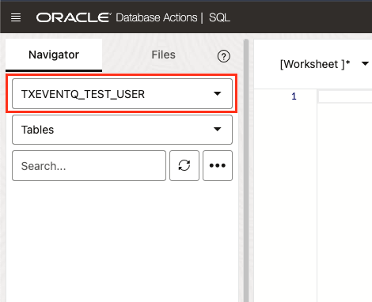

# Queue Management

## Introduction

This lab provides hands-on experience with the management of Transactional Event Queues (TxEventQ). Participants will gain practical knowledge of the necessary database permissions, the steps to manage queues using the PL/SQL API for TxEventQ.

We'll also dive into the differences between "topics" and "queues" in today's IT world and cover an extended list of options for managing TxEventQ.

Estimated Time: 10 minutes

### Objectives

- Understand database permissions required for TxEventQ users
- Start, stop, and manage queues
- Creating topics vs. creating queues
- Learn the different message payload types used when creating queues

### Prerequisites

- A Free Tier, Paid, or LiveLabs Oracle Cloud account
- You have completed the introduction and lab setup

## **Task 1:** Database Permissions for Transactional Event Queues

The following permissions are recommended for PL/SQL TxEventQ users, granting access to the necessary database packages. Ensure tablespace is granted as appropriate for your TxEventQ user.

Note: If you are already familiar with these permissions and prefer to run the labs as an Admin without creating a new user, you can skip Task 1 and proceed directly to Task 2.

Execute the following statement to create a new user account.

```sql
  CREATE USER txeventq_test_user IDENTIFIED BY "Livelabs1234#";
```

Execute following statement to grant required permissions to the user.

```sql
<copy>
  -- Grant tablespace as appropriate to your TxEventQ user
  -- GRANT UNLIMITED TABLESPACE TO txeventq_test_user;    
  GRANT RESOURCE, CONNECT TO txeventq_test_user;
  GRANT aq_user_role TO txeventq_test_user;
  GRANT EXECUTE ON dbms_aq TO txeventq_test_user;
  GRANT EXECUTE ON dbms_aqadm TO txeventq_test_user;
  GRANT EXECUTE ON dbms_aqin TO txeventq_test_user;
  GRANT EXECUTE ON dbms_aqjms TO txeventq_test_user;
</copy>
```

Refresh the page and, from the navigator section in the top left corner, switch your user from ADMIN to `TXEVENTQ_TEST_USER` as illustrated below:



- `dbms_aq`: The `DBMS_AQ` package provides the PL/SQL interface message management within the Oracle database. See [`DBMS_AQ` Security Model](https://docs.oracle.com/en/database/oracle/oracle-database/23/arpls/DBMS_AQ.html#GUID-EA27B877-CA19-4B66-9293-AE4AD28B9BB3) for more information.
- `dbms_aqadm`: The `DBMS_AQADM` package provides PL/SQL procedures for administering  queues, subscribers, propagation, and security privileges. See [DBMS_AQADM Security Model](https://docs.oracle.com/en/database/oracle/oracle-database/23/arpls/DBMS_AQADM.html#GUID-4C5364E5-DD93-4E56-9587-65EE5D0FB324) for more information.
- `dbms_aqin`: The `DBMS_AQIN` package is essential for secure access to Oracle JMS interfaces, requiring EXECUTE privilege for users of Oracle JMS. See [DBMS_AQIN Security Model](https://docs.oracle.com/en/database/oracle/oracle-database/23/arpls/DBMS_AQIN.html#GUID-4DBA97E2-601E-47CE-8D21-776243782CFA) for more information.

## **Task 2:** Create, Start, and Stop Queues

This task involves managing TxEventQ with the DBMS_AQADM PL/SQL package.

The [`DBMS_AQADM` PL/SQL package](https://docs.oracle.com/en/database/oracle/oracle-database/23/arpls/DBMS_AQADM.html) provides procedures for the management of Transactional Event Queues.

A queue can be created using the [`DBMS_AQADM.CREATE_TRANSACTIONAL_EVENT_QUEUE` procedure](https://docs.oracle.com/en/database/oracle/oracle-database/23/arpls/DBMS_AQADM.html#GUID-6841A667-1021-4E5C-8567-F71913AA4773). Queues must be started with the [`DBMS_AQADM.START_QUEUE` procedure](https://docs.oracle.com/en/database/oracle/oracle-database/23/arpls/DBMS_AQADM.html#GUID-EED83332-40B1-4B0A-9E50-AC006A1A0615) after creation, but before they are used for messaging.

Run the following PL/SQL statement to create and start a queue named `my_queue` using the default DBMS_AQADM options:

```sql
<copy>
begin
    -- create the Transactional Event Queue
    dbms_aqadm.create_transactional_event_queue(
        queue_name         => 'my_queue',
        -- when multiple_consumers is true, this will create a pub/sub "topic" - the default is false, it will create point-to-point "queue"
        multiple_consumers => false
    );

    -- start the Transactional Event Queue
    dbms_aqadm.start_queue(
        queue_name         => 'my_queue'
    );
end;
/
</copy>
```

The [`DBMS_AQADM.ALTER_TRANSACTIONAL_EVENT_QUEUE` procedure](https://docs.oracle.com/en/database/oracle/oracle-database/23/arpls/DBMS_AQADM.html#GUID-260ED3E1-9959-4033-8B00-FD911424DFBB) is used to modify an existing queue. This procedure can configure settings like queue retries, queue comments, and other properties after creation.

Run the following PL/SQL statement to add a comment to the `my_queue` queue.

```sql
<copy>
begin
    dbms_aqadm.alter_transactional_event_queue(
        queue_name => 'my_queue',
        comment    => 'for testing purposes'
    );
end;
/
</copy>
```

To view the current queues in the user schema, query the `user_queues` table.

```sql
<copy>
select * from user_queues;
/
</copy>
```

You should see queue data similar to the following, for the queues available on your specific database schema.

| NAME             | QUEUE_TABLE      | QID  | QUEUE_TYPE     | MAX_RETRIES | RETRY_DELAY | ENQUEUE_ENABLED | DEQUEUE_ENABLED | RETENTION | USER_COMMENT         | NETWORK_NAME | SHARDED | QUEUE_CATEGORY           | RECIPIENTS |
|------------------|------------------|------|---------------|-------------|-------------|-----------------|-----------------|-----------|----------------------|--------------|---------|-------------------------|------------|
| MY_QUEUE         | MY_QUEUE         | 73283 | NORMAL_QUEUE   | 5           | 0           | YES             | YES             | 0         | for testing purposes | null         | TRUE    | Transactional Event Queue | SINGLE    |


The [`DBMS_AQADM.STOP_QUEUE` procedure](https://docs.oracle.com/en/database/oracle/oracle-database/23/arpls/DBMS_AQADM.html#GUID-14EADFE9-D7C3-472D-895D-861BB5570EED) is used to stop a queue. After a queue is stopped, it can be dropped using the [`DBMS_AQADM.DROP_TRANSACTIONAL_EVENT_QUEUE` procedure](https://docs.oracle.com/en/database/oracle/oracle-database/23/arpls/DBMS_AQADM.html#GUID-99A161DB-85C7-439A-A85C-A7BEEBD0288F).

Run the following PL/SQL statement to stop the `my_queue` queue, and drop it from the database.

```sql
<copy>
begin
    dbms_aqadm.stop_queue(
        queue_name => 'my_queue'
    );
    dbms_aqadm.drop_transactional_event_queue(
        queue_name => 'my_queue'
    );
end;
/
</copy>
```

## **Task 3:** Creating Topics and Queues

This task delves into topics vs. queues in today's IT world and covers the parameters used when managing TxEventQ with the DBMS_AQADM SQL package.

### Topics vs. Queues in Today’s IT World

In modern software engineering, queues and topics serve as fundamental messaging patterns for asynchronous, decoupled communication between services. While both enable high-throughput message exchange, they differ significantly in how they distribute and retain messages.

#### What is a Queue?

A queue follows a point-to-point messaging model, where each message is consumed by exactly one consumer. Once a message is processed, it is removed from the queue. Queues are ideal for task distribution, where work needs to be shared among multiple workers but each task should only be handled once. There can also be specific flavors of queues like priority queues, where some messages can be processed/dequeued with higher priority.

##### Use Cases for Queues

- Job Processing – Distributing workloads among multiple worker nodes (e.g., background task processing in Celery, AWS SQS, or RabbitMQ).
- Transactional Systems – Ensuring an event is processed exactly once, preventing duplicate actions.
- Load Balancing – Managing traffic distribution across backend services.

#### What is a Topic?

A topic follows a publish-subscribe (pub/sub) model, where each message can be broadcast to multiple subscribers. Unlike queues, topics do not remove messages upon consumption—messages are retained for a specified duration, allowing multiple consumers to process the same message independently.

##### Use Cases for Topics

- Event-Driven Architectures – Notifying multiple downstream services about an event (e.g., user sign-ups triggering notifications, analytics, and fraud detection).
- Message Replay & Streaming – Allowing consumers to process past events (e.g., event sourcing with Apache Kafka).
- Multi-Consumer Communication – Delivering real-time messages to multiple applications (e.g., IoT telemetry data processing).

### Options Available with TxEventQ to Address Advanced Use-Cases

Here is the list of arguments that can be used with the [`DBMS_AQADM.CREATE_TRANSACTIONAL_EVENT_QUEUE` procedure](https://docs.oracle.com/en/database/oracle/oracle-database/23/arpls/DBMS_AQADM.html#GUID-6841A667-1021-4E5C-8567-F71913AA4773):

#### Required Parameters

| Parameter        | Description |
|-----------------|-------------|
| **queue_name**  | Specifies the name of the new queue. Maximum of 128 characters allowed. |

#### Optional Parameters

| Parameter                | Description                                                                                                                                                                                                                                                                                                                                                                                         |
|--------------------------|-----------------------------------------------------------------------------------------------------------------------------------------------------------------------------------------------------------------------------------------------------------------------------------------------------------------------------------------------------------------------------------------------------|
| **storage_clause**       | Defines storage settings for the queue table. It can include parameters such as PCTFREE, PCTUSED, INITRANS, MAXTRANS, TABLESPACE, LOB, and a table storage clause. If not specified, the default user tablespace is used. See [storage_clause](https://docs.oracle.com/en/database/oracle/oracle-database/23/arpls/DBMS_AQADM.html#GUID-93B0FF90-5045-4437-A9C4-B7541BEBE573) for more information. |
| **multiple_consumers**   | Determines whether a queue can have multiple consumers per message. Default is `FALSE` (single consumer per message). Set to `TRUE` for multiple consumers. Publish/Subscribe model ("Topic") vs. Point-to-Point model ("Queue").                                                                                                                                                                   |
| **max_retries**          | Limits the number of retry attempts for dequeuing a message after failure. The maximum value is 2³¹ - 1. If the limit is exceeded, the message is purged from the queue.                                                                                                                                                                                                                            |
| **comment**              | A user-specified description of the queue table, added to the queue catalog.                                                                                                                                                                                                                                                                                                                        |
| **queue\_payload\_type** | Specifies the payload type the queue can handle. Options include `RAW`, `JSON`, `DBMS_AQADM.JMS_TYPE`, or an object type. Default is `DBMS_AQADM.JMS_TYPE`. See [DBMS_AQ Data Types](https://docs.oracle.com/en/database/oracle/oracle-database/23/arpls/DBMS_AQ.html#GUID-56E78CA6-3EB0-44C9-AEB7-F13A5A077D73).                                                                                   |
| **queue_properties**     | Defines additional queue properties such as queue type (Normal or Exception Queue), retry delay, retention time, sort list, and cache hints. See [QUEUE_PROPS_T Type](https://docs.oracle.com/en/database/oracle/oracle-database/23/arpls/advanced-queuing-AQ-types.html#GUID-E3F15E41-1365-42C3-8B47-CA3C1E805B77) for more information.                                                           |

#### Create a Topic using the JSON payload type

```sql
<copy>
begin
    dbms_aqadm.create_transactional_event_queue(
            queue_name         => 'my_topic',
            queue_payload_type => 'JSON',
            multiple_consumers => true,
            comment            => 'my TxEventQ topic'
    );

    dbms_aqadm.start_queue(
      queue_name => 'my_topic'
    );
end;
/
</copy>
```

#### Create a Queue using the JSON payload type

```sql
<copy>
begin
    dbms_aqadm.create_transactional_event_queue(
            queue_name         => 'my_queue',
            queue_payload_type => 'JSON',
            multiple_consumers => false,
            comment            => 'my TxEventQ queue'
    );

    dbms_aqadm.start_queue(
      queue_name => 'my_queue'
    );
end;
/
</copy>
```

## **Task 4:** Create Transactional Event Queues with Message Payload Types

Transactional Event Queues support various [message payload types](https://docs.oracle.com/en/database/oracle/oracle-database/23/arpls/DBMS_AQ.html#GUID-56E78CA6-3EB0-44C9-AEB7-F13A5A077D73), allowing flexibility in how data is structured and stored within the queue. The payload type determines the format and structure of the messages that can be enqueued and dequeued. When creating a Transactional Event Queue, you may specify one of these payload types, each offering different benefits depending on your application's needs and data characteristics. Note that if not specified, `DBMS_AQADM.JMS_TYPE` is the default payload type.

Understanding these payload types is crucial for designing efficient and effective messaging solutions. The choice of payload type impacts how you interact with the queue, the kind of data you can store, and how that data is processed. Let's explore the available payload types and their use cases.

> Attempting to produce a message of the wrong payload type may result in the following error:
> 
> **ORA-25207: enqueue failed, queue <schema>.<queue> is disabled from enqueueing**

### `DBMS_AQADM.JMS_TYPE`

The JMS (Java Message Service) payload type is ideal for applications using JMS, as it provides a highly scalable API for asynchronous messaging.

The following script creates and starts a Transactional Event Queue using `DBMS_AQADM.JMS_TYPE` as the payload type, which is the default payload type.

```sql
<copy>
-- Create a Transactional Event Queue
begin
    dbms_aqadm.create_transactional_event_queue(
            queue_name         => 'jms_queue_example',
            -- Payload can be RAW, JSON, DBMS_AQADM.JMS_TYPE, or an object type.
            -- Default is DBMS_AQADM.JMS_TYPE.
            queue_payload_type => DBMS_AQADM.JMS_TYPE,
            multiple_consumers => false
    );

    -- Start the queue
    dbms_aqadm.start_queue(
            queue_name         => 'jms_queue_example'
    );
end;
/
</copy>
```

### Raw

When using the RAW type, the Transactional Event Queue backing table will be created with a [Large Object (LOB)](https://docs.oracle.com/en/database/oracle/oracle-database/23/adque/glossary.html#GUID-E0E22C6A-42AE-41CF-A021-5CB63BABB48E) column 32k in size for binary messages.

RAW payloads are suitable for unstructured binary data that do not fit into predefined schemas, or for simple, lightweight messages. While RAW payloads offer flexibility and efficiency, they may require additional application-level processing to interpret the binary data.

The following PL/SQL statement creates a Transactional Event Queue using the RAW payload type.

```sql
<copy>
begin
  dbms_aqadm.create_transactional_event_queue(
    queue_name => 'raw_queue_example',
    queue_payload_type => 'RAW'
  );
  
  dbms_aqadm.start_queue(
    queue_name => 'raw_queue_example'
  );
end;
/
</copy>
```

### JSON

The JSON payload type stores the JSON message data in a post-parse binary format, allowing fast access to nested JSON values. It's recommended to use the JSON payload type if you're working with document data or other unstructured JSON.

The following PL/SQL statement creates a Transactional Event Queue using the JSON payload type.

```sql
<copy>
begin
  dbms_aqadm.create_transactional_event_queue(
    queue_name => 'json_queue_example',
    queue_payload_type => 'JSON'
  );
  
  dbms_aqadm.start_queue(
    queue_name => 'json_queue_example'
  );
end;
/
</copy>
```

### Object

For structured, complex messages, you may choose to set the payload type as a custom object type that was defined using `create type`. Object types must be accessible from the queue/topic, and the structure of each message must exactly match the payload type.

First, define a custom object type `my_message`:

```sql
<copy>
-- Define the payload type
create type my_message as object (
  id number,
  subject varchar2(100),
  body    varchar2(2000)
);
</copy>
```

Then, create a Transactional Event Queue using `my_message` as the payload type:

```sql
<copy>
-- Create and start a queue using the custom payload type
begin
    dbms_aqadm.create_transactional_event_queue(
            queue_name         => 'custom_type_queue',
            queue_payload_type => 'my_message'
    );

    -- Start the queue
    dbms_aqadm.start_queue(
            queue_name         => 'custom_type_queue'
    );
end;
/
</copy>
```

You may now **proceed to the next lab**

## Acknowledgements

- **Authors** - Ben Kocabasoglu, Senior Principal Software Engineer;
- **Contributors** - Anders Swanson, Developer Evangelist;
- **Last Updated By/Date** - Ben Kocabasoglu, Feb 2025
