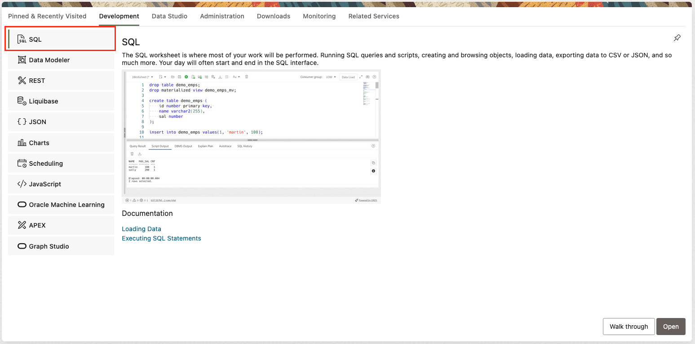

# Log in to SQL Worksheet

## Introduction

In this lab, we'll log in to the SQL Worksheet for your lab's Oracle Autonomous Database instance. SQL Worksheet is an online interface that allows you to run Oracle Autonomous Database SQL statements.

Estimated Time: 5 minutes

### Objectives

- Log in to SQL Worksheet for your Oracle Autonomous Database Instance

### Prerequisites

This lab assumes you have:

- A Free Tier, Paid or LiveLabs Oracle Cloud account
- You have completed the introduction and lab setup
- Completion of the Intro and Lab 1

## **Task 1:** Log in to SQL Worksheet

Above the workshop instructions, click the **View Login Info** button to view login information for your lab.

On the LiveLabs reservation information screen, make note of the ADMIN user and password, and then click the **SQL Worksheet URL**. This URL takes you directly to the Autonomous Database log in screen for SQL Worksheet.

On the ADB login screen, enter the ADMIN username and password to log in to SQL Worksheet.

After logging in, you should be redirected to the Database Actions launchpad. Click the "SQL" button on the upper left to access SQL Worksheet.

For the remainder of the lab, we'll use SQL Worksheet to run various commands.

You may now **proceed to the next lab**

## Acknowledgements

- **Authors** - Anders Swanson, Developer Evangelist;
- **Contributors** -
- **Last Updated By/Date** - Anders Swanson, Feb 2025
