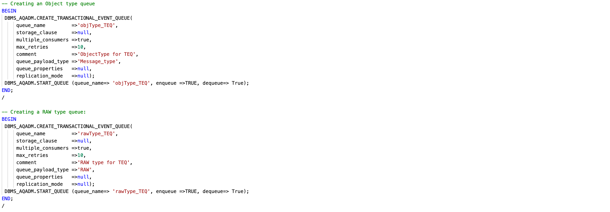
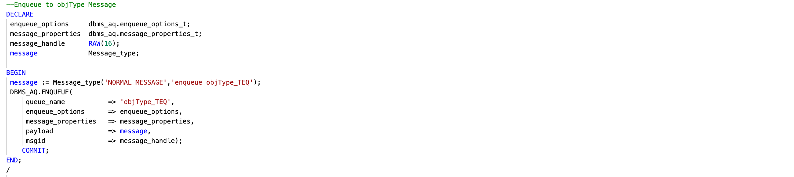
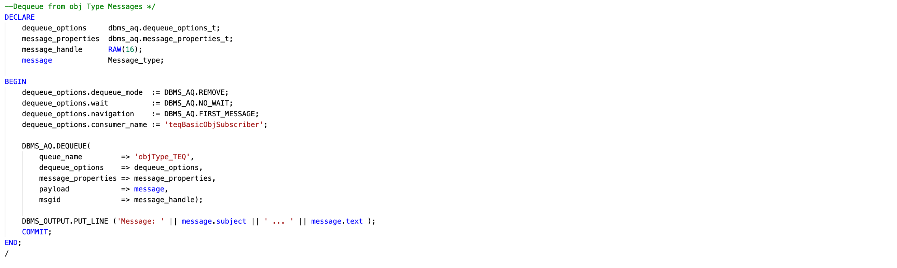
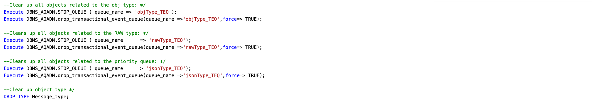

# Understand TEQ

## Introduction

Transactional Event Queues(TEQ) samples to create queues using different payloads, Enqueue, dequeue, and cleanups using PL/SQL.

- Estimated Time: 10 minutes

### Objectives

- Create Transactional Event Queue
- Enqueue Transactional Event Queue
- Dequeue Transactional Event Queue

### Prerequisites

- This workshop assumes you have an Oracle cloud account and configured setup in Lab 1.

## Task 1: Create TEQ

1. Below are the code samples to create TEQ

    

    - Multi-consumer TEQ with Payload as RAW using PL/SQL.

    - Multi-Consumer TEQ with Payload as Object Type using PL/SQL.

    - Multi-Consumer TEQ with Payload as JSON Type using PL/SQL.

2. Execute the following sequence of commands into cloud shell

    ```bash
    <copy>cd $ORACLEAQ_HOME; source createTEQ.sh;
    </copy>
    ```

## Task 2: Enqueue in TEQ

1. Below are the code samples to enqueue TEQ

    

    - Enqueue for multi-consumer TEQ with Payload as RAW using PL/SQL.

    - Enqueue for multi-Consumer TEQ with Payload as Object Type using PL/SQL.

    - Enqueue for multi-Consumer TEQ with Payload as JSON Type using PL/SQL.

1. Execute the following sequence of commands into cloud shell

    ```bash
    <copy>cd $ORACLEAQ_HOME; source enqueueTEQ.sh;
    </copy>
    ```

## Task 3: Dequeue in TEQ

1. Below are the code samples to dequque TEQ

    

    - Enqueue for multi-consumer TEQ with Payload as RAW using PL/SQL.

    - Enqueue for multi-Consumer TEQ with Payload as Object Type using PL/SQL.

    - Enqueue for multi-Consumer TEQ with Payload as JSON Type using PL/SQL.

2. Execute the following sequence of commands into cloud shell

    ```bash
    <copy>cd $ORACLEAQ_HOME; source dequeueTEQ.sh;
    </copy>
    ```

## Task 4: TEQ Enqueue and Dequeue using Java

1. Execute the following sequence of commands into cloud shell

    ```bash
    <copy> curl http://localhost:8081/oracleAQ/pubSubTEQ </copy>
    ```

    You can view the source code for this lab [here.](https://github.com/oracle/microservices-datadriven/tree/main/workshops/oracleAQ/aqJava/src/main/java/com/examples/enqueueDequeueTEQ/EnqueueDequeueTEQ.java)

## Task 5: Drop TEQ

1. Below are the code samples to cleanup TEQ

    

    - Stop classic Queues

    - Drop classic Queues

2. Execute the following sequence of commands into cloud shell

    ```bash
    <copy>cd $ORACLEAQ_HOME; source cleanupTEQ.sh;
    </copy>
    ```

 You may now **proceed to the next lab.**

## Acknowledgements

- **Author** - Mayank Tayal, Developer Advocate
- **Contributors** - Sanjay Goil, VP Microservices and Oracle Database; Paul Parkinson, Developer Evangelist; Paulo Simoes, Developer Evangelist; Richard Exley, Maximum Availability Architecture; Shivani Karnewar, Senior Member Technical Staff
- **Last Updated By/Date** - Mayank Tayal, February 2022
