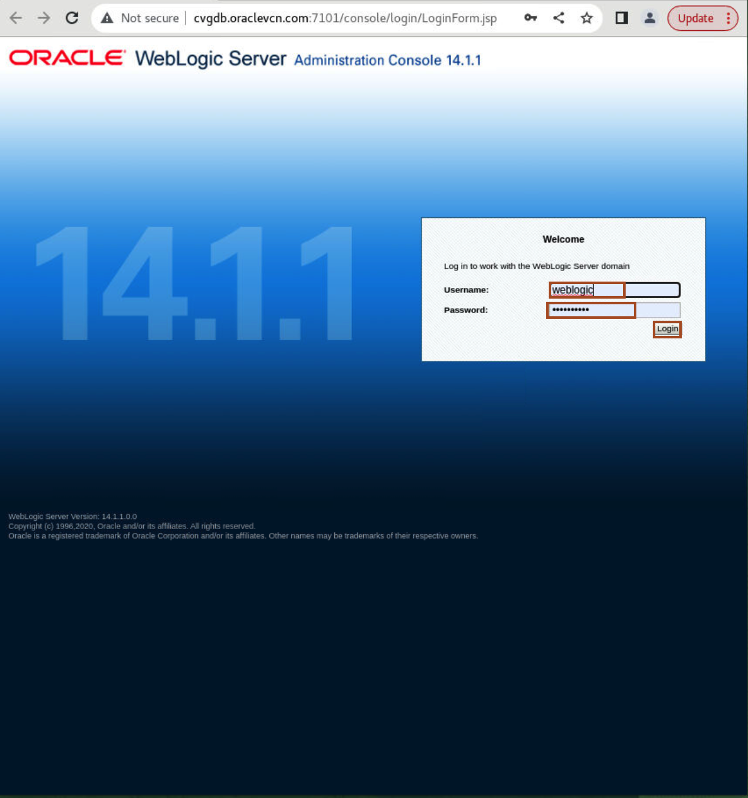

# Initialize Environment

## Introduction

In this lab we will review and startup all components required to successfully run this workshop.

*Estimated Lab Time:* 10 Minutes.

### Objectives
- Initialize the workshop environment.

### Prerequisites
This lab assumes you have:
- A Free Tier, Paid or LiveLabs Oracle Cloud account
- You have completed:
    - Lab: Prepare Setup (*Free-tier* and *Paid Tenants* only)


## Task 1: Validate That Required Processes are Up and Running.
1. Now with access to your remote desktop session, proceed as indicated below to validate your environment before you start executing the subsequent labs. The following Processes should be up and running:
    - Application
        - bestbank2020

2. Validate that expected processes are up. Please note that it may take up to 5 minutes after instance provisioning for all processes to fully start. On Desktop, Click on **Terminal** and paste the below command.

    ```
    <copy>
    systemctl status oracle-init-workshop
    </copy>
    ```

3. On the web browser window on the right preloaded with *WebLogic Admin Console* login page, click on the *Username* field and select the saved credentials or provide the credentials below to login.

      

    ```
    username: <copy>weblogic</copy>
    ```
    ```
    password: <copy>Oracle123!</copy>
    ```

5.	On the left hand side Menu under **Domain Structure** click on **Deployments**. Observe that the *bestbank2020* application has been already deployed and available to access.

	  

5.	Still on the same browser window on the right, switch to the second tab preloaded with  tab *BestBank* application UI and confirm that the page loaded successfully

You may now [proceed to the next lab](#next).


## Acknowledgements

- **Authors** - Balasubramanian Ramamoorthy, Sudip Bandyopadhyay, Vishwanath Venkatachalaiah
- **Contributors** - Jyotsana Rawat, Satya Pranavi Manthena, Kowshik Nittala, Rene Fontcha
- **Last Updated By/Date** - Ankit Pandey, February 2024
