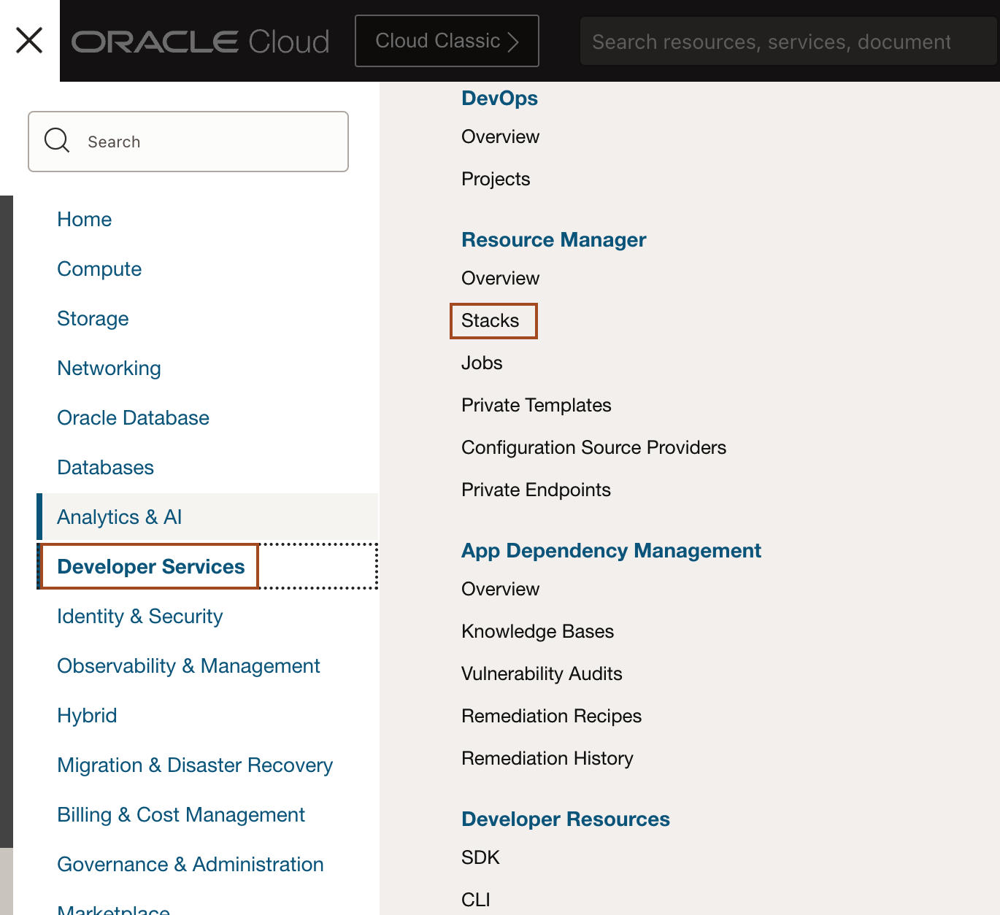
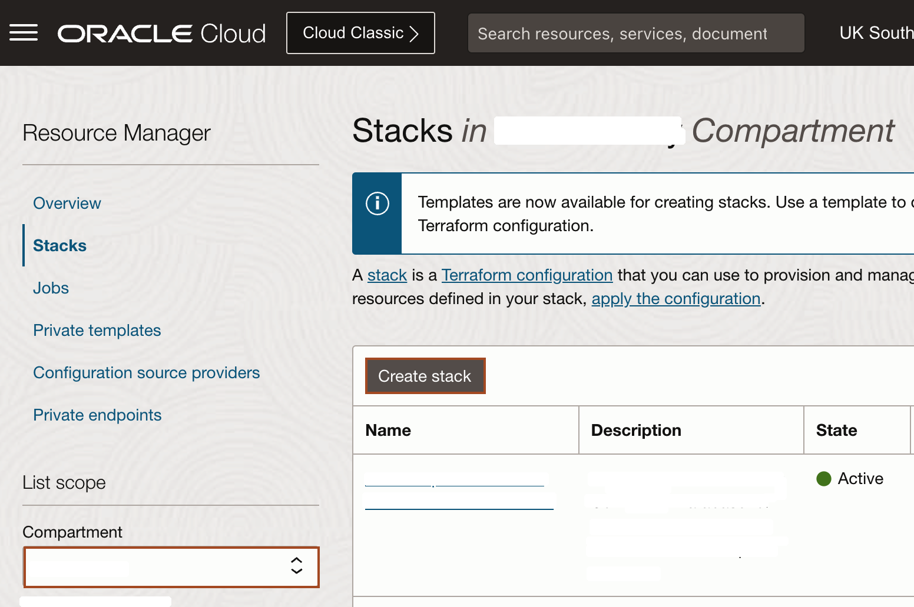
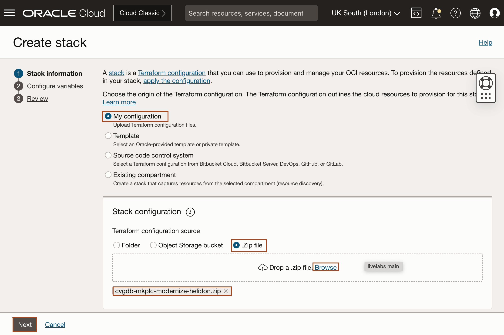
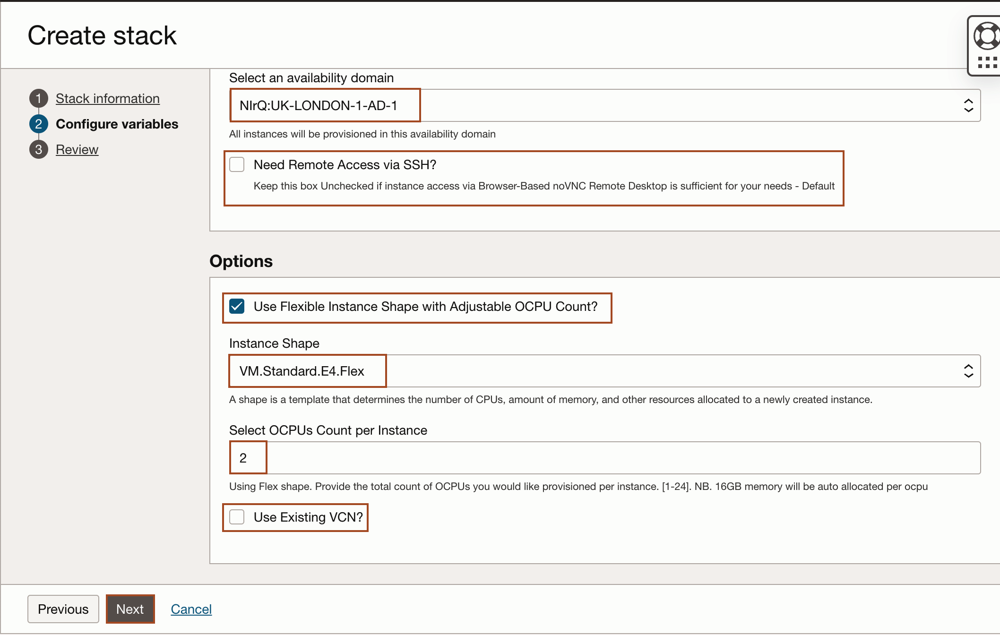
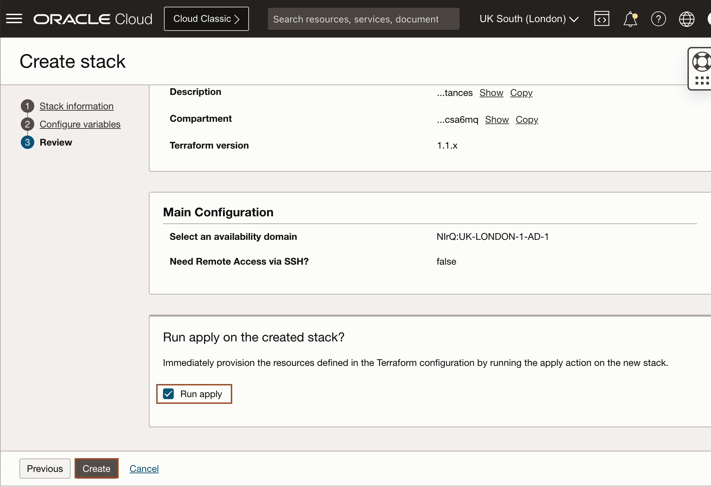
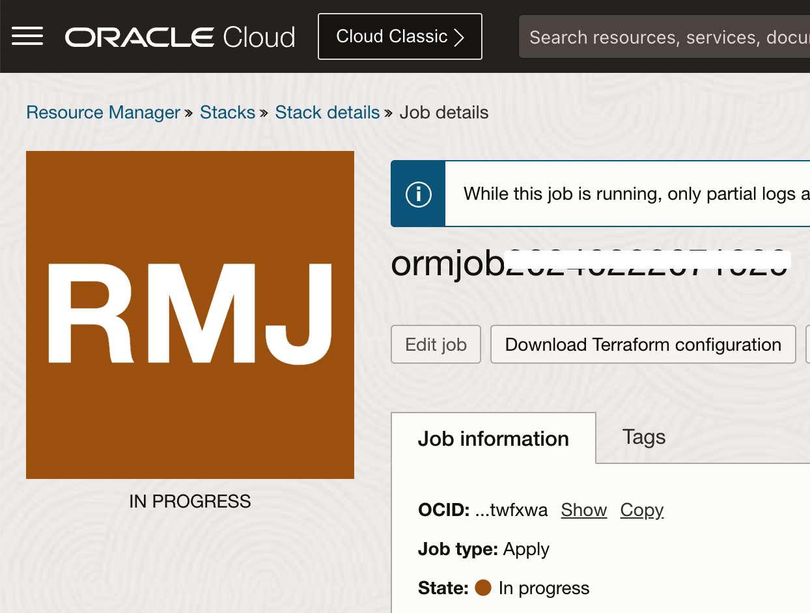
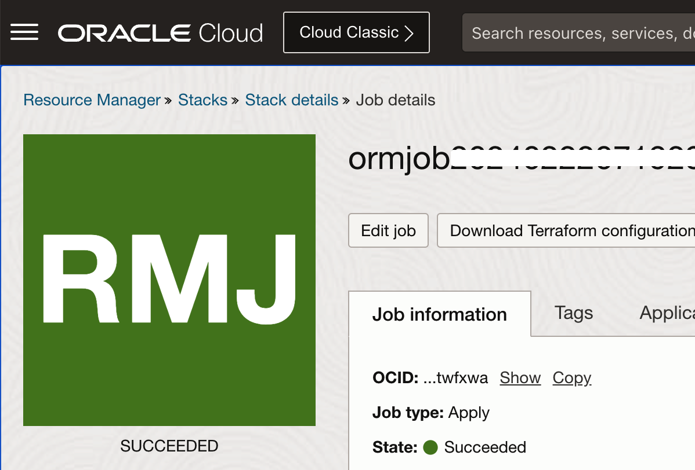
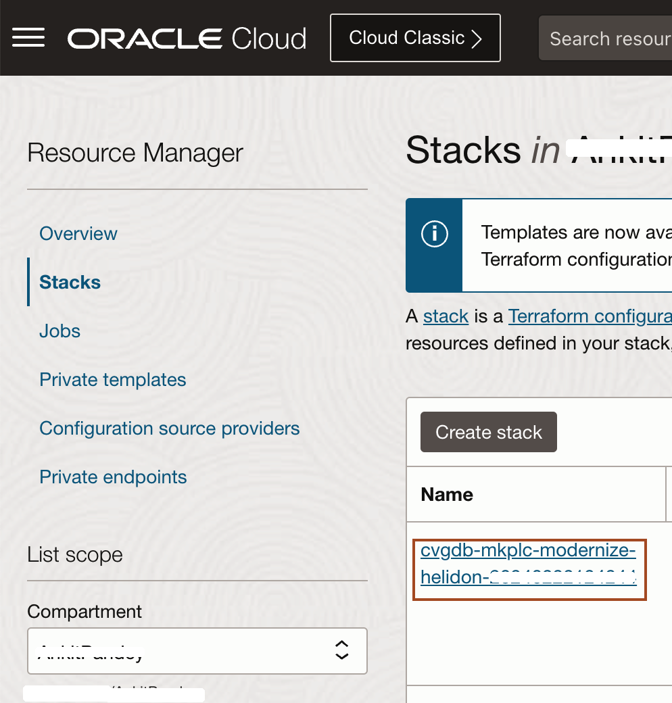
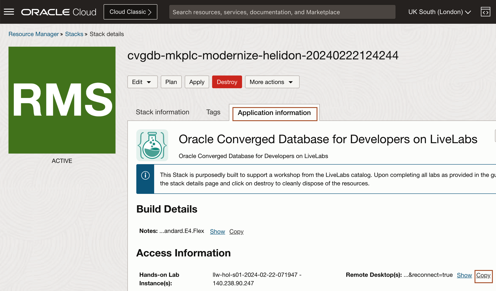
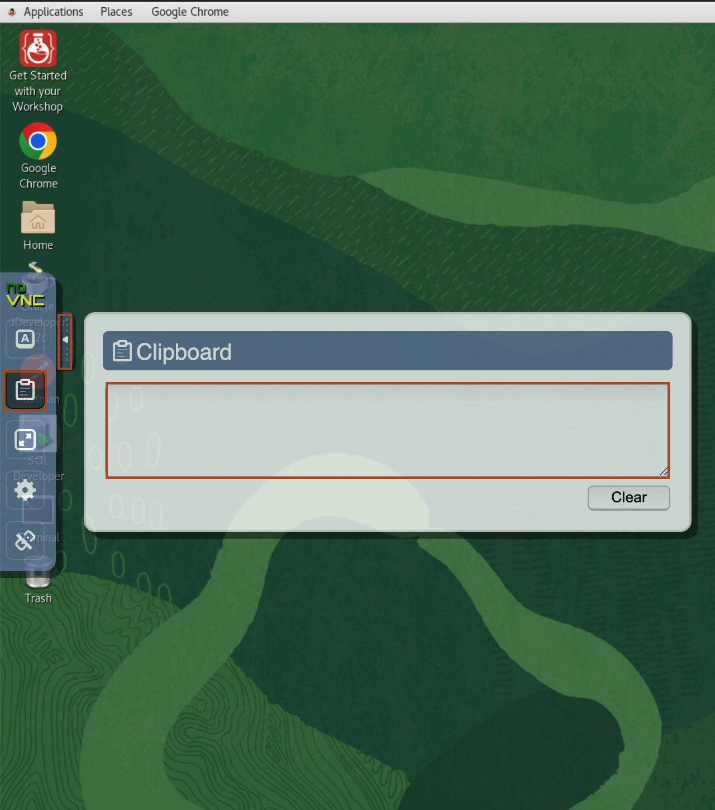

# Prepare Setup

## Introduction
This lab will show you how to download the Oracle Resource Manager (ORM) stack zip file needed to setup the resource needed to run this workshop. This workshop requires a compute instance and a Virtual Cloud Network (VCN).

*Estimated Lab Time:* 15 minutes

### Objectives
- Download ORM stack
- Create Stack: Compute + Networking
- Access the Graphical Remote Desktop

### Prerequisites
This lab assumes you have:
- An Oracle Free Tier or Paid Cloud account

## Task 1: Create Stack: Compute + Networking

1.  Click on the link below to download the Resource Manager zip file you need to build your environment.

    - [cvgdb-mkplc-modernize-helidon.zip](https://objectstorage.us-ashburn-1.oraclecloud.com/p/Gvq71CGuGoNCmZQF5URdKHzAqbg0UbZ-yM5k6tmHyY5h2ia864uIWCvdgvp_6p9S/n/natdsecurity/b/stack/o/cvgdb-mkplc-modernize-helidon.zip)

2.  Save in your downloads folder.

3. Open up the hamburger menu in the top left corner. Click **Developer Services**, and choose **Resource Manager** > **Stacks**. Choose the compartment in which you would like to install the stack. Click **Create Stack**.
    
    


3. Select **My Configuration**, choose the **.Zip** file button, click the **Browse** link, and select the zip file that you downloaded or drag-n-drop for the file explorer. Click **Next**.
    

4. Enter or select the following and click **Next**.

    **Instance Count:** Accept the default, 1.

    **Select Availability Domain:** Select an availability domain from the dropdown list.

    **Need Remote Access via SSH?** Unchecked for Remote Desktop only Access.

    **Use Flexible Instance Shape with Adjustable OCPU Count?:** Keep the default as checked (unless you plan on using a fixed shape).

    **Instance Shape:** Keep the default or select from the list of Flex shapes in the dropdown menu (e.g VM.Standard.E4.Flex).

    **Select OCPUs Count per Instance:** Accept the default shown. e.g. (2) will provision 2 OCPUs and 32GB of memory. 

    **Use Existing VCN?:** Accept the default by leaving this unchecked. This will create a new VCN.
    
    


7. Select **Run Apply** and click **Create**.
    

    > Please wait, until you notice the job has been successfully completed.
        
        


## Task 2: Access the Graphical Remote Desktop

For ease of execution of this workshop, your VM instance has been pre-configured with a remote graphical desktop accessible using any modern browser on your laptop or workstation. Proceed as detailed below to log in.

1. Open up the hamburger menu in the top left corner. Click **Developer Services**, and choose **Resource Manager** > **Stacks**.

2. Click on the stack name which you have createed in lab 1.
    

3. Navigate to **Application Information** tab, and copy **Remote Desktop URL** and paste it in new browser tab.
    
    
4. Once you open the Remote Desktop URL, you will see an arrow, click on it and you will notice the **clipboard**. Use this clipboard to copy/paste the command from local to remote desktop and vice versa.
    

5. In the remote desktop, you will find workshop document on left side. Close this document. Open a new Chrome window and copy/paste the below URL to use the updated document. From Lab 2, you need to follow the instruction from this Workshop document.
    ```bash
    <copy>https://oracle-livelabs.github.io/converged/modernize-apps/workshops/freetier-helidon-microservice/</copy>
    ```


You may now [proceed to the next lab](#next).

## Acknowledgements

* **Author** - Rene Fontcha, Master Principal Solutions Architect, NA Technology
* **Contributors** - Kay Malcolm, Product Manager, Database Product Management
* **Last Updated By/Date** - Ankit Pandey, February 2024
