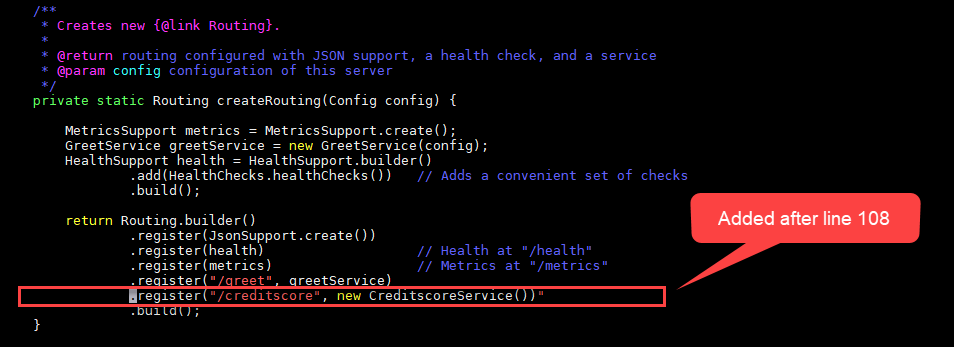
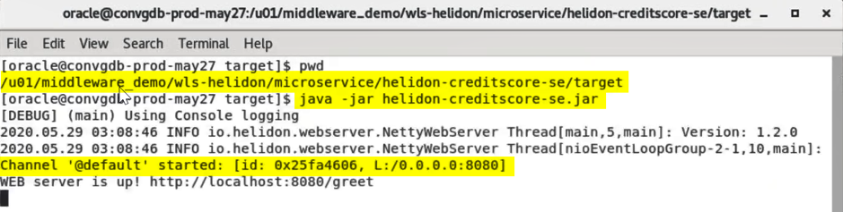

# Using WebLogic and Helidon Microservices

## Introduction

This lab walks you through the steps for deploying and testing the interoperability between Weblogic Bank Application and Helidon Microservice for Credit Verification.

*Estimated Lab Time:* 90 minutes

### Objectives
* Writing Helidon Microservice
* Deploying WebLogic Application
* Interoperability between Weblogic and Helidon

### Prerequisites
This lab assumes you have:
* A Free Tier, Paid or LiveLabs Oracle Cloud account
* You have completed:
    - Lab: Prepare Setup (*Free-tier* and *Paid Tenants* only)
    * Lab: Environment Setup
    * Lab: Initialize Environment

### Lab Description

The very purpose of writing microservices is to do a small piece of job efficiently and re-use it multiple times in different applications. Helidon SE enables us to write one such microservice in this lab.
BestBank, a hypothetical bank has an application. As part of that application, the bank’s credit division wants to build a simple UI which showcases the details of top 15 customers with their SSN number and IBAN number.  The team wants to have a microservice which provides credit score of the customer as output taking the user details like IBAN/SSN numbers as input.
The IT developers create a CreditScore Microservice in Helidon and consume it in the current UI application listing the top 15 customers.

### Implementation Details and Assumptions
* The sample application UI is built to showcase JSF and CDI using XHTML
* The user data is not coming from database
* The Helidon Microservice written in the lab can be deployed on Docker/Kubernetes, but in this lab, we only run it from the JVM locally

### Lab Flow
This lab is designed for people with no prior experience with Kubernetes, Docker, WebLogic, Helidon and want to learn the core concepts and basics of how to run WebLogic JEE and Helidon microservices application.
* Setup Lab Environment
* Verify Basic Bank Application Code and working application
* Develop new Credit Score function as microservice using Helidon SE and deploy on local JVM
* Modify Bank Web Application to use Credit Score microservice and deploy on WebLogic
 
## Task 1: Develop new Credit Score Function
Proceed to Develop new Credit Score Function as microservice using Helidon SE and deploy on local JVM

1. Source the `setWLS14Profile.sh` and `setBankAppEnv.sh` to set the environment variables required to start the WebLogic 14c Admin server and run commands to build Helidon and Bank applications

    ```
    <copy>cd /u01/middleware_demo/scripts/
    . ./setWLS14Profile.sh
    . ./setBankAppEnv.sh</copy>
    ```

2.	Create a directory called “microservice” under `/u01/middleware_demo/wls-helidon` and navigate to `/u01/middleware_demo/wls-helidon/microservice`

    ```
    <copy>
    mkdir /u01/middleware_demo/wls-helidon/microservice
    cd /u01/middleware_demo/wls-helidon/microservice
    </copy>
    ```

3.	Generate the project sources using Helidon SE Maven archetypes. The result is a simple project that shows the basics of configuring the WebServer and implementing basic routing rule

    ```
    <copy>
    mvn archetype:generate -DinteractiveMode=false \
    	-DarchetypeGroupId=io.helidon.archetypes \
    	-DarchetypeArtifactId=helidon-quickstart-se \
    	-DarchetypeVersion=1.2.0 \
    	-DgroupId=io.helidon.bestbank \
    	-DartifactId=helidon-creditscore-se \
    	-Dpackage=io.helidon.bestbank.creditscore
    </copy>
    ```

4.	When the project generation is ready open the Main.java for edit:

    ```
    <copy>vi helidon-creditscore-se/src/main/java/io/helidon/bestbank/creditscore/Main.java</copy>
    ```

5.	Register the creditscore route after line 108 by adding `".register("/creditscore", new CreditscoreService())"` as indicated below. This basically the context path for the service endpoint.

      

6.	Now create a new class called CreditscoreService in the same package where the Main.java is located. For ease of execution the class file has already been created and is located at *"/u01/middleware_demo/scripts/CreditscoreService.java"*. Simply run the following to copy it to the correct location:

    ```
    <copy>cp /u01/middleware_demo/scripts/CreditscoreService.java helidon-creditscore-se/src/main/java/io/helidon/bestbank/creditscore/</copy>
    ```

    Please note the code above accepts a GET for healthcheck and POST method to calculate the credit score value based on the account owner's details which passed using JSON.

7. Build the project:

    ```
    <copy>cd /u01/middleware_demo/wls-helidon/microservice/helidon-creditscore-se/
    mvn package</copy>
    ```

    This will create the executable jar file of the Helidon Microservice under the folder “target”

    ```
    <copy>
    cd /u01/middleware_demo/wls-helidon/microservice/helidon-creditscore-se/target
    ls -alrt helidon-creditscore-se.jar
    </copy>
    ```

## Task 2: Modify Bank Web Application
Proceed to Modify Bank Web Application To Use Credit Score Microservice & Deploy On WebLogic

Before the deployment of the Bank Web Application to consume Microservice, the following changes will be made:
  -	Modify the User Interface. Create View button which opens Account Owner details window. This detail window will show the credit score value of the Account Owner.
  -	Modify the server side bean to invoke Credit Score Microservices Application.
  -	Configure the endpoint for the Bank Web Application.
  -	Deploy new web application

### Modify user Interface
1. Open for edit the `/u01/middleware_demo/wls-helidon/src/main/webapp/index.xhtml` HTML file.

    ```
    <copy>vi /u01/middleware_demo/wls-helidon/src/main/webapp/index.xhtml</copy>
   	```

2. Find and delete all the lines which contain REMOVE THIS LINE comment.
Only that one`(!)`, but that full line of comment which contains. (4 lines needs to be removed.) Save the file.
If you are familiar with JSF to check what has changed in the code.

### Modify Server Side Bean
1. Open for edit `/u01/middleware_demo/wls-helidon/src/main/java/com/oracle/oow19/wls/bestbank/AccountOwnerBean.java` class file.

    ```
    <copy>vi /u01/middleware_demo/wls-helidon/src/main/java/com/oracle/oow19/wls/bestbank/AccountOwnerBean.java</copy>
    ```

2. Find and delete the 4 lines which contain the *REMOVE THIS LINE* comment. Save the file and Check what has changed in the code.

    - The postConstruct method modified to read the end point URL from the property file.
    - New getCreditScore method created to calculate the credit score value of the Account Owner.
    - Finally include the new method invocation in getSelectedAccountOwner method which is triggered by the View button on the User Interface.

### Configure End-Point
1. The last file to modify is the `/u01/middleware_demo/wls-helidon/src/main/resources/app.properties` file.

    The Bank Web Application reads this properties file to know the endpoint's URL. Obviously this solution is just for demo purposes, because in real microservices architecture the best practice is to use additional tools for better service/API management.

    ```
    <copy>vi /u01/middleware_demo/wls-helidon/src/main/resources/app.properties</copy>
   	```

2. Replace the URL to your given value and save: `creditscore.url=http://<Your instance public IP address>:8080/creditscore`

### Deploy Modified Web Application
1. Make sure you are in the terminal where the environment variables are set.
2. Change to the Bank Web Application's directory:
3. Source the `setWLS14Profile.sh` and `setBankAppEnv.sh` to set the environment variables required to start the WebLogic 14c Admin server and run commands to build Helidon and Bank applications

    ```
    <copy>cd /u01/middleware_demo/scripts/
    . ./setWLS14Profile.sh
    . ./setBankAppEnv.sh</copy>
    ```

4. Change the directory to wls-helidon where the Bank Application code reside

    ```
    <copy>cd /u01/middleware_demo/wls-helidon/</copy>
    ```

5. Run the following Maven command:

    ```
    <copy>mvn clean package</copy>
    ```

    When the build is complete and successful, open the browser and access the new bank application using the URL *`http://<Your instance public IP address>:7101/bestbank2020_01`*

6. Select an Account Owner and click the new View button. A pop-up window with no information about the credit score of the user is seen. This is because the microservice is not yet started !!!

### Start The Helidon Microservice
1. Open a new terminal.
2. Navigate to `/u01/middleware_demo/wls-helidon/microservice/helidon-creditscore-se/target/`

    ```
    <copy>cd /u01/middleware_demo/wls-helidon/microservice/helidon-creditscore-se/target/</copy>
    ```

3. Start the Microservice application as a standalone Java Program using the command:

    ```
    <copy>java -jar helidon-creditscore-se.jar &</copy>
    ```

      

4. In the browser, check if the CreditScore Microservice application is running by checking the health check url `http://<Your instance public IP address>:8080/creditscore/healthcheck`
5. Open the browser and access the new bank application using the URL `http://<Your instance public IP address>:7101/bestbank2020_01` or refresh the existing browser window with the above URL
6. Select an Account Owner and click the new View button.	A pop-up window with CreditScore information of the user is seen.  

      

*Congratulations! You have successfully completed the workshop*

## Acknowledgements
* **Author** - Srinivas Pothukuchi, Pradeep Chandramouli, Chethan BR, AppDev & Integration Team, Oracle, October 2020
* **Contributors** - Meghana Banka, Rene Fontcha
* **Last Updated By/Date** - Rene Fontcha, LiveLabs Platform Lead, NA Technology, December 2020
