# Use graph analytics to recommend movies

## Introduction

#### Video Preview

[] (youtube:Z1HxSxr4wd4)

Use Oracle Graph analytics to create customer communities based on movie viewing behavior. Once you've created communities - make recommendations based on what your community members have watched.

In this lab you will use graph analytics to identify movies to recommend to customers who are at risk of leaving.

Estimated Time: 30 minutes

### About graph
When you model your data as a graph, you can run graph algorithms on your data to analyze your data based on the connections and relationships in your data. You can also use graph queries to find patterns in your data, such as cycles, paths between vertices, anomalous patterns, and others. Graph algorithms are invoked using a Java or Python API, and graph queries are run using PGQL (Property Graph Query Language, see [pgql-lang.org](https://pgql-lang.org)).

In this lab you will create a graph from the tables MOVIE, CUSTOMER\_PROMOTIONS, and CUSTSALES\_PROMOTIONS. MOVIE and CUSTOMER\_PROMOTIONS are vertex tables (every row in these tables becomes a vertex). CUSTSALES\_PROMOTIONS connects the two tables, and is the edge table. Every time a customer in CUSTOMER\_PROMOTIONS rents a movie in the table MOVIE, that is an edge in the graph.

You have the choice of over 60 pre-built algorithms when analyzing a graph. In this lab you will use the **WhomToFollow** algorithm that clusters users based on the movies they have rented. A customer in a cluster is likely to like movies liked by other customers in the same cluster. WhomToFollow is used in social network analysis to identify who you should follow; here we use it to identify movie recommendations that will most interest a customer.  

### Objectives

In this lab, you will use the Graph Studio feature of Autonomous Database to:
* Create a graph
* Start a notebook
* Run a few PGQL graph queries
* Run WhomToFollow from the algorithm library
* Query the results

### Prerequisites

- This lab requires completion of Labs 1 through 4, and Lab 7 Use OML to Predict Customer Churn, in the Contents menu on the left.
- You can complete the prerequisite labs in two ways:

    a. Manually run through the labs.

    b. Provision your Autonomous Database and then go to the **Initialize Labs** section in the contents menu on the left. Initialize Labs will create the MOVIESTREAM user plus the results of having run Labs 1 through 4 and Lab 7.

## Task 1: Prepare data for graph analysis

You will first create two new tables for this lab. The table CUSTOMER\_PROMOTIONS contains a union of the customers who are at risk of leaving (as identified in the Oracle Machine Learning [OML] lab), and a 10% sample of all customers.  This sample can be used to identify movie recommendations for the customers at risk of leaving. The table CUSTSALES\_PROMOTIONS that contains the sales information for the customers in the table CUSTOMER\_PROMOTIONS.

Connect to Autonomous Database tool as the MOVIESTREAM user:

1. In your Autonomous Database Details page, click **Database Actions**.

	  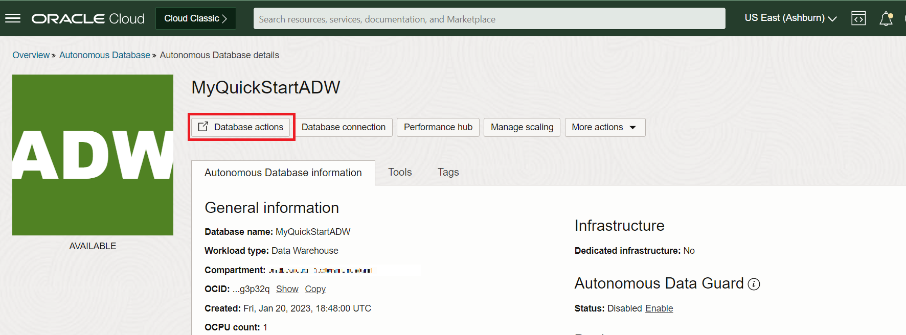

2. On the login screen, enter the username MOVIESTREAM, then click the blue **Next** button.

3. Enter the password for the MOVIESTREAM user you set up in the Create User lab. Click **Sign in**.

4. Open the SQL Worksheet from the Launchpad:

    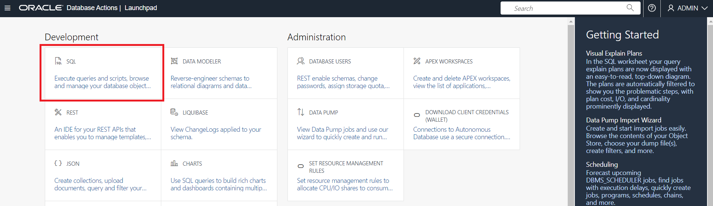

5. Review and copy the code list below and paste into the SQL worksheet. Then, click **Run script**. This code creates two tables, CUSTOMER\_PROMOTIONS and CUSTSALES\_PROMOTIONS.  Note the use of the SAMPLE() function to sample 10% of the customers in your data set.

    ```
    <copy>

        -- Create a sampling of customers
        -- Let's focus on the customers in the US that have the highest likelihood to churn
        -- Plus a random sampling of other US customers
        create table customer_promotions as
        with
            -- cust_ids of potential churners in the US - top 500
            us_potential_churners as (
                select c.*
                from customer c, potential_churners p
                where c.cust_id = p.cust_id
                and p.will_churn = 1
                and c.country_code = 'US'
                order by p.prob_churn desc
               fetch first 500 rows only),
        -- Random sample of customers in the US - not including the churners
        customer_sample as (    
            select *
            from customer
            where country_code='US'
            and cust_id not in (select cust_id from us_potential_churners)
            and ora_hash(cust_id, 9) = 7
        )
        select * from customer_sample
        union all
        select * from us_potential_churners
    ;

    -- Next, let's get the rental info from those customers
       create table custsales_promotions as
       select *
       from custsales c
       where c.cust_id in (select p.cust_id from customer_promotions p);

    -- Finally, we'll add the constraints that are used to enforce the vertex and edge rules
       alter table customer_promotions add constraint customer_promotions_pk primary key(cust_id);
       alter table custsales_promotions add constraint fk_custsales_promotions_cust_id foreign key(cust_id) references customer_promotions(cust_id);
       alter table custsales_promotions add constraint fk_custsales_promotions_movie_id foreign key(movie_id) references movie(movie_id);
       alter table custsales_promotions add primary key (cust_id, movie_id, day_id);

    </copy>
    ```

    SQL worksheet is displayed below:
    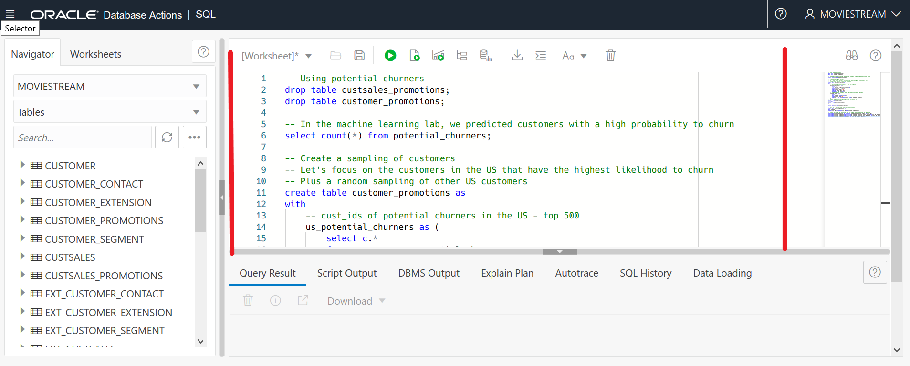

    (If you are running this lab for the first time, ignore the two errors at the beginning. They are because the tables CUSTOMER\_PROMOTIONS and CUSTSALES\_PROMOTIONS did not exist.)

    You are now ready to create your graph!

## Task 2: Log into graph studio

Graph Studio is a feature of Autonomous Database. It is available as an option under the **Tools** tab. You need a graph-enabled user to log into Graph Studio. In this workshop, user MOVIESTREAM has already been graph-enabled.

1. In your Autonomous Database console, click the **Tools** tab and then **Graph Studio**.

    Click **Tools**.

        

    Scroll down and click **Graph Studio**.

    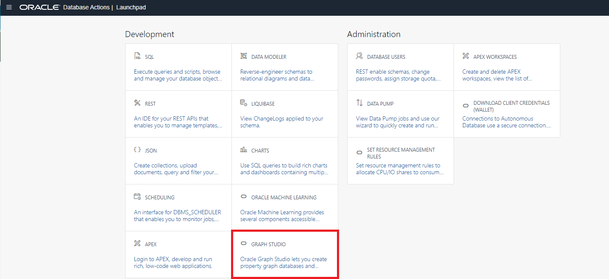

2. Log in to Graph Studio. Use the credentials for the database user MOVIESTREAM.

    

## Task 3: Create a graph

This is the Graph Studio interface for modeling a graph. You will create a graph from three tables: CUSTOMER\_PROMOTIONS, CUSTSALES\_PROMOTIONS, and MOVIE.

1. Click **Expand** and then **Start Modeling**.
    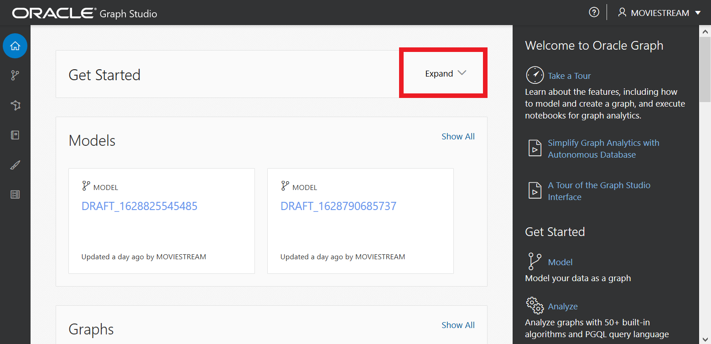

    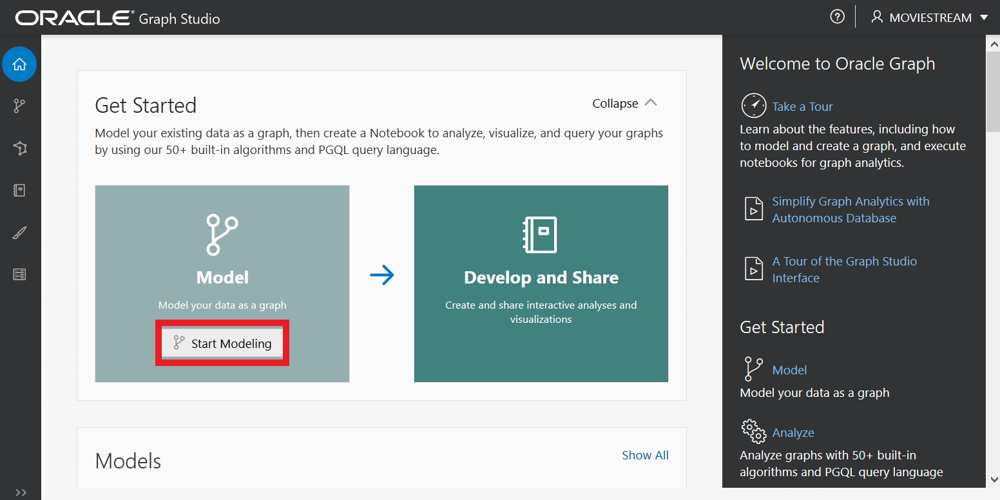

2. Change **Graph Type** from the default **PG View** to **PG Objects**.  This is because the algorithm we will use, **WhomToFollow**, is one of the algorithms that requires a **PG Objects** type of graph.   For most other algorithms you can use a **PG View** graph, which is the preferred Graph Type.

    

    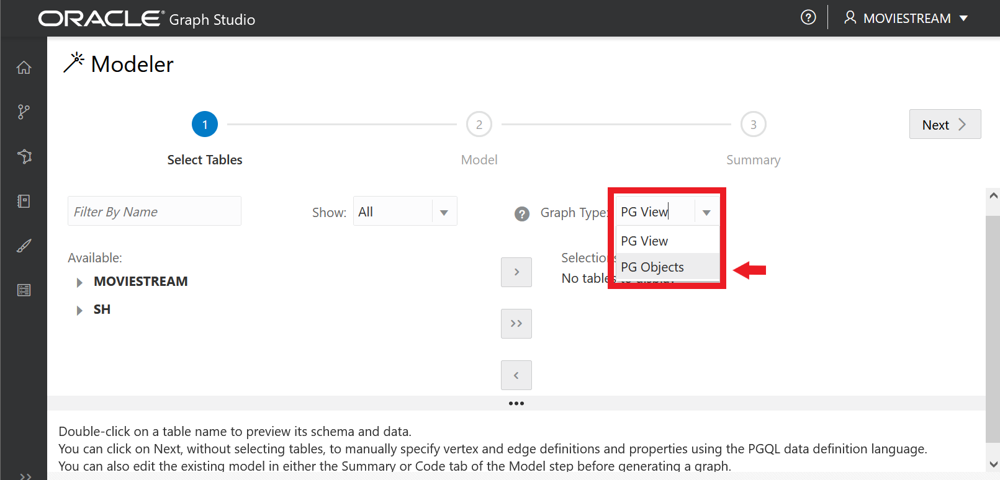

    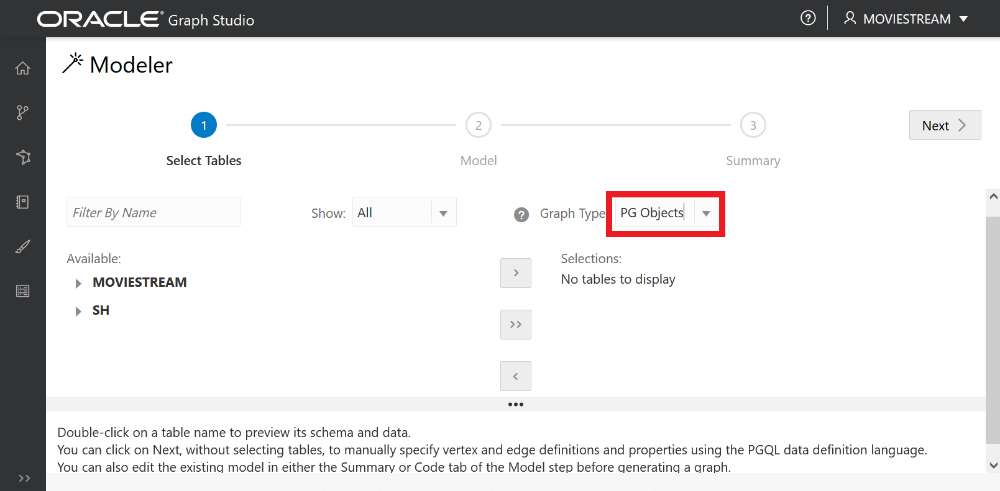

3. Expand **MOVIESTREAM** to see the list of tables available for creating a graph.
    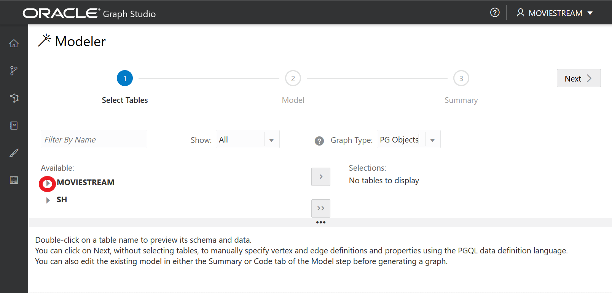

    

4. Select the tables **CUSTOMER\_PROMOTIONS**, **CUSTSALES\_PROMOTIONS**, **MOVIE** to create a graph. For each table, highlight the table, and click the right arrow.

    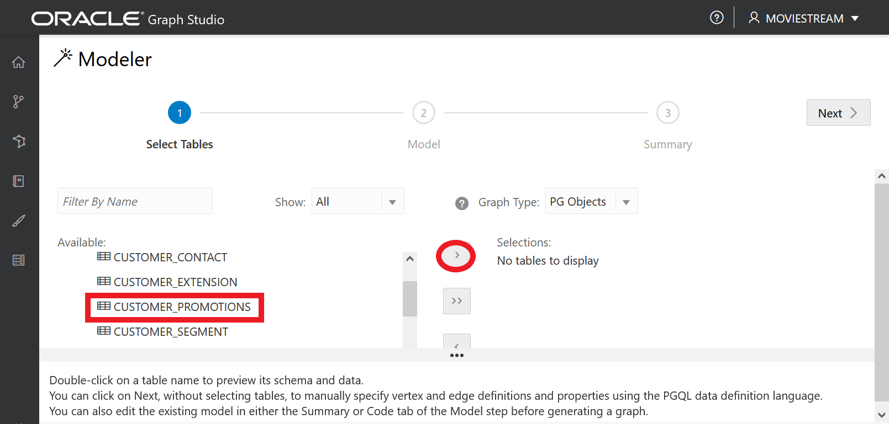

    

    

 Then expand the **MOVIESTREAM** on the right to confirm your table selections, and also confirm that you have selected **PG Objects** as the **Graph Type**, and click **Next**.

    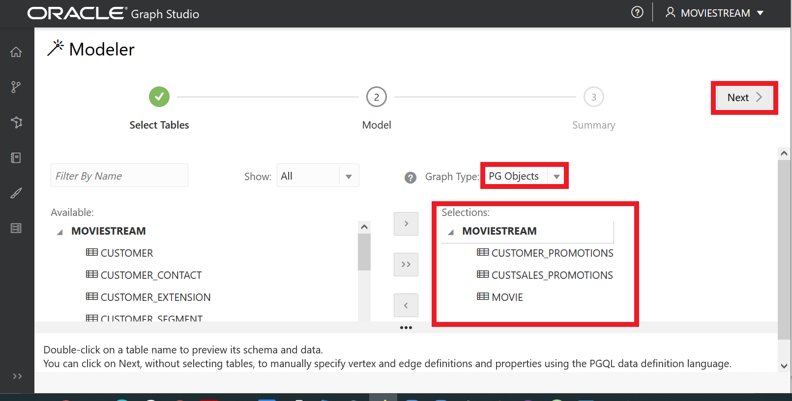

5. After you click **Next** the modeler examines the tables, the primary keys, and the foreign key constraints, and proposes the vertex tables and edge tables for the graph, as you can see in the highlighted section below.

    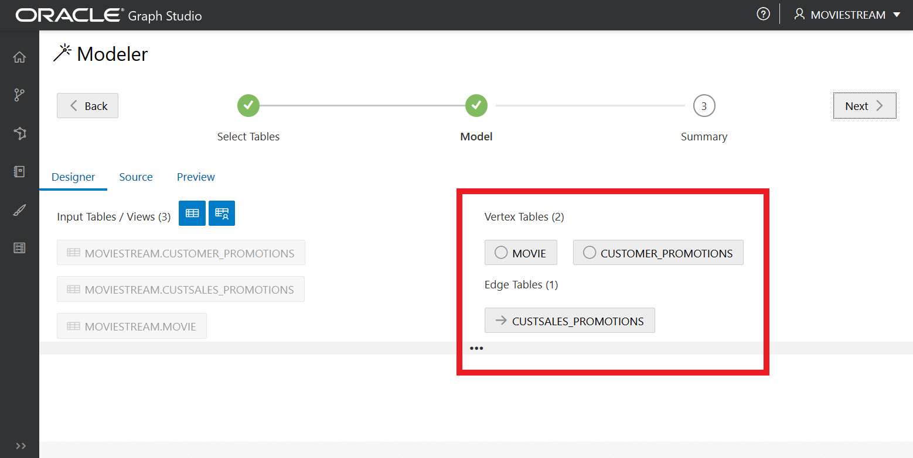

6. Click **Source** to view the CREATE PROPERTY GRAPH statement. It is good practice to always confirm that the graph created is the one you want. Note the following features:

    Primary key column of vertex tables become the KEY in the CREATE PROPERTY GRAPH statement.

    Foreign key constraints between vertex tables become the edges between vertices, with the source vertex from one vertex table and the destination vertex from the other vertex table.

    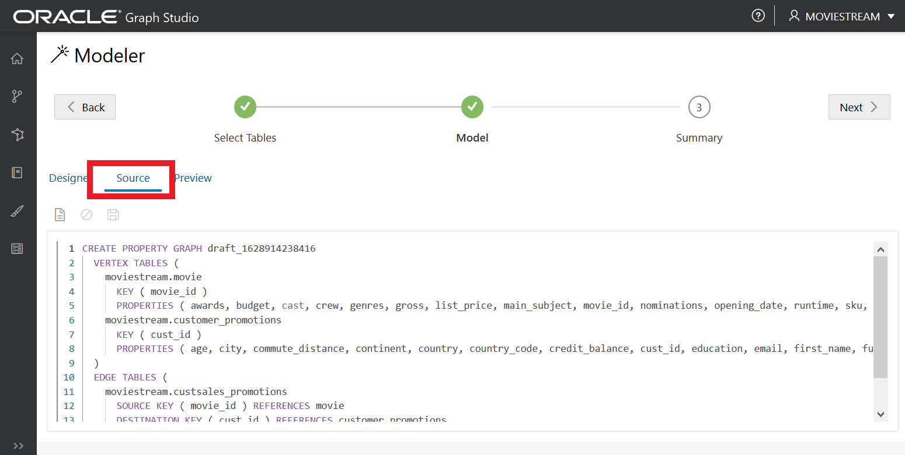

    Note that the direction of the edge is *from* **movie\_id** *to* **cust\_id**.

    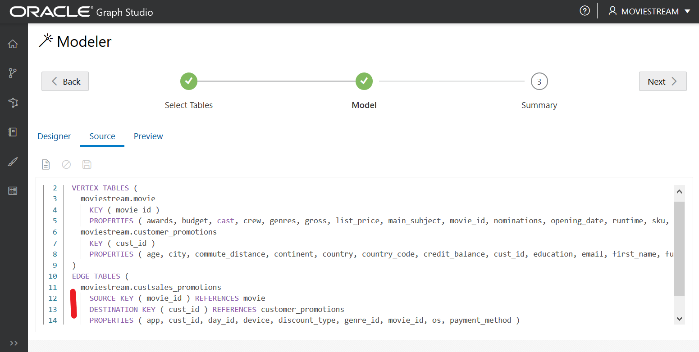

7. Click **Designer**. Click the edge table CUSTSALES_PROMOTIONS to make two changes to the graph model.

    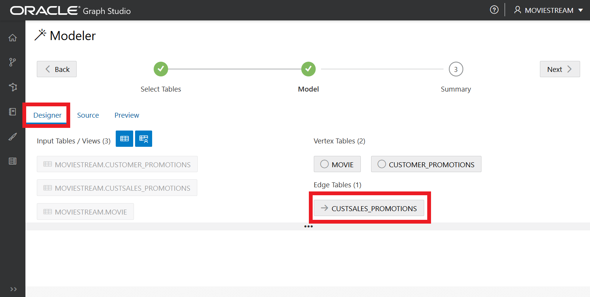

    Change the edge label name. By default, the edge label name is the name of the edge table (CUSTSALES\_PROMOTIONS). We will change that to RENTED, which reflects the customers' actions and will be more intuitive to use in a query. Type RENTED, and press **Enter**.

    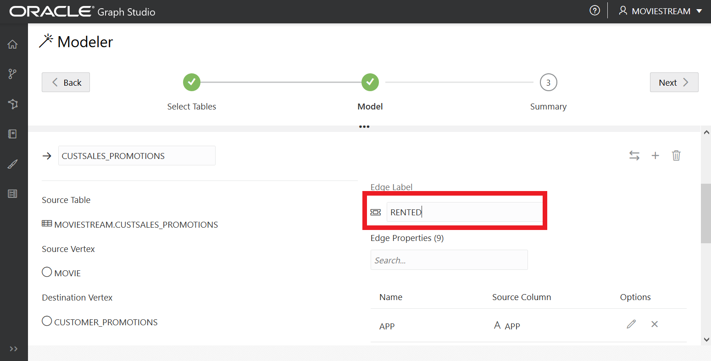

    Change the direction of the edge to be *from* **cust\_id** *to* **movie\_id**. Click **once** on the two arrows icon to do this. This is necessary because we want the algorithm to make recommendations based on links *from* customers *to* movies.

    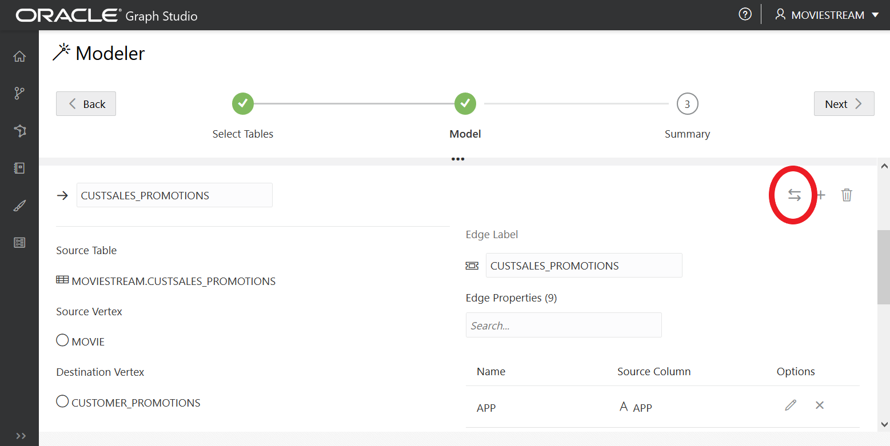

8. Click on **Source** again to confirm that the edge direction is now *from* **cust\_id** *to* **movie\_id**.   You will also see that the label **RENTED** clause has been added to the CREATE PROPERTY GRAPH statement.   

9. Then click **Next**.

    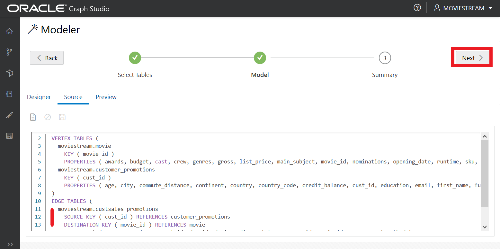

10. Click **Create Graph**

    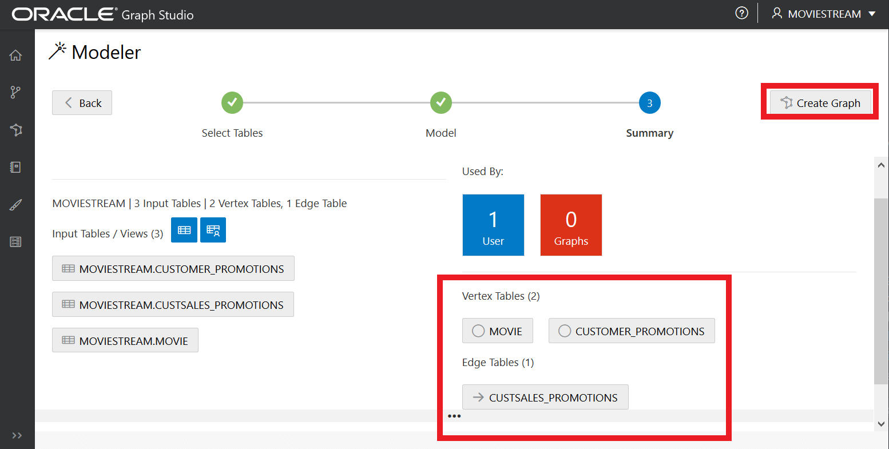

11. Type in a Graph name, in this lab we will use **MOVIE_RECOMMENDATIONS**.  Ensure that **Load into Memory** radio button is on, and click **Create**.

    This step will take about 3 minutes to create a graph. The graph has approximately 8k vertices and 800k edges.

    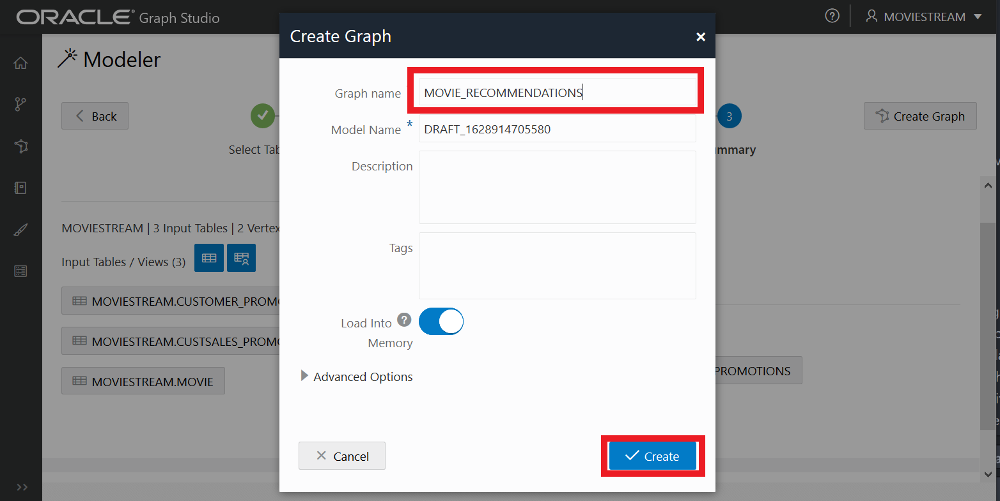

## Task 4: Create a notebook

1. Create a notebook by clicking on the notebook icon on the left, and clicking on **Create**.

    

2. Type in a notebook name and click **Create**. In this lab we use the same name as we used for the graph, **MOVIE_RECOMMENDATIONS**.

    

    You now have a notebook to use to run graph queries and graph analytics. You have three interpreters available: **%md** for markdown, **%pgql-pgx** to run PGQL graph queries, and **%java-pgx** to run graph analytics using the Java API.

    

3. You can create a new paragraph by hovering on the bottom of a paragraph and clicking on the + button.

    

## Task 5: Run graph queries and analytics

- You can copy the PGQL queries and Java code snippets and run them in the notebook.

- PGQL is the Property Graph Query Language, a SQL-like language for running graph queries. PGQL queries run in the interpreter **%pgql-pgx.**

- Over 60 pre-built algorithms can be run using a Java API in the interpreter **%java-pgx.**

- The **%md** interpreter is for displaying text.

    Let us consider the customer **Ricky Rogers**.  The OML lab has identified him as one among several potential customers who might leave the service (churn).   

1.  The first query is a simple PGQL query that selects some of the movies (limit to 10) that **Ricky Rogers** has rented.     
    ```
    <copy>
    %pgql-pgx
    select c, e, m from match (c)-[e]->(m) on MOVIE_RECOMMENDATIONS
    where c.FIRST_NAME = 'Ricky' and c.LAST_NAME = 'Rogers'
    limit 10
    </copy>
    ```

    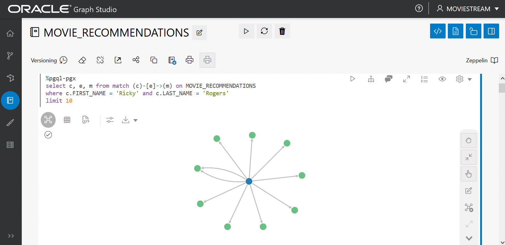

    Now let us visually display some information about the vertices and edges.

2. Click on the **Settings** icon to open the Settings dialog box

    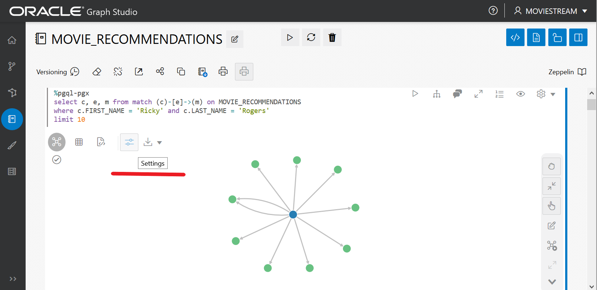

3. Select **Visualization**

    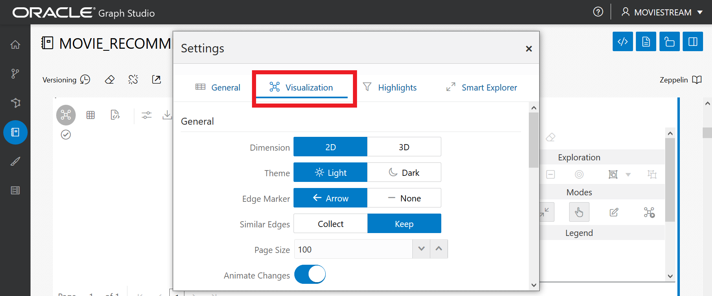

4. Scroll down to the area where you can select vertex and edge labels. In the drop down menu for the **Vertex Label**, select **TITLE**.  This will display the movie title in the graph.

    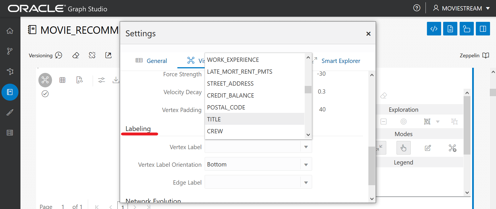

5. In the drop down menu for the **Edge Label**, select **label**.  This will display the label for the edges (which we had set to be RENTED when we created the graph)

    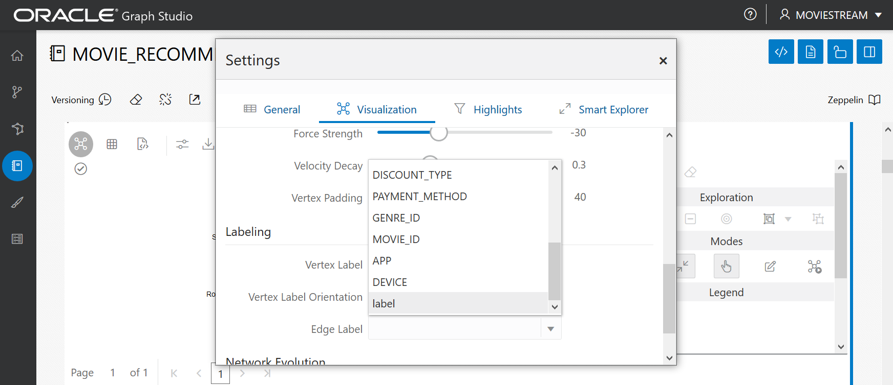

6. Close the **Settings** dialog box.   

    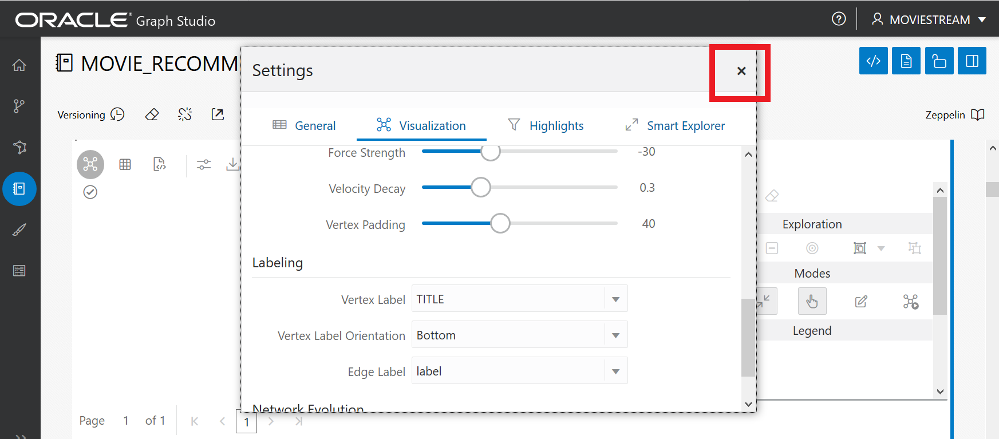

7. The graph will now look like this.

    

8. Also note that you can right click any vertex or edge to see the properties about that vertex or edge.

    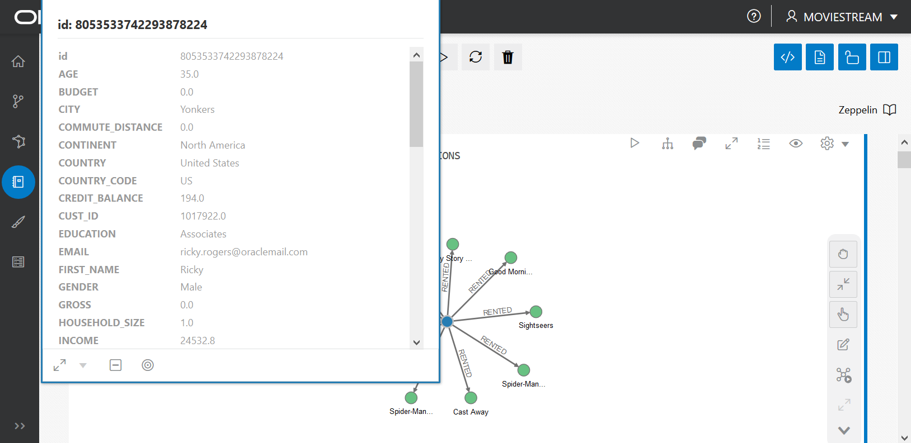

9. As explained in Task 4, hover your mouse over the bottom boundary of the paragraph to get the + sign to create a new paragraph for the next query.

10. The second PGQL query selects some movies (limit 100) that both **Ricky Rogers** and another customer **Blanca Diaz** have rented. Blanca Diaz is a customer from the sampled list of customers, and she has watched a lot of movies. The query limits the result to 100 edges, where each edge represents a movie both customers have rented.

    ```
    <copy>
    %pgql-pgx
    select c1, e, m, e1, c2
    from match (c1)-[e]->(m)<-[e1]-(c2) on MOVIE_RECOMMENDATIONS
    where c1.FIRST_NAME = 'Ricky' and c1.LAST_NAME = 'Rogers' and
    c2.FIRST_NAME = 'Blanca' and c2.LAST_NAME = 'Diaz'
    limit 100
    </copy>
    ```

    

11. As before, you can visualize a property of the vertex by opening the **Settings** dialog box. In this case we will choose the FIRST_NAME of the customer.

    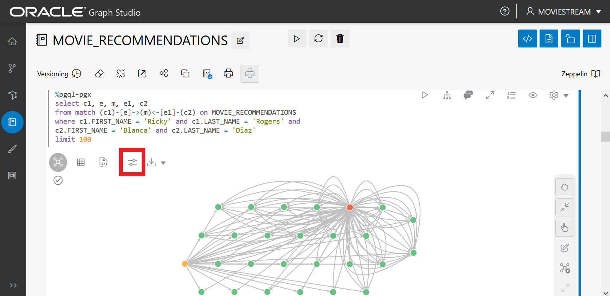

12. Select **Visualization** and scroll down to selecting a **Vertex Label** and **Edge Label**.

    Select **FIRST\_NAME** as the vertex label. You can start typing **FIRST** and the vertex label **FIRST\_NAME** will appear (easier than scrolling through a long list of properties).

    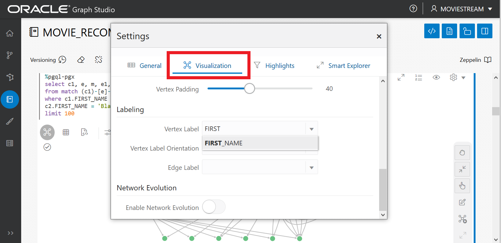

13. Close the Settings dialog box.

    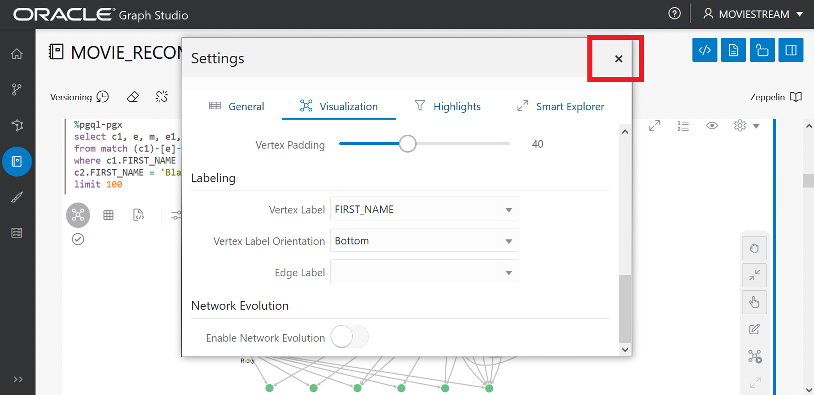

14. Your graph will look like this.

    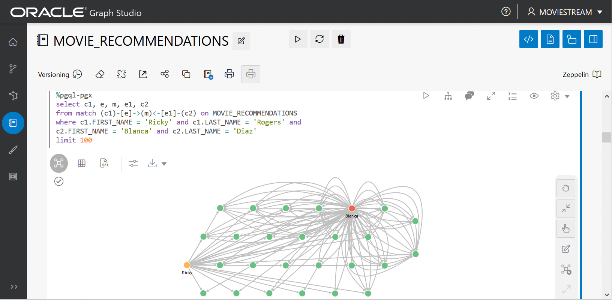

15. You can drag the customer vertices (labeled Ricky and Blanca) to the left so that you can visualize this as a bipartite graph. Product recommendation graphs are typically bipartite graphs.

    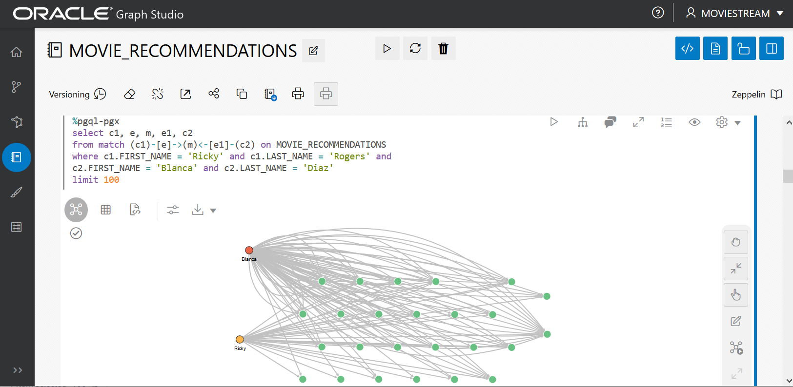

    Now, instead of only looking at two customers and comparing the movies they have rented, let us analyze the whole graph. We will use the **%java-pgx** interpreter.

16. Get a handle to the graph in memory. After running the following code snippet, the output shows that the graph has been loaded into memory, and has 8919 vertices and 906117 edges.

    ```
    <copy>
    %java-pgx
PgxGraph cpGraph = session.getGraph("MOVIE_RECOMMENDATIONS");

    cpGraph;
    </copy>
    ```

    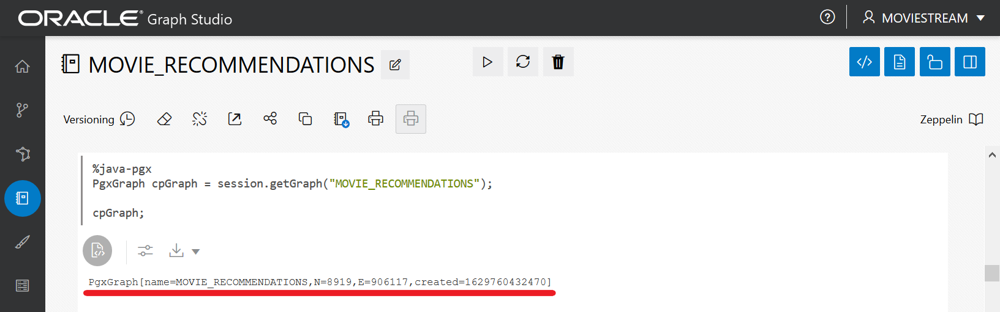

17. We will now run the pre-built algorithm WhomToFollow for the customer **Ricky Rogers** who is in danger of leaving. This algorithm is used in social network analysis. This algorithm clusters customers into communities based on the movies they have rented. Then, based on the community the vertex belongs to, the algorithm identifies the movies they should recommend for this customer. Rather than looking at one or two similar customers to identify movie recommendations, this algorithm identifies communities of customers, and uses the movie choices of the entire community **Ricky Rogers** belongs to, to make recommendations.

    ```
    <copy>
    %java-pgx
    var queryR2 = cpGraph.queryPgql("select v from match(v) where v.first_name = 'Ricky' and v.last_name = 'Rogers'");
    out.println("Num rows: " + queryR2.getNumResults());
    queryR2.first();
    PgxVertex<Long> cust = queryR2.getVertex("v");
    out.println(" " + cust.getProperty("FIRST_NAME"));
    var cust_id = cust.getProperty("CUST_ID");
    double cust_id_d = (Double) cust_id;
    int cust_id_i = (int) cust_id_d;
    out.println(" " + cust_id_i);
    Pair<VertexSequence<Long>, VertexSequence<Long>> rmovies = analyst.whomToFollow(cpGraph, cust);
    </copy>
    ```

    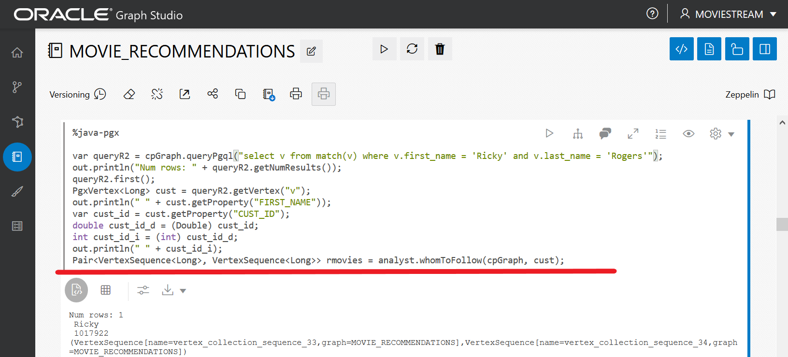

18. WhomToFollow returns two lists. One, the list of customers in the community that **Ricky Rogers** belongs to, and two, the movies recommended for **Ricky Rogers** based on his community.  

    ```
    <copy>
    %java-pgx
    var similarCustomers = rmovies.getFirst();
    var suggestedProducts = rmovies.getSecond();
    out.println("Num similar:" + similarCustomers.size());
    out.println("Num recommended: " + suggestedProducts.size());
    </copy>
    ```

    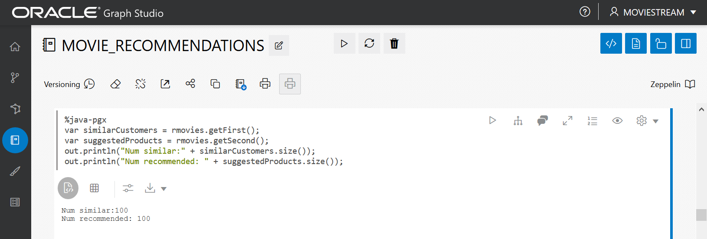

19. List the customers in the cluster that **Ricky Rogers** belongs to. The screenshot only shows a few.
    ```
    <copy>
		%java-pgx
    for (var v: similarCustomers){
      out.println(""+v.getProperty("FIRST_NAME")+ " " + v.getProperty("LAST_NAME"));
    }
    </copy>
    ```

    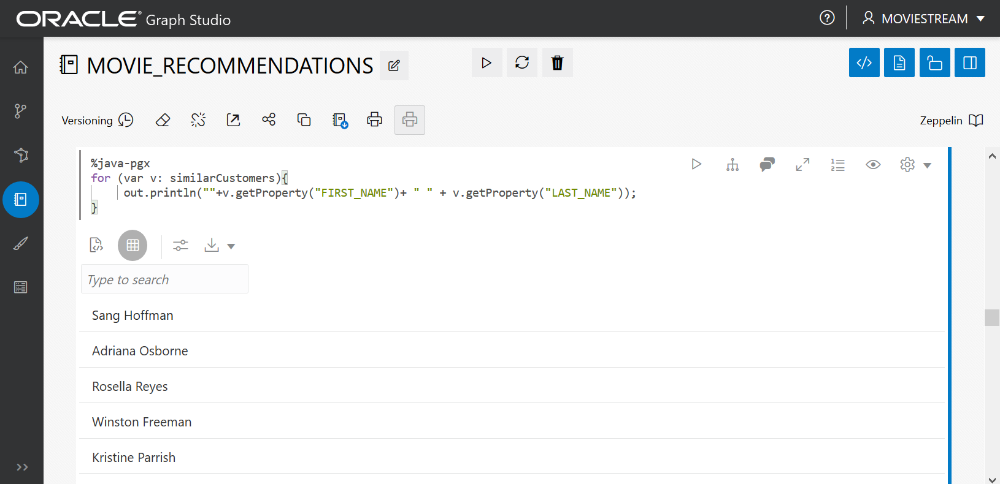

20. List the movies recommended for **Ricky Rogers**.
    ```
    <copy>
    %java-pgx
    for (var v: suggestedProducts){
    out.println("" + cust_id_i + "\t" + v.getProperty("TITLE"));
    }
    </copy>
    ```

    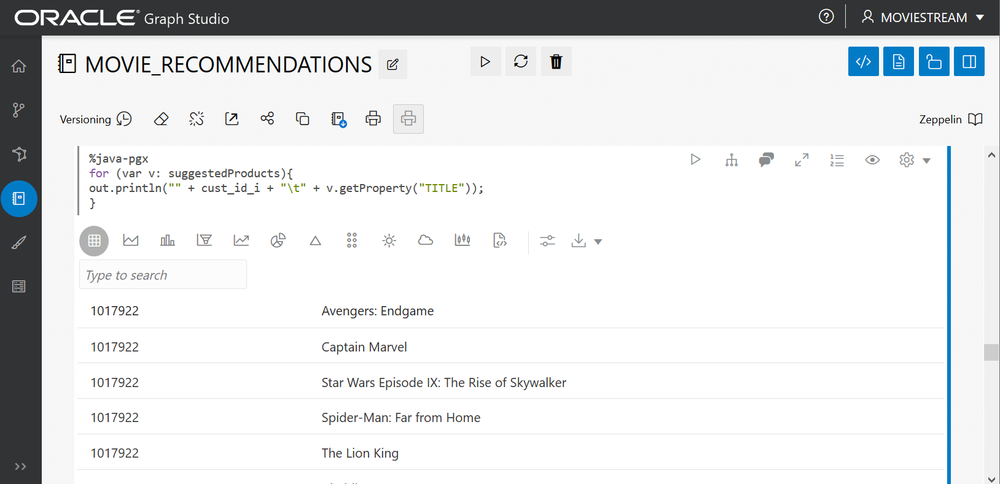

21. Let us consider one of the movies recommended, *Captain Marvel*. We can check whether **Ricky Rogers** has ever watched this movie, using a PGQL query.

    ```
    <copy>
    %pgql-pgx
    select v,e, m.title from match (v)-[e:RENTED]->(m) on MOVIE_RECOMMENDATIONS
    where v.FIRST_NAME = 'Ricky' and v.LAST_NAME = 'Rogers' and m.title='Captain Marvel'
    </copy>
    ```

22. We see that he has not watched this movie. The query returns no results.

    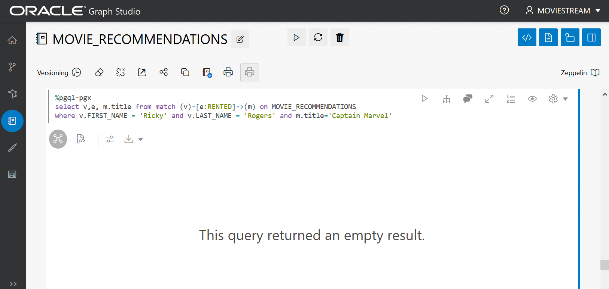

23. Other members in the community (that **Ricky Rogers** belongs to), such as Sang Hoffman, **have** watched the movie *Captain Marvel*.  Sang Hoffman has watched it multiple times as seen by the multiple edges. So *Captain Marvel* is a good recommendation to make for **Ricky Rogers**.  

    ```
    <copy>
    %pgql-pgx
    select v,e, m.title from match (v)-[e:RENTED]->(m) on MOVIE_RECOMMENDATIONS
    where v.FIRST_NAME = 'Sang' and v.LAST_NAME = 'Hoffman' and m.title='Captain Marvel'
    </copy>
    ```

    You can again use the **Settings** dialog box to visualize the **TITLE** of the movies in the graph.

    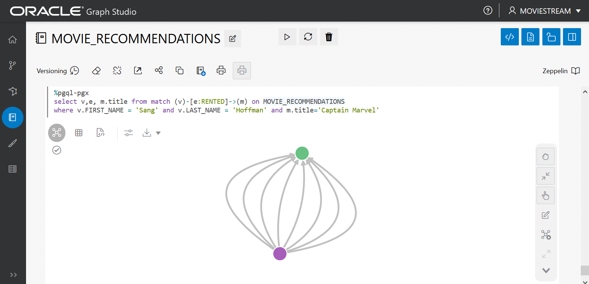

24. We also see that Ricky Rogers has not watched the movie *Toy Story 4*.

    ```
    <copy>
    %pgql-pgx
    select v,e, m.title from match (v)-[e:RENTED]->(m) on MOVIE_RECOMMENDATIONS
    where v.FIRST_NAME = 'Ricky' and v.LAST_NAME = 'Rogers' and m.title='Toy Story 4'
    </copy>
    ```
    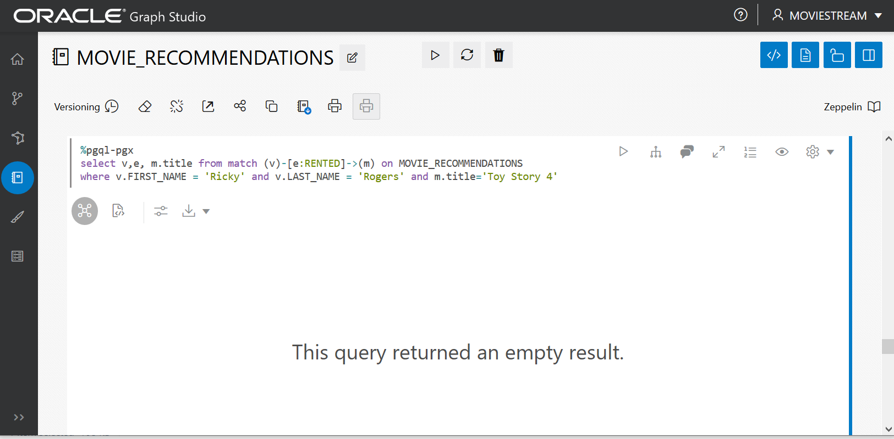

25. Sang Hoffman in his community **has** watched it, multiple times.

    ```
    <copy>
    %pgql-pgx
    select v,e, m.title from match (v)-[e:RENTED]->(m) on MOVIE_RECOMMENDATIONS
    where v.FIRST_NAME = 'Sang' and v.LAST_NAME = 'Hoffman' and m.title='Toy Story 4'
    </copy>
    ```

    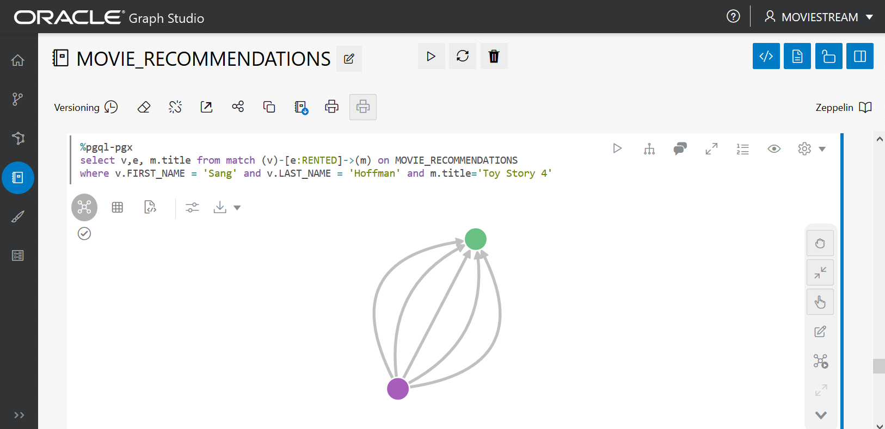

## Learn more

* [LiveLabs](https://apexapps.oracle.com/pls/apex/dbpm/r/livelabs/home) (search for graph)
* [Documentation](https://docs.oracle.com/en/cloud/paas/autonomous-database/graph-studio.html)

## Acknowledgements
* **Author** - Melli Annamalai, Product Manager, Oracle Spatial and Graph
* **Contributors** -  Jayant Sharma
* **Last Updated By/Date** - Melli Annamalai, August 2021
