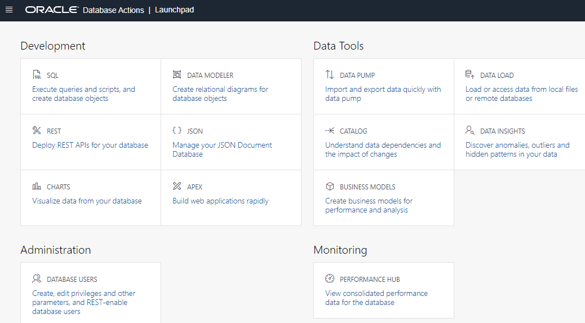

# Create a database user

## Introduction

In this lab, you will create a database user and launch SQL Worksheet.

Estimated Time: 10 minutes

### Objectives

In this lab, you will:
* Create a database user
* Update the user's profile to grant more roles
* Log in as the user
* Launch SQL Worksheet

### Prerequisites
- This lab requires completion of Lab 1, **Provision an ADB Instance**, in the Contents menu on the left.
- You can complete the prerequisite lab in two ways:

    a. Manually run through Lab 1.

    b. Provision your Autonomous Database and then go to the **Initializing Labs** section in the contents menu on the left. Initialize Labs will create the required database objects.

## Task 1: Create a database user

When you create a new data warehouse, you automatically get an account called ADMIN that is your super administrator user. In the real world, you will definitely want to keep your data warehouse data separate from the administration processes. Therefore, you will need to know how to create separate new users and grant them access to your data warehouse. This section will guide you through this process using the "New User" wizard within the SQL tools.

For this workshop we need to create one new user.

1. Navigate to the Details page of the Autonomous Database you provisioned in the "Provision an ADW Instance" lab. In this example, the database name is "My Quick Start ADW." Click the **Database Actions** button.

    

2. Enter ADMIN for the username and click **Next**. On the next form, enter the ADMIN password - which is the one you entered when creating your Autonomous Data Warehouse. Click **Sign in**.

    

3. On the Database Actions home page, click the **Database Users** card.

    

4.  You can see that your ADMIN user appears as the current user.  On the right-hand side, click the **+ Create User** button.

    

5. The **Create User**  form will appear on the right-hand side of your browser window. Use the settings below to complete the form:

 - username: **MOVIESTREAM**
 - password: create a suitably strong password, and make note of it, as you will need to provide it in an upcoming step.

    >**Note:** Rules for User Passwords: Autonomous Data Warehouse requires strong passwords. User passwords user must meet the following default password complexity rules:

    - Password must be between 12 and 30 characters long

    - Must include at least one uppercase letter, one lowercase letter, and one numeric character

    - Limit passwords to a maximum of 30 characters

    - Cannot contain the username

    - Cannot be one of the last four passwords used for the same username

    - Cannot contain the double quote (") character

    There is more information available in the documentation about password rules and how to create your own password rules; see here: [Create Users on Autonomous Database](https://docs.oracle.com/en/cloud/paas/autonomous-database/adbsa/manage-users-create.html#GUID-B5846072-995B-4B81-BDCB-AF530BC42847)

- Toggle the **Graph** button to **On**.
- Toggle the **Web Access** button to **On** and expand **Web access advanced features**. Accept the default alias which is automatically set to moviestream - this enables the user access to our new data warehouse using the Database Actions tools.
- Leave the **Authorization required** toggle button as on/blue. 
- In the upper right section of the Create User dialog, select **UNLIMITED** from the drop down menu for Quota on tablespace DATA
- Leave the **Password Expired** toggle button as off (Note: this controls whether the user is prompted to change their password when they next log in).
- Leave the **Account is Locked** toggle button as off. 
- **Do not** toggle the **OML** button to **On**. We will select this and grant other roles in the next step.
- Click **Create User** at the bottom of the form.

    

Now that you have created a user with several roles, let's see how easy it is to grant some more roles.

## Task 2: Update the user's profile to grant more roles

You learned how to use the Create User dialog to create a new user. You can also create and modify users using SQL. This is useful when you don't have access to the user interface or you want to run scripts to create/alter many users. Open the SQL worksheet as the ADMIN user to update the MovieStream user you just created.

1. The Database Users page now shows your new MOVIESTREAM user in addition to the ADMIN user. Click **Database Actions** in the upper left corner of the page, to return to the Database Actions launch page.

    

2.  In the Development section of the Database Actions page, click the **SQL** card to open a new SQL worksheet:

    

    This will open up a new window that should look something like the screenshot below. The first time you open SQL Worksheet, a series of pop-up informational boxes introduce you to the main features. Click Next to take a tour through the informational boxes.

    


3. In the SQL Worksheet, paste in this code and run it using the **Run Script** button:

    ```
    <copy>-- Run this script as ADMIN user
    -- Uncomment the next 2 lines if you want to drop and recreate your user
    -- drop user moviestream cascade;
    -- create user moviestream identified by "YourPassword1234#";

    -- Add the OML access
    alter user moviestream grant connect through OML$PROXY;
    grant oml_developer to moviestream;

    -- Allow user to change resource privileges (LOW/MEDIUM/HIGH)
    grant select on v$services to moviestream;
    grant select on dba_rsrc_consumer_group_privs to moviestream;
    grant execute on dbms_session to moviestream;

    -- Here are other privileges that you already granted in the UI
    grant unlimited tablespace to moviestream;
    grant connect to moviestream;
    grant dwrole to moviestream;
    grant resource to moviestream;
    grant graph_developer to moviestream;
    alter user moviestream grant connect through GRAPH$PROXY_USER;
    grant console_developer to moviestream;

    -- Enable access to SQL Tools
    begin
        ords_admin.enable_schema (
            p_enabled               => TRUE,
            p_schema                => 'moviestream',
            p_url_mapping_type      => 'BASE_PATH',
            p_auto_rest_auth        => TRUE   
        );
        commit;
    end;
    /</copy>
    ```

    >**Note:** DWROLE includes CREATE ANALYTIC VIEW, CREATE ATTRIBUTE DIMENSION, ALTER SESSION, CREATE HIERARCHY, CREATE JOB, CREATE MINING MODEL, CREATE PROCEDURE, CREATE SEQUENCE, CREATE SESSION, CREATE SYNONYM, CREATE TABLE, CREATE TRIGGER, CREATE TYPE, CREATE VIEW, and READ,WRITE ON directory DATA\_PUMP\_DIR.

    These commands give the user all the privileges required to work with the console, use machine learning and perform graph analyses. The commands also enable the user to change the consumer group for the session (LOW, MEDIUM or HIGH) - altering levels of performance and concurrency. [See the documentation](https://docs.oracle.com/en/cloud/paas/autonomous-database/adbsa/manage-service-concurrency.html#GUID-400B1460-E44D-4BA5-B216-0B185BE55F8E) for more details.

## Task 3: Log in as the user

Now you need to switch from the ADMIN user to the MOVIESTREAM user, before starting the next lab on data loading.

1. In the upper right corner of the page, click the drop-down menu for ADMIN, and click **Sign Out**.

    

2. On the next screen, click **Sign in**.

    

3. Enter the username MOVIESTREAM and the password you defined when you created this user.

    

4. This will launch the Database Actions Launchpad page.

    


## Task 4: Launch SQL Worksheet 

In the next labs, you will use the SQL Worksheet application that is built in to the data warehouse environment. 

1. In the **Development** section of the Database Actions page, click the **SQL** card again to open a new SQL worksheet:

    

2. You don't have any tables yet, but let's run a query that selects the current user and today's date:

    ```
    <copy>select user, sysdate from dual;</copy>
    ```
    

    In the query results, you'll see MOVIESTREAM and today's date. You've successfully run your first Autonomous Database query!

Please *proceed to the next lab*.

## Learn more

See the documentation on [Managing Users on Autonomous Database](https://docs.oracle.com/en/cloud/paas/autonomous-database/adbsa/manage.html#GUID-AD7ACC07-AAF7-482A-8845-9C726B1BA86D). This topic describes administration tasks for managing users on Autonomous Database.

## Acknowledgements
* **Author** - Rick Green, Principal Developer, Database User Assistance
* **Contributors** - Marty Gubar, Product Manager
* **Last Updated By/Date** - Rick Green, August 2021
