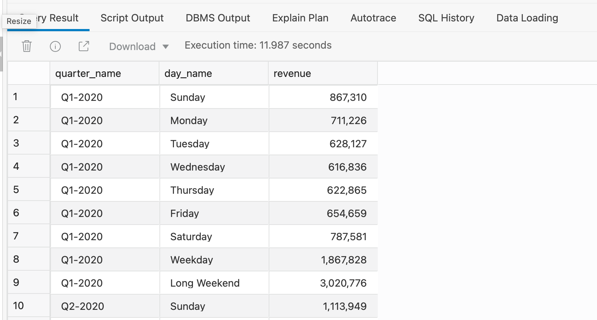
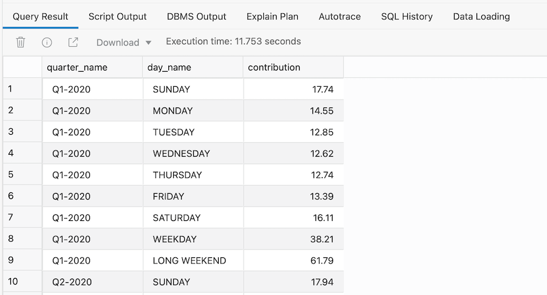
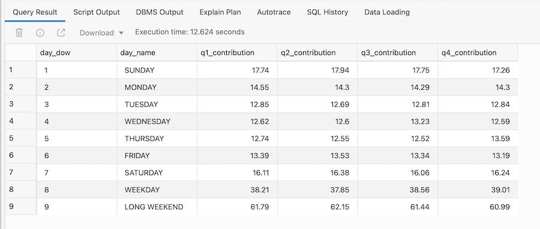

# Deeper analysis of movie sales data

## Introduction

**This lab is optional**. This lab is for people who are accustomed to working with spreadsheets and are comfortable creating sophisticated formulas within their worksheets. In this lab we explore how to use the **`SQL MODEL`** clause to make SQL more spreadsheet-like in terms of inserting new rows and new calculations into a query.

Estimated Time: 10 minutes

### Objectives

- Learn how to combine existing rows within a query to create new rows

- Understand how to define new calculations using a spreadsheet-like syntax

### Prerequisites
- This lab requires completion of the previous labs in the Contents menu on the left.
- You can complete the prerequisite labs in two ways:

    a. Manually run through the labs.

    b. Provision your Autonomous Database and then go to the **Initialize Labs** section in the contents menu on the left. Initialize Labs will create the MOVIESTREAM user plus the required database objects.


### Go a little deeper

Sometimes we will find that the data is organized in just the way we want it to be! In many cloud-based data warehouses, we are locked in to only viewing data in terms of the way it is stored. Making changes to the structure and organization of our data when it's in a spreadsheet is really easy - we can insert new rows and new columns to add new content.

Wouldn't it be great if our data warehouse offered the flexibility to add completely new rows to our data set that were derived from existing rows - effectively giving us the chance to build our own  **dimension**  values. In general data warehousing terminology this is known as adding **custom aggregates** to our result set.

What if we want to group the days of week into two new custom aggregates, effectively adding two new rows within our query?

- **new row 1 - Weekday** which consists of values for Tuesday, Wednesday, Thursday

- **new row 2 - Long Weekend** which consists of values for Monday, Friday, Saturday and Sunday


## Task 1: Simplify the dataset

To simplify the SQL in the following tasks, we are going to create a view to setup the data set for the spreadsheet calculations in Task 2.

1. Use the code below to create a view which will be used in the next set of tasks:

    ```
    <copy>CREATE OR REPLACE VIEW vw_spreadsheet_data AS
    SELECT
    quarter_name,
    day_dow,
    TRIM(day_name) AS day_name,
    ROUND(SUM(actual_price),0) AS revenue
    FROM vw_movie_sales_fact
    WHERE year_name = '2020'
    GROUP BY quarter_name, day_dow, day_name;</copy>
    ```


## Task 2: Revenue analysis by weekdays versus long weekends

In spreadsheets, we can refer to values by referencing the row + column position such as A1 + B2. This would enable us to see more clearly the revenue provided by each day and group of days so we can get some deeper insight into the most heavily trafficked days for movie-watching. How can we do this?

Autonomous Data Warehouse has a unique SQL feature called the **`MODEL`** clause which creates a spreadsheet-like modeling framework over our data. Additional keywords enable us to create and populate new rows so that the revenue for the rows LONG WEEKEND and WEEKDAY can be calculated as follows:

<code>revenue['LONG WEEKEND'] = revenue['SUNDAY']+revenue['MONDAY']+revenue['FRIDAY']+revenue['SATURDAY']</code>

<code>revenue['WEEKDAY'] = revenue['TUESDAY']+revenue['WEDNESDAY']+revenue['THURSDAY']</code>


1.  Using the MODEL clause it is possible to add completely new rows (**Weekday** and **Long Weekend**) into our results:

    ```
    <copy>SELECT
    quarter_name,
    day_name,
    revenue
    FROM vw_spreadsheet_data
    MODEL
    PARTITION BY (quarter_name)   
    DIMENSION BY (day_name)
    MEASURES(revenue, day_dow)
    RULES (
    revenue['WEEKDAY'] = revenue['TUESDAY']+revenue['WEDNESDAY']+revenue['THURSDAY'],
    revenue['LONG WEEKEND'] = revenue['SUNDAY']+revenue['MONDAY']+revenue['FRIDAY']+revenue['SATURDAY'],
    day_dow['WEEKDAY'] = 8,
    day_dow['LONG WEEKEND'] = 9)
    ORDER BY quarter_name, day_dow;</copy>
    ```

2. This will generate the following output:

    

See how easy it is to build upon existing discoveries using SQL to extend our understanding of the data! The concept of being able to add new rows using a spreadsheet-like approach within SQL is unique to Oracle. The MODEL clause creates two new rows that we identify as **LONG WEEKEND** and **WEEKDAY**. The calculation of revenue for these two new rows uses a similar approach to many spreadsheets: revenue for **LONG WEEKEND** is derived from adding together revenue for SUNDAY + MONDAY + FRIDAY + SATURDAY.


## Task 3: Contribution analysis by weekdays versus long weekends

If we tweak the last query we can switch the MODEL clause to calculate contribution using a similar approach:

    <code>contribution['LONG WEEKEND'] = (revenue['SUNDAY']+revenue['MONDAY']+revenue['FRIDAY']+revenue['SATURDAY'])/(revenue['SUNDAY']+revenue['MONDAY']+revenue['FRIDAY']+revenue['SATURDAY']+revenue['TUESDAY']+revenue['WEDNESDAY']+revenue['THURSDAY'])</code>

This statement calculates the contribution for the new row LONG WEEKEND by taking the revenue for MONDAY, FRIDAY, SATURDAY and SUNDAY and dividing it by the combined revenue from all seven days.

1. Use the code below to change the view created in Task 1 so that it includes the function RATIO\_TO\_REPORT to calculate the quarterly contribution for each day:

    ```
    <copy>CREATE OR REPLACE VIEW vw_spreadsheet_data AS
    SELECT
    quarter_name,
    day_dow,
    TRIM(day_name) AS day_name,
    ROUND(SUM(actual_price),0) AS revenue,
    RATIO_TO_REPORT(SUM(actual_price)) OVER(PARTITION BY quarter_name) AS contribution
    FROM vw_movie_sales_fact
    WHERE year_name = '2020'
    GROUP BY quarter_name, day_dow, day_name;</copy>
    ```

2. Run the following query to calculate both revenue and contribution for each of the new day groupings (LONG WEEKEND and WEEKDAY):

    ```
    <copy>SELECT
    quarter_name,
    day_name,
    ROUND(contribution * 100,2) AS contribution
    FROM vw_spreadsheet_data
    MODEL
    PARTITION BY (quarter_name)
    DIMENSION BY (day_name)
    MEASURES(revenue, contribution, day_dow)
    RULES (
    contribution['WEEKDAY'] = (revenue['TUESDAY']+revenue['WEDNESDAY']+revenue['THURSDAY'])/(revenue['SUNDAY']+revenue['MONDAY']+revenue['FRIDAY']+revenue['SATURDAY']+revenue['TUESDAY']+revenue['WEDNESDAY']+revenue['THURSDAY']),
    contribution['LONG WEEKEND'] = (revenue['SUNDAY']+revenue['MONDAY']+revenue['FRIDAY']+revenue['SATURDAY'])/(revenue['SUNDAY']+revenue['MONDAY']+revenue['FRIDAY']+revenue['SATURDAY']+revenue['TUESDAY']+revenue['WEDNESDAY']+revenue['THURSDAY']),
    day_dow['WEEKDAY'] = 8,
    day_dow['LONG WEEKEND'] = 9)
    ORDER BY quarter_name, day_dow;</copy>
    ```

3. This will generate the following output:

    


## Task 4: Pivot the results s it's even more like a spreadsheet

1. As with earlier examples, we can now use the pivot feature to swap the quarter names into columns, making the result look more like a typical spreadsheet:

    ```
    <copy>SELECT * FROM
    (SELECT
    quarter_name,
    day_dow,
    day_name,
    ROUND(contribution*100,2) AS contribution
    FROM vw_spreadsheet_data
    MODEL
    PARTITION BY (quarter_name)
    DIMENSION BY (day_name)
    MEASURES(revenue, contribution, day_dow)
    RULES (
    contribution['WEEKDAY'] = (revenue['TUESDAY']+revenue['WEDNESDAY']+revenue['THURSDAY'])/(revenue['SUNDAY']+revenue['MONDAY']+revenue['FRIDAY']+revenue['SATURDAY']+revenue['TUESDAY']+revenue['WEDNESDAY']+revenue['THURSDAY']),
    contribution['LONG WEEKEND'] = (revenue['SUNDAY']+revenue['MONDAY']+revenue['FRIDAY']+revenue['SATURDAY'])/(revenue['SUNDAY']+revenue['MONDAY']+revenue['FRIDAY']+revenue['SATURDAY']+revenue['TUESDAY']+revenue['WEDNESDAY']+revenue['THURSDAY']),
    day_dow['WEEKDAY'] = 8,
    day_dow['LONG WEEKEND'] = 9
    ))
    PIVOT
    (
    SUM(contribution) contribution
    FOR quarter_name IN('Q1-2020' as "Q1", 'Q2-2020' as "Q2", 'Q3-2020' as "Q3", 'Q4-2020' as "Q4")
    )
    ORDER BY day_dow;</copy>
    ```

2. The final output looks like this, where we can now see that over 60% of revenue is generated over those days within a Long Weekend! Conversely, the other three days in our week (Tuesday, Wednesday, Thursday) are generating nearly 40% of our weekly revenue, which means that on work/school nights we are still seeing strong demand for streaming movies. This type of information might be useful for our infrastructure team so they can manage their resources more effectively and our marketing team could use this information to help them drive new campaigns.

    


### Recap

Let's quickly recap what has been covered in this lab:

- Explored power of Oracle's built in spreadsheet-like SQL Model clause to add new rows to our results

- Learned how to combine spreadsheet-like operations with other SQL features such as PIVOT


Please *proceed to the next lab*.

## **Acknowledgements**

- **Author** - Keith Laker, Oracle Autonomous Database Product Management
- **Adapted for Cloud by** - Richard Green, Principal Developer, Database User Assistance
- **Last Updated By/Date** - Keith Laker, August 2021
