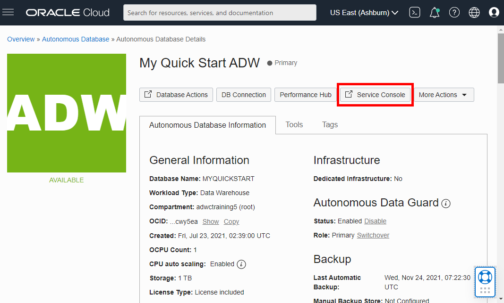
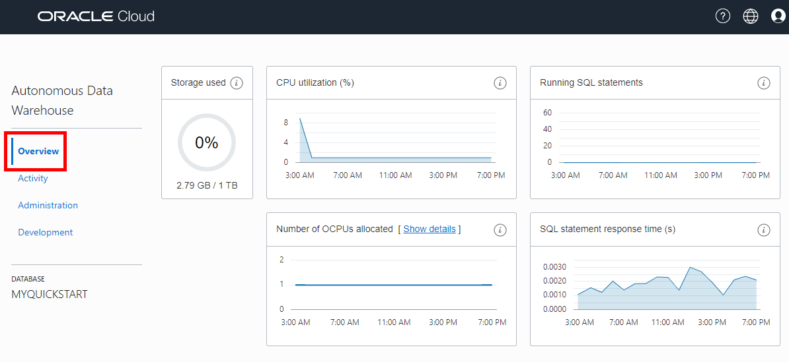
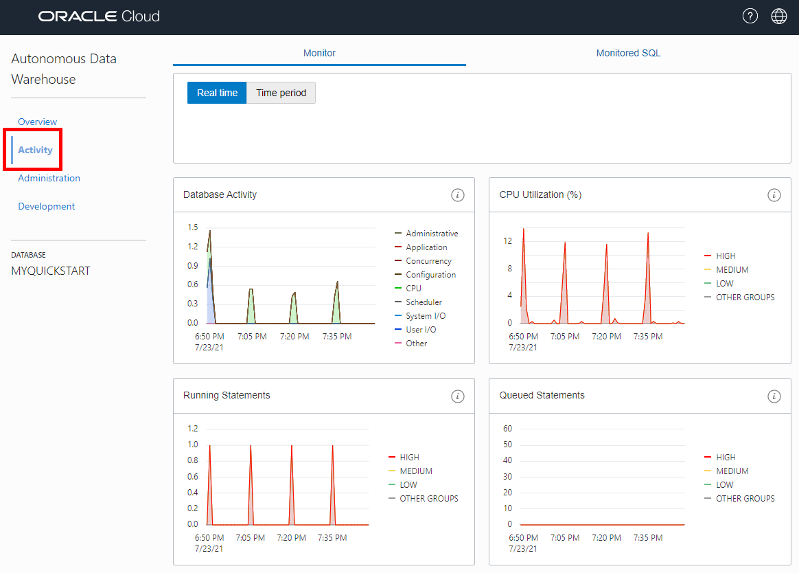
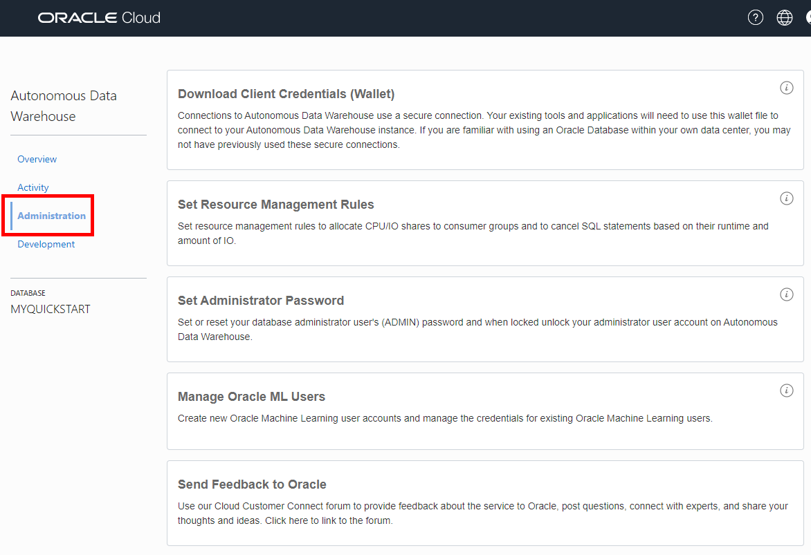
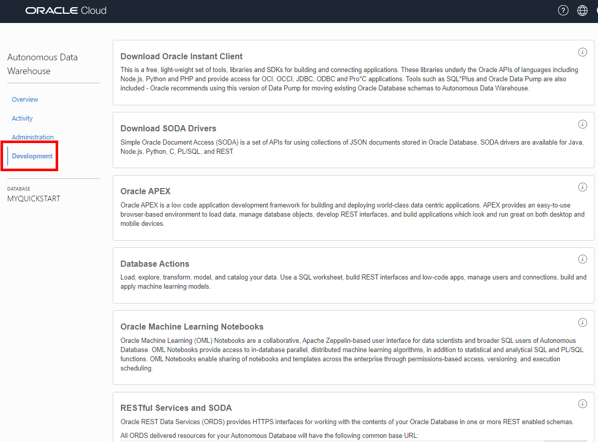
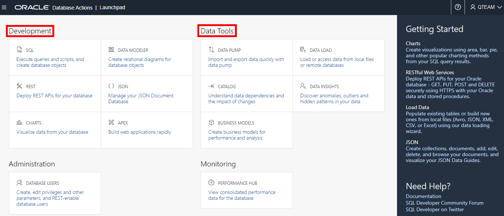
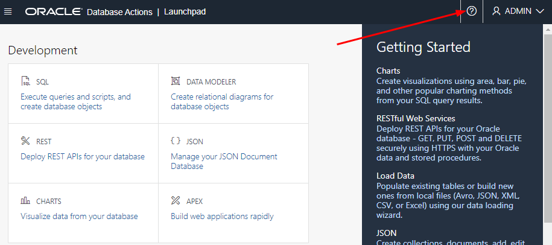
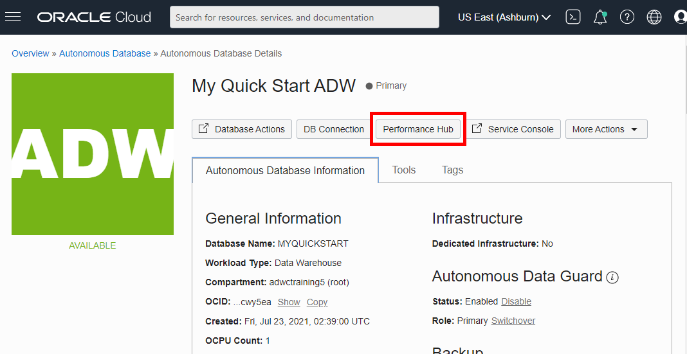
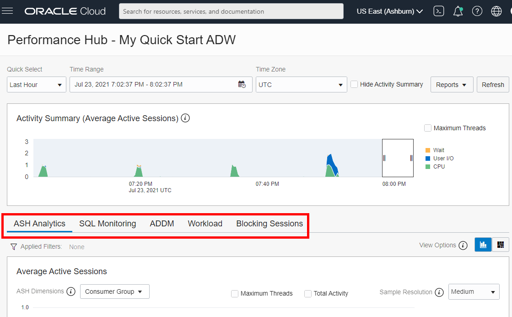

# A quick tour Of The Autonomous Data Warehouse console

## Introduction

Autonomous Data Warehouse provides a web-based console to create, manage, and monitor Autonomous Databases. Let's take a quick tour of the Autonomous Data Warehouse console. 

Estimated Time: 10 minutes

### Objectives (this lab is optional)

In this lab, you will:
* Familiarize with the Autonomous Database console
* Examine the built-in Autonomous Database tools
* Check the performance monitoring features of the built-in Performance Hub

### Prerequisites
- This lab requires completion of Lab 1, **Provision an ADB Instance**, in the Contents menu on the left.
- You can complete the prerequisite lab in two ways:

    a. Manually run through Lab 1.

    b. Provision your Autonomous Database and then go to the **Initializing Labs** section in the contents menu on the left. Initialize Labs will create the required database objects.

## Task 1: Familiarize with the Autonomous Database console
The Autonomous Data Warehouse console provides a user interface to create and manage autonomous databases, plus database tools to perform typical data warehouse tasks including loading and managing data, and a Performance Hub to monitor real-time and historical performance.

1. Navigate to the Autonomous Database Details page for your new database, My Quick Start ADW. There are 5 buttons across the top, and 3 tabs under those, to navigate among the many functions and tools of the Autonomous Database console. Click the **More Actions** drop down menu, and note the many actions you can perform.

    

2. Click the **Service Console** button.

    

3. The **Overview** tab in the Service Console provides information about the performance of an Autonomous Database: CPU utilization, running SQL statements, Number of OCPUs allocated, and SQL statement response time.

    

4. Click the **Activity** tab. The Activity page shows past and current monitored SQL statements and detailed information about each statement. This page has two tabs: Monitor, Monitored SQL.

    

5. Click the **Administration** tab. The Administration page has cards to download client credentials (a wallet), set resource management rules, set or reset the Administrator password, manage Oracle Machine Learning users, and send feedback to Oracle.

    

6. Click the **Development** tab. The Development page has cards to download Oracle Instant Client, download SODA drivers, open Oracle APEX application development framework, open Database Actions tools page, open Oracle Machine Learning (OML) Notebooks, and access RESTFUL Services and SODA.

    

## Task 2: Examine the built-in Autonomous Database Tools
Autonomous Data Warehouse comes with a built-in suite of tools that can help you with many of the typical data warehouse tasks. This tool suite is complementary to various capabilities accessible using the SQL command line, which themselves are covered by other workshops. 

There are two ways to access the Autonomous Database built-in tool suite:

* From the Autonomous Database console page
* Directly from a URL

1. Switch back to the browser tab showing the Autonomous Database Details page. Click the **Database Actions** button:

    

    In the log-in dialog, enter ADMIN for the username and click **Next**. On the next form, enter the ADMIN password - which is the one you entered when creating your Autonomous Data Warehouse. Click **Sign in**.

2. This will open a browser tab taking you to the Autonomous Data Warehouse **Database Actions Launchpad** page (shown below). This page has a card for each of the most common tasks that the data warehouse user would want to perform. The cards are grouped by theme. For example, here you see groups for Development and Data Tools. Each card has a title and description.  

    

3. If you want more information about each of the tasks related to each card then you can access the online help by clicking the **Question Mark** in the title bar, as indicated in the image below:

    

4. This will pop out a tray containing links to the relevant topics in the Autonomous Data Warehouse documentation. To close the help tray, simply click the  **X**.

    

## Task 3: Check the performance monitoring features of the Performance Hub
The Autonomous Data Warehouse console has a built-in performance monitoring tool called Performance Hub. This tool gives us both real-time and historical performance data for our Autonomous Data Warehouse.

1. Switch back to the browser tab showing the Autonomous Database Details page. Click the **Performance Hub** button.

    

2. The Performance Hub page shows active session analytics along with SQL monitoring and workload information. There are tabs for Average Active Sessions (ASH Analytics), SQL monitoring, ADDM analysis, Workload analysis, and blocking sessions.

    

    Click **Close** in the lower left corner when you finish examining the Performance Hub.

Please *proceed to the next lab*.

## Learn more

* See the [documentation](https://docs.oracle.com/en/cloud/paas/autonomous-database/adbsa/part-using.html#GUID-F9B1D121-5D89-40B4-90C6-8E8E233C2B3F) for Oracle Autonomous Database.

## Acknowledgements
* **Author** - Rick Green, Principal Developer, Database User Assistance
* **Last Updated By/Date** - Rick Green, July 2021
