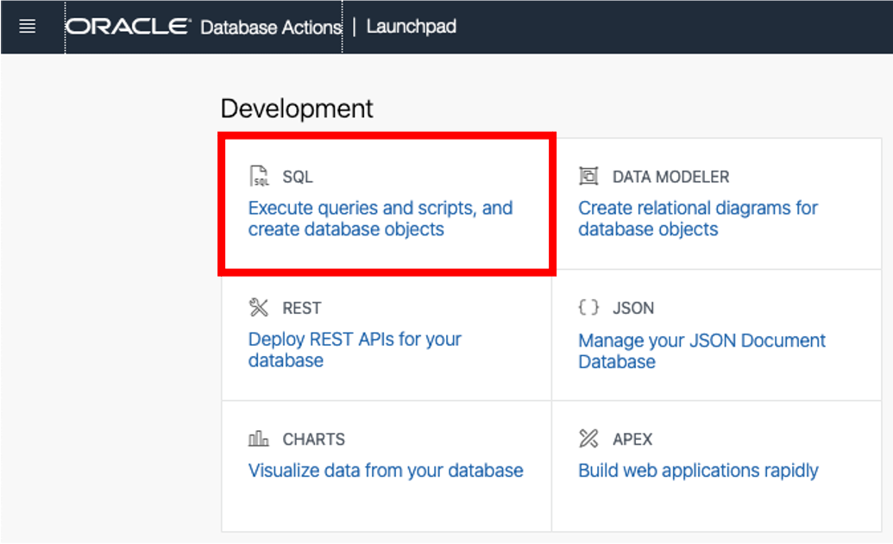
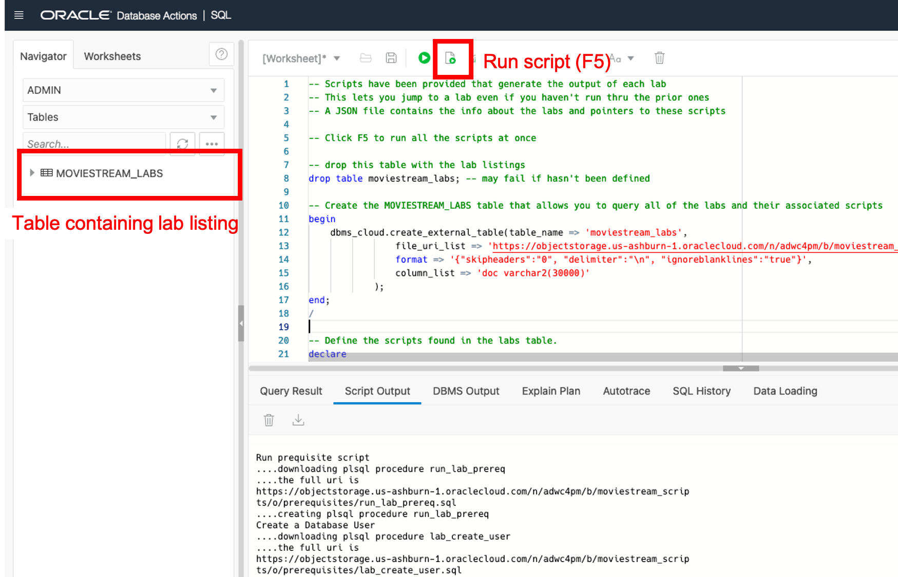
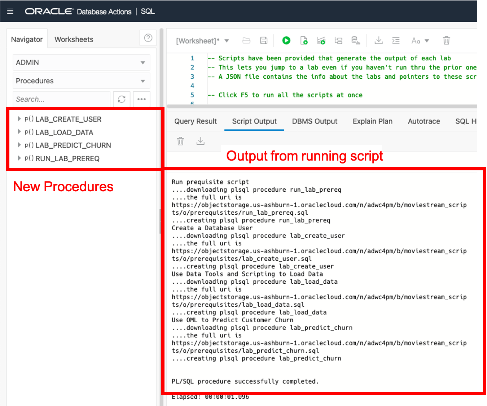

# Initializing Labs

## Introduction
The workshop has been designed to run from beginning to end.  However, you may want to skip certain labs - which means that you may have also skipped some prerequisites.  For example, you can't recommend movies to a potential churner (using the Graph lab) until you've predicted those customers that are likely to churn (using the Machine Learning lab).

There's a two step process that will allow you to jump to any lab in the workshop:

1. PL/SQL procedures are available that will generate the output of each lab.  You will need to download those scripts from object storage (don't worry, we've made this very easy)
2. Execute the `run_lab_preq` procedure - passing as a parameter the lab number that you would like to run.  All of the prerequisites for that lab will be run and you're ready to go!

The script drop and recreate the MOVIESTREAM user.  This means that all of the data for that user will be deleted and recreated.

>**<span style="color:red">Warning:</span>  Any custom work that you did in the MOVIESTREAM schema will be deleted - so save your work!**

Estimated Time: 5 minutes

## Task 1:  Connect to the ADB SQL Tool as the ADMIN User

Connect to Autonomous Database tool as the ADMIN user:

1. In your ADW database's details page, click the Tools tab. Click **Open Database Actions**.

    

2. On the login screen, enter the username ADMIN, then click the blue **Next** button.

3. Enter the password for the ADMIN user you set up in the provisioning lab.

4. Open the SQL Worksheet from the Launchpad:

    

## Task 2:  Create the PL/SQL Procedures that Run the Prerequisite Labs

Now that you're in the SQL worksheet, you will create the procedures used to initialize the labs.  

1. Copy the script below into the worksheet and click Run Script (F5).

```
<copy>
-- Scripts have been provided that generate the output of each lab
-- This lets you jump to a lab even if you haven't run thru the prior ones
-- A JSON file contains the info about the labs and pointers to these scripts

-- Click F5 to run all the scripts at once

-- drop this table with the lab listings
drop table moviestream_labs; -- may fail if hasn't been defined

-- Create the MOVIESTREAM_LABS table that allows you to query all of the labs and their associated scripts
begin
    dbms_cloud.create_external_table(table_name => 'moviestream_labs',
                file_uri_list => 'https://objectstorage.us-ashburn-1.oraclecloud.com/n/c4u04/b/moviestream_scripts/o/prerequisites/moviestream-labs.json',
                format => '{"skipheaders":"0", "delimiter":"\n", "ignoreblanklines":"true"}',
                column_list => 'doc varchar2(30000)'
            );
end;
/

-- Define the scripts found in the labs table.
declare
    b_plsql_script blob;            -- binary object
    v_plsql_script varchar2(32000); -- converted to varchar
    uri_scripts varchar2(2000) := 'https://objectstorage.us-ashburn-1.oraclecloud.com/n/c4u04/b/moviestream_scripts/o/prerequisites'; -- location of the scripts
    uri varchar2(2000);
begin

    -- Run a query to get each lab and then create the procedures that generate the output
    for lab_rec in (
        select  json_value (doc, '$.lab_num' returning number) as lab_num,
                json_value (doc, '$.title' returning varchar2(500)) as title,
                json_value (doc, '$.script' returning varchar2(100)) as proc        
        from moviestream_labs ml
        where json_value (doc, '$.script' returning varchar2(100))  is not null
        order by 1 asc
        )
    loop
        -- The plsql procedure DDL is contained in a file in object store
        -- Create the procedure
        dbms_output.put_line(lab_rec.title);
        dbms_output.put_line('....downloading plsql procedure ' || lab_rec.proc);

        -- download the script into this binary variable        
        uri := uri_scripts || '/' || lab_rec.proc || '.sql';

        dbms_output.put_line('....the full uri is ' || uri);        
        b_plsql_script := dbms_cloud.get_object(object_uri => uri);

        dbms_output.put_line('....creating plsql procedure ' || lab_rec.proc);
        -- convert the blob to a varchar2 and then create the procedure
        v_plsql_script :=  utl_raw.cast_to_varchar2( b_plsql_script );

        -- generate the procedure
        execute immediate v_plsql_script;

    end loop lab_rec;  

    exception
        when others then
            dbms_output.put_line('Unable to setup prequisite scripts.');
            dbms_output.put_line('You will need to run thru each of the labs');
            dbms_output.put_line('');
            dbms_output.put_line(sqlerrm);
 end;
 /
 </copy>
```

2. The result of running the procedure is displayed below. There is a new table called MOVIESTREAM_LABS that contains the list of available labs in this workshop.

    

3. Scroll to **Procedures** in the Navigator to see the procedures that were generated by the script:

    

## Task 3: Execute the `run_lab_preq` Procedure

In the SQL Worksheet, you can now run the script that will ensure that the prerequisites are in place for the lab that you would like to run.  

1. Simply replace ``<lab number>`` below with the number of the lab that you want to run.

    ``exec run_lab_prereq(lab_number => <lab number>);``

2. Because the MOVIESTREAM user will be recreated, you will also need to specify a password from the user. The example below will run the prequisites for **Lab 5** and then set the password to a secure value.

    ```
    <copy>
    exec run_lab_prereq(lab_number => 5);
    alter user moviestream identified by "MoviesAreC00l#";
    </copy>
    ```

    This may take a few minutes to run; the script is running thru many steps :). Once complete, the MOVIESTREAM is initialized and you can continue to your Lab.

## Acknowledgements

* **Author** - Marty Gubar, Product Manager - Server Technologies
* **Last Updated By/Date** - Marty Gubar, August 2021
