# Use Oracle Machine Learning AutoML UI to predict churn

## Introduction

#### Video Preview

[] (youtube:Qwsw_AjLZ1Y)

Analyzing past performance lets you know customers that have already been lost. Lets get in front of this problem and predict those that are at risk using in database analytics.

In this lab, you will use the Oracle Machine Learning (OML) Notebooks and the OML4SQL interface provided with Autonomous Database, and the OML AutoML UI and its features to identify customers with a higher likelihood of churning from **Oracle MovieStream** streaming services to a different movie streaming company.

There are two parts to this Lab:
- Data preparation required by machine learning algorithms to understand customer behavior from the past
- Use of the Oracle Machine Learning AutoML UI to build a model that can predict churn, and score current customers

Estimated Time: 90 minutes

### About Product

In this lab, we will learn more about the Autonomous Database's built-in [Oracle Machine Learning](https://www.oracle.com/goto/machinelearning) components, including:
- Oracle Machine Learning Notebooks - see [OML Notebooks documentation](https://docs.oracle.com/en/database/oracle/machine-learning/oml-notebooks/index.html).
- Oracle Machine Learning for Python - see [OML4Py documentation](https://docs.oracle.com/en/database/oracle/machine-learning/oml4py/index.html).
- Oracle Machine Learning AutoML UI - see [OML AutoML UI documentation](https://docs.oracle.com/en/database/oracle/machine-learning/oml-automl-ui/index.html).
- Oracle Machine Learning Services - see [OML Services documentation](https://docs.oracle.com/en/database/oracle/machine-learning/omlss/omlss/use-case-oml.html)

### Objectives

In this lab, you will:
- Access Oracle Machine Learning Notebooks provided with Oracle Autonomous Database
- Download and import a notebook for Data Preparation
- Run the notebook to complete the Data Preparation process
- Prepare a database table that will be used for building a machine learning model using **OML AutoML UI**
- Use **OML AutoML UI** to build a high-quality machine model that can help predict future churn by customers
- Use the machine learning model to score the list of customers and predict their likelihood to churn in the future

### Prerequisites

- This lab requires completion of Labs 1 through 4 in the Contents menu on the left.
- You can complete the prerequisite labs in two ways:

    a. Manually run through the labs.

    b. Provision your Autonomous Database and then go to the **Initializing Labs** section in the contents menu on the left. Initialize Labs will create the MOVIESTREAM user plus the required database objects.

> **Note:** If you have a **Free Trial** account, when your Free Trial expires your account will convert to an **Always Free** account. You will not be able to conduct Free Tier workshops unless the Always Free environment is available. See the [**Free Tier FAQ page**.](https://www.oracle.com/cloud/free/faq.html)

## Task 1: Understand customer churn and preparing the OML environment

To understand customer behavior, we need to look into their Geo-Demographic information, but also their transactional behavior. For transactional data, we need to summarize number of transactions and aggregate values per month for each type of transaction that we would like to explore. This is because the algorithms need to receive as input a single row per customer, with their attributes provided in database table columns.

To create the database table needed to build a machine learning model, we will work with the data that exists in the **CUSTSALES** Oracle Database table. This table contains historical customer transactions for every movie streamed, including payment and discounts, and can help us identify customer preferences and usage of the service. To aggregate the data, with **one customer per row** (which is a data layout required by Machine Learning), we will have to work with the **Date** information of the transactions to determine the customer behavior.

Defining what **customer churn** is can be very complex, but for our example here we will use the following definition:
- A customer will considered "churned" if they had **no (zero) streams in the last available month of data**, while having streamed movies during 12 months continuously before a **buffer** month (detailed below).
- In contrast to those customers, the customers that will be compared to those (and considered "non-churners") are the customers that have been **streaming movies for 12 months continuously as well as on the last available month of data**.

The following diagram shows the process we will use, including a **buffer** month that represents the time needed to be able to **act** on the knowledge that a customer is about to leave. Predicting the **probability that a customer is going to leave exactly right now** does not help preparing a customer retention campaign, since there is a lot of processing involved in updating customer data at the end of a day before one can do scoring, excluding customers that have a **DO NOT CONTACT** exception. Also, processing offers and other processes in sync with all other divisions of the enterprise will always take time.  


In addition to that, **a customer churning today probably made that decision a while ago**, so our machine learning model needs to be able to detect any change in behavior from at least a month ago. This is the reason for the buffer of 1 month in the following process.

In **Task 2** we will learn how to create and run the functions necessary to transform the data into the required layout for running the Machine Learning algorithms successfully. We will do that by accessing an OML notebook that will give a step-by-step process that is going to create the Table needed as input to the next Task.

We will finish up in **Task 3** using **OML AutoML UI** to create a machine learning model that best identifies future churn, then generate the code to score the current customers for their probability to churn in the future.

1. Download the Oracle Machine Learning Notebook for this lab.

    The first step is to download the notebook to your machine and then import it into OML Notebooks.

    **Click** <a href="./files/Data_Preparation_for_Predicting_Churn_with_OML.json" download="Data_Preparation_for_Predicting_Churn_with_OML.json" target="\_blank">**here**</a> to download the sample notebook for this lab, Data\_Preparation\_for\_Predicting\_Churn\_with\_OML.json, to a folder on your local computer.

2. Access OML Notebook as one of the Oracle Autonomous Database (ADB) users.

    You can import, create, and work with notebooks in Oracle Machine Learning Notebooks. You can access Oracle Machine Learning Notebooks from Autonomous Database.

    In "Lab 2: Quick Tour of ADW", under "Task 1: Familiarizing with the Autonomous Database Console", at Step 6 you got access to the **Development page.** In there you can see a "card" to open **Oracle Machine Learning (OML) Notebooks.**

    As a quick recap, from the tab on your browser with your Oracle Autonomous Data Warehouse (ADW) instance, click **Service Console.**

    

    Once in the Service Console, select **Development** from the menu on the left.

    

    From the cards that are available in the Development section, click the **Oracle Machine Learning Notebooks** card.

    

    <if type="livelabs">Sign in with ``MOVIESTREAM`` using the password you created in "Lab 3: Create a Database User", Task 1, Step 5. </if><if type="freetier">Enter your Autonomous Database user credentials and click **Sign in.**<br>Please note that your user has to have the proper credentials for Oracle Machine Learning, described under "**Lab 3:** Create a Database User", at "**Task 2:** Update the User's Profile to Grant Additional Roles."</if>

    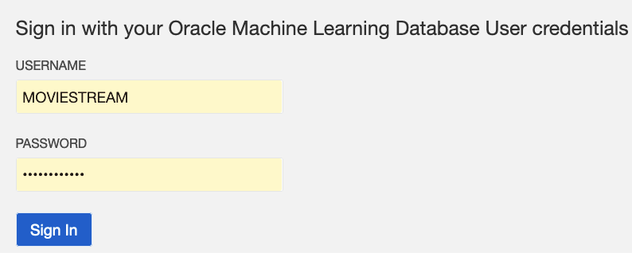

    Click **Notebooks** on the Quick Actions menu.

    

3. Import the Notebook into your OML Notebooks session.

    In the Notebooks listing page, click the **Import** button and navigate to the folder where you downloaded the notebook **Data\_Preparation\_for\_Predicting\_Churn\_with\_OML.json** file you downloaded previously in Task 1.

    Click **Open** to load the notebook into your environment.

    

    If the import succeeds, you will receive a notification at the top of the screen that the Import process worked, and you should be able to see the notebook called **Data Prep for Predicting Churn with OML** in the list of notebooks.

    

    You are ready to proceed to the next Task.

4. Open the notebook just imported into OML Notebooks.

    We are going to open the notebook for editing. For that, we need to **click the notebook's name**. You will see that the notebook server starts and loads the notebook, where you get to the top of the notebook.

    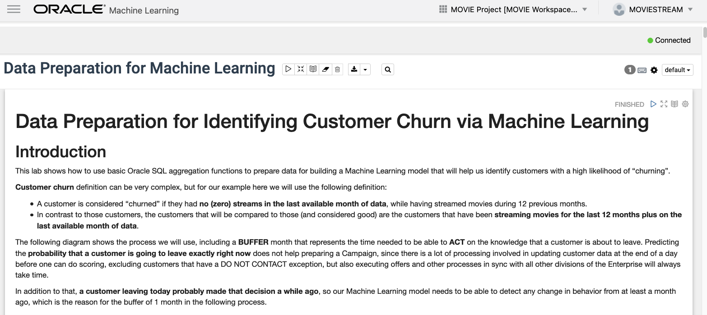

5. Make sure the notebook has an **Interpreter** assigned.

   Before running anything on the notebook, we have to make adjustments to the **Interpreters**, which specify whether to run the notebook by default using the LOW, MEDIUM or HIGH Autonomous Database consumer group. You can read more about the details of the different service levels in the [Autonomous Database documentation](https://docs.oracle.com/en/cloud/paas/autonomous-database/adbsa/service-names-data-warehouse.html#GUID-80E464A7-8ED4-45BB-A7D6-E201DD4107B7).

    The first thing we need to do is to **click the gear icon on the top right**, which will open the panel with the Interpreters, and on that panel make sure to select at least one of the interpreters that indicate **%sql (default), %script, %python**. You can move the interpreters to change their order and bring the one you prefer to the top. Ideally, move the **MEDIUM** interpreter (the one with "_medium" in the name) to the top, or only select it by clicking on it (it becomes blue) and leave the others unclicked (they stay white).

    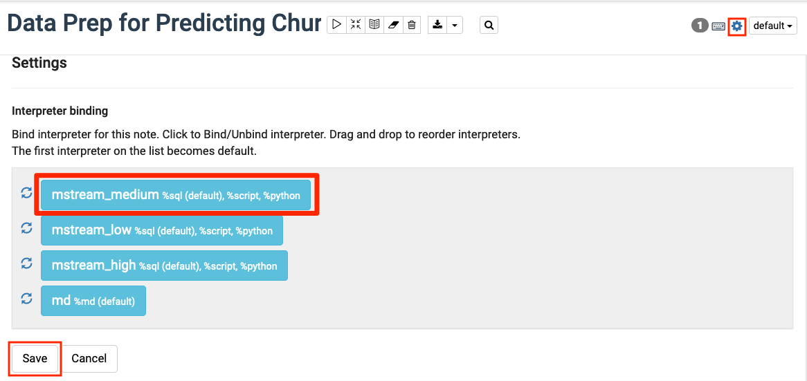

    Once you are satisfied, **click Save** to save your options, and stay in the notebook screen.

7. Run the entire notebook.

   We will follow the notes and instructions in the notebook, but before we do, and to make sure the entire environment is ready, we will run the entire notebook by clicking at the top of the screen, on the icon that looks like a **play button** next to the notebook name, like indicated in the image below.

    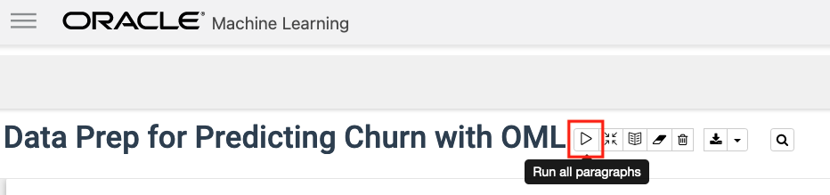

    In the menu that pops open, confirm that you do want to run the entire Notebook by clicking the **OK** button.

    The entire run is expected to take around 5 minutes or less, depending on the resources available, but we can start exploring the contents while it is still running.

## Task 2: Data preparation for machine learning

1. Prepare a time difference column to build our monthly aggregations

    The `CUSTSALES` database table contains a time stamp column called `DAY_ID` indicating when each purchase was made. To identify customer trends over time, we will build new aggregation columns that indicate how many months before the last one were the transactions made. This is because machine learning algorithms do not know the meaning of January or September, and because we are going to be always evaluating the last X months of data before predicting the customer behavior in the subsequent months, so we will want relative numbers.

    On other types of machine learning problems, one could include seasonality into the mix, including seasons of the year, week of the month, day of the week and more, but in our current example we will simplify the process and only look at monthly trends.

    You can follow on the notebook and keep scrolling down as you go through it. You see that the current explains the data aggregation we need, so we will start by checking out the data.  

    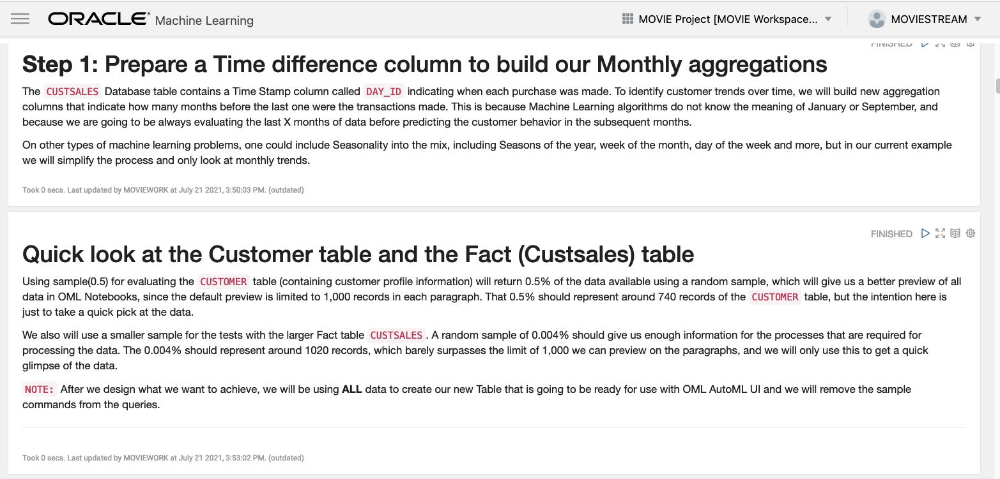

    Scrolling down you will see the first steps, where we counted the number of records from the `CUSTOMER` dataset, and the `CUSTSALES` table.

    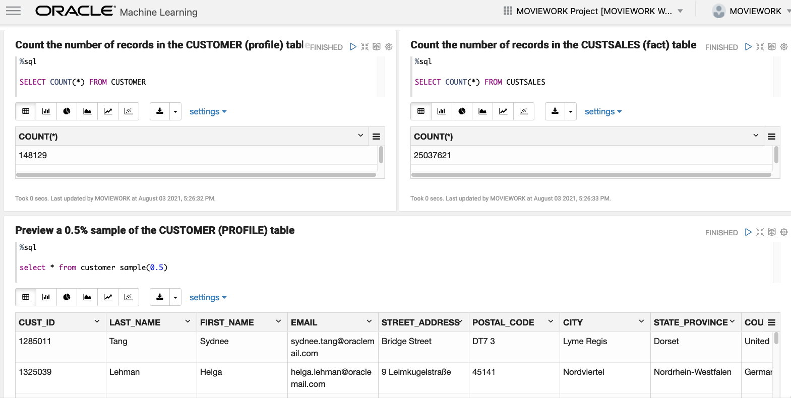

    We also wanted to investigate the distributions of some of the columns. Usually it would be important to look at all the columns, but we give you an example here. We are looking for any irregularities in the distributions.

    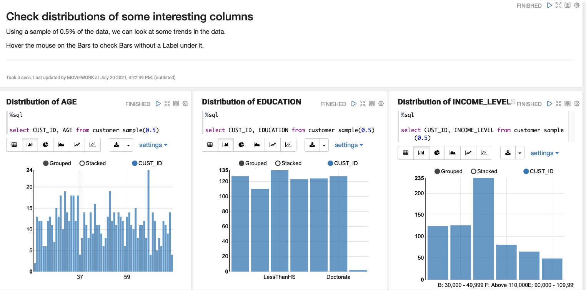

    We finally reviewed a listing of the `CUSTSALES` table.

    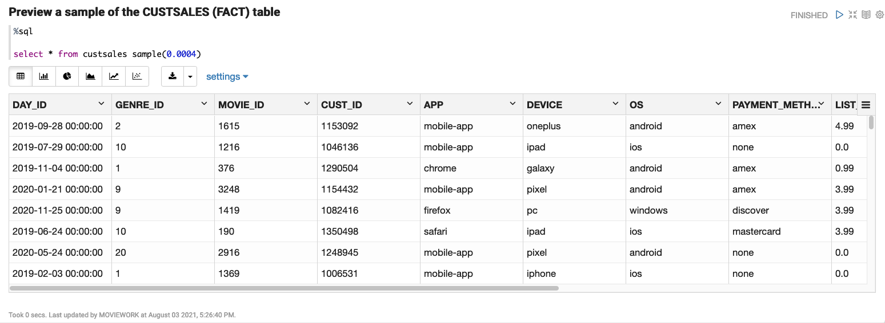

    We prepared a time difference column `MDIFF_JAN2021`, so we created the aggregations by the difference of time to a specific month.

    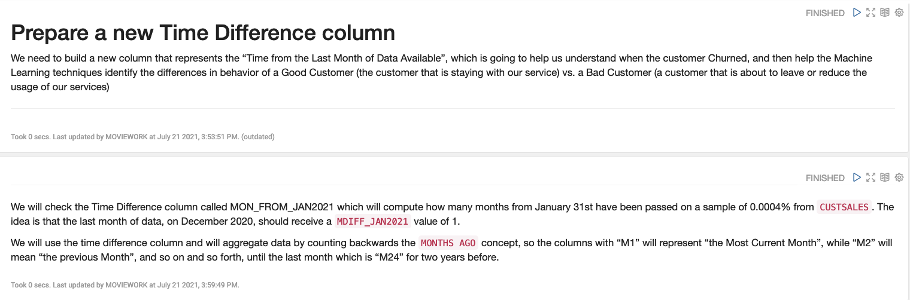

    We ran a quick test to check if everything is as expected in our assumption for the calculation, and checked the time difference distribution, which we expected would be in a range from 1 (latest month) to 24 (2 years ago).

2. Prepare some acceleration and velocity attributes to try to understand customer behavior.

    In this step we used the time difference column we created to build the aggregation attributes for the `CUSTSALES` table.

    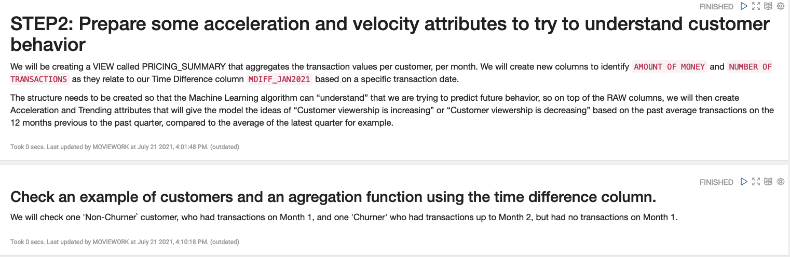

    To make sure that the aggregate number of transactions per month is working correctly, we limited the query to a single customer that we know had transactions for all months, and compared to a customer that we know did not make any transactions in the last month (considered a **churner**).  We expect that the **non-churner** customer on the left would have transactions on `MDIFF_JAN2021=1`, while the **churner** would only start to have transactions on `MDIFF_JAN2021=2`.

    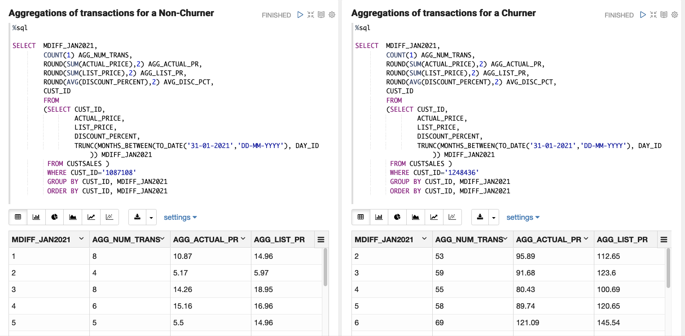

    Since this works, we created the full Pivot for the aggregations for each customer. Machine learning models require data to be all consolidated in a single record for each `CUST_ID`, so we needed to use some pivot processing on the data.

    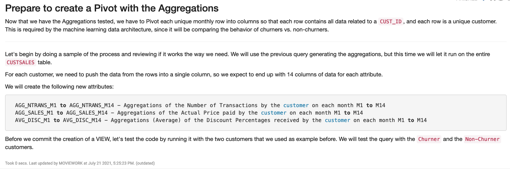

    We created the full code for testing with only those 2 customers we had previously experimented with, just to check for any problems. It starts with the many `CASE` statements in the code, where we are identifying which month the transaction is coming from and accumulating the results.

    The query starts with:
    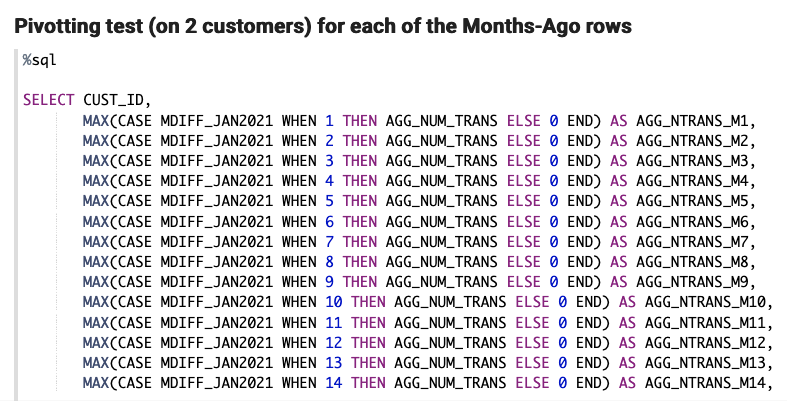

    The query ends with:

    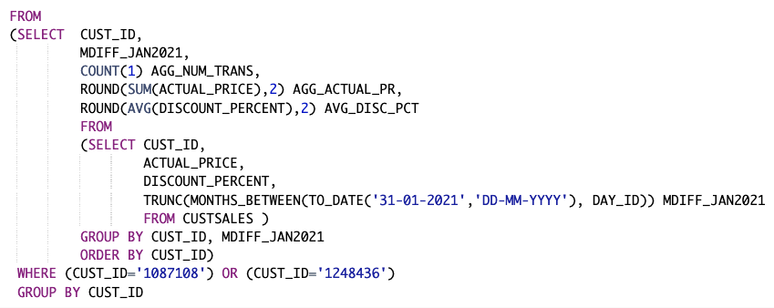

    The result can be seen in those 2 records listed, where we can see that the **churner** has an expected **"0"** for the data from **M1**.

    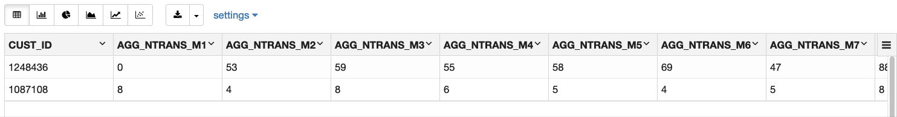

    We notice that the mechanics work, so next we created a view on top of the entire `CUSTSALES` table to continue with the creation of the acceleration and velocity attributes.

    All we did was to add a CREATE VIEW statement, giving the view a name of `SALES_SUMMARY`, and we also removed the WHERE clause that was limiting the previous query to 2 customers. The beginning of the query looks like:

    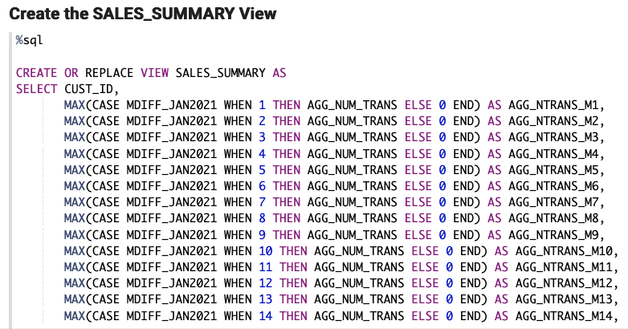

    With the `SALES_SUMMARY` view created, we added new attributes related to the trends and acceleration that a customer might have over time. For that, we created new attributes based on the existing ones into a new view, called `TRENDS_SALES_TRANS`.

    Below we show the code that created a new view containing (for each `CUST_ID` found in the `SALES_SUMMARY`) additional columns that are transformations on the existing aggregated monthly columns. We then previewed the output.

    You will note that there are plain averages being calculated, but also that we computed **ratios**. An example of the calculation of averages is provided in the code below.

    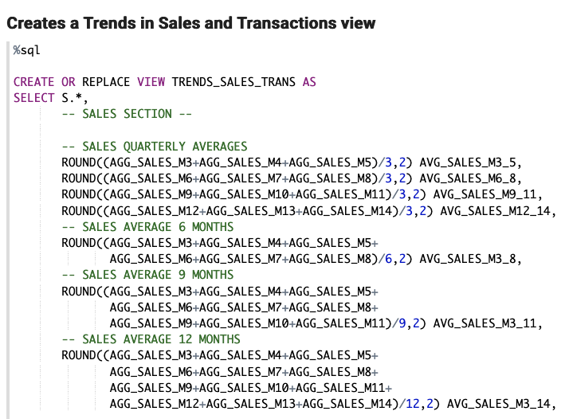

    To calculate the ratios, it is important to make sure the denominator of the division is not "0," so we used a CASE statement to verify and avoid this condition, as shown here.

    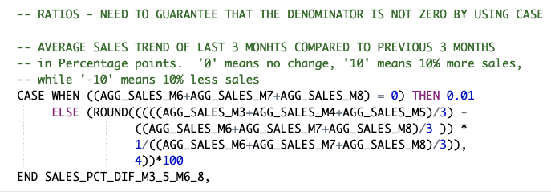

    We then prefiewed the data in our `TRENDS_SALES_TRANS` view. Remember to scroll to the right to check most of the new attributes created.

    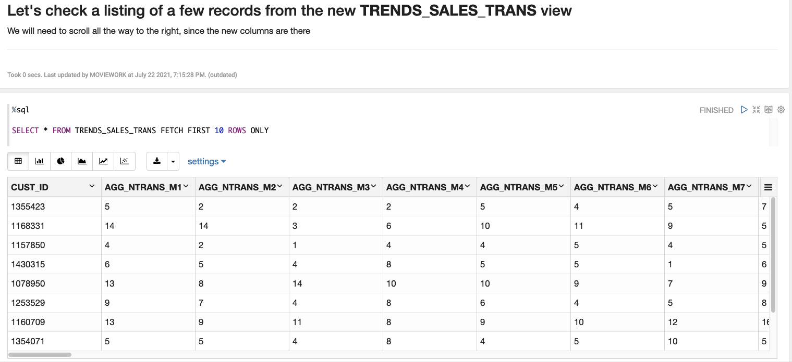

3. Prepare a pivoting table for several of the transaction features.

    We then explored the different categorical columns that we can use for pivoting.  

    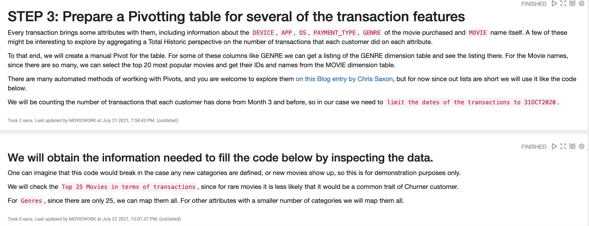

    For example, let's take a look at the **25 most popular Movies**, and also check **all the different genres**. To help identify the movies by name, we merged our `CUSTSALES` table with the `MOVIE` table. We also did the same with the `GENRE` table when identifying the different names of genres.

    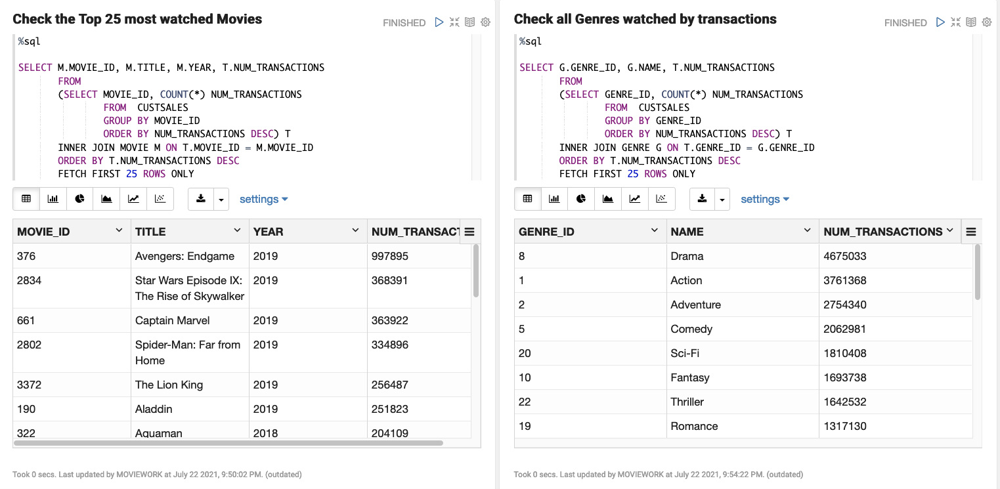

    We created a **pivoting map** for each categorical attribute available in the `CUSTSALES` table, so that we can understand how many movies the customers watched in the different devices or browser types, what type of payment methods they prefer, different times they watched the popular movies or how many movies of each genre they like. This gives us a good insight into customer behavior.

    We stored that information into a new view called `CUSTOMER_CATEGORIES`.

    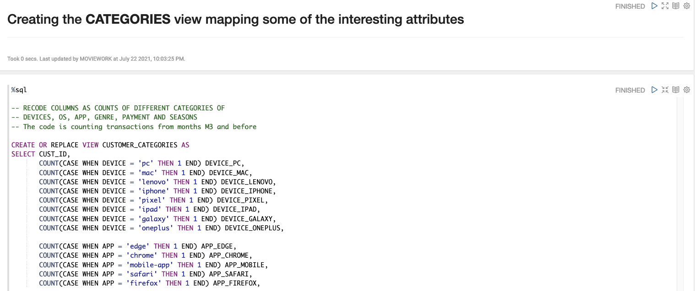

     We previewed the `CUSTOMER_CATEGORIES` view and all the new columns created per customer. Remember to scroll right to see all the additional columns in the visualization.

    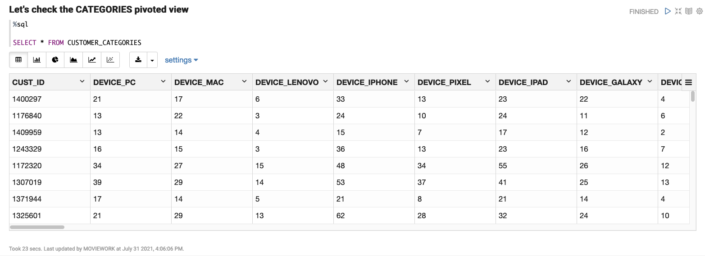


4. Prepare a column that will represent whether a customer has churned (1) or not(0) in the last available month

    We created the **target** column based on the assumption that for the Business Manager, if a customer did not have any interaction in the last month of data, the customer is considered as **churned**.

    In that sense, we created a query that has a new attribute called **TARGET** that is defined as follows:
    ```
    For all customers that had transactions on every month between M3 and M14:
    TARGET = "1" -> "Churner" if the customer had no transactions in Month 1 (December 2020)
    TARGET = "0" -> "Non-Churner" otherwise
    ```

    That means that because of our requirement of existing transactions on all those months, customers that just started or that churned inside the M14 to M3 range will be excluded, so that our model can concentrate on identifying **churner** vs. **non-churner** behavior in that same historical subset of time.

    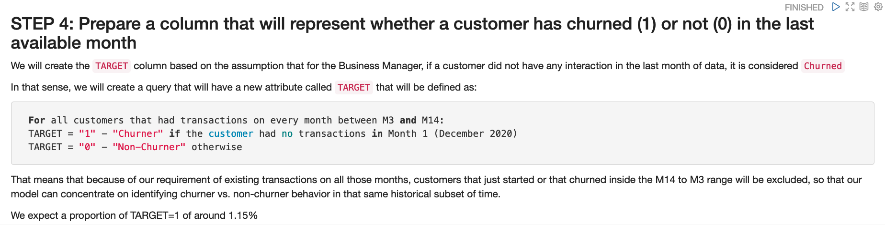

    We checked the number of customers that fit this definitions, and checked the number of **churners**.  We expect a proportion of **TARGET=1** (**churners**) of around 1.15% in our example.

    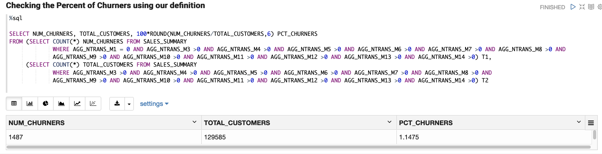


5. Build the final dataset for Machine Learning.

We built a table called `MOVIESTREAM_CHURN` which joined all the different components we worked on so far:
- The `CUSTOMER` table that contains the Geo-Demographics on the customers
- The `TRENDS_SALES_TRANS` pivoted view with trends, velocity and acceleration attributes
- The `CUSTOMER_CATEGORIES` pivoted view and the information on all those categorical attributes
- The churn definition as the `TARGET` attribute

    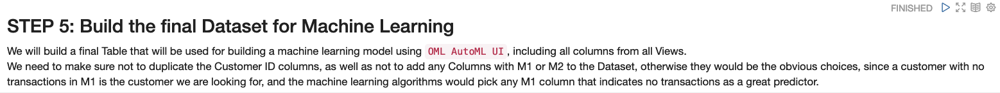

    The beginning of the query is here:

    

    The final check for the number of existing **churners** vs. **non-churners** is at the bottom of the notebook.

    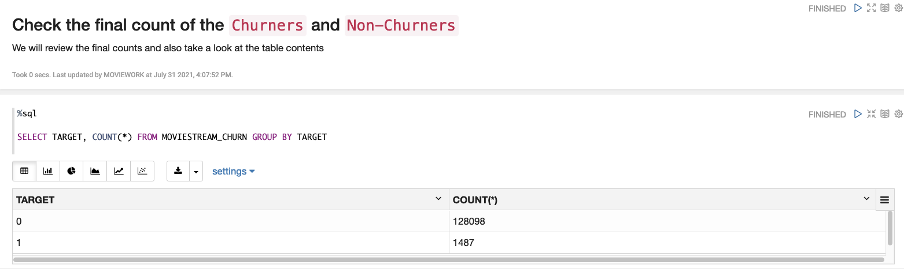

## Task 3: Use AutoML UI to build a machine learning model to predict churn

In this task, you will use the Oracle Machine Learning (OML) AutoML UI provided with your Autonomous Database and its features to identify customers with a higher likelihood of churning from **Oracle MovieStream** streaming services to a different movie streaming company.

We have prepared the final table called `MOVIESTREAM_CHURN` in the previous tasks, so now we can use it in our analysis.

1. Open the OML AutoML UI interface from the main OML menu and create an **Experiment**.

    If you have closed or have signed out of your OML Notebooks session, follow the instructions on **Task 1**, **Step 2** to get to the home screen of OML Notebooks like the one below, and click "AutoML".

    

    You should see the OML AutoML UI Experiments menu, which should be empty. Let's create a **new experiment** by clicking the **Create** button indicated below.

    

    We need to give the new experiment a **name**, and optionally a description in the **comments** section. Type the name you would like to call it by and a description if you wish.  

    Then, click the **magnifying glass icon** at the right of the **Data Source** field, so that we can find the table called `MOVIESTREAM_CHURN` that we have just created.

    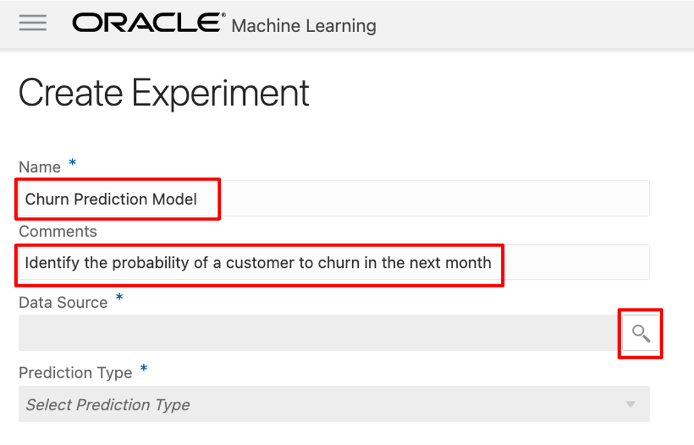

    In the **Select Table** menu that opens, leave the `SCHEMA` selection as it is, and on the right side scroll down to search for the `MOVIESTREAM_CHURN` table. Alternatively, you can start typing `CHURN` in the search box at the bottom of the list, and it should appear. Select the `MOVIESTREAM_CHURN` table and click the **OK** button.

    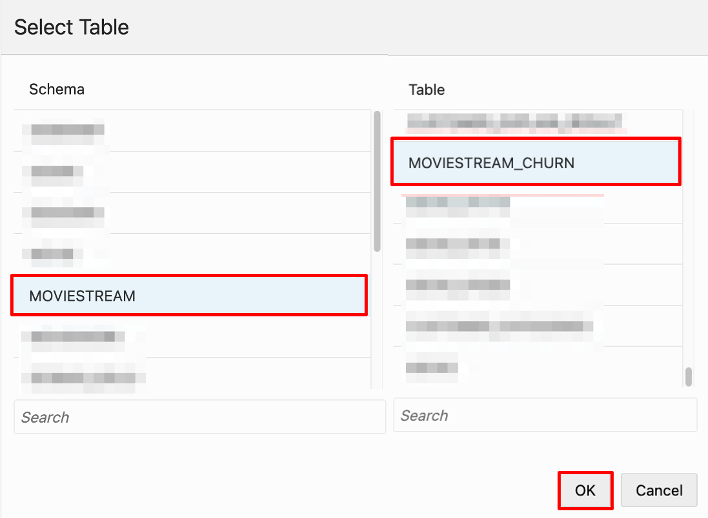

    Back on the **Experiment** page, the **Data Source** name is populated with our selection, and OML AutoML UI will display several statistics for each attribute of the table.

    Scroll down in the **Experiment** page until you see the **Features** section. A list of the attributes available in the table is displayed. Please note that there is a **scroll bar** for the list itself at the right, next to the **Std Dev** statistic.

    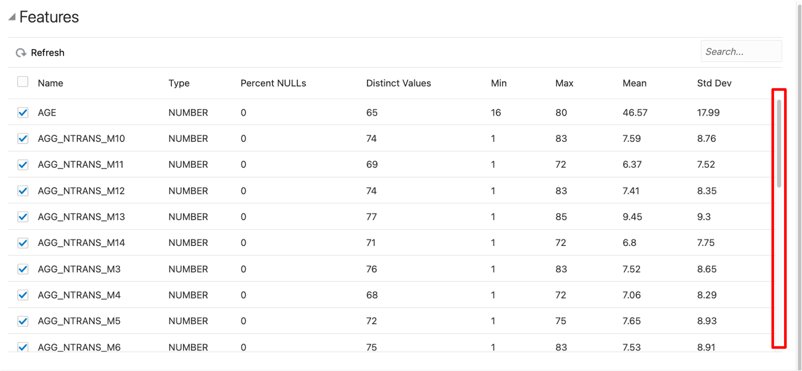

2. Define the Prediction Target, Case ID and Experiment Settings.

    Back to the top of the **Experiments** page, at the right of the screen you will find two pull-down menus. We need to use those to define what we want to predict, in the **Predict** field. Click the down-arrow and search for `TARGET`. Alternatively you can start typing in the `Search` box that appears.

    

    Repeat the process with the **Case ID** pull-down menu selection, identifying the column `CUST_ID` as the unique identifier of our customer. The final result should look like the image below.

    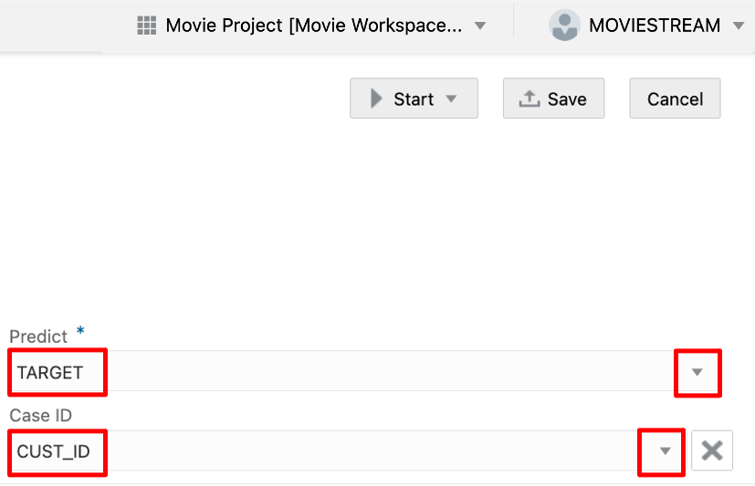

    On the left hand side, just under the **Data Source**, you should have noted that now the **Prediction Type** pull-down option is showing **Classification**. This is because OML AutoML UI detects that our recently selected **Predict** column, our `TARGET` attribute, has only two distinct values and as such this is a binary classification problem. The other option is **Regression**, which is not appropriate for our problem, so we just leave it as is.

    Below that we find the **Additional Settings** section. Let's expand that by clicking on the little triangle next to its name. In here you see that the default values for **Maximum Top Models** is **5**, but we will reduce that to **2** to make it a bit faster for this workshop. Also, we will increase the **Database Service Level** to Medium. Increasing it to **High** might cause other queries to the same database to be de-prioritized, so you might want to be careful with that. Read more about Service Levels with OML AutoML UI in [this Blog Post](https://blogs.oracle.com/machinelearning/oml-automl-ui-4-things-you-can-do-that-affect-performance).

    We are going to leave the **Algorithms** selections as is, which means that OML AutoML UI will try each of these algorithms to find the best one for us.

    Here's what our selections look like.

    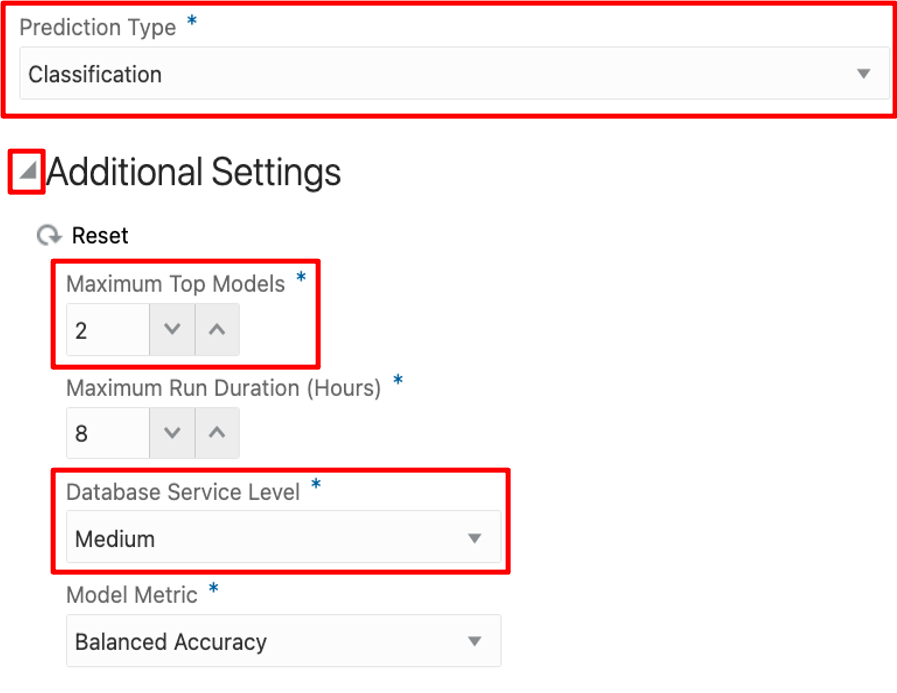

    We are now ready to start the Experiment

3. Run the Experiment and explore the results.

    At the very top right of the screen, you will find the **Start** button. We will click it, and from the sub-menu that appears, we will select **Faster Results**. With that selection, OML AutoML UI will search for models on a reduced hyperparameter search space, to speed up the process.

    

    As a reference point, we expect this **Experiment** to run to completion on a **Classification** task using **Balanced Accuracy** as the metric, and using **Maximum Top Models of 2** in about **15 minutes or less**.

     **IMPORTANT:** Please note that if you choose different settings for your own Experiment, a larger number of models, or even run it at **Best Accuracy** instead of **Faster Results**, a longer running time might be required, and a different "best" algorithm might be chosen. In that case, your results might differ slightly from the screens below, but will still be valid and correct to your settings.

    While the **Experiment** is running, you will note that a floating **Progress** indicator opens, showing the specific step of the process the **Experiment** is currently running, and an approximate time that it has been running.

    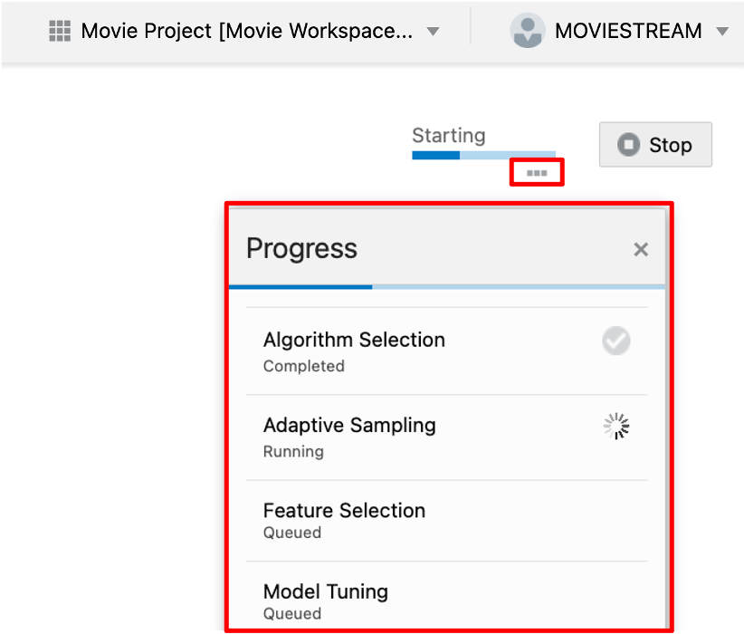

    This process is completely **asynchronous**, so you can go back to the **Experiments** menu at any time by clicking on the blue button on the top left.

    

    You can see then that the **Experiments** listing shows our experiment as **running**.

    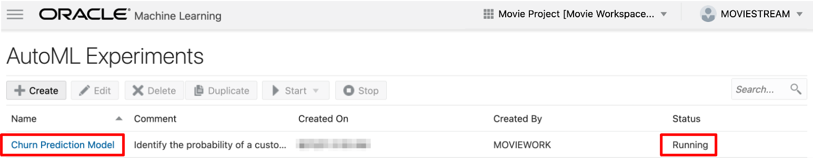

    Clicking on the **Experiment Name** (Churn Prediction Model in our case) takes us back to the running screen.

    The performance of OML AutoML UI depends a lot of the type of environment your Autonomous Database is running on. As explained in [this blog post](https://blogs.oracle.com/machinelearning/oml-automl-ui-4-things-you-can-do-that-affect-performance), several components may affect the performance, among the most important ones is the number of CPUs that can be allocated to your Autonomous Database instance, and whether you can enable auto scaling on Autonomous Database.  

    Once the process completes, you will note that the **running icon** on the top right changes to indicate it is **Completed**. The **Balanced Accuracy** chart will show the increased accuracy over time as the models were tested, and the **Leader Board** will present the different algorithms that were chosen, and their respective **Model Names**.

    In the following screen we can see that the top 2 algorithms chosen were **Random Forest** and a **Decision Tree**. By default they receive randomly generated unique **Model Names**.

    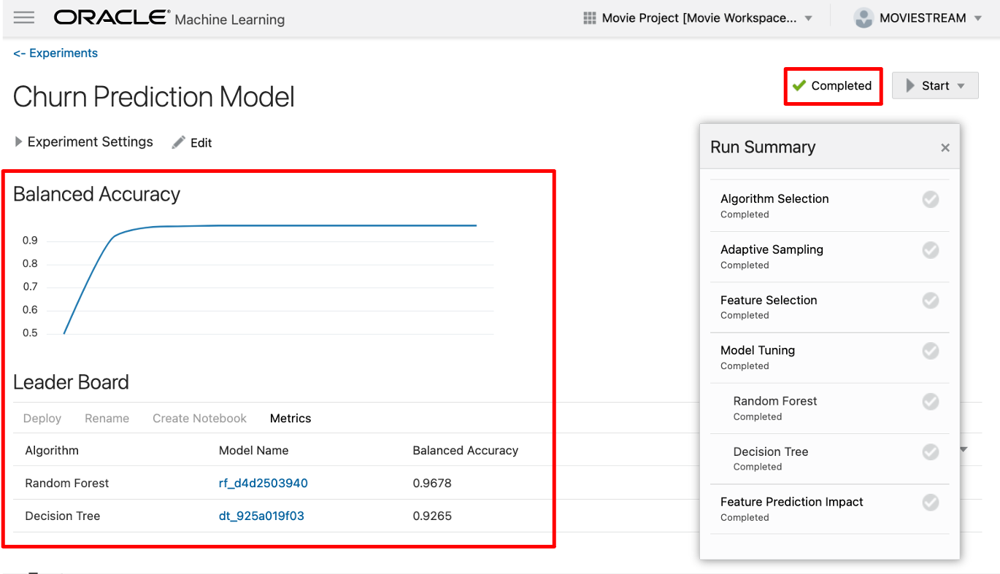

    After an **Experiment** run is completed, the **Features** grid displays an additional column **Importance**. This feature importance indicates the overall level of sensitivity of prediction to a particular feature. Hover your cursor over the graph to view the value of importance. The value is always depicted in the range 0 to 1, with values closer to 1 being more important.

    Please Note: this importance value is **not** related to any particular model, but it shows an overall value to give us an idea of potentially which attributes would be important.

    Scroll down to see the **Features** section. You will also note a **Search** box at the top right of this section, which is important given that there are 170+ attributes.

    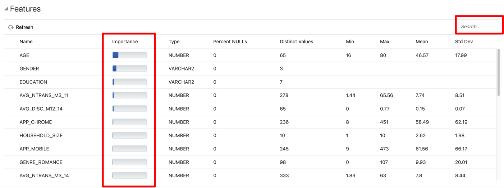

    In this **Experiment**, the attributes with the highest **overall importance** are:
    ```
    AGE, GENDER, EDUCATION, AVG_NTRANS_M3_11, AVG_DISC_M12_14, APP_CHROME, HOUSEHOLD_SIZE, APP_MOBILE, GENRE_ROMANCE and AVG_NTRANS_M3_14
    ```

    Scrolling up to the **Leader Board** section, we can click the **Random Forest** unique model name to open the diagnostics. Click on the Random Forest **Model Name** link in blue. The exact name will be unique to your model, and in the following example it is called *rf_d4d2503940*.

    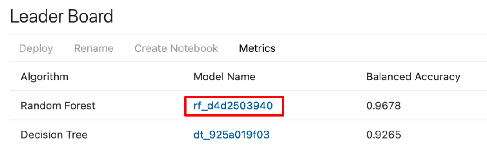

    The first screen that shows up is the **Prediction Impacts**. This time the attributes are listed in order of impact that this specific model uses in its formulation to predict churn.

    It includes the following geo-demographic attributes:

    ```
    AGE, GENDER, INCOME, MORTGAGE_AMT, WORK_EXPERIENCE, YRS_CURRENT_EMPLOYER, NUM_MORTGAGES
    ```

    From the customer product behavior point of view, it includes averages of transactions from the last Quarter (M3\_5) and the last 6 months (M3\_8), as well as the number of transactions using different devices, types of payment and specific genres of movies watched.

    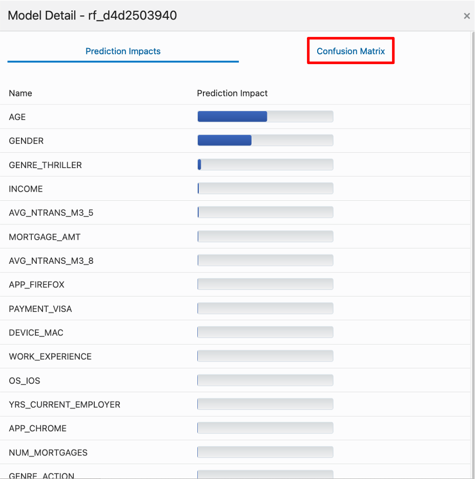

    After reviewing the impacts, click the **Confusion Matrix** tab to visualize the result of the assessment of the model on a **Test Set** of data chosen by AutoML for this test.

    

    In the **Confusion Matrix** we can see that, in this particular **Test Set**,  there were 1,278 customers that were **predicted** to be **non-churners**, and they actually were, so our model was correct.  

    There were **no** customers that were **predicted** to be **non-churners** when they were **churners**, which is good.

    On the column on the right, the model **predicted** incorrectly that 88 customers were going to be **churners** when they were not, but this kind of error is not that bad for marketing purposes, since we would be sending offers to these customers when they might be staying anyway.

    In the bottom right cell the model **predicted** 12 customers were going to **churn** when they actually did, and the model was able to capture all **churners** from this **Test Set**.

4. View other metrics of model quality

    Back in the **Leader Board** section, there are many actions that can be done at this point with a model.

    We will first check out the **Metrics** menu item, by **clicking it**. A menu will pop open showing several metrics that can be selected. Choose a few ones and just close the menu in the top right **X** when ready.

    

    The new metrics will be displayed for each model and would enable you to compare and sort the list of models by each type of metric as desired.

    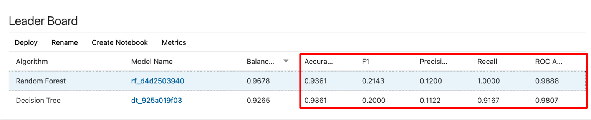

5. Deploy the model to OML Services REST APIs

    Clicking on the **row of a model**, but not on the model name itself, would highlight that row **in a blue hue**.

    

    You will now be able to select any of the three menus under **Leader Board**, with the options to *Deploy*, *Rename* and *Create Notebook*.

    You have the option to **Deploy** a model, which would enable you to register the model with Oracle Machine Learning Services. OML Services enable sub-second scoring from a REST interface that is suitable for real-time applications.

    An example of the Deployment dialog window is shown below, and it is optional for this **Workshop**.

    More details on the [OML AutlML UI model deployment documentation](https://docs.oracle.com/en/database/oracle/machine-learning/oml-automl-ui/amlui/deploy.html).
    For more information on Oracle Machine Learning Services, see [OML Services documentation on model deployment](https://docs.oracle.com/en/database/oracle/machine-learning/omlss/omlss/use-case-oml.html).

    

    You can fill in the information required as follows:
    - In the Name field, the system generated model name is displayed here by default. You can edit this name. The model name must be a unique alphanumeric name (no spaces, '_' as special character is preferred) with maximum 50 characters.
    - In the URI field, enter a name for the model URI. The URI must be alphanumeric (no spaces, '_' as special character is preferred), and the length must be max 200 characters.
    - In the Version field, enter a version of the model. The version must be in the format xx.xx where x is a number.
    - In the Namespace field, enter a name for the model namespace. Usually `OML_MODELS` would indicate an in-Database model.
    - Click **Shared** to enable users with access to the database schema to view and deploy the model.

    In the case of a successful deployment, a notice at the top right of the screen will indicate that.  

6. Create an auto-generated notebook with the model selected in the Leaderboard

    The next option available is the **Create Notebook** button, which generates a Python-based notebook using the Oracle Machine Learning for Python interface. This notebook will contain the hyperparameters selected by the AutoML process and allows you to create the model explicitly using OML4Py.

    While still making sure the best model is selected (row highlighted in a blue hue), click the **Create Notebook** button to open a dialog window where you specify the name you want for this notebook. This step is also optional for this **Workshop**.

    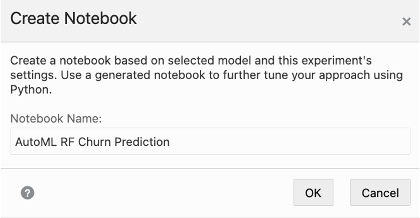   

    Upon successful **Notebook** creation, a notice at the top right of the screen will indicate that. 

    If you were to open the Notebook from the **OML Notebooks** menu, you would see that the entire code for building the exact model you have chosen is there,  written in Python using OML4Py capabilities, so that a Data Scientist can study and modify the model at their will, as well as do batch scoring.

7. Rename the model in preparation for Scoring using SQL

    Finally, there is an option to **Rename** the model, which **we will need to do** to continue with the scoring later. Click the **Rename** button and give your model a name.

    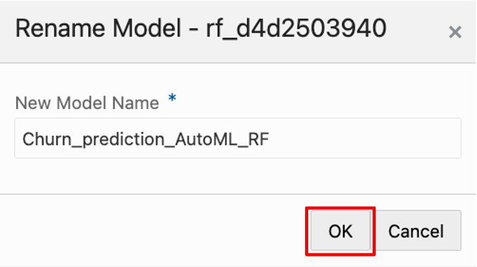  

    If the Rename is successful, a notice at the top right of the screen will indicate that.  

    It will also show up in the **Leader Board** with the new name as well in a few seconds.

    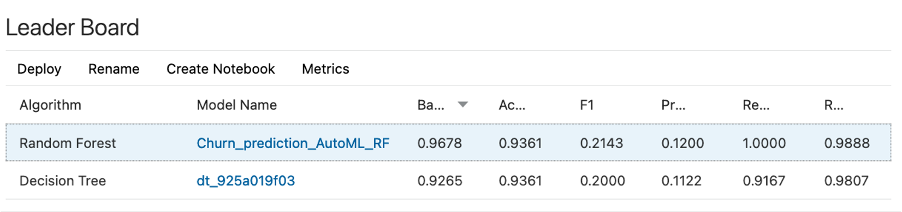

    Now we are ready for scoring customers using SQL.

8. Score the customers using the AutoML model.

    With the model renamed to an easily recognizable name, you can now proceed to run a simple SQL query for creating a new table that will contain the list of customers with their **probabilities to churn**.

    Let's download a new **Oracle Machine Learning notebook** that has the code for scoring the table, and then import it into OML Notebooks.

    [**CLICK HERE** to download the "Scoring customers with Churn Model" notebook file in JSON format](./files/Scoring_customers_with_Churn_Model.json?download=1), and save it to a folder on your local computer.

    Navigate back to the OML Notebooks screen, click the **Import** button and navigate to the folder where you just downloaded the notebook **Scoring\_customers\_with\_Churn\_Model.json** file.

    Click **Open** to load the notebook into your environment, like shown below.

    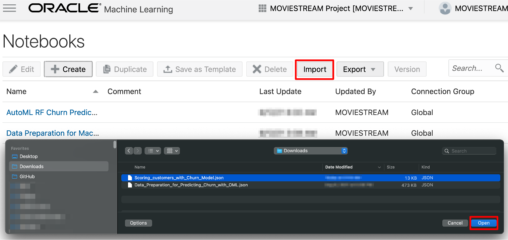

    In case of success, you should receive a notification at the top right of the screen that the import process was successful, and you should be able to see a new notebook called **Scoring customers with Churn Model** in the list of Notebooks.

    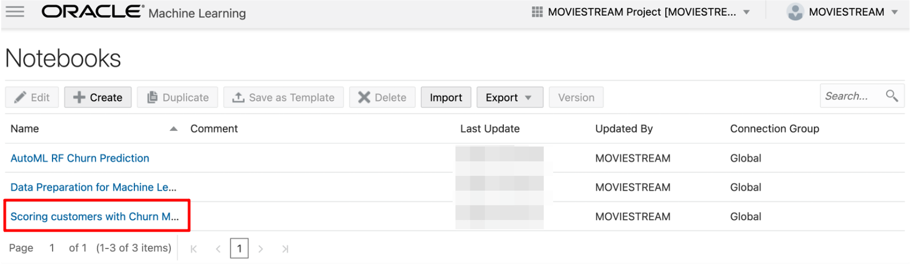

    We are going to open the Notebook for editing. For that we need to **click the "Scoring customers with Churn Model" name**. You will see that the notebook server starts and loads the notebook. You should see the beginning of the notebook, as shown below.

    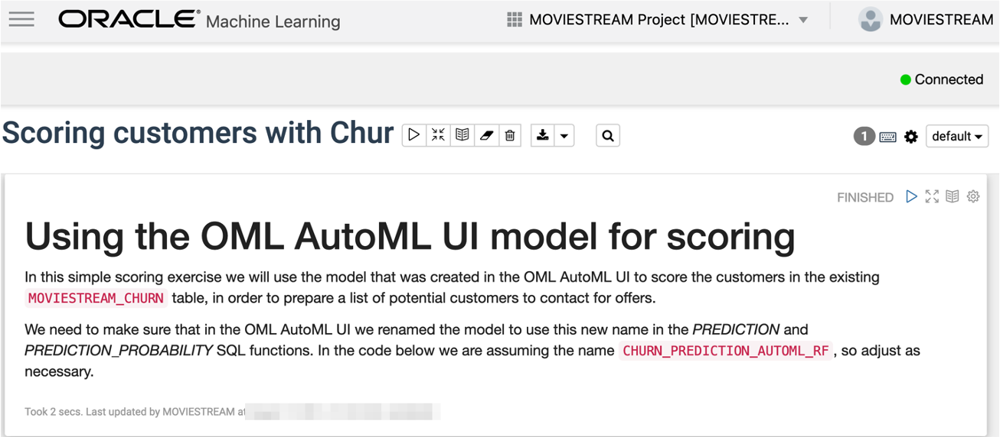

    Just as we did before, we have to make adjustments to the **Interpreters**, which specifies whether to run the notebook using the LOW, MEDIUM or HIGH Autonomous Database consumer group.

    The first thing we need to do is to click the gear icon on the top right, which will open the panel with the Interpreters, and on that panel make sure to select at least one of the interpreters that indicate **%sql (default), %script, %python**. You can move the interpreters to change their order and bring the one you prefer to the top. Ideally move the **MEDIUM** interpreter (the one with "_medium" in the name) to the top, or only select it by clicking on it (it becomes blue) and leave the others unclicked (they stay white).

    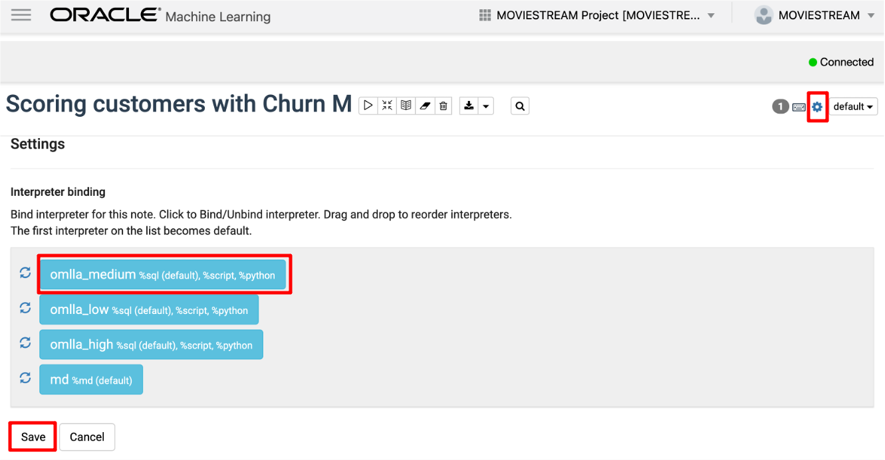

    Once you are satisfied, **click Save** to save your options, and stay in the notebook screen.

    We will follow the notes and instructions in the notebook, but before we do, and to make sure the entire environment is ready, we will run the entire notebook by clicking at the top of the screen, on the icon that looks like a **play button** next to the notebook name, like indicated in the image below.

    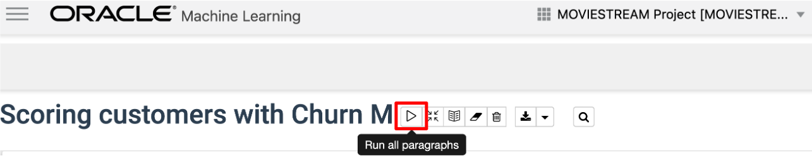

    In the menu that pops open, confirm that you do want to run the entire Notebook by clicking the **OK** button.

    The entire run is expected to take around 15 seconds, depending on the resources available.

    If we scroll down, we see basically two main steps. The first paragraph deletes a table named `POTENTIAL_CHURNERS` if it exists, and the second paragraph uses SQL to create a new table based on the `PREDICTION` and `PREDICTION_PROBABILITY` capabilities by OML.

    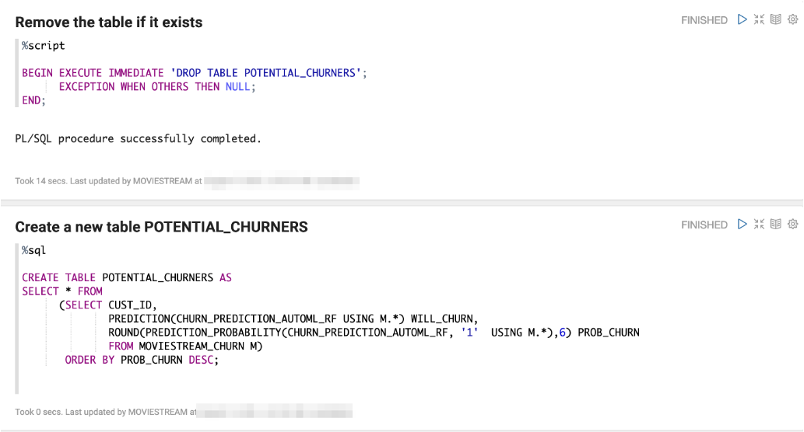

    Please note that the following code can be accessed by any Application through `JDBC` against this Autonomous Database instance, and the scoring will be returned.

    Also remember that you need to change the name of the model being used from `CHURN_PREDICTION_AUTOML_RF` to something else if you decided to use a different name when you were doing the model **Rename** in **Step 4** of **Task 3**.

    ```
    <copy>
    SELECT * FROM
      (SELECT CUST_ID,
              PREDICTION(CHURN_PREDICTION_AUTOML_RF USING M.*) WILL_CHURN,
              ROUND(PREDICTION_PROBABILITY(CHURN_PREDICTION_AUTOML_RF, '1'  USING M.*),6) PROB_CHURN
              FROM MOVIESTREAM_CHURN M)
    ORDER BY PROB_CHURN DESC;
    ```

  At the end, the following result is expected from the table of scores just created.

    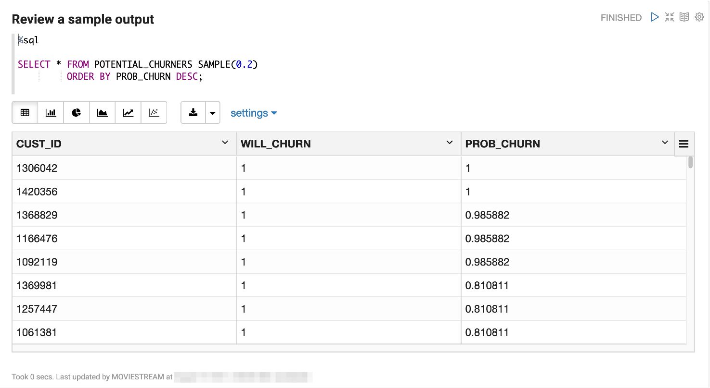

**CONGRATULATIONS!!!**

You now have deployed a new table called `POTENTIAL_CHURNERS` containing each customer's likelihood to churn and the decision (will the customer churn or not?) suggested by the Model.

Now other professionals can take advantage of both the deployment you have just made in order to contact the customers at risk with an offer, as well as use your SQL Scoring code to put the model into production and run the scoring in batch every time there is a new refresh of the data, be it hourly, daily, weekly, or monthly.

Please *proceed to the next lab*.

## Learn more

* [Oracle Machine Learning product information](https://oracle.com/goto/machinelearning)
* [Subscribe to the Weekly AskTOM Oracle Machine Learning Office Hours](https://asktom.oracle.com/pls/apex/asktom.search?office=6801#sessionss)
* [Oracle Machine Learning AutoML UI Demo](https://www.youtube.com/watch?v=yJGsfU9cmt0)
* [Oracle Machine Learning for Python Demo](https://youtu.be/P861m__PEMQ)
* [Oracle Machine Learning Notebooks Demo](https://youtu.be/EgxKYQ8paCw)

## Acknowledgements
* **Author** - Marcos Arancibia, Oracle Machine Learning Product Management
* **Contributors** -  Mark Hornick, Marty Gubar, Kevin Lazarz, Nilay Panchal, Jayant Sharma, Jie Liu, Sherry LaMonica, Richard Green
* **Last Updated By/Date** - Marcos Arancibia, October 2021
