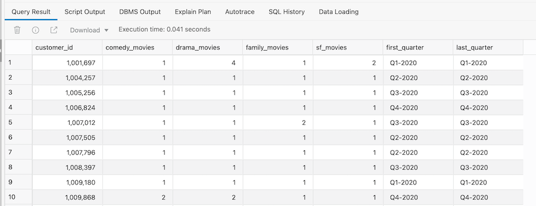
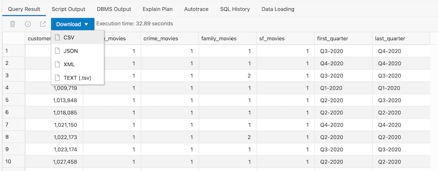
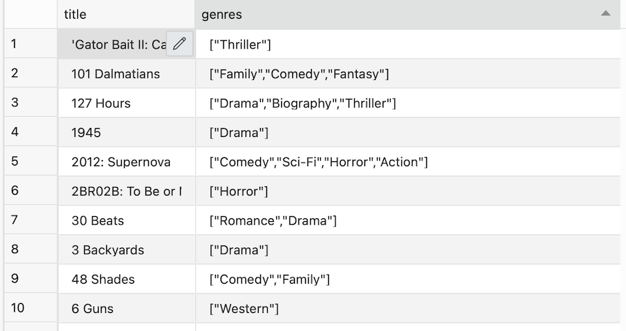
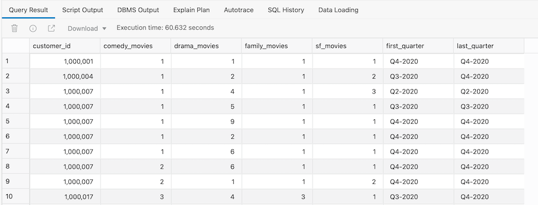

# Targeting customers based on viewing patterns

## Introduction

Patterns are everywhere in business but what is a pattern? They are usually defined as a repetitive series or sequence of specific events or actions and they occur everywhere in business. The ability to find, analyze and quantify individual or groups of patterns within a data set is now a key business requirement. It can help you gain a better understanding of your customers’ behavior and associated operational activities, seek out new opportunities to drive additional revenue streams and even help identify malicious activities that could lead to your business incurring significant costs.

Autonomous Data Warehouse comes complete with native pattern matching capabilities. This brings the simplicity and efficiency of the most common data analysis language (SQL) to the process of identifying patterns within a data set. It offers significant gains in term of performance, maintainability and scalability compared to the legacy ways of solving pattern matching-like problems.

Estimated time: 15 minutes

### Objectives

- Understand that many data sets have patterns

- Learn how to write simple `MATCH_RECOGNIZE` queries

- Learn how to use built-in pattern matching measures

- Learn how to define frequency criteria for patterns

- Learn how to define search criteria for patterns

### Prerequisites
- This lab requires completion of the previous labs in the Contents menu on the left.
- You can complete the prerequisite labs in two ways:

    a. Manually run through the labs.

    b. Provision your Autonomous Database and then go to the **Initializing Labs** section in the contents menu on the left. Initialize Labs will create the MOVIESTREAM user plus the required database objects.

### Overview Of business problem

The marketing team at MovieStream are planning their next campaign which is to promote a new package of carefully selected comedy-family-sci-fi movies to specific customers.

The campaign will be driven by an email blast containing a limited-time discount code. The team has a specific customer profile they want to target, which is customers that watch a lot of family movies each quarter and the occasional sci-fi movie within the same quarter. They have asked you to find the list of customers who meet this very precise profile. How will you find those customers?

The business requirement breaks down as follows:

1. Search for customers who have watched at least one family genre movie within a quarter during 2020.

2. Filter the customers by those who have watched at least some additional family related genre movies within a quarter during 2020.

3. Create a report for the marketing team that shows how many of each type of movie each customer watched within each quarter during 2020.

This all sounds very complicated, but using SQL pattern matching, it is very easy to find these customers!

First we need to understand how our movies are assigned to genres. In the sales fact table there is foreign key which links the sales data to the genre table. Which means for each movie a customer streams we can identify the genre for that movie.


## Task 1: Identify the customers who watch family movies

We can find the customers who watched at least 1 family genre movie during a quarter by using the SQL pattern matching feature: **`MATCH_RECOGNIZE`**. This is a very powerful feature and it's worth spending some time reviewing the simple [stock ticker example](https://docs.oracle.com/en/database/oracle/oracle-database/21/dwhsg/sql-pattern-matching-data-warehouses.html#GUID-136DAC89-DA17-45C6-9E37-C9892723AC79) in the documentation.

To map this pattern within our query, we use the following to outline what we are looking for:
```
PATTERN (family+)
```

This implies that we are searching for at least 1 occurrence of a pattern called family as we search through the data set. And then the pattern 'family' is defined as follows:

```
DEFINE family as genre = 'Family',
AND first(family.quarter_num_of_year) = last(family.quarter_num_of_year)
```
This means that the pattern 'family' looks for movies where the genre is set to 'Family' with the additional test that where we have multiple occurrences of a customer watching family movies they all fall within the same quarter.


1. The first step is to create a view over the `movie_sales_fact` table to filter the results to only show customer data for 2020. Copy and paste the following code:

    ```
    <copy>CREATE OR REPLACE VIEW vw_movie_sales_fact_2020 AS
    SELECT * FROM vw_movie_sales_fact
    WHERE year_name = '2020';</copy>
    ```

2. The format of our SQL query must include some additional keywords as shown below, which counts the number of customers that have watched at least two family movies within a quarter. We can now copy and paste the following code into our SQL Worksheet and run the code:

    ```
    <copy>SELECT count(*)
    FROM vw_movie_sales_fact_2020
    MATCH_RECOGNIZE
    (PARTITION BY customer_id ORDER BY day_id, genre
    ONE ROW PER MATCH
    PATTERN (family+ )
    DEFINE
    family AS genre = 'Family'
    AND family.quarter_name = FIRST(family.quarter_name)
    );</copy>
    ```

    > **Note**: we have already seen concepts such as PARTITION BY and ORDER BY in earlier queries. These keywords enforce similar types of operations when used with pattern matching. In the above example, the data set (vw\_movie\_sales\_fact\_2020) is divided into individual partitions for each customer\_id and the data within each partition is ordered by day and genre to help present the data to the pattern matching process in the most efficient way.

3. The result should be 495,450.

    This shows that we have over 495,450 customers that match this pattern which is too many for the marketing team's project. Before we refine our pattern, let's try and get a little bit more information about these customers by extending our query.

## Task 2: Return more information about the pattern

The pattern matching process can return information about the pattern it has discovered. Defining the information needed is done within the keyword  **`MEASURES`**.  In this case, we want to know the movie\_id, the number of family movies that were watched by each customer and just to confirm our pattern matching process is working as expected, we return the quarter name of the first matched row and the quarter name for the pattern (*and those two columns should have identical values since that is the requirement from our business definition*). To provide more insight the code below includes two built-in measures called *classifier*  and *match_number*:

1. Here is an example of how to extend the data points returned by the pattern matching query (*note you don't have to run the code in this step*):

    ```
    <code class="unselectable">
    MEASURES
    FIRST(family.quarter_name) AS first_quarter,
    LAST(family.quarter_name) AS last_quarter,
    count(family.movie_id) AS family_movies,
    family.movie_id AS movie
    match_number() as match_number
    classifier() as classifier</code>
    ```

2. Copy and paste the following expanded code into your worksheet:

    ```
    <copy>SELECT
    customer_id,
    genre,
    movie,
    family_movies,
    match_number,
    classifier,
    first_quarter,
    last_quarter
    FROM vw_movie_sales_fact_2020
    MATCH_RECOGNIZE
    (PARTITION BY customer_id ORDER BY day_id, genre
    MEASURES
    match_number() as match_number,
    classifier() as classifier,
    first(family.quarter_name) AS first_quarter,
    last(family.quarter_name) AS last_quarter,
    family.movie_id AS movie,
    count(family.movie_id) AS family_movies
    ALL ROWS PER MATCH
    PATTERN (family+)
    DEFINE
    family AS genre = 'Family'
    AND family.quarter_name = FIRST(family.quarter_name)
    )
    order by customer_id, match_number;</copy>
    ```

3. This time we get a lot more information returned by our query. This expanded query shows a row for each occurrence of a customer watching a family movie and it shows the movie. As you scroll through the list of customers, you can see that in some instances each customer watches more than one family movie per month (see the column headed `FAMILY_MOVIES`):

    

## Task 3: Search for family and family-related movies

Now that we understand how our pattern matching query is working, we can extend the pattern search criteria to include a broader definition of the term family movie. This means including additional genres: comedy and crime. We do this by simply expanding the definition the pattern as follows:

1. The code below shows the newly expanded definition for the PATTERN and DEFINE clauses (*note you don't have to run the code in this step*)

    ```
    <code class="unselectable">
    PATTERN (comedy+ crime drama family+  quarter)
    DEFINE
    comedy as genre = 'Comedy',
    crime as genre = 'Crime',
    family as genre = 'Family',
    AND FIRST(family.quarter_name) = LAST(family.quarter_name)</code>
    ```

    > **Note:** We are defining "family related" genres as comedy and crime as you can see in the above definition. The above means we are now looking for rows with at least one comedy movie, a crime movie and at least one family movie within a given quarter. Essentially we are looking for a specific pattern of movie streaming.

2. If we insert the above into our first pattern matching query, we can then paste the following code into our SQL Worksheet:

    ```
    <copy>SELECT COUNT(*)
    FROM vw_movie_sales_fact_2020
    MATCH_RECOGNIZE
    (PARTITION BY customer_id ORDER BY day_id, genre
    MEASURES
    match_number() as match_number,
    classifier() as classifier,
    first(comedy.quarter_name) AS first_quarter,
    last(family.quarter_name) AS last_quarter,
    count(movie_id) AS count_movies
    ALL ROWS PER MATCH
    PATTERN (comedy+ crime family+)
    DEFINE
    comedy as genre = 'Comedy',
    crime as genre = 'Crime',
    family as genre = 'Family'
    AND family.quarter_name = LAST(comedy.quarter_name)
    ) mr
    order by mr.customer_id, match_number;</copy>
    ```

3. This returns around 2,765 customers:

Before we do any more work on this query, we should check-in with our marketing team to see if this number is within the range they were expecting.

## Task 4: Change requirements

A quick Zoom call with the marketing team reveals that they are really pleased to have the list of customers so quickly! However, they think the list needs more tweaking. Ideally, they want to target a much smaller list of customers with the first round of this campaign and they need to find customers who like sci-fi movies! So we need to identify only those customers that have more than a *specific* interest in watching family related movies, but also like to watch sci-fi movies! The marketing team has also decided that it would be better to swap drama based movies for comedy movies in the search criteria.

How can you adapt the previous query to pick out those customers that really enjoy family style movies and sci-fi movies? All we need to do is tweak our pattern statement! This means our pattern definition will now look like this:

1. The code below shows the revised definition for the PATTERN and DEFINE clauses (*note you don't have to run the code in this step*)

    ```
    <code class="unselectable">
    PATTERN (comedy+ drama+ family+ scifi+)
    DEFINE
    comedy as genre = 'Comedy',
    drama as genre = 'Drama',
    family as genre = 'Family',
    scifi as genre = 'Sci-Fi' AND family.quarter_name = LAST(comedy.quarter_name)</code>
    ```

2. We can run the following query to see how many customers match this new pattern:

    ```
    <copy>SELECT count(*)
    FROM vw_movie_sales_fact_2020
    MATCH_RECOGNIZE
    (PARTITION BY customer_id ORDER BY day_id, genre
    ONE ROW PER MATCH
    PATTERN (comedy+ drama+ family+  scifi+)
    DEFINE
    comedy as genre = 'Comedy',
    drama as genre = 'Drama',
    family as genre = 'Family',
    scifi as genre = 'Sci-Fi' AND family.quarter_name = LAST(comedy.quarter_name)
    );</copy>
    ```

3. The answer is 424. This should be more in line with what the marketing team is expecting so they can run a quick test campaign to gauge the level of feedback.


4. To help them validate this smaller list of customers, we will add some additional information into our results by showing whether a movie was matched by our pattern as a family or sci-fi movie (this is shown in the **`classifier`** column.)

    ```
    <copy>SELECT
    customer_id,
    comedy_movies,
    drama_movies,
    family_movies,
    sf_movies,
    first_quarter,
    last_quarter
    FROM vw_movie_sales_fact_2020
    MATCH_RECOGNIZE
    (PARTITION BY customer_id ORDER BY day_id, genre
    MEASURES
    first(family.quarter_name) AS first_quarter,
    last(scifi.quarter_name) AS last_quarter,
    count(comedy.movie_id) AS comedy_movies,
    count(drama.movie_id) AS drama_movies,
    count(family.movie_id) AS family_movies,
    count(scifi.movie_id) AS sf_movies
    ONE ROW PER MATCH
    PATTERN (comedy+ drama+ family+  scifi+)
    DEFINE
    comedy as genre = 'Comedy',
    drama as genre = 'Drama',
    family as genre = 'Family',
    scifi as genre = 'Sci-Fi' AND family.quarter_name = LAST(comedy.quarter_name)
    )
    order by customer_id, first_quarter, family_movies, sf_movies;</copy>
    ```

5. Now we have a much smaller list of customers for our marketing team to review, which should enable them to test out their new campaign.

    

## Task 5: Job done

1. The marketing team is happy with this smaller list of customers, which means the last step is to share the results with our marketing team. We can simply send them a file by using the  **Download**  feature on the  **Query Result**  panel.

    


## Task 6: What about movies with multiple genres
The above examples have used a very simple business rule: each movie has a single genre. In reality, each movie probably belongs to multiple genres. For example we might categorize Star Wars: Episode IV – A New Hope as being a family, comedy, sci-fi film! Therefore, our pattern matching SQL needs to deal with this situation. Within the MOVIE table each film is assigned multiple categories:

1. Let's view the movie dimension table:

    ```
    <copy>SELECT
    title,
    genres
    FROM movie</copy>
    ```

2. Now we can see that each movie has multiple genres.

    

3. Let's create a new view over the sales data joins that with the movie table and incorporates the column containing the genre information:

    ```
    <copy>CREATE OR REPLACE VIEW vw_movie_sales_gfact_2020 AS
    SELECT
    m.DAY_ID,
    m.DAY_NAME,
    m.DAY_DOW,
    m.DAY_DOM,
    m.DAY_DOY,
    m.WEEK_WOM,
    m.WEEK_WOY,
    m.MONTH_MOY,
    m.MONTH_NAME,
    m.MONTH_ANAME,
    m.QUARTER_NAME,
    m.YEAR_NAME,
    m.CUSTOMER_ID,
    m.STATE_PROVINCE,
    m.COUNTRY,
    m.CONTINENT,
    m.APP,
    m.DEVICE,
    m.OS,
    m.PAYMENT_METHOD,
    m.LIST_PRICE,
    m.DISCOUNT_TYPE,
    m.DISCOUNT_PERCENT,
    m.ACTUAL_PRICE,
    f.GENRES as GENRE,
    m.MOVIE_ID
    FROM vw_movie_sales_fact m, movie f
    WHERE year_name = '2020'
    AND m.movie_id = f.movie_id;</copy>
    ```

    Next we need to modify the original pattern definition to use the SQL INSTR function which enables us to search for a specific string within a row:

    

    In this context, we need to search the column genre for a specific string such as 'Comedy' or 'Drama' starting at position 1 and we only need to find the first occurrence. If the function finds the string it returns the starting position for the search string.

4. Next we modify the previous pattern definition to use the INSTR function as follows:

    ```
    <copy>
    SELECT
    customer_id,
    comedy_movies,
    drama_movies,
    family_movies,
    sf_movies,
    first_quarter,
    last_quarter
    FROM vw_movie_sales_gfact_2020
    MATCH_RECOGNIZE
    (PARTITION BY customer_id ORDER BY day_id, genre
    MEASURES
    first(family.quarter_name) AS first_quarter,
    last(scifi.quarter_name) AS last_quarter,
    count(comedy.movie_id) AS comedy_movies,
    count(drama.movie_id) AS drama_movies,
    count(family.movie_id) AS family_movies,
    count(scifi.movie_id) AS sf_movies
    ONE ROW PER MATCH
    PATTERN (comedy+ drama+ family+  scifi+)
    DEFINE
    comedy AS INSTR(genre, 'Comedy',1,1) > 0,
    drama AS INSTR(genre, 'Drama',1,1) > 0,
    family AS INSTR(genre, 'Family',1,1) > 0,
    scifi AS INSTR(genre,'Sci-Fi',1,1) > 0 AND family.quarter_name = LAST(comedy.quarter_name)
    )
    order by customer_id, first_quarter, family_movies, sf_movies;</copy>
    ```

5. The result will look like this.

    

## Recap

Let's quickly recap what we covered in this lab:

- Using `MATCH_RECOGNIZE` to find patterns in your data

- Defining search rules for a pattern

- Quickly changing a pattern to meet new business requirements

- Calculating useful information from data inside your pattern

- Sharing results with other data warehouse users

Please *proceed to the next lab*.

## **Acknowledgements**

- **Author** - Keith Laker, Oracle Autonomous Database Product Management
- **Adapted for Cloud by** - Richard Green, Principal Developer, Database User Assistance
- **Last Updated By/Date** - Keith Laker, August 2021
