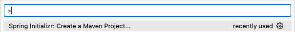
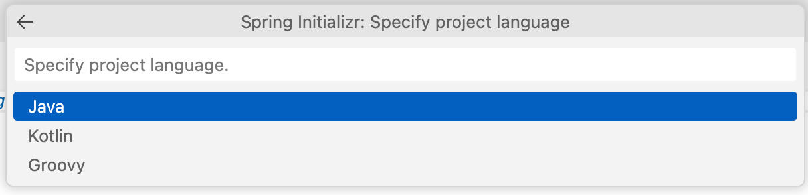
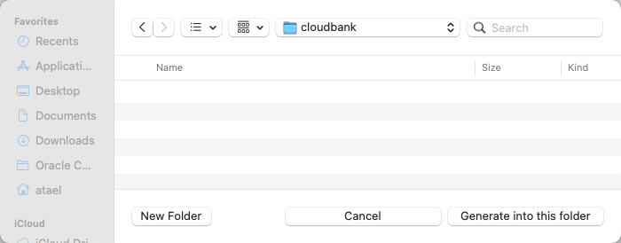

# Build the Account Microservice

## Introduction

This lab walks you through the steps to build a Spring Boot microservice from scratch, and to deploy it into the Oracle Backend for Spring Boot.  In this lab, we will build the "Account" microservice.  In the next lab, the remaining Cloud Bank microservices will be provided for you.

Estimated Time: 20 minutes

### About Spring Boot
Enter background information here about the technology/feature or product used in this lab - no need to repeat what you covered in the introduction. Keep this section fairly concise. If you find yourself needing more than two sections/paragraphs, please utilize the "Learn More" section.

### Objectives

In this lab, you will:
* Create a new Spring Boot project in your IDE
* Plan your accounts database and create Liquibase files to automate creation of the database objects
* Use Spring Data JPA to allow your microservice to use the data in the Orace database
* Create REST services to allow clients to perform create, read, update, and delete operations on accounts
* Learn how to externalize configuration for your microservice
* Deploy your microservice into the backend
* TODO ?? Learn how to use service discovery

### Prerequisites (Optional)

This lab assumes you have:
* An Oracle Cloud account
* All previous labs successfully completed

## Task 1: Create a Spring Boot project

Create a project to hold your Account service.

> **Note**: It is also possible to use [Spring Initialzr](http://start.spring.io) online.

1. Create the project

   In Visual Studio Code, press Ctrl+Shift+P (or equivalent) to access the command window.  Start typing "Spring Init" and you will see a number of options to create a Spring project, as shown in the image below.  Select the option to **Create a Maven Project**.
   
   
   
   TODO TODO

   
   
   TODO TODO

   
   
   TODO TODO

   
   
   TODO TODO

   
   
   TODO TODO

   
   
   TODO TODO

   
   
   TODO TODO

   
   
   TODO TODO

   
   
   TODO TODO

   
   
   TODO TODO

   
   
   TODO TODO

## Learn More

*(optional - include links to docs, white papers, blogs, etc)*

* [URL text 1](http://docs.oracle.com)
* [URL text 2](http://docs.oracle.com)

## Acknowledgements
* **Author** - <Name, Title, Group>
* **Contributors** -  <Name, Group> -- optional
* **Last Updated By/Date** - <Name, Month Year>
