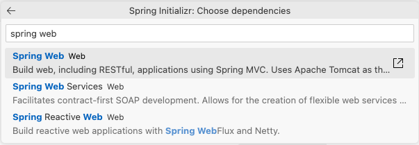
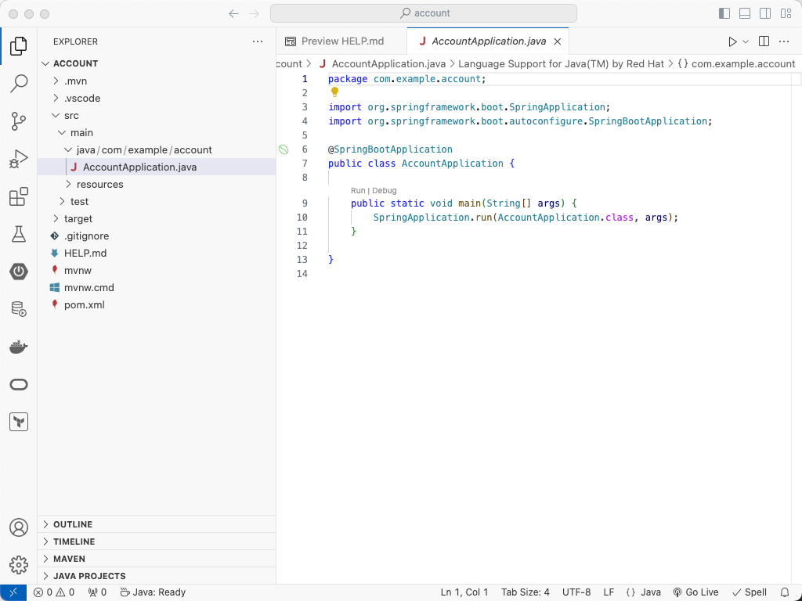
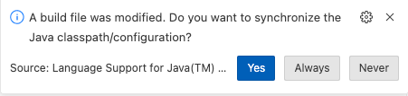
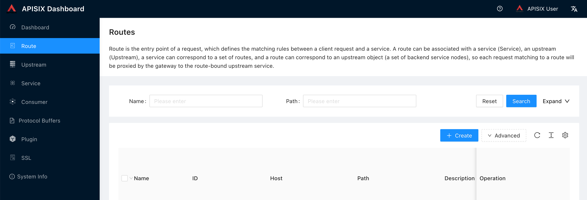

# Build the Account Microservice

## Introduction

This lab walks you through the steps to build a Spring Boot microservice from scratch, and to deploy it into the Oracle Backend for Spring Boot.  In this lab, we will build the "Account" microservice.  In the next lab, the remaining Cloud Bank microservices will be provided for you.

Estimated Time: 20 minutes

Quick walk through on how to build an account microservice.

[](videohub:1_qijspt83)

### Objectives

In this lab, you will:

* Create a new Spring Boot project in your IDE
* Plan your accounts database and create Liquibase files to automate creation of the database objects
* Use Spring Data JPA to allow your microservice to use the data in the Oracle database
* Create REST services to allow clients to perform create, read, update, and delete operations on accounts
* Deploy your microservice into the backend

### Prerequisites (Optional)

This lab assumes you have:

* An Oracle Cloud account
* All previous labs successfully completed

## Task 1: Create a Spring Boot project

Create a project to hold your Account service.  In this lab, you will use the Spring Initialzr directly from Visual Studio Code, however it is also possible to use [Spring Initialzr](http://start.spring.io) online and download a zip file with the generated project.

1. Create the project

   In Visual Studio Code, press Ctrl+Shift+P (or equivalent) to access the command window.  Start typing "Spring Init" and you will see a number of options to create a Spring project, as shown in the image below.  Select the option to **Create a Maven Project**.

  

1. Select the Spring Boot Version

   You will be presented with a list of available Spring Boot versions.  Choose **2.7.9** (or the latest 2.7.x version available).  Do not choose a 3.x version for this lab - there are some breaking changes in 3.x which mean that some instructions in this lab will not work with 3.x.

   

1. Choose Implementation Language

   Next, you will be asked to choose the implementation language.  Choose **Java** from the available options.

   

1. Choose Group ID.

   You will be asked for the Maven Group ID for this new project, you can use **com.example** (the default value).

   

1. Choose Artifact ID.

   You will be asked for the Maven Artifact ID for this new project, enter **accounts**.

   

1. Select Packaging Type

   You will be asked what type of packaging you want for this new project, select **JAR** from the list of options.

   

1. Choose Java Version

   Next, you will be asked what version of Java to use.  Select **17** from the list of options.  Technically you could use an earlier version of Java with Spring Boot 2.7.x, however the lab instructions assume you are using Java 17, so it is better to choose that to avoid issues during this lab.  Note that Spring Boot 3.0 requires Java 17 as the minimum level.

   

1. Add Spring Boot dependencies

   Now you will have the opportunity to add the Spring Boot dependencies your project needs.  For now just add **Spring Web**, which will let us write some REST services.  We will add more later as we need them.  After you add Spring Web, click on the option to continue with the selected dependencies.

   

1. Select where to save the project

   You will be asked where to save the project.  Note that this needs to be an existing location.  You may wish to create a directory in another terminal if you do not have a suitable location.  Enter the directory to save the project in and press Enter.

   

1. Open the generated project

   Now the Spring Initializr will create a new project based on your selections and place it in the directory you specified.  This will only take a few moments to complete.  You will a message in the bottom right corner of Visual Studio Code telling you it is complete.  Click on the **Open** button in that message to open your new project in Visual Studio Code.

   

1. Explore the project

   Explore the new project.  You should find the main Spring Boot application class and your Spring Boot `application.properties` file as shown in the image below.

   

1. Remove some files (Optional)

   If desired, you can delete some of the generated files that you will not need.  You can remove `.mvn`, `mvnw`, `mvnw.cmd` and `HELP.md` if you wish.  Leaving them there will not cause any issues.

1. Build and run the service

    Open a terminal in Visual Studio Code by selecting **New Terminal** from the **Terminal** menu (or if you prefer, just use a separate terminal application).
    Build and run the newly created service with this command:

    ```shell
    $ <copy>mvn spring-boot:run</copy>
    ```

    The service will take a few seconds to start, and then you will see some messages similar to these:

    ```text
    2023-02-25 12:27:21.277  INFO 20507 --- [           main] o.s.b.w.embedded.tomcat.TomcatWebServer  : Tomcat started on port(s): 8080 (http) with context path ''
    2023-02-25 12:27:21.282  INFO 20507 --- [           main] c.example.accounts.AccountsApplication   : Started AccountsApplication in 0.753 seconds (JVM running for 0.893)
    ```

    Of course, the service does not do anything yet, but you can still make a request and confirm you get a response from it. Open a new terminal and execute the following command:

    ```shell
    $ <copy>curl http://localhost:8080</copy>
    {"timestamp":"2023-02-25T17:28:23.264+00:00","status":404,"error":"Not Found","path":"/"}
    ```

## Task 2: Implement your first service

1. Implement the first simple endpoint

    1. Create `AccountController.java`

        Create a new directory in the directory `src/main/java/com/example/accounts` called `controller`.  In that new directory, create a new Java file called `AccountController.java`.  When prompted for the type, choose **class**.

        Your new file should look like this:

        ```java
        <copy>package com.example.accounts.controller;
        
        public class AccountController {
            
        }</copy>
        ```

    2. Add the `RestController` annotation

        Add the `RestController` annotation to this class to tell Spring Boot that we want this class to expose REST services.  You can just start typing `@RestController` before the `public class` statement and Visual Studio Code will offer code completion for you.  When you select from the pop-up, Visual Studio Code will also add the import statement for you.  The list of suggestions is based on the dependencies you added to your project.

        Add the `RequestMapping` annotation to this class as well, and set the URL path to `/api/v1`.  Your class should now look like this:

        ```java
        <copy>package com.example.accounts.controller;
        
        import org.springframework.web.bind.annotation.RequestMapping;
        import org.springframework.web.bind.annotation.RestController;
        
        @RestController
        @RequestMapping("/api/v1")
        public class AccountController {
            
        }</copy>
        ```

    3. Add `ping` method

        Add a method to this class called `ping` which returns a `String` with a helpful message.  Add the `GetMapping` annotation to this method and set the URL path to `/hello`.  Your class should now look like this:

        ```java
        <copy>package com.example.accounts.controller;
        
        import org.springframework.web.bind.annotation.GetMapping;
        import org.springframework.web.bind.annotation.RequestMapping;
        import org.springframework.web.bind.annotation.RestController;
        
        @RestController
        @RequestMapping("/api/v1")
        public class AccountController {
            
          @GetMapping("/hello")
          public String ping() {
            return "Hello from Spring Boot";
          }
        
        }</copy>
        ```

    You have just implemented your first REST service in Spring Boot!  This service will be available on `http://localhost:8080/api/v1/hello`.  And the `GetMapping` annotation tells Spring Boot that this service will respond to the HTTP GET method.

    You can test your service now by building and running again.  If you still have the application running from before, hit Ctrl+C (or equivalent) to stop it, and then build and run with this command:

    ```shell
    $ <copy>mvn spring-boot:run</copy>
    ```

    Then try to call your service with this command:

    ```shell
    $ <copy>curl -i http://localhost:8080/api/v1/hello</copy>
    HTTP/1.1 200 
    Content-Type: text/plain;charset=UTF-8
    Content-Length: 22
    Date: Sat, 25 Feb 2023 17:59:52 GMT
    
    Hello from Spring Boot
    ```

    Great, it works!  Notice it returned HTTP Status Code 200 (OK) and some HTTP Headers along with the body which contained your message.  Later we will see how to return JSON and to set the status code appropriately.

## Task 3: Prepare objects in the Oracle Database

1. Start SQLcl and load the Wallet

  The Accounts service is going to have two main objects - an `account` and a `journal`.

  Here are the SQL statements to create the necessary objects in the database. If you installed SQLcl as recommended, you can connect to your database using this command (or use the SQLcl session created during Lab two, Setup)

    ```shell
    $ <copy>sql /nolog</copy>

    SQLcl: Release 22.4 Production on Fri Mar 03 12:25:24 2023

    Copyright (c) 1982, 2023, Oracle.  All rights reserved.

    SQL>
    ```

1. Load the Wallet

  When you are connected, run the following command to load the Wallet you downloaded during the Setup lab. Replace the name and location of the Wallet to match your environment.

    ```sql
    SQL> <copy>set cloudconfig ~/path/to/wallet/wallet-name.zip</copy>
    ```

1. Connect to the Database

  Connect to the database using the `ADMIN` user. The ADMIN password can be retrieved from a k8s secret using this command. Replace the **DBNAME** with the name of your database.

    ```shell
    $ <copy>kubectl -n application get secret DBNAME-db-secrets -o jsonpath='{.data.db\.password}' | base64 -d</copy>
    ```

    ```sql
    SQL> <copy>connect ADMIN/your-ADMIN-password@your-TNS-entry</copy>
    Connected.
    ```

  If you need to see what TNS Entries you have run the `show tns` command. For example:

    ```sql
    <copy>show tns</copy>
    CLOUD CONFIG set to: /Users/atael/tmp/wallet/Wallet_CBANKDB.zip

    TNS Lookup Locations
    --------------------

    TNS Locations Used
    ------------------
    1.  /Users/atael/tmp/wallet/Wallet_CBANKDB.zip
    2.  /Users/atael

    Available TNS Entries
    ---------------------
    CBANKDB_HIGH
    CBANKDB_LOW
    CBANKDB_MEDIUM
    CBANKDB_TP
    CBANKDB_TPURGENT
    ```

1. Create Database Objects

  Run the SQL statements below to create the database objects:

    ```sql
    <copy>
    -- create a database user for the account service
    create user account identified by "Welcome1234##";

    -- add roles and quota
    grant connect to account;
    grant resource to account;
    alter user account default role connect, resource;
    alter user account quota unlimited on users;

    -- create accounts table
    create table account.accounts (
      account_id            number generated always as identity (start with 1 cache 20),
      account_name          varchar2(40) not null,
      account_type          varchar2(2) check (account_type in ('CH', 'SA', 'CC', 'LO')),
      customer_id           varchar2 (20),
      account_opened_date   date default sysdate not null,
      account_other_details varchar2(4000),
      account_balance       number
    ) logging;

    alter table account.accounts add constraint accounts_pk primary key (account_id) using index logging;
    
    comment on table account.accounts is 'CloudBank accounts table';

    -- create journal table
    create table account.journal (
      journal_id      number generated always as identity (start with 1 cache 20),
      journal_type    varchar2(20),
      account_id      number,
      lra_id          varchar2(1024) not null,
      lra_state       varchar2(40),
      journal_amount  number
    ) logging;

    alter table account.journal add constraint journal_pk primary key (journal_id) using index logging;

    comment on table account.journal is 'CloudBank accounts journal table';
    /</copy>
    ```

  Now that the database objects are created, you can configure Spring Data JPA to use them in your microservice.

## Task 4: Use Spring Data JPA to access the database

1. Add Spring Data JPA to the Account service and configure it to access the database

    Spring Data JPA allows our Spring Boot application to easily use the database.  It uses simple Java POJOs to represent the data model and provides a lot of out-of-the-box features which means there is a lot less boilerplate code to be written.

    To add Spring Data JPA and the Oracle Database drivers to your project, open the Maven POM (`pom.xml`) and add these extra dependencies for Spring Data JPA, Oracle Spring Boot Starters for Oracle Database UCP (Universal Connection Pool) and Wallet:

    ```xml
    <copy>
    <dependency>
        <groupId>org.springframework.boot</groupId>
        <artifactId>spring-boot-starter-data-jpa</artifactId>
    </dependency>
    <dependency>
        <groupId>com.oracle.database.spring</groupId>
        <artifactId>oracle-spring-boot-starter-ucp</artifactId>
        <type>pom</type>
        <version>2.7.7</version>
    </dependency>
        <dependency>
        <groupId>com.oracle.database.spring</groupId>
        <artifactId>oracle-spring-boot-starter-wallet</artifactId>
        <version>2.7.7</version>
        <type>pom</type>
    </dependency></copy>
    ```

    Visual Studio code will display a notification in the bottom right corner and ask if it should update the project based on the change you just made.  You should select **Yes** or **Always** to this notification.  Doing so will ensure that the auto-completion will have access to the classes in the new dependency that you just added.

    

1. Configure JPA datasource

    To configure Spring Data JPA access to the database, you will add some configuration information to the Spring Boot application properties (or YAML) file. Access to the database you need to unzip the Wallet and get information from those files.

    1. Unzip the Wallet you downloaded in the Setup lab (Lab 2)

      ```shell
      $ <copy>unzip /path/to/wallet/wallet_name.zip</copy>
      ```

    1. Edit the `sqlnet.ora` file so that the section `(DIRECTORY="?/network/admin")` matches the full path to the directory where you unzipped the Wallet, for example:

      ```text
      WALLET_LOCATION = (SOURCE = (METHOD = file) (METHOD_DATA = (DIRECTORY="/path/to/unzipped/wallet")))
      ```

    1. Get the TNS Entry connection string using this command. Remember the name of the entry as you'll need it in the next steps. In the sample below it is `cbankdb_tp`.

      ```shell
      $ <copy>grep "_tp =" /path/to/unzipped/wallet/tnsnames.ora</copy>
      cbankdb_tp = (description= (retry_count=20)(retry_delay=3)(address=(protocol=tcps)(port=1522)(host=adb.us-.....-1.oraclecloud.com))(connect_data=(service_name=....._cbankdb_tp.adb.oraclecloud.com))(security=(ssl_server_dn_match=yes)))
      ```

      You will find a file called `application.properties` in the `src/main/resources` directory in your project.  You can use either properties format or YAML format for this file.  In this lab, you will use YAML.  Rename the file to `application.yaml` and then add this content to the file. Make sure that you modify the url to contain the path to the wallet and the name of the TNS entry you collected earlier.

        ```yaml
        <copy>
        spring:
          application:
            name: accounts
          jpa:
            hibernate:
              ddl-auto: validate
            properties:
              hibernate:
                dialect: org.hibernate.dialect.Oracle12cDialect
                format_sql: true
            show-sql: true
          datasource:
            url: jdbc:oracle:thin:@tns_entry_from_above?TNS_ADMIN=/path/to/wallet
            username: account
            password: Welcome1234##
            driver-class-name: oracle.jdbc.OracleDriver
            type: oracle.ucp.jdbc.PoolDataSource
            oracleucp:
              connection-factory-class-name: oracle.jdbc.pool.OracleDataSource
              connection-pool-name: AccountConnectionPool
              initial-pool-size: 15
              min-pool-size: 10
              max-pool-size: 30</copy>
        ```

   These parameters will be used by Spring Data JPA to automatically configure the data source and inject it into your application.  This configuration uses [Oracle Universal Connection Pool](https://docs.oracle.com/en/database/oracle/oracle-database/21/jjucp/index.html) to improve performance and better utilize system resources.  The settings in the `jpa.hibernate` section tell Spring Data JPA to use Oracle SQL syntax, and to show the SQL statements in the log, which is useful during development when you may wish to see what statements are being executed as your endpoints are called.

1. Create the data model in the Spring Boot application

   Create a new directory inside `src/main/java/com/example/accounts` called `model` and inside that new directory, create a new Java file called `Account.java`, when prompted for a type, choose **class**.

   In this class you can define the fields that will make up the "account" object, as shown below.  Also add a constructor for the non-generated fields.

    ```java
    <copy>package com.example.accounts.model;
    
    import java.util.Date;
    
    public class Account {
    
        private long accountId;
        private String accountName;
        private String accountType;
        private String accountCustomerId;
        private Date accountOpenedDate;
        private String accountOtherDetails;
        private long accountBalance;
    
        public Account(String accountName, String accountType, String accountOtherDetails, String accountCustomerId) {
            this.accountName = accountName;
            this.accountType = accountType;
            this.accountOtherDetails = accountOtherDetails;
            this.accountCustomerId = accountCustomerId;
        }
    }</copy>
    ```

    Now, you need to give Spring Data JPA some hints about how to map these fields to the underlying database objects.  Spring Data JPA can actually automate creation of database objects for you, and that can be very helpful during development and testing.  But in many real-world cases, the database objects will already exist, so in this lab you will work with pre-existing database objects.

    Before continuing, open the Maven POM (`pom.xml`) for the project and add this new dependency to the list.  Lombok offers various annotations aimed at replacing Java code that is well known for being boilerplate, repetitive, or tedious to write. You’ll use it to avoid writing getters, setters, constructors and builders.

    ```xml
    <copy><dependency>
        <groupId>org.projectlombok</groupId>
        <artifactId>lombok</artifactId>
    </dependency></copy>
    ```

    Visual Studio code will display a notification in the bottom right corner and ask if it should update the project based on the change you just made.  You should select **Yes** or **Always** to this notification.  Doing so will ensure that the auto-completion will have access to the classes in the new dependency that you just added.

    

    Add the `Data` and `NoArgsConstructor` Lombok annotations to your `Account` class.  `@Data` generates all the boilerplate that is normally associated with simple POJOs and beans: getters for all fields, setters for all non-final fields, and appropriate `toString`, `equals` and `hashCode` implementations that involve the fields of the class, and a constructor that initializes all final fields, as well as all non-final fields with no initializer that have been marked with `@NonNull`, in order to ensure the field is never null.  The `NoArgsConstructor` creates a constructor with no arguments.

    Also add the JPA `Entity` and `Table` annotations to the class and set the `Table`'s `name` property to `accounts`.  These tell JPA that this object will be mapped to a table in the database called `accounts`.  Your class should now look like this:

    ```java
    <copy>package com.example.accounts.model;
    
    import java.util.Date;
    import javax.persistence.Entity;
    import javax.persistence.Table;
    import lombok.Data;
    import lombok.NoArgsConstructor;
    
    @Data
    @NoArgsConstructor
    @Entity
    @Table(name = "ACCOUNTS")
    public class Account {
        // ...
    }</copy>
    ```

   You also need to give some hints about the columns in the existing tables.  You should add a `Column` annotation to each field and set its `name` property to the name of the database column.  Some of the columns will need additional information.  

   First, the `accountId` field is the primary key, so add the `Id` annotation to it, and its value is generated, so add the `GeneratedValue` annotation and set its `strategy` property to `GenerationType.IDENTITY`.  

   Next, the `accountOpenedDate` field is special - it should not be able to be inserted or updated.  So you will add the `updatable` and `insertable` properties to its `Column` annotation and set them both to `false`.  Also add the `Generated` annotation and set it to `GenerationTime.INSERT` to tell Spring Data JPA that the value for this field should be generated at the time of the database insert operation.

   With these additions, the fields in your class should now look like this, the extra imports are also shown:

    ```java
    <copy>
    import javax.persistence.Column;
    import javax.persistence.GeneratedValue;
    import javax.persistence.GenerationType;
    import org.hibernate.annotations.Generated;
    import org.hibernate.annotations.GenerationTime;
    import javax.persistence.Id;

    // ...

    @Id
    @GeneratedValue(strategy = GenerationType.IDENTITY)
    @Column(name = "ACCOUNT_ID")
    private long accountId;

    @Column(name = "ACCOUNT_NAME")
    private String accountName;

    @Column(name = "ACCOUNT_TYPE")
    private String accountType;

    @Column(name = "CUSTOMER_ID")
    private String accountCustomerId;

    @Generated(GenerationTime.INSERT)
    @Column(name = "ACCOUNT_OPENED_DATE", updatable = false, insertable = false)
    private Date accountOpenedDate;

    @Column(name = "ACCOUNT_OTHER_DETAILS")
    private String accountOtherDetails;

    @Column(name = "ACCOUNT_BALANCE")
    private long accountBalance;</copy>
    ````

1. Create the JPA Repository definition

   Create a new directory in `src/main/java/com/example/accounts` called `repository` and in the new directory, create a new Java file called `AccountRepository.java`.  When prompted for the type, choose **interface**.  Update the interface definition to extend `JpaRepository` with type parameters `<Account, Long>`.  `Account` is the model class you just created, and `Long` is the type of the primary key.  Your interface should look like this:

    ```java
    <copy>package com.example.accounts.repository;
    
    import org.springframework.data.jpa.repository.JpaRepository;
    import com.example.accounts.model.Account;
    
    public interface AccountRepository extends JpaRepository<Account, Long> {    
    }</copy>
    ```

    By extending `JpaRepository` you will get a lot of convenient methods "for free".  You will use one of them now to create an endpoint to list all accounts.

## Task 5: Write services to create and query accounts in the Oracle Database

1. Create a service to list all accounts

    Open your `AccountsController.java` file and add a final field in the class of type `AccountRepository`.  And update the constructor to accept an argument of this type and set the field to that value.  This tells Spring Boot to inject the JPA repository class we just created into this class.  That will make it available to use in our services.  The updated parts of your class should look like this:

    ```java
    <copy>import com.example.accounts.repository.AccountRepository;
    
    // ...
    
    final AccountRepository accountRepository;
    
    public AccountController(AccountRepository accountRepository) {
        this.accountRepository = accountRepository;
    }</copy>
    ```

    Now, add a method to get all the accounts from the database and return them.  This method should respond to the HTTP GET method.  You can use the built-in `findAll` method on `JpaRepository` to get the data.  Your new additions to your class should look like this:

    ```java
    <copy>import java.util.List;
    import com.example.accounts.model.Account;
    
    // ...

    @GetMapping("/accounts")
    public List<Account> getAllAccounts() {
        return accountRepository.findAll();
    }</copy>
    ```

1. Rebuild and restart your application and test your new endpoint

    If your application is still running, stop it with Ctrl+C (or equivalent) and then rebuild and restart it with this command:

    ```shell
    $ <copy>mvn spring-boot:run</copy>
    ```

    This time, when it starts up you will see some new log messages that were not there before.  These tell you that it connected to the database successfully.

    ```text
    2023-02-25 15:58:16.852  INFO 29041 --- [           main] o.hibernate.jpa.internal.util.LogHelper  : HHH000204: Processing PersistenceUnitInfo [name: default]
    2023-02-25 15:58:16.872  INFO 29041 --- [           main] org.hibernate.Version                    : HHH000412: Hibernate ORM core version 5.6.15.Final
    2023-02-25 15:58:16.936  INFO 29041 --- [           main] o.hibernate.annotations.common.Version   : HCANN000001: Hibernate Commons Annotations {5.1.2.Final}
    2023-02-25 15:58:17.658  INFO 29041 --- [           main] org.hibernate.dialect.Dialect            : HHH000400: Using dialect: org.hibernate.dialect.Oracle12cDialect
    2023-02-25 15:58:17.972  INFO 29041 --- [           main] o.h.e.t.j.p.i.JtaPlatformInitiator       : HHH000490: Using JtaPlatform implementation: [org.hibernate.engine.transaction.jta.platform.internal.NoJtaPlatform]
    2023-02-25 15:58:17.977  INFO 29041 --- [           main] j.LocalContainerEntityManagerFactoryBean : Initialized JPA EntityManagerFactory for persistence unit 'default'
    ```

   Now you can test the new service with this command:

    ```shell
    $ <copy>curl http://localhost:8080/api/v1/accounts</copy>
    HTTP/1.1 200 
    Content-Type: application/json
    Transfer-Encoding: chunked
    Date: Sat, 25 Feb 2023 21:00:40 GMT
    
    []
    ```

1. Add data to `ACCOUNTS` table

   Notice that Spring Boot automatically set the `Content-Type` to `application/json` for us.  The result is an empty JSON array `[]` as you might expect.  Add some accounts to the database using these SQL statements (run these in your SQLcl terminal):

    ```sql
    <copy>insert into account.accounts (account_name,account_type,customer_id,account_other_details,account_balance)
    values ('Andy''s checking','CH','abcDe7ged','Account Info',-20);
    insert into account.accounts (account_name,account_type,customer_id,account_other_details,account_balance)
    values ('Mark''s CCard','CC','bkzLp8cozi','Mastercard account',1000);
    commit;</copy>
    ```

1. Test the `/accounts` service

   Now, test the service again.  You may want to send the output to `jq` if you have it installed, so that it will be formatted for easier reading:

    ```shell
    $ <copy>curl -s http://localhost:8080/api/v1/accounts | jq .</copy>
    [
      {
        "accountId": 1,
        "accountName": "Andy's checking",
        "accountType": "CH",
        "accountCustomerId": "abcDe7ged",
        "accountOpenedDate": "2023-02-26T02:04:54.000+00:00",
        "accountOtherDetails": "Account Info",
        "accountBalance": -20
      },
      {
        "accountId": 2,
        "accountName": "Mark's CCard",
        "accountType": "CC",
        "accountCustomerId": "bkzLp8cozi",
        "accountOpenedDate": "2023-02-26T02:04:56.000+00:00",
        "accountOtherDetails": "Mastercard account",
        "accountBalance": 1000
      }
    ]
    ```

    Now that you can query accounts, it is time to create an API endpoint to create an account.

1. Create an endpoint to create a new account.

   Now we want to create an endpoint to create a new account.  Open `AccountController.java` and add a new `createAccount` method.  This method should return `ResponseEntity<Account>` this will allow you to return the account object, but also gives you access to set headers, status code and so on.  The method needs to take an `Account` as an argument.  Add the `RequestBody` annotation to the argument to tell Spring Boot that the input data will be in the HTTP request's body.

   Inside the method, you should use the `saveAndFlush` method on the JPA Repository to save a new instance of `Account` in the database.  The `saveAndFlush` method returns the created object.  If the save was successful, return the created object and set the HTTP Status Code to 201 (Created).  If there is an error, set the HTTP Status Code to 500 (Internal Server Error).

   Here's what the new method (and imports) should look like:

    ```java
    <copy>import org.springframework.web.bind.annotation.PostMapping;
    import org.springframework.web.bind.annotation.RequestBody;
    import org.springframework.http.HttpStatus;
    import org.springframework.http.ResponseEntity;

    // ...
    
    @PostMapping("/account")
    public ResponseEntity<Account> createAccount(@RequestBody Account account) {
        try {
            Account _account = accountRepository.saveAndFlush(account);
            return new ResponseEntity<>(_account, HttpStatus.CREATED);
        } catch (Exception e) {
            return new ResponseEntity<>(null, HttpStatus.INTERNAL_SERVER_ERROR);
        }
    }</copy>
    ```

1. Test the `/account` endpoint

   Rebuild and restart the application as you have previously.  Then test the new endpoint.  You will need to make an HTTP POST request, and you will need to set the `Content-Type` header to `application/json`.  Pass the data in as JSON in the HTTP request body.  Note that Spring Boot Web will handle mapping the JSON to the right fields in the type annotated with the `RequestBody` annotation.  So a JSON field called `accountName` will map to the `accountName` field in the JSON, and so on.

   Here is an example request and the expected output (yours will be slightly different):

    ``` shell
    $ <copy>curl -i -X POST \
          -H 'Content-Type: application/json' \
          -d '{"accountName": "Dave", "accountType": "CH", "accountOtherDetail": "", "accountCustomerId": "abc123xyz"}' \
          http://localhost:8080/api/v1/account</copy>
    HTTP/1.1 201 
    Content-Type: application/json
    Transfer-Encoding: chunked
    Date: Sat, 25 Feb 2023 21:52:30 GMT
    
    {"accountId":3,"accountName":"Dave","accountType":"CH","accountCustomerId":"abc123xyz","accountOpenedDate":"2023-02-26T02:52:30.000+00:00","accountOtherDetails":null,"accountBalance":0}
    ```

    Notice the HTTP Status Code is 201 (Created).  The service returns the account that was created in the body.

1. Test endpoint `/account` with bad data

    Now try a request with bad data that will not be able to be parsed and observe that the HTTP Status Code is 400 (Bad Request).  If there happened to be an exception thrown during the `save()` method, you would get back a 500 (Internal Server Error):

    ```shell
    $ <copy>curl -i -X POST -H 'Content-Type: application/json' -d '{"bad": "data"}'  http://localhost:8080/api/v1/account</copy>
    HTTP/1.1 400 
    Content-Type: application/json
    Transfer-Encoding: chunked
    Date: Sat, 25 Feb 2023 22:05:24 GMT
    Connection: close
    
    {"timestamp":"2023-02-25T22:05:24.350+00:00","status":400,"error":"Bad Request","path":"/api/v1/account"}
    ```

    That completes the basic endpoints.  In the next task, you can add some additional endpoints if you wish.  If you prefer, you can skip that task because you have the option to deploy the fully pre-built service in the next lab if you choose.

## (Optional) Task 6: Add extra account endpoints

If you would like to learn more about endpoints and implement the remainder of the account-related endpoints, this task provides the necessary details.

1. Implement Get Account by Account ID endpoint

   Add new method to your `AccountController.java` class that responds to the HTTP GET method.  This method should accept the account ID as a path variable.  To accept a path variable, you place the variable name in braces in the URL path in the `@GetMapping` annotation and then reference it in the method's arguments using the `@PathVariable` annotation.  This will map it to the annotated method argument.  If an account is found, you should return that account and set the HTTP Status Code to 200 (OK).  If an account is not found, return an empty body and set the HTTP Status Code to 404 (Not Found).

   Here is the code to implement this endpoint:

    ```java
    <copy>import org.springframework.http.HttpStatus;
    import org.springframework.http.ResponseEntity;
    import org.springframework.web.bind.annotation.PathVariable;
    import java.util.Optional;
    
    // ...

    @GetMapping("/account/{accountId}")
    public ResponseEntity<Account> getAccountById(@PathVariable("accountId") long accountId) {
        Optional<Account> accountData = accountRepository.findById(accountId);
        try {
            return accountData.map(account -> new ResponseEntity<>(account, HttpStatus.OK))
                    .orElseGet(() -> new ResponseEntity<>(HttpStatus.NOT_FOUND));
        } catch (Exception e) {
            return new ResponseEntity<>(null, HttpStatus.INTERNAL_SERVER_ERROR);
        }
    }</copy>
    ```

1. Restart and test `/account/{accountId}` endpoint

    Restart the application and test this new endpoint with this command (note that you created account with ID 2 earlier):

    ```shell
    $ <copy>curl -s http://localhost:8080/api/v1/account/2 | jq .</copy>
    {
      "accountId": 2,
      "accountName": "Mark's CCard",
      "accountType": "CC",
      "accountCustomerId": "bkzLp8cozi",
      "accountOpenedDate": "2023-02-26T02:04:56.000+00:00",
      "accountOtherDetails": "Mastercard account",
      "accountBalance": 1000
    }
    ```

1. Implement Get Accounts for Customer ID endpoint

  Add a new method to your `AccountController.java` class that responds to the HTTP GET method.  This method should accept a customer ID as a path variable and return a list of accounts for that customer ID.  If no accounts are found, return an empty body and set the HTTP Status Code to 204 (No Content).

  Here is the code to implement this endpoint:

    ```java
    <copy>import java.util.ArrayList;
    
    // ...

    @GetMapping("/account/getAccounts/{customerId}")
    public ResponseEntity<List<Account>> getAccountsByCustomerId(@PathVariable("customerId") String customerId) {
        try {
            List<Account> accountData = new ArrayList<Account>();
            accountData.addAll(accountRepository.findByAccountCustomerId(customerId));
            if (accountData.isEmpty()) {
                return new ResponseEntity<>(HttpStatus.NO_CONTENT);
            }
            return new ResponseEntity<>(accountData, HttpStatus.OK);
        } catch (Exception e) {
            return new ResponseEntity<>(null, HttpStatus.INTERNAL_SERVER_ERROR);
        }
    }</copy>
    ```

   You will also need to update your `AccountRepository.java` class to add the extra find method you need for this endpoint.

    ```java
    <copy>import java.util.List; 

    // ...

    public interface AccountRepository extends JpaRepository <Account, Long> {
        List<Account> findByAccountCustomerId(String customerId);
    }</copy>
    ```

1. Test the `/account/getAccounts/{customerId}` endpoint

   Restart the application and test the new endpoint with this command (note that you created this account and customer ID earlier):

    ```shell
    $ <copy>curl -s http://localhost:8080/api/v1/account/getAccounts/bkzLp8cozi | jq .</copy>
    [
      {
        "accountId": 2,
        "accountName": "Mark's CCard",
        "accountType": "CC",
        "accountCustomerId": "bkzLp8cozi",
        "accountOpenedDate": "2023-02-26T02:04:56.000+00:00",
        "accountOtherDetails": "Mastercard account",
        "accountBalance": 1000
      }
    ]
    ```

1. Implement a Delete Account API endpoint

   Add a new method to your `AccountController.java` file that responds to the HTTP DELETE method and accepts an account ID as a path variable.  You can use the `@DeleteMapping` annotation to respond to HTTP DELETE.  This method should delete the account specified and return an empty body and HTTP Status Code 204 (No Content) which is generally accepted to mean the deletion was successful (some people also use 200 (OK) for this purpose).

   Here is the code to implement this endpoint:

    ```java
    <copy>import org.springframework.web.bind.annotation.DeleteMapping;
    
    // ...

    @DeleteMapping("/account/{accountId}")
    public ResponseEntity<HttpStatus> deleteAccount(@PathVariable("accountId") long accountId) {
        try {
            accountRepository.deleteById(accountId);
            return new ResponseEntity<>(HttpStatus.NO_CONTENT);
        } catch (Exception e) {
            return new ResponseEntity<>(HttpStatus.INTERNAL_SERVER_ERROR);
        }
    }</copy>
    ```

1. Test the Delete `/account/{accountId}` endpoint

   Restart the application and test this new endpoint with this command (note that you created an account with this customer ID earlier):

    ```shell
    $ <copy>curl -s http://localhost:8080/api/v1/account/getAccounts/abcDe7ged | jq .</copy>
    [
      {
        "accountId": 1,
        "accountName": "Andy's checking",
        "accountType": "CH",
        "accountCustomerId": "abcDe7ged",
        "accountOpenedDate": "2023-02-26T02:04:54.000+00:00",
        "accountOtherDetails": "Account Info",
        "accountBalance": -20
      }
    ]
    ```

   Restart the application and test this new endpoint by creating and deleting an account.  First create an account:

    ```shell
    $ <copy>curl -i -X POST \
        -H 'Content-Type: application/json' \
        -d '{"accountName": "Bob", "accountType": "CH", "accountOtherDetail": "", "accountCustomerId": "bob808bob"}' \
        http://localhost:8080/api/v1/account</copy>
    HTTP/1.1 201 
    Content-Type: application/json
    Transfer-Encoding: chunked
    Date: Wed, 01 Mar 2023 13:23:44 GMT

    {"accountId":42,"accountName":"Bob","accountType":"CH","accountCustomerId":"bob808bob","accountOpenedDate":"2023-03-01T18:23:44.000+00:00","accountOtherDetails":null,"accountBalance":0}
    ```

   Verify that account exists:

    ```shell
    $ <copy>curl -s http://localhost:8080/api/v1/account/getAccounts/bob808bob | jq .</copy>
    [
      {
        "accountId": 42,
        "accountName": "Bob",
        "accountType": "CH",
        "accountCustomerId": "bob808bob",
        "accountOpenedDate": "2023-03-01T18:23:44.000+00:00",
        "accountOtherDetails": null,
        "accountBalance": 0
      }
    ]
    ```

   Delete the account. **Note** that your account ID may be different, check the output from the previous command to get the right ID and replace `42` at the end of the URL with your ID:

    ```shell
    $ <copy>curl -i -X DELETE http://localhost:8080/api/v1/account/42</copy>
    HTTP/1.1 204 
    Date: Wed, 01 Mar 2023 13:23:56 GMT
    ```

   Verify the account no longer exists:

    ```shell
    $ <copy>curl -s http://localhost:8080/api/v1/account/getAccounts/bob808bob | jq .</copy>
    ```

   That completes the account endpoints.  Now it is time to deploy your service to the backend.

## Task 7: Deploy the account service to Oracle Backend for Spring Boot

1. Prepare the data source configuration for deployment

   Update the data source configuration in your `src/main/resources/application.yaml` as shown in the example below.  This will cause the service to read the correct database details that will be injected into its pod by the Oracle Backend for Spring Boot.

    ```yaml
    <copy>datasource:
      url: ${spring.datasource.url}
      username: ${spring.datasource.username}
      password: ${spring.datasource.password}</copy>
    ```

1. Add the client and configuration for the Spring Eureka Service Registry

   When you deploy the application to the backend, you want it to register with the Eureka Service Registry so that it can be discovered by other services including the APISIX API Gateway, so that we can easily expose it outside the cluster.

   Add the dependency for the client to the Maven POM file:

    ```xml
    <copy>
    <dependency>
        <groupId>org.springframework.cloud</groupId>
        <artifactId>spring-cloud-starter-netflix-eureka-client</artifactId>
        <version>3.1.4</version>
    </dependency>
    </copy>
    ```

   Add the `@EnableDiscoveryClient` annotation to the `AccountsApplication` class to enable the service registry.

    ```java
    <copy>
    import org.springframework.cloud.client.discovery.EnableDiscoveryClient;

    // .. 

    @SpringBootApplication
    @EnableDiscoveryClient
    public class AccountsApplication {       
    </copy>
    ```

   Add the configuration to `src/main/resources/application.yaml` file.

    ```yaml
    <copy>
    eureka:
      instance:
        hostname: ${spring.application.name}
        preferIpAddress: true
      client:
        service-url:
          defaultZone: ${eureka.service-url}
        fetch-registry: true
        register-with-eureka: true
        enabled: true
    </copy>
    ```

1. Build a JAR file for deployment

   Run the following command to build the JAR file (it will also remove any earlier builds).  Note that you will need to skip tests now, since you updated the `application.yaml` and it no longer points to your local test database instance.

    ```shell
    $ <copy>mvn clean package -Dmaven.test.skip=true</copy>
    ```

   The service is now ready to deploy to the backend.

1. Prepare the backend for deployment

   The Oracle Backend for Spring Boot admin service is not exposed outside of the Kubernetes cluster by default. Oracle recommends using a **kubectl** port forwarding tunnel to establish a secure connection to the admin service.

   Start a tunnel using this command:

    ```shell
    $ <copy>kubectl -n obaas-admin port-forward svc/obaas-admin 8080</copy>
    ```

   Start the Oracle Backend for Spring Boot CLI in a new terminal window using this command:

    ```shell
    $ <copy>oractl</copy>
       _   _           __    _    ___
      / \ |_)  _.  _. (_    /  |   |
      \_/ |_) (_| (_| __)   \_ |_ _|_
      Application Version: 0.3.1
        :: Spring Boot (v3.0.0) ::


      oractl:>
    ```

   Connect to the Oracle Backend for Spring Boot admin service using this command.  Hit enter when prompted for a password.  **Note**: Oracle recommends changing the password in a real deployment.

    ```shell
    oractl> <copy>connect</copy>
    password (defaults to oractl):
    using default value...
    connect successful server version:0.3.1
    oractl:>
    ```

   Create a database "binding" by tunning this command.  Enter the password (`Welcome1234##`) when prompted.  This will create a Kubernetes secret in the `application` namespace called `account-db-secrets` which contains the username (`account`), password, and URL to connect to the Oracle Autonomous Database instance associated with the Oracle Backend for Spring Boot.

    ```shell
    oractl:> <copy>bind --app-name application --service-name account</copy>
    database password/servicePassword (defaults to Welcome12345): *************
    database secret created successfully and schema already exists for account  
    oractl:>
    ```

   This created a Kubernetes secret with the credentials to access the database using this Spring Boot microservice application's username and password.  When you deploy the application, its pods will have the keys in this secret injected as environment variables so the application can use them to authenticate to the database.

1. Deploy the account service

  You will now deploy your account service to the Oracle Backend for Spring Boot using the CLI.  You will deploy into the `application` namespace, and the service name will be `account`.  Run this command to deploy your service, make sure you provide the correct path to your JAR file.  **Note** that this command may take 1-3 minutes to complete:

    ```shell
    oractl:> <copy>deploy --app-name application --service-name account --artifact-path /path/to/accounts-0.0.1-SNAPSHOT.jar --image-version 0.0.1</copy>
    uploading: account/target/accounts-0.0.1-SNAPSHOT.jarbuilding and pushing image...
    creating deployment and service... successfully deployed
    oractl:>
    ```

    > What happens when you use the Oracle Backend for Spring Boot CLI **deploy** command? 
    When you run the deploy command, the Oracle Backend for Spring Boot CLI does several things for you:

    - Uploads the JAR file to server side
    - Builds a container image and push it to the OCI Registry
    - Inspects the JAR file and looks for bind resources (JMS)
    - Create the microservices deployment descriptor (k8s) with the resources supplied
    - Applies the k8s deployment and create k8s object service to microservice

1. Verify account service

  You can check if the account service is running properly by running the following command:

    ```shell
    $ <copy>kubectl logs -n application svc/account</copy>
    ```
  
  The command will return the logfile content for the account service. If everything is running properly you should see something like this:

    ```text
    2023-06-01 20:44:24.882  INFO 1 --- [           main] o.s.b.w.embedded.tomcat.TomcatWebServer  : Tomcat started on port(s): 8080 (http) with context path ''
    2023-06-01 20:44:24.883  INFO 1 --- [           main] .s.c.n.e.s.EurekaAutoServiceRegistration : Updating port to 8080
    2023-06-01 20:44:24.903  INFO 1 --- [           main] c.example.accounts.AccountsApplication   : Started AccountsApplication in 14.6 seconds (JVM running for 15.713)
    2023-06-01 20:44:31.971  INFO 1 --- [nio-8080-exec-1] o.a.c.c.C.[Tomcat].[localhost].[/]       : Initializing Spring DispatcherServlet 'dispatcherServlet'
    2023-06-01 20:44:31.971  INFO 1 --- [nio-8080-exec-1] o.s.web.servlet.DispatcherServlet        : Initializing Servlet 'dispatcherServlet'
    2023-06-01 20:44:31.975  INFO 1 --- [nio-8080-exec-1] o.s.web.servlet.DispatcherServlet        : Completed initialization in 4 ms

    ```

## Task 8: Expose the account service using the API Gateway

Now that the account service is deployed, you need to expose it through the API Gateway so that clients will be able to access it.  This is done by creating a "route" in APISIX Dashboard.

1. Access the APISIX Dashboard

   The APISIX Dashboard isn't exposed outside of the cluster. You need to start a tunnel to be able to access APISIX Dashboard. Start the tunnel using this command in a new terminal window:

    ```shell
    $ <copy>kubectl -n apisix port-forward svc/apisix-dashboard 8090:80</copy>
    ```

   Open a web browser to [http://localhost:8090](http://localhost:8090) to view the APISIX Dashboard web user interface.  It will appear similar to the image below.

   If prompted to login, login with username `admin` and password `admin`.  Note that Oracle strongly recommends that you change the password, even though this interface is not accessible outside the cluster without a tunnel.

   Open the **routes** page from the left hand side menu.  You will not have any routes yet.

   

1. Create the route

   Click on the **Create** button to start creating a route.  The **Create route** page will appear. Enter `account` in the **Name** field:

   

   Scroll down to the **Request Basic Define** section.  Set the **Path** to `/api/v1/account*`.  This tells APISIX API Gateway that any incoming request for that URL path (on any host or just IP address) should use this route.  In the **HTTP Method** select `GET`, `POST`, `DELETE`, and `OPTIONS`.  The first three you will recall using directly in the implementation of the account service during this lab.  User interfaces and other clients will often send an `OPTIONS` request before a "real" request to see if the service exists and check headers and so on, so it is a good practice to allow `OPTIONS` as well.

   

   Click on the **Next** button to move to the **Define API Backend Server** page.  On this page you configure where to route requests to. In the **Upstream Type** field, select **Service Discovery**.  Then in the **Discovery Type** field, select **Eureka**.  In the **Service Name** field enter `ACCOUNTS`.  This tells APISIX to lookup the service in Spring Eureka Service Registry with the key `ACCOUNTS` and route requests to that service using a Round Robin algorithm to distribute requests.

   

   Click on **Next** to go to the **Plugin Config** page.  You will not add any plugins right now.  You may wish to browse through the list of available plugins on this page.  When you are ready, click on **Next** to go to the **Preview** page.  Check the details and then click on **Submit** to create the route.

   When you return to the route list page, you will see your new `account` route in the list now.

   

1. Verify the account service

   In the next two commands, you need to provide the correct IP address for the API Gateway in your backend environment.  You can find the IP address using this command, you need the one listed in the **`EXTERNAL-IP`** column:

    ```shell
    $ <copy>kubectl -n ingress-nginx get service ingress-nginx-controller</copy>
    NAME                       TYPE           CLUSTER-IP      EXTERNAL-IP   PORT(S)                      AGE
    ingress-nginx-controller   LoadBalancer   10.123.10.127   100.20.30.40  80:30389/TCP,443:30458/TCP   13d
    ```

   Test the create account endpoint with this command, use the IP address (**EXTERNAL-IP** in the table above) for your API Gateway:

    ```shell
    $ <copy>curl -i -X POST \
      -H 'Content-Type: application/json' \
      -d '{"accountName": "Sanjay''s Savings", "accountType": "SA", "accountCustomerId": "bkzLp8cozi", "accountOtherDetails": "Savings Account"}' \
      http://<EXTERNAL-IP>/api/v1/account</copy>
    HTTP/1.1 201
    Date: Wed, 01 Mar 2023 18:35:31 GMT
    Content-Type: application/json
    Transfer-Encoding: chunked
    Connection: keep-alive

    {"accountId":24,"accountName":"Sanjays Savings","accountType":"SA","accountCustomerId":"bkzLp8cozi","accountOpenedDate":null,"accountOtherDetails":"Savings Account","accountBalance":0}
    ```

   Test the get account endpoint with this command, use the IP address for your API Gateway and the `accountId` that was returned in the previous command:

    ```shell
    $ <copy>curl -s http://<EXTERNAL-IP>/api/v1/account/24 | jq .</copy>
    {
      "accountId": 24,
      "accountName": "Sanjay's Savings",
      "accountType": "SA",
      "accountCustomerId": "bkzLp8cozi",
      "accountOpenedDate": null,
      "accountOtherDetails": "Savings Account",
      "accountBalance": 1040
    }
    ```

   Your service is deployed in the Oracle Backend for Spring Boot and using the Oracle Autonomous Database instance associated with the backend.

## Learn More

* [Oracle Backend for Spring Boot](https://oracle.github.io/microservices-datadriven/spring/)
* [Oracle Backend for Parse Platform](https://oracle.github.io/microservices-datadriven/mbaas/)
* [Kubernetes](https://kubernetes.io/docs/home/)
* [Apache APISIX](https://apisix.apache.org)
* [Oracle Cloud Infrastructure](https://docs.oracle.com/en-us/iaas/Content/home.htm)

## Acknowledgements

* **Author** - Andy Tael, Mark Nelson, Developer Evangelists, Oracle Database
* **Contributors** - [](var:contributors)
* **Last Updated By/Date** - Andy Tael, June 2023
