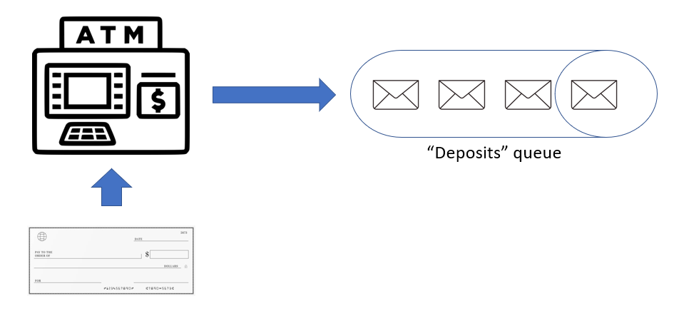
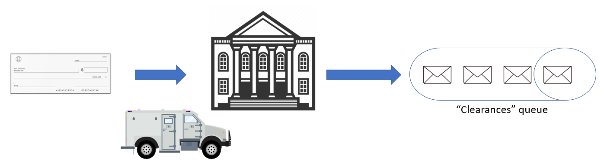
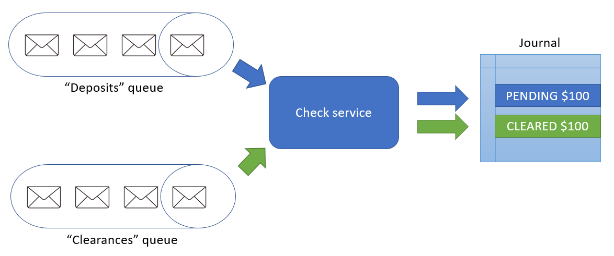

# Build the Check Processing Microservices

## Introduction

This lab walks you through the steps to build Spring Boot microservices that use Java Message Service (JMS) to send and receive asynchronous messages using Transactional Event Queues in the Oracle Database.  This service will also use service discovery to lookup and use the previously built Account service.  In this lab, we will extend the Account microservice built in the previous lab, build a new "Check Processing" microservice and another "Test Runner" microservice to help with testing.

Estimated Time: 20 minutes

### Objectives

In this lab, you will:

* Create new Spring Boot projects in your IDE
* Plan your queues and message formats
* Use Spring JMS to allow your microservice to use JMS Transactional Event Queues in the Oracle database
* Use OpenFeign to allow the Check Processing service to discover and use the Account service
* Create a "Test Runner" service to simulate the sending of messages
* Deploy your microservices into the backend

### Prerequisites (Optional)

This lab assumes you have:

* An Oracle Cloud account
* All previous labs successfully completed

## Task 1: Learn about the scenario for this lab

In the previous lab, you created an Account service that includes endpoints to create and query accounts, lookup accounts for a given customer, and so on.  In this lab you will extend that service to add some new endpoints to allow recording bank transactions, in this case check deposits, in the account journal.

In this lab, we will assume that customers can deposit a check at an Automated Teller Machine (ATM) by typing in the check amount, placing the check into a deposit envelope and then inserting that envelope into the ATM.  When this occurs, the ATM will send a "deposit" message with details of the check deposit.  You will record this as a "pending" deposit in the account journal.



Later, imagine that the deposit envelop arrives at a back office check processing facility where a person checks the details are correct, and then "clears" the check.  When this occurs, a "clearance" message will be sent.  Upon receiving this message, you will change the "pending" transaction to a finalized "deposit" in the account journal.



You will implement this using three microservices:

* The Account service you created in the previous lab will have the endpoints to manipulate journal entries
* A new "Check Processing" service will listen for messages and process them by calling calling the appropriate endpoints on the Account service
* A "Test Runner" service will simulate the ATM and the back office and allow you to send the "deposit" and "clearance" messages to test your other services



## Task 2: Update the Account service to add the Journal

Starting with the account service that you built in the previous lab, you will the the JPA model and repository for the journal and some new endpoints.

1. Create the Journal model

   Create a new Java file in `src/main/java/com/example/accounts/model` called `Journal.java`.  In this class you can define the fields that make up the journal.  Note that you created the Journal table in the previous lab. You will not use the `lraId` and `lraState` fields until the next lab. To simplify this lab, create an additional constructor that defaults those fields to suitable values. Your new class should look like this:

    ```java
    <copy>package com.example.accounts.model;

    import javax.persistence.Column;
    import javax.persistence.Entity;
    import javax.persistence.GeneratedValue;
    import javax.persistence.GenerationType;
    import javax.persistence.Id;
    import javax.persistence.Table;

    import lombok.Data;
    import lombok.NoArgsConstructor;

    @Entity
    @Table(name = "JOURNAL")
    @Data
    @NoArgsConstructor
    public class Journal {

        @Id
        @GeneratedValue(strategy = GenerationType.IDENTITY)
        @Column(name = "JOURNAL_ID")
        private long journalId;

        // type is withdraw or deposit
        @Column(name = "JOURNAL_TYPE")
        private String journalType;

        @Column(name = "ACCOUNT_ID")
        private long accountId;

        @Column(name = "LRA_ID")
        private String lraId;

        @Column(name = "LRA_STATE")
        private String lraState;

        @Column(name = "JOURNAL_AMOUNT")
        private long journalAmount;

        public Journal(String journalType, long accountId, long journalAmount) {
            this.journalType = journalType;
            this.accountId = accountId;
            this.journalAmount = journalAmount;
        }

        public Journal(String journalType, long accountId, long journalAmount, String lraId, String lraState) {
            this.journalType = journalType;
            this.accountId = accountId;
            this.lraId = lraId;
            this.lraState = lraState;
            this.journalAmount = journalAmount;
        }
    }</copy>
    ```

1. Create the Journal repository

   Create a new Java file in `src/main/java/com/example/accounts/repository` called `JournalRepository.java`. This should be an interface that extends `JpaRepository` and you will need to define a method to find journal entries by `accountId`. Your interface should look like this:

    ```java
    <copy>package com.example.accounts.repository;

    import java.util.List;

    import org.springframework.data.jpa.repository.JpaRepository;

    import com.example.accounts.model.Journal;

    public interface JournalRepository extends JpaRepository<Journal, Long> {
        List<Journal> findJournalByAccountId(long accountId);
    }</copy>
    ```

1. Update the `AccountController` constructor

   Update the constructor for `AccountController` so that both the repositories are injected.  You will need to create a variable to hold each.  Your updated constructor should look like this:

    ```java
    <copy>import com.example.repository.JournalRepository;
    
    // ...
    
    final AccountRepository accountRepository;
    final JournalRepository journalRepository;

    public AccountController(AccountRepository accountRepository, JournalRepository journalRepository) {
        this.accountRepository = accountRepository;
        this.journalRepository = journalRepository;
    }</copy>
    ```

1. Add new method to post entries to the journal

   Add a new HTTP POST endpoint in the `AccountRepository.java` class. The method accepts a journal entry in the request body and saves it into the database. Your new method should look like this:

    ```java
    <copy>import com.example.model.Journal;
    
    // ...
    
    @PostMapping("/account/journal")
    public ResponseEntity<Journal> postSimpleJournalEntry(@RequestBody Journal journalEntry) {
        try {
            Journal _journalEntry = journalRepository.saveAndFlush(journalEntry);
            return new ResponseEntity<>(_journalEntry, HttpStatus.CREATED);
        } catch (Exception e) {
            return new ResponseEntity<>(null, HttpStatus.INTERNAL_SERVER_ERROR);
        }
    }</copy>
    ```

1. Add new method to get journal entries

   Add a new HTTP GET endpoint in the `AccountRepository.java` class to get a list of journal entries for a given `accountId`. Your new method should look like this:

    ```java
    import com.example.accounts.repository.JournalRepository;

    <copy>@GetMapping("/account/{accountId}/journal")
    public List<Journal> getJournalEntriesForAccount(@PathVariable("accountId") long accountId) {
        return journalRepository.findJournalByAccountId(accountId);
    }</copy>
    ```

1. Add new method to update an existing journal entry

   Add a new HTTP POST endpoint to update and existing journal entry to a cleared deposit.  To do this, you set the `journalType` field to `DEPOSIT`.  Your method should accept the `journalId` as a path variable.  If the specified journal entry does not exist, return a 202 (Accepted) to indicate the message was received but there was nothing to do.  Returning a 404 (Not found) would cause an error and the message would get requeued and reprocessed, which we don't want.  Your new method should look like this:

    ```java
    <copy>@PostMapping("/account/journal/{journalId}/clear")
    public ResponseEntity<Journal> clearJournalEntry(@PathVariable long journalId) {
        try {
            Optional<Journal> data = journalRepository.findById(journalId);
            if (data.isPresent()) {
                Journal _journalEntry = data.get();
                _journalEntry.setJournalType("DEPOSIT");
                journalRepository.saveAndFlush(_journalEntry);
                return new ResponseEntity<Journal>(_journalEntry, HttpStatus.OK);
            } else {
                return new ResponseEntity<Journal>(new Journal(), HttpStatus.ACCEPTED);
            }
        } catch (Exception e) {
            return new ResponseEntity<>(null, HttpStatus.INTERNAL_SERVER_ERROR);
        }
    }</copy>
    ```

1. Build a JAR file for deployment

   Run the following command to build the JAR file.  Note that you will need to skip tests now, since you updated the `application.yaml` and it no longer points to your local test database instance.

    ```shell
    $ <copy>mvn clean package -Dmaven.test.skip=true</copy>
    ```

   The service is now ready to deploy to the backend.

1. Prepare the backend for deployment

   The Oracle Backend for Spring Boot admin service is not exposed outside of the Kubernetes cluster by default. Oracle recommends using a **kubectl** port forwarding tunnel to establish a secure connection to the admin service.

   Start a tunnel (unless you already have the tunnel running from previous labs) using this command:

    ```shell
    $ <copy>kubectl -n obaas-admin port-forward svc/obaas-admin 8080</copy>
    ```

   Start the Oracle Backend for Spring Boot CLI using this command:

    ```shell
    $ <copy>oractl</copy>
       _   _           __    _    ___
      / \ |_)  _.  _. (_    /  |   |
      \_/ |_) (_| (_| __)   \_ |_ _|_
      Application Version: 0.3.1
        :: Spring Boot (v3.0.0) ::


      oractl:>
    ```

   Connect to the Oracle Backend for Spring Boot admin service using this command.  Hit enter when prompted for a password.  **Note**: Oracle recommends changing the password in a real deployment.

    ```shell
    oractl> <copy>connect</copy>
    password (defaults to oractl):
    using default value...
    connect successful server version:0.3.1
    oractl:>
    ```

1. Redeploy the account service

  You will now redeploy your account service to the Oracle Backend for Spring Boot using the CLI.  Run this command to redeploy your service, make sure you provide the correct path to your JAR file.  **Note** that this command may take 1-3 minutes to complete:

    ```shell
    oractl:> <copy>deploy --app-name application --service-name account --artifact-path /path/to/accounts-0.0.1-SNAPSHOT.jar --image-version 0.0.1 --redeploy true</copy>
    uploading: account/target/accounts-0.0.1-SNAPSHOT.jarbuilding and pushing image...
    creating deployment and service... successfully deployed
    oractl:>
    ```

1. Verify the new endpoints in the account service

   In the next three commands, you need to provide the correct IP address for the API Gateway in your backend environment.  You can find the IP address using this command, you need the one listed in the **`EXTERNAL-IP`** column:

    ```shell
    $ <copy>kubectl -n ingress-nginx get service ingress-nginx-controller</copy>
    NAME                       TYPE           CLUSTER-IP      EXTERNAL-IP   PORT(S)                      AGE
    ingress-nginx-controller   LoadBalancer   10.123.10.127   100.20.30.40  80:30389/TCP,443:30458/TCP   13d
    ```

   Test the create journal entry endpoint (make sure you use an `accountId` that exits in your database) with this command, use the IP address for your API Gateway:

    ```shell
    $ <copy>curl -i -X POST \
          -H 'Content-Type: application/json' \
          -d '{"journalType": "PENDING", "accountId": 2, "journalAmount": 100.00, "lraId": "0", "lraState": ""}' \
          http://[EXTERNAL-IP]/api/v1/account/journal</copy>
    HTTP/1.1 201
    Date: Wed, 31 May 2023 13:02:10 GMT
    Content-Type: application/json
    Transfer-Encoding: chunked
    Connection: keep-alive

    {"journalId":21,"journalType":"PENDING","accountId":2,"lraId":"0","lraState":"","journalAmount":100}
    ```

   Notice that the response contains a `journalId` which you will need in a later command, and that the `journalType` is `PENDING`.

   Test the get journal entries endpoint with this command, use the IP address for your API Gateway and the same `accountId` as in the previous step. Your output may be different:

    ```shell
    $ <copy>curl -i http://[EXTERNAL-IP]/api/v1/account/[accountId]/journal</copy>
    HTTP/1.1 200
    Date: Wed, 31 May 2023 13:03:22 GMT
    Content-Type: application/json
    Transfer-Encoding: chunked
    Connection: keep-alive

    [{"journalId":3,"journalType":"PENDING","accountId":2,"lraId":"0","lraState":null,"journalAmount":100},{"journalId":4,"journalType":"DEPOSIT","accountId":2,"lraId":"0","lraState":null,"journalAmount":100},{"journalId":5,"journalType":"PENDING","accountId":2,"lraId":"0","lraState":null,"journalAmount":222},{"journalId":21,"journalType":"PENDING","accountId":2,"lraId":"0","lraState":null,"journalAmount":100},{"journalId":2,"journalType":"DEPOSIT","accountId":2,"lraId":"0","lraState":null,"journalAmount":100}]
    ```

   Test the update/clear journal entry endpoint with this command, use the IP address for your API Gateway and the `journalId` from the first command's response:

    ```shell
    $ <copy>curl -i -X POST http://[EXTERNAL-IP]/api/v1/account/journal/[journalId]/clear</copy>
    HTTP/1.1 200
    Date: Wed, 31 May 2023 13:04:36 GMT
    Content-Type: application/json
    Transfer-Encoding: chunked
    Connection: keep-alive

    {"journalId":2,"journalType":"DEPOSIT","accountId":2,"lraId":"0","lraState":null,"journalAmount":100}
    ```

   That completes the updates for the Account service.

## Task 3: Create the queues in the database

1. Create the queues

   Connect to the database as the `ADMIN` user and execute the following statements to give the `account` user the necessary permissions to use queues. **Note**: Lab 2, Task 9 provided details on how to connect to the database.

    ```sql
    <copy>grant execute on dbms_aq to account;
    grant execute on dbms_aqadm to account;
    grant execute on dbms_aqin to account;
    grant execute on dbms_aqjms_internal to account;
    commit;</copy>
    ```

   Now connect as the `account` user and create the queues by executing these statements (replace `[TNS-ENTRY]` with your environment information):

    ```sql
    connect account/Welcome1234##@[TNS-ENTRY];
    <copy>
    begin
        -- deposits
        dbms_aqadm.create_queue_table(
            queue_table        => 'deposits_qt',
            queue_payload_type => 'SYS.AQ$_JMS_TEXT_MESSAGE');
        dbms_aqadm.create_queue(
            queue_name         => 'deposits',
            queue_table        => 'deposits_qt');
        dbms_aqadm.start_queue(
            queue_name         => 'deposits');
        -- clearances 
        dbms_aqadm.create_queue_table(
            queue_table        => 'clearances_qt',
            queue_payload_type => 'SYS.AQ$_JMS_TEXT_MESSAGE');
        dbms_aqadm.create_queue(
            queue_name         => 'clearances',
            queue_table        => 'clearances_qt');
        dbms_aqadm.start_queue(
            queue_name         => 'clearances');
    end;
    /</copy>
    ```

   You have created two queues named `deposits` and `clearances`. Both of them use the JMS `TextMessage` format for the payload.

## Task 4: Create the Test Runner microservice

Next, you will create the "Test Runner" microservice which you will use to simulate the ATM and Back Office.  This service will send messages to the queues that you just created.

1. Create the Test Runner Spring Boot project

   Create a new directory called `testrunner` alongside your `account` directory. This new directory will hold the new Test Runner Spring Boot project.  In this directory create a file called `pom.xml` with the following content. This will be the Maven POM for this project. It is very similar to the POM for the account service, however the dependencies are slightly different. This service will use the "Web" Spring Boot Starter which will allow it to expose REST endpoints and make REST calls to other services. It also uses the two Oracle Spring Boot Starters for UCP and Wallet to access the database:

    ```xml
    <copy><?xml version="1.0" encoding="UTF-8"?>
    <project xmlns="http://maven.apache.org/POM/4.0.0" xmlns:xsi="http://www.w3.org/2001/XMLSchema-instance"
        xsi:schemaLocation="http://maven.apache.org/POM/4.0.0 https://maven.apache.org/xsd/maven-4.0.0.xsd">
        <modelVersion>4.0.0</modelVersion>
        <parent>
            <groupId>org.springframework.boot</groupId>
            <artifactId>spring-boot-starter-parent</artifactId>
            <version>2.7.12</version>
            <relativePath/> <!-- lookup parent from repository -->
        </parent>

        <groupId>com.example</groupId>
        <artifactId>testrunner</artifactId>
        <version>0.0.1-SNAPSHOT</version>
        <name>testrunner</name>
        <description>Test Runner Application</description>

        <properties>
            <java.version>17</java.version>
        </properties>

        <dependencies>
            <dependency>
                <groupId>org.springframework.boot</groupId>
                <artifactId>spring-boot-starter-web</artifactId>
            </dependency>
            <dependency>
                <groupId>com.oracle.database.spring</groupId>
                <artifactId>oracle-spring-boot-starter-aqjms</artifactId>
                <version>2.7.7</version>
            </dependency>
            <dependency>
                <groupId>com.oracle.database.spring</groupId>
                <artifactId>oracle-spring-boot-starter-wallet</artifactId>
                <type>pom</type>
                <version>2.7.7</version>
            </dependency>
            <dependency>
                <groupId>org.projectlombok</groupId>
                <artifactId>lombok</artifactId>
            </dependency>
        </dependencies>

        <build>
            <plugins>
                <plugin>
                    <groupId>org.springframework.boot</groupId>
                    <artifactId>spring-boot-maven-plugin</artifactId>
                </plugin>
            </plugins>
        </build>

    </project></copy>
    ```

1. Create the Spring Boot application YAML file

   In the `testrunner` directory, create a new directory called `src/main/resources` and in that directory, create a file called `application.yaml` with the following content:

    ```yaml
    <copy>spring:
      application:
        name: testrunner

    oracle:
      aq:
        url: ${spring.datasource.url}
        username: ${spring.datasource.username}
        password: ${spring.datasource.password}</copy>
    ```

   This is the Spring Boot application YAML file, which contains the configuration information for this service.  In this case, you only need to provide the application name and the connection details for the database hosting the queues.  **Note**: the connection details are the same as those you used for JPA in the previous lab, but there are provided under a different name (`oracle.aq`) in this case.

1. Create the main Spring Application class

   In the `testrunner` directory, create a new directory called `src/main/java/com/example/testrunner` and in that directory, create a new Java file called `TestrunnerApplication.java` with this content.  This is a standard Spring Boot main class, notice the `SpringBootApplication` annotation on the class.  It also has the `EnableJms` annotation which tells Spring Boot to enable JMS functionality in this application.  The `main` method is a normal Spring Boot main method:

    ```java
    <copy>package com.example.testrunner;

    import javax.jms.ConnectionFactory;

    import org.springframework.boot.SpringApplication;
    import org.springframework.boot.autoconfigure.SpringBootApplication;
    import org.springframework.context.annotation.Bean;
    import org.springframework.jms.annotation.EnableJms;
    import org.springframework.jms.core.JmsTemplate;
    import org.springframework.jms.support.converter.MappingJackson2MessageConverter;
    import org.springframework.jms.support.converter.MessageConverter;
    import org.springframework.jms.support.converter.MessageType;

    @SpringBootApplication
    @EnableJms
    public class TestrunnerApplication {

        public static void main(String[] args) {
            SpringApplication.run(TestrunnerApplication.class, args);
        }
    
        // Serialize message content to json using TextMessage
        @Bean 
        public MessageConverter jacksonJmsMessageConverter() {
            MappingJackson2MessageConverter converter = new MappingJackson2MessageConverter();
            converter.setTargetType(MessageType.TEXT);
            converter.setTypeIdPropertyName("_type");
            return converter;
        }

        @Bean 
        public JmsTemplate jmsTemplate(ConnectionFactory connectionFactory) {
            JmsTemplate jmsTemplate = new JmsTemplate();
            jmsTemplate.setConnectionFactory(connectionFactory);
            jmsTemplate.setMessageConverter(jacksonJmsMessageConverter());
            return jmsTemplate;
        }

    }</copy>
    ```

   In addition to the standard parts of a Spring Boot application class, you will add two beans that will be needed in this service.  First, you need a `MessageConverter` bean so that you can convert a Java object (POJO) into JSON format, and vice versa. This bean will be used to serialize and deserialize the objects you need to write onto the queues.

   The second bean you need is a `JmsTemplate`. This is a standard Spring JMS bean that is used to access JMS functionality.  You will use this bean to enqueue messages. Notice that this bean is configured to use the `MessageConverter` bean and that the JMS `ConnectionFactory` is injected. The Oracle Spring Boot Starter for AQ/JMS will create the JMS `ConnectionFactory` for you.

   **Note**: The Oracle Spring Boot Starter for AQ/JMS will also inject a JDBC `Connection` bean which shares the same database transaction with the JMS `ConnectionFactory`. This is not needed in this lab.  The shared transaction enables you to write methods which can perform both JMS and JPA operations in an atomic transaction, which can be very helpful in some use cases and can dramatically reduce the amount of code needed to handle situations like duplicate message delivery or lost messages.

1. Create the model classes

   Create a new directory called `src/main/java/com/example/testrunner/model` and in this directory create two Java files. First, `CheckDeposit.java` with this content. This class will be used to simulate the ATM sending the "deposit" notification:

    ```java
    <copy>package com.example.testrunner.model;

    import lombok.AllArgsConstructor;
    import lombok.Data;
    import lombok.NoArgsConstructor;

    @Data
    @AllArgsConstructor
    @NoArgsConstructor
    public class CheckDeposit {
        private long accountId;
        private long amount;
    }</copy>
    ```

   Next, `Clearance.java` with this content. This class will be used to simulate the Back Office sending the "clearance" notification:

    ```java
    <copy>package com.example.testrunner.model;

    import lombok.AllArgsConstructor;
    import lombok.Data;
    import lombok.NoArgsConstructor;

    @Data
    @AllArgsConstructor
    @NoArgsConstructor
    public class Clearance {
        private long journalId;
    }</copy>   
    ```

1. Create the controller

   Create a new directory called `src/main/java/com/example/testrunner/controller` and in this directory create a new Java file called `TestRunnerController.java` with the following content. This class will have the `RestController` annotation so that it can expose REST APIs that you can call to trigger the simulation of the ATM and Back Office notifications. It will need the `JmsTemplate` to access JMS functionality, this can be injected with the `AutoWired` annotation. Create two methods, one to send each notification:

    ```java
    <copy>package com.example.testrunner.controller;

    import org.springframework.beans.factory.annotation.Autowired;
    import org.springframework.http.HttpStatus;
    import org.springframework.http.ResponseEntity;
    import org.springframework.jms.core.JmsTemplate;
    import org.springframework.web.bind.annotation.PostMapping;
    import org.springframework.web.bind.annotation.RequestBody;
    import org.springframework.web.bind.annotation.RequestMapping;
    import org.springframework.web.bind.annotation.RestController;

    import com.example.testrunner.model.CheckDeposit;
    import com.example.testrunner.model.Clearance;

    @RestController
    @RequestMapping("/api/v1/testrunner")
    public class TestRunnerController {

        @Autowired
        private JmsTemplate jmsTemplate;
        
        @PostMapping("/deposit")
        public ResponseEntity<CheckDeposit> depositCheck(@RequestBody CheckDeposit deposit) {       
            jmsTemplate.convertAndSend("deposits", deposit);
            return new ResponseEntity<CheckDeposit>(deposit, HttpStatus.CREATED);
        }

        @PostMapping("/clear")
        public ResponseEntity<Clearance> clearCheck(@RequestBody Clearance clearance) {
            jmsTemplate.convertAndSend("clearances", clearance);
            return new ResponseEntity<Clearance>(clearance, HttpStatus.CREATED);
        }

    }</copy>
    ```

1. Build a JAR file for deployment

   Run the following command to build the JAR file.

    ```shell
    $ <copy>mvn clean package -Dmaven.test.skip=true</copy>
    ```

   The service is now ready to deploy to the backend.

1. Prepare the backend for deployment

   The Oracle Backend for Spring Boot admin service is not exposed outside of the Kubernetes cluster by default. Oracle recommends using a **kubectl** port forwarding tunnel to establish a secure connection to the admin service.

   Start a tunnel using this command:

    ```shell
    $ <copy>kubectl -n obaas-admin port-forward svc/obaas-admin 8080:8080</copy>
    ```

   Start the Oracle Backend for Spring Boot CLI using this command:

    ```shell
    $ <copy>oractl</copy>
       _   _           __    _    ___
      / \ |_)  _.  _. (_    /  |   |
      \_/ |_) (_| (_| __)   \_ |_ _|_
      Application Version: 0.3.1
        :: Spring Boot (v3.0.0) ::


      oractl:>
    ```

   Connect to the Oracle Backend for Spring Boot admin service using this command. Hit enter when prompted for a password. **Note**: Oracle recommends changing the password in a real deployment.

    ```shell
    oractl> <copy>connect</copy>
    password (defaults to oractl):
    using default value...
    connect successful server version:0.3.1
    oractl:>
    ```

1. Create a binding for the Test Runner service

   Create a binding so the Test Runner service can access the Oracle Autonomous Database as the `account` user. Run this command to create the binding, and type in the password for the `account` user when prompted. The password is `Welcome1234##`):

    ```shell
    oractl:> <copy>bind --app-name application --service-name testrunner --username account</copy>
    ```

1. Deploy the Test Runner service

  You will now deploy your Test Runner service to the Oracle Backend for Spring Boot using the CLI. Run this command to deploy your service, make sure you provide the correct path to your JAR file. **Note** that this command may take 1-3 minutes to complete:

    ```shell
    oractl:> <copy>deploy --app-name application --service-name testrunner --artifact-path /path/to/testrunner-0.0.1-SNAPSHOT.jar --image-version 0.0.1</copy>
    uploading: testrunner/target/testrunner-0.0.1-SNAPSHOT.jarbuilding and pushing image...
    creating deployment and service... successfully deployed
    oractl:>
    ```

   You can close the port forwarding session for the CLI now (just type a Ctrl+C in its console window).

1. Check that the `testrunner` service is running

    Verify that the testrunner application is up and running by running this command:

    ```shell
    $ <copy>kubectl logs -n application svc/testrunner</copy>
    ```

    The output should be similar to this, look for `Started TestrunnerApplication`

    ```text
    2023-06-02 15:18:39.620  INFO 1 --- [           main] w.s.c.ServletWebServerApplicationContext : Root WebApplicationContext: initialization completed in 1806 ms
    2023-06-02 15:18:40.915  INFO 1 --- [           main] o.s.b.w.embedded.tomcat.TomcatWebServer  : Tomcat started on port(s): 8080 (http) with context path ''
    2023-06-02 15:18:40.938  INFO 1 --- [           main] c.e.testrunner.TestrunnerApplication     : Started TestrunnerApplication in 4.174 seconds (JVM running for 5.237)
    ```

1. Test the endpoints

   The Test Runner service is not exposed outside your Kubernetes cluster, so you must create a port-forwarding tunnel to access it. Create a tunnel using this command:

    ```shell
    $ <copy>kubectl -n application port-forward svc/testrunner 8080</copy>
    ```

   Call the deposit endpoint to send a deposit notification using this command:

    ```shell
    $ <copy>curl -i -X POST -H 'Content-Type: application/json' -d '{"accountId": 2, "amount": 200}' http://localhost:8080/api/v1/testrunner/deposit</copy>
    HTTP/1.1 201
    Date: Wed, 31 May 2023 15:11:55 GMT
    Content-Type: application/json
    Transfer-Encoding: chunked
    Connection: keep-alive

    {"accountId":2,"amount":200}
    ```

   Call the clear endpoint to send a clearance notification using this command. Note that you can use any `journalId` since there is nothing receiving and processing these messages yet:

    ```shell
    $ <copy>curl -i -X POST -H 'Content-Type: application/json' -d '{"journalId": 4}' http://localhost:8080/api/v1/testrunner/clear</copy>
    HTTP/1.1 201
    Date: Wed, 31 May 2023 15:12:54 GMT
    Content-Type: application/json
    Transfer-Encoding: chunked
    Connection: keep-alive

    {"journalId":4}
    ```

1. Verify the expected messages are on the queues

   Connect to the database as the `account` (password `Welcome12343##`) and issue this SQL statement to check the payloads of the messages on the deposits queue:

    ```sql
    SQL> <copy>select qt.user_data.text_vc from deposits_qt qt;</copy>

    USER_DATA.TEXT_VC
    _______________________________
    {"accountId":2,"amount":200}
    ```

   Issue this SQL statement to check the payloads of the messages on the clearances queue:

    ```sql
    SQL> <copy>select qt.user_data.text_vc from clearances_qt qt;</copy>

    USER_DATA.TEXT_VC
    ____________________
    {"journalId":4}
    ```

   That completes the Test Runner service. Next, you will build the Check Processing service which will receive these messages and process them.

## Task 5: Create the Check Processing microservice

Next, you will create the "Check Processing" microservice which you will receive messages from the ATM and Back Office and process them by calling the appropriate endpoints on the Account service. This service will also introduce the use of service discovery using [OpenFeign](https://spring.io/projects/spring-cloud-openfeign) clients.

1. Create the Check Processing Spring Boot project

   Create a new directory called `checks` alongside your `account` directory.  This new directory will hold the new Test Runner Spring Boot project.  In this directory create a file called `pom.xml` with the following content.  This will be the Maven POM for this project.  It is very similar to the POM for the account and test runner services, however the dependencies are slightly different.  This service will use the "Web" Spring Boot Starter which will allow it to expose REST endpoints and make REST calls to other services.  It also uses the two Oracle Spring Boot Starters for UCP and Wallet to access the database. You will also add the Eureka client and [OpenFeign](https://spring.io/projects/spring-cloud-openfeign) dependencies to allow service discovery and client side load balancing:

    ```xml
    <copy><?xml version="1.0" encoding="UTF-8"?>
    <project xmlns="http://maven.apache.org/POM/4.0.0"
        xmlns:xsi="http://www.w3.org/2001/XMLSchema-instance"
        xsi:schemaLocation="http://maven.apache.org/POM/4.0.0 https://maven.apache.org/xsd/maven-4.0.0.xsd">
        <modelVersion>4.0.0</modelVersion>
        <parent>
            <groupId>org.springframework.boot</groupId>
            <artifactId>spring-boot-starter-parent</artifactId>
            <version>2.7.12</version>
            <relativePath /> <!-- lookup parent from repository -->
        </parent>

        <groupId>com.example</groupId>
        <artifactId>checks</artifactId>
        <version>0.0.1-SNAPSHOT</version>
        <name>checks</name>
        <description>Check Processing Application</description>

        <properties>
            <java.version>17</java.version>
        </properties>

        <dependencies>
            <dependency>
                <groupId>org.springframework.boot</groupId>
                <artifactId>spring-boot-starter-web</artifactId>
            </dependency>
            <dependency>
                <groupId>com.oracle.database.spring</groupId>
                <artifactId>oracle-spring-boot-starter-aqjms</artifactId>
                <version>2.7.7</version>
            </dependency>
            <dependency>
                <groupId>com.oracle.database.spring</groupId>
                <artifactId>oracle-spring-boot-starter-wallet</artifactId>
                <type>pom</type>
                <version>2.7.7</version>
            </dependency>

            <dependency>
                <groupId>org.springframework.cloud</groupId>
                <artifactId>spring-cloud-starter-netflix-eureka-client</artifactId>
                <version>3.1.6</version>
            </dependency>
            <dependency>
                <groupId>org.springframework.cloud</groupId>
                <artifactId>spring-cloud-starter-openfeign</artifactId>
                <version>3.1.6</version>
            </dependency>

            <dependency>
                <groupId>org.projectlombok</groupId>
                <artifactId>lombok</artifactId>
            </dependency>
        </dependencies>

        <build>
            <plugins>
                <plugin>
                    <groupId>org.springframework.boot</groupId>
                    <artifactId>spring-boot-maven-plugin</artifactId>
                </plugin>
            </plugins>
        </build>

    </project></copy>
    ```

1. Create the Spring Boot application YAML file

   In the `checks` directory, create a new directory called `src/main/resources` and in that directory, create a file called `application.yaml` with the following content:

    ```yaml
    <copy>spring:
      application:
        name: checks

    oracle:
      aq:
        url: ${spring.datasource.url}
        username: ${spring.datasource.username}
        password: ${spring.datasource.password}</copy>
    ```

   This is the Spring Boot application YAML file, which contains the configuration information for this service.  In this case, you only need to provide the application name and the connection details for the database hosting the queues. **Note**: the connection details are the same as those you used for JPA in the previous lab, but there are provided under a different name (`oracle.aq`) in this case.

1. Create the main Spring Application class

   In the `checks` directory, create a new directory called `src/main/java/com/example/checks` and in that directory, create a new Java file called `ChecksApplication.java` with this content.  This is a standard Spring Boot main class, notice the `SpringBootApplication` annotation on the class.  It also has the `EnableJms` annotation which tells Spring Boot to enable JMS functionality in this application.  The `main` method is a normal Spring Boot main method:

    ```java
    <copy>package com.example.checks;

    import javax.jms.ConnectionFactory;

    import org.springframework.boot.SpringApplication;
    import org.springframework.boot.autoconfigure.SpringBootApplication;
    import org.springframework.boot.autoconfigure.jms.DefaultJmsListenerContainerFactoryConfigurer;
    import org.springframework.cloud.openfeign.EnableFeignClients;
    import org.springframework.context.annotation.Bean;
    import org.springframework.jms.annotation.EnableJms;
    import org.springframework.jms.config.DefaultJmsListenerContainerFactory;
    import org.springframework.jms.config.JmsListenerContainerFactory;
    import org.springframework.jms.core.JmsTemplate;
    import org.springframework.jms.support.converter.MappingJackson2MessageConverter;
    import org.springframework.jms.support.converter.MessageConverter;
    import org.springframework.jms.support.converter.MessageType;

    @SpringBootApplication
    @EnableFeignClients
    @EnableJms
    public class ChecksApplication {

        public static void main(String[] args) {
            SpringApplication.run(ChecksApplication.class, args);
        }
    
        @Bean // Serialize message content to json using TextMessage
        public MessageConverter jacksonJmsMessageConverter() {
            MappingJackson2MessageConverter converter = new MappingJackson2MessageConverter();
            converter.setTargetType(MessageType.TEXT);
            converter.setTypeIdPropertyName("_type");
            return converter;
        }

        @Bean 
        public JmsTemplate jmsTemplate(ConnectionFactory connectionFactory) {
            JmsTemplate jmsTemplate = new JmsTemplate();
            jmsTemplate.setConnectionFactory(connectionFactory);
            jmsTemplate.setMessageConverter(jacksonJmsMessageConverter());
            return jmsTemplate;
        }

        @Bean
        public JmsListenerContainerFactory<?> factory(ConnectionFactory connectionFactory,
                                DefaultJmsListenerContainerFactoryConfigurer configurer) {
            DefaultJmsListenerContainerFactory factory = new DefaultJmsListenerContainerFactory();
            // This provides all boot's default to this factory, including the message converter
            configurer.configure(factory, connectionFactory);
            // You could still override some of Boot's default if necessary.
            return factory;
        }

    }</copy>
    ```  

   As in the Test Runner service, you will also need the `MessageConverter` and `JmsTemplate` beans.  You will also need an additional bean in this service, the `JmsListenerConnectionFactory`.  This bean will be used to create listeners that receive messages from JMS queues.  Note that the JMS `ConnectionFactory` is injected as in the Test Runner service.

1. Create the model classes

   Create a directory called `src/main/java/com/example/testrunner/model` and in that directory create the two model classes.  

   **Note**: These are in the `testrunner` package, not the `checks` package!  The classes used for serialization and deserialization of the messages need to be the same so that the `MessageConverter` knows what to do.

   First, `CheckDeposit.java` with this content:

    ```java
    <copy>package com.example.testrunner.model;

    import lombok.AllArgsConstructor;
    import lombok.Data;
    import lombok.Getter;
    import lombok.NoArgsConstructor;
    import lombok.Setter;
    import lombok.ToString;

    @Data
    @AllArgsConstructor
    @NoArgsConstructor
    @Getter
    @Setter
    @ToString
    public class CheckDeposit {
        private long accountId;
        private long amount;
    }</copy>
    ```

   And then, `Clearance.java` with this content:

    ```java
    <copy>package com.example.testrunner.model;

    import lombok.AllArgsConstructor;
    import lombok.Data;
    import lombok.Getter;
    import lombok.NoArgsConstructor;
    import lombok.Setter;
    import lombok.ToString;

    @Data
    @AllArgsConstructor
    @NoArgsConstructor
    @Getter
    @Setter
    @ToString
    public class Clearance {
        private long journalId;
    }</copy>
    ```

1. Create the OpenFeign clients

    > **OpenFeign**
    > In this step you will use OpenFeign to create a client.  OpenFeign allows you to lookup an instance of a service from the Spring Eureka Service Registry using its key/identifier, and will create a client for you to call endpoints on that service.  It also provides client-side load balancing.  This allows you to easily create REST clients without needing to know the address of the service or how many instances are running.

   Create a directory called `src/main/java/com/example/checks/clients` and in this directory create a new Java interface called `AccountClient.java` to define the OpenFeign client for the account service. Here is the content:

    ```java
    <copy>package com.example.checks.clients;

    import org.springframework.cloud.openfeign.FeignClient;
    import org.springframework.web.bind.annotation.PathVariable;
    import org.springframework.web.bind.annotation.PostMapping;
    import org.springframework.web.bind.annotation.RequestBody;

    @FeignClient("accounts")
    public interface AccountClient {
        
        @PostMapping("/api/v1/account/journal")
        void journal(@RequestBody Journal journal);

        @PostMapping("/api/v1/account/journal/{journalId}/clear")
        void clear(@PathVariable long journalId);

    }</copy>
    ```

   In the interface, you define methods for each of the endpoints you want to be able to call.  As you see, you specify the request type with an annotation, the endpoint path, and you can specify path variables and the body type.  You will need to define the `Journal` class.

   In the same directory, create a Java class called `Journal.java` with the following content:

    ```java
    <copy>package com.example.checks.clients;

    import lombok.AllArgsConstructor;
    import lombok.Data;
    import lombok.NoArgsConstructor;

    @Data
    @AllArgsConstructor
    @NoArgsConstructor
    public class Journal {
        private long journalId;
        private String journalType;
        private long accountId;
        private String lraId;
        private String lraState;
        private long journalAmount;

        public Journal(String journalType, long accountId, long journalAmount) {
            this.journalType = journalType;
            this.accountId = accountId;
            this.journalAmount = journalAmount;
            this.lraId = "0";
            this.lraState = "";
        }
    }</copy>
    ```

   **Note**:  The `lraId` and `lraState` field are set to reasonable default values, since we are not going to be using those fields in this lab.

1. Create the services

   Next, you will create a service to implement the methods defined in the OpenFeign client interface.  Create a directory called `src/main/java/com/example/checks/service` and in that directory create a Java class called `AccountService.java` with this content.  The services are very simple, you just need to use the `accountClient` to call the appropriate endpoint on the Account service and pass through the data. **Note** the `AccountClient` will be injected by Spring Boot because of the `RequiredArgsConstructor` annotation, which saves some boilerplate constructor code:

    ```java
    <copy>package com.example.checks.service;

    import org.springframework.stereotype.Service;

    import com.example.checks.clients.AccountClient;
    import com.example.checks.clients.Journal;
    import com.example.testrunner.model.Clearance;

    import lombok.RequiredArgsConstructor;

    @Service
    @RequiredArgsConstructor
    public class AccountService {
        
        private final AccountClient accountClient;

        public void journal(Journal journal) {
            accountClient.journal(journal);
        }

        public void clear(Clearance clearance) {
            accountClient.clear(clearance.getJournalId());
        }

    }</copy>
    ```

1. Create the Check Receiver controller

   This controller will receive messages on the `deposits` JMS queue and process them by calling the `journal` method in the `AccountService` that you just created, which will make a REST POST to the Account service, which in turn will write the journal entry into the accounts database.

   Create a directory called `src/main/java/com/example/checks/controller` and in that directory, create a new Java class called `CheckReceiver.java` with the following content.  You will need to inject an instance of the `AccountService` (in this example the constructor is provided so you can compare to the annotation used previously). Implement a method to receive and process the messages. To receive messages from the queues, use the `JmsListener` annotation and provide the queue and factory names. This method should call the `journal` method on the `AccountService` and pass through the necessary data.  Also, notice that you need to add the `Component` annotation to the class so that Spring Boot will load an instance of it into the application:

    ```java
    <copy>package com.example.checks.controller;

    import org.springframework.jms.annotation.JmsListener;
    import org.springframework.stereotype.Component;

    import com.example.checks.clients.Journal;
    import com.example.checks.service.AccountService;
    import com.example.testrunner.model.CheckDeposit;

    @Component
    public class CheckReceiver {

        private AccountService accountService;

        public CheckReceiver(AccountService accountService) {
            this.accountService = accountService;
        }

        @JmsListener(destination = "deposits", containerFactory = "factory")
        public void receiveMessage(CheckDeposit deposit) {
            System.out.println("Received deposit <" + deposit + ">");
            accountService.journal(new Journal("PENDING", deposit.getAccountId(), deposit.getAmount()));
        }

    }</copy>
    ```

1. Create the Clearance Receiver controller

   In the same directory, create another Java class called `ClearanceReceiver.java` with the following content.  This is very similar to the previous controller, but listens to the `clearances` queue instead, and calls the `clear` method on the `AccountService`:

    ```java
    <copy>package com.example.checks.controller;

    import org.springframework.jms.annotation.JmsListener;
    import org.springframework.stereotype.Component;

    import com.example.checks.service.AccountService;
    import com.example.testrunner.model.Clearance;

    @Component
    public class ClearanceReceiver {

        private AccountService accountService;

        public ClearanceReceiver(AccountService accountService) {
            this.accountService = accountService;
        }

        @JmsListener(destination = "clearances", containerFactory = "factory")
        public void receiveMessage(Clearance clearance) {
            System.out.println("Received clearance <" + clearance + ">");
            accountService.clear(clearance);
        }

    }</copy>
    ```

   That completes the Check Processing service.  Now you can deploy and test it.

1. Build a JAR file for deployment

   Run the following command to build the JAR file.

    ```shell
    $ <copy>mvn clean package -Dmaven.test.skip=true</copy>
    ```

   The service is now ready to deploy to the backend.

1. Prepare the backend for deployment

   The Oracle Backend for Spring Boot admin service is not exposed outside of the Kubernetes cluster by default. Oracle recommends using a **kubectl** port forwarding tunnel to establish a secure connection to the admin service.

   Start a tunnel using this command:

    ```shell
    $ <copy>kubectl -n obaas-admin port-forward svc/obaas-admin 8080:8080</copy>
    ```

   Start the Oracle Backend for Spring Boot CLI using this command:

    ```shell
    $ <copy>oractl</copy>
       _   _           __    _    ___
      / \ |_)  _.  _. (_    /  |   |
      \_/ |_) (_| (_| __)   \_ |_ _|_
      Application Version: 0.3.1
        :: Spring Boot (v3.0.0) ::


      oractl:>
    ```

   Connect to the Oracle Backend for Spring Boot admin service using this command.  Hit enter when prompted for a password.  **Note**: Oracle recommends changing the password in a real deployment.

    ```shell
    oractl> <copy>connect</copy>
    password (defaults to oractl):
    using default value...
    connect successful server version:0.3.1
    oractl:>
    ```

1. Create a binding for the Test Runner service

   Create a binding so the Test Runner service can access the Oracle Autonomous Database as the `account` user. Run this command to create the binding, and type in the password for the `account` user when prompted. The password is `Welcome1234##`:

    ```shell
    oractl:> <copy>bind --app-name application --service-name checks --username account</copy>
    ```

1. Deploy the Test Runner service

  You will now deploy your Test Runner service to the Oracle Backend for Spring Boot using the CLI.  Run this command to deploy your service, make sure you provide the correct path to your JAR file.  **Note** that this command may take 1-3 minutes to complete:

    ```shell
    oractl:> <copy>deploy --app-name application --service-name checks --artifact-path /path/to/checks-0.0.1-SNAPSHOT.jar --image-version 0.0.1</copy>
    uploading: checks/target/checks-0.0.1-SNAPSHOT.jarbuilding and pushing image...
    creating deployment and service... successfully deployed
    oractl:>
    ```

   You can close the port forwarding session for the CLI now (just type a Ctrl+C in its console window).

1. Testing the service

   Since you had messages already sitting on the queues, the service should process those as soon as it starts.  You can check the service logs to see the log messages indicating this happened using this command:

    ```shell
    $ <copy>kubectl -n application logs svc/checks</copy>
    ( ... lines omitted ...)
    Received deposit <CheckDeposit(accountId=2, amount=200)>
    Received clearance <Clearance(journalId=4)>
    ( ... lines omitted ...)
    ```

   You can also look at the journal table in the database to see the results.

## Task 6: Test the end-to-end flow

Now you can test the full end-to-end flow for the Check Processing scenario.

1. Simulate a check deposit

   The Test Runner service is not exposed outside your Kubernetes cluster, so you must create a port-forwarding tunnel to access it.  Create a tunnel using this command:

    ```shell
    $ <copy>kubectl -n application port-forward svc/testrunner 8080</copy>
    ```

   Simulate a check being deposited at the ATM using the Test Runner service:

    ```shell
    $ <copy>curl -i -X POST -H 'Content-Type: application/json' -d '{"accountId": 2, "amount": 256}' http://localhost:8080/api/v1/testrunner/deposit</copy>
    HTTP/1.1 201
    Date: Wed, 31 May 2023 15:11:55 GMT
    Content-Type: application/json
    Transfer-Encoding: chunked
    Connection: keep-alive

    {"accountId":2,"amount":256}
    ```

1. Check the logs for the Check Processing service

   Check the logs for the Check Processing service using this command.  You should see a log message indicating that the message was received and processed:

    ```shell
    $ <copy>kubectl -n application logs svc/checks</copy>
    ( ... lines omitted ...)
    Received deposit <CheckDeposit(accountId=2, amount=256)>
    ( ... lines omitted ...)
    ```

1. Check the journal entries for this account

   In the next commands, you need to provide the correct IP address for the API Gateway in your backend environment.  You can find the IP address using this command, you need the one listed in the `EXTERNAL-IP` column:

    ```shell
    $ <copy>kubectl -n ingress-nginx get service ingress-nginx-controller</copy>
    NAME                       TYPE           CLUSTER-IP      EXTERNAL-IP   PORT(S)                      AGE
    ingress-nginx-controller   LoadBalancer   10.123.10.127   100.20.30.40  80:30389/TCP,443:30458/TCP   13d
    ```

   Use this command to retrieve the journal entries for this account.  Your output may contain more entries.  Find the entry corresponding to the deposit you just simulated (it was for $256) and note the `journalId` - you will need it in the next step:

    ```shell
    $ <copy>curl -i http://100.20.30.40/api/v1/account/2/journal</copy>
    HTTP/1.1 200
    Date: Wed, 31 May 2023 13:03:22 GMT
    Content-Type: application/json
    Transfer-Encoding: chunked
    Connection: keep-alive

    [{"journalId":6,"journalType":"PENDING","accountId":2,"lraId":"0","lraState":null,"journalAmount":256}]
    ```

1. Simulate the Back Office clearance of that check

   Using the `journalId` you received in the output of the previous command (in this example it is `6`), update and then run this command to simulate the Back Office clearing that check:

    ```shell
    $ <copy>curl -i -X POST -H 'Content-Type: application/json' -d '{"journalId": 6}' http://localhost:8080/api/v1/testrunner/clear</copy>
    HTTP/1.1 201
    Date: Wed, 31 May 2023 15:12:54 GMT
    Content-Type: application/json
    Transfer-Encoding: chunked
    Connection: keep-alive

    {"journalId":6}
    ```

1. Check the logs for the Check Processing service

   Check the logs for the Check Processing service using this command.  You should see a log message indicating that the message was received and processed:

    ```shell
    $ <copy>kubectl -n application logs svc/checks</copy>
    ( ... lines omitted ...)
    Received clearance <Clearance(journalId=6)>
    ( ... lines omitted ...)
    ```

1. Retrieve the journal entries again

   Retrieve the journal entries again to confirm the `PENDING` entry was updated to a `DEPOSIT`:

    ```shell
    $ <copy>curl -i http://100.20.30.40/api/v1/account/2/journal</copy>
    HTTP/1.1 200
    Date: Wed, 31 May 2023 13:03:22 GMT
    Content-Type: application/json
    Transfer-Encoding: chunked
    Connection: keep-alive

    [{"journalId":6,"journalType":"DEPOSIT","accountId":2,"lraId":"0","lraState":null,"journalAmount":256}]
    ```

   That completes this lab, congratulations, you learned how to use JMS to create loosely coupled services that process asynchronous messages, and also how to use service discovery with OpenFeign.

## Learn More

* [Oracle Backend for Spring Boot](https://oracle.github.io/microservices-datadriven/spring/)
* [Oracle Backend for Parse Platform](https://oracle.github.io/microservices-datadriven/mbaas/)
* [Kubernetes](https://kubernetes.io/docs/home/)
* [Apache APISIX](https://apisix.apache.org)
* [Oracle Cloud Infrastructure](https://docs.oracle.com/en-us/iaas/Content/home.htm)

## Acknowledgements

* **Author** - Mark Nelson, Developer Evangelist, Oracle Database
* **Contributors** - [](var:contributors)
* **Last Updated By/Date** - Mark Nelson, June 2023
