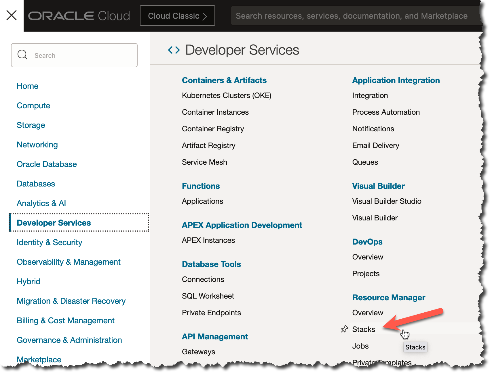
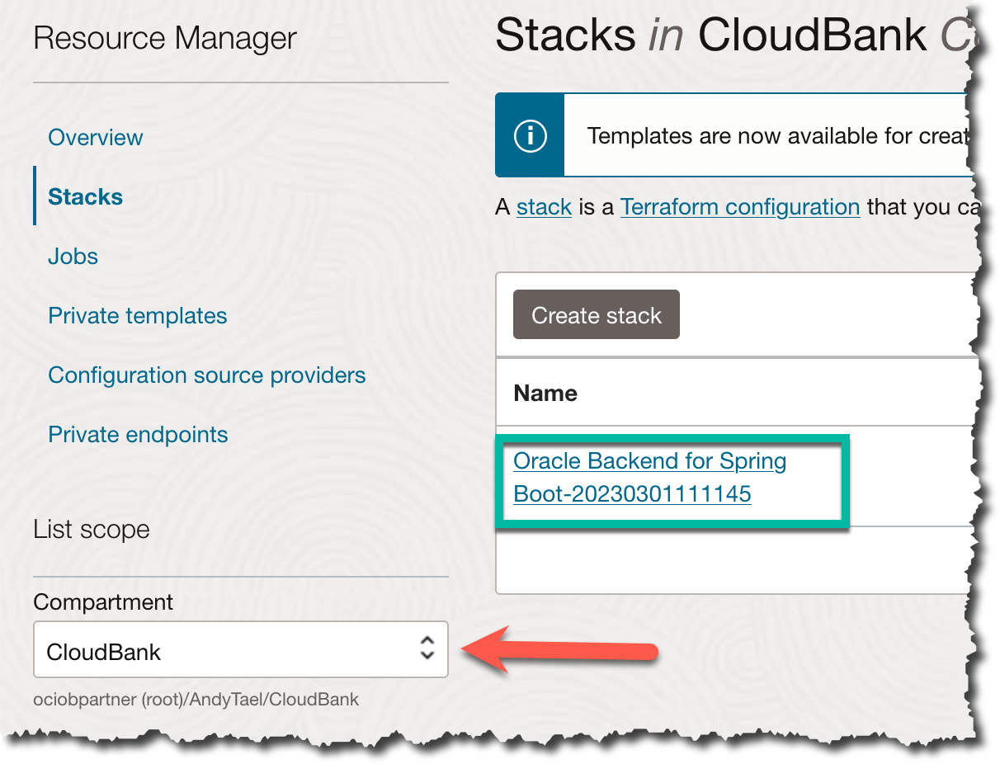
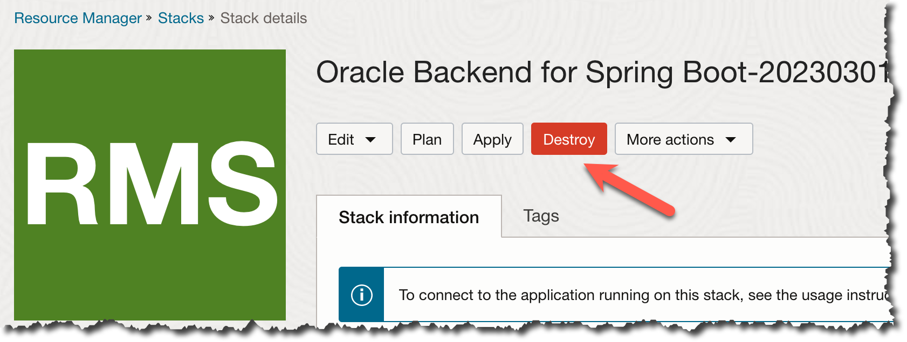
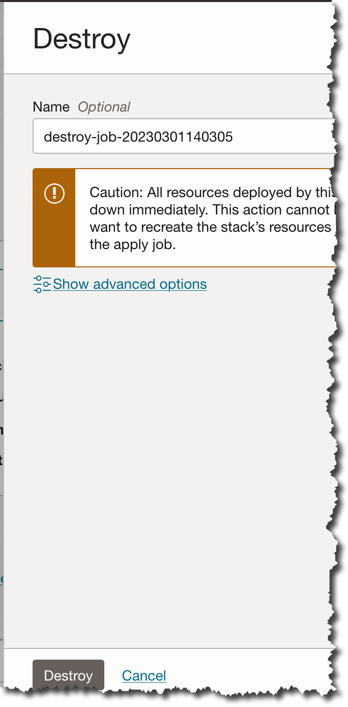
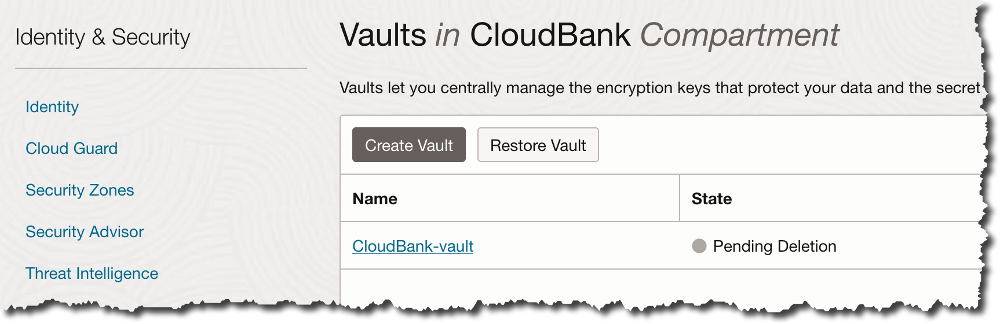

# Clean up

When you have finished this Live Lab you may wish to clean up the resources you created.  If so, you may complete the steps in this optional lab.

Estimated Lab Time: 20 minutes

## Objectives

In this workshop, you will learn how to:

* Clean up your instance of the Oracle Backend for Spring Boot and other resources you created during this Live Lab

## Prerequisites

This lab assumes you have:

* An Oracle account
* Have successfully or partially completed Lab 1 (Provision an instance of Oracle Backend for Spring Boot)

### Task 1: Uninstall Oracle Backend for Spring Boot

The Oracle Backend for Spring Boot environment was deployed using ORM and Terraform.  The uninstall will use OCI Resource Manager (ORM) to Destroy the stack.

1. Navigate to OCI Resource Manager Stacks

   

2. Make sure you choose the Compartment where you installed Oracle Backend for Spring Boot. Click on the Stack Name (which will be different from the screenshot)

   

3. After picking the stack. Click destroy. **NOTE** This will stop all resources and remove the Oracle Backend for Spring Boot environment. The only way to get it back is to re-deploy the stack

   

4. Confirm that you want to shutdown and destroy the resources

   

If the Terraform Destroy job fails, re-run the Destroy job again after a few minutes.

### Task 2: Left over resources

Even after the Destroy job ahs finished there will be one resource left in the tenancy/compartment and that is an OCI Vault. The Vault is on `PENDING DELETION` mode.

   

## Learn More

* [Oracle Backend for Spring Boot](https://oracle.github.io/microservices-datadriven/spring/)
* [Oracle Backend for Parse Platform](https://oracle.github.io/microservices-datadriven/mbaas/m)
* [Oracle Cloud Infrastructure Resource Manager](https://docs.oracle.com/en-us/iaas/Content/ResourceManager/home.htm#top)

## Acknowledgements

* **Author** - Andy Tael, Developer Evangelist, Oracle Database
* **Contributors** - 
* **Last Updated By/Date** - Andy Tael, February 2023
