# Deploy the full CloudBank Application

## Introduction

Now that you know how to build a Spring Boot microservice and deploy it to the Oracle Backend for Spring Boot, this lab will guide you through deploying the rest of the Cloud Bank services that we have already built for you and exploring the runtime and management capabilities of the platform.

Estimated Lab Time: 20 minutes

Quick walk through on how to deploy full CloudBank application.

[](videohub:1_3r1te1ii)

### Objectives

In this lab, you will:

* Deploy the full CloudBank sample application into your Oracle Backend for Spring Boot instance

### Prerequisites

This lab assumes you have:

* An Oracle Cloud account
* Have all the necessary tools installed (kubectl, git, maven, oractl, sqlcl, curl, jq). All of them should be installed during Lab two (Setup your Development Environment)
* Git version control tool installed on your computer (optional)

## Task 1: Get a copy of the CloudBank sample application

Download a copy of the CloudBank sample application.

1. Clone the source repository

    Create a local clone of the CloudBank source repository using this command.

    ```shell
    $ <copy>git clone https://github.com/oracle/microservices-datadriven.git</copy>
    ```

    > **Note**: If you do not have **git** installed on your machine, you can download a zip file of the source code from [GitHub](https://github.com/oracle/microservices-datadriven) and unzip it on your machine instead.

    The source code for the CloudBank application will be in the `microservices-datadriven` directory you just created, in the `cloudbank-v2/spring-apps` subdirectory.

    ```shell
    $ <copy>cd microservices-datadriven/cloudbank-v2/spring-apps</copy>
    ```

## Task 2: Build the CloudBank application

1. Create application JAR files

    In the directory where you cloned (or unzipped) the application and build the application JARs using the following command:

    ```shell
    $ <copy>mvn clean package -Dmaven.test.skip=true</copy>
    ```

    The output should be similar to this:

    ```text
    [INFO] ------------------------------------------------------------------------
    [INFO] Reactor Summary for cloudbank 0.0.1-SNAPSHOT:
    [INFO] 
    [INFO] cloudbank .......................................... SUCCESS [  3.225 s]
    [INFO] account ............................................ SUCCESS [  2.773 s]
    [INFO] customer ........................................... SUCCESS [  0.848 s]
    [INFO] creditscore ........................................ SUCCESS [  0.344 s]
    [INFO] transfer ........................................... SUCCESS [  0.511 s]
    [INFO] ------------------------------------------------------------------------
    [INFO] BUILD SUCCESS
    [INFO] ------------------------------------------------------------------------
    [INFO] Total time:  8.276 s
    [INFO] Finished at: 2023-06-27T11:50:56-05:00
    [INFO] ------------------------------------------------------------------------
    ```

    **NOTE**: You can optionally jump to the **Task 6** to do the deployment through the Oracle Backend for Spring Boot VS Code plugin.

## Task 3: Install CloudBank in your Oracle Backend for Spring Boot instance

1. Prepare the backend for deployment

    The Oracle Backend for Spring Boot admin service is not exposed outside of the Kubernetes cluster by default. Oracle recommends using a kubectl port forwarding tunnel to establish a secure connection to the admin service.

    Start a tunnel using this command:

    ```shell
    $ <copy>kubectl -n obaas-admin port-forward svc/obaas-admin 8080:8080</copy>
    Forwarding from 127.0.0.1:8080 -> 8080
    Forwarding from [::1]:8080 -> 8080
    ```

2. Start the Oracle Backend for Spring Boot CLI

    Open a new terminal Window or Tab and start the Oracle Backend for Spring Boot CLI using this command:

    ```shell
    $ <copy>oractl</copy>
       _   _           __    _    ___
      / \ |_)  _.  _. (_    /  |   |
      \_/ |_) (_| (_| __)   \_ |_ _|_
      Application Version: 0.3.1
        :: Spring Boot (v3.0.0) ::


      oractl:>
    ```

3. Connect to the Oracle Backend for Spring Boot admin service

    Connect to the Oracle Backend for Spring Boot admin service using this command.  Hit enter when prompted for a password.  **Note**: Oracle recommends changing the password in a real deployment.

    ```shell
    oractl> <copy>connect</copy>
    password (defaults to oractl):
    using default value...
    connect successful server version:0.3.1
    oractl:>
    ```

4. Create Database Bindings

    Create database bindings for the applications by running the following commands in the CLI. You are going to create two different bindings. **Note** The creditscore and transfer services are not using a database binding.

    > What happens when you use the Oracle Backend for Spring Boot CLI **bind** command?
    When you run the `bind` command, the Oracle Backend for Spring Boot CLI does several things for you:

    * Asks for Database user credentials
    * Creates a k8s secret with the provided user credentials
    * Creates a Database Schema with the provided user credentials

    1. Account Service

        Create a database "binding" by running this command. Enter the password (`Welcome1234##`) when prompted.  This will create a Kubernetes secret in the `application` namespace called `account-db-secrets` which contains the username (`account`), password, and URL to connect to the Oracle Autonomous Database instance associated with the Oracle Backend for Spring Boot.

        ```shell
        oractl:> <copy>bind --app-name application --service-name account</copy>
        database password/servicePassword (defaults to Welcome12345): *************
        database secret created successfully and schema already exists for account  
        oractl:>
        ```

    1. Customer Service

        Create a database "binding" by running this command. Enter the password (`Welcome1234##`) when prompted.  This will create a Kubernetes secret in the `application` namespace called `customer-db-secrets` which contains the username (`customer`), password, and URL to connect to the Oracle Autonomous Database instance associated with the Oracle Backend for Spring Boot.

        ```shell
        oractl:> <copy>bind --app-name application --service-name customer</copy>
        database password/servicePassword (defaults to Welcome12345): **************
        database secret created successfully and schema created successfully for customer
        oractl:>
        ```

5. Create Database Objects

    The services are using [Liquibase](https://www.liquibase.org/). Liquibase is an open-source database schema change management solution which enables you to manage revisions of your database changes easily. When the service get's deployed the `tables` and sample `data` will be created and inserted by Liquibase.

6. Deploy the services

    **NOTE**: If you have finished Lab three (Build the Account Microservice) and Lab four (Manage Transactions across Microservices) you can skip step one (Deploy/Redeploy the Account Service) below and deploy the other services.

    1. Deploy/Redeploy the Account Service

        You will now deploy your Account service to the Oracle Backend for Spring Boot using the CLI.  You will deploy into the `application` namespace, and the service name will be `account`. Run this command to deploy your service, make sure you provide the correct path to your JAR file:

        ```shell
        oractl:> <copy>deploy --app-name application --service-name account --artifact-path /path/to/account-0.0.1-SNAPSHOT.jar --image-version 0.0.1</copy>
        uploading: account/target/accounts-0.0.1-SNAPSHOT.jarbuilding and pushing image...
        creating deployment and service... successfully deployed
        oractl:>
        ```

        If you'd like to re-deploy the accounts service (if you didn't finish lab 4) you can re-deploy the Account Service using the following command, make sure you provide the correct path to your JAR file:

        ```shell
        oractl:> <copy>deploy --redeploy true --app-name application --service-name account --artifact-path /path/to/account-0.0.1-SNAPSHOT.jar --image-version 0.0.1</copy>
        uploading: account/target/accounts-0.0.1-SNAPSHOT.jar
        building and pushing image...
        creating deployment and service... successfully deployed
        oractl:>
        ```

    1. Deploy the Customer Service

        You will now deploy your Customer service to the Oracle Backend for Spring Boot using the CLI.  You will deploy into the `application` namespace, and the service name will be `customer`. Run this command to deploy your service, make sure you provide the correct path to your JAR file:

        ```shell
        oractl:> <copy>deploy --app-name application --service-name customer --artifact-path /path/to/customer-0.0.1-SNAPSHOT.jar --image-version 0.0.1</copy>
        uploading: customer/target/customer-0.0.1-SNAPSHOT.jar
        building and pushing image...
        creating deployment and service... successfully deployed
        oractl:>
        ```

    1. Deploy the Crediscore service

        You will now deploy your Creditscore service to the Oracle Backend for Spring Boot using the CLI.  You will deploy into the `application` namespace, and the service name will be `creditscore`. Run this command to deploy your service, make sure you provide the correct path to your JAR file:

        ```shell
        oractl:> <copy>deploy --app-name application --service-name creditscore --artifact-path /path/to/creditscore-0.0.1-SNAPSHOT.jar --image-version 0.0.1</copy>
        uploading: creditscore/target/creditscore-0.0.1-SNAPSHOT.jar
        building and pushing image...
        creating deployment and service... successfully deployed
        oractl:>
        ```

    1. Deploy the Transfer service

        You will now deploy your Transfer service to the Oracle Backend for Spring Boot using the CLI.  You will deploy into the `application` namespace, and the service name will be `creditscore`. Run this command to deploy your service, make sure you provide the correct path to your JAR file:

        ```shell
        oractl:> <copy>deploy --app-name application --service-name transfer --artifact-path /path/to/transfer-0.0.1-SNAPSHOT.jar --image-version 0.0.1</copy>
        uploading: transfer/target/transfer-0.0.1-SNAPSHOT.jar
        building and pushing image...
        creating deployment and service... successfully deployed
        oractl:>
        ```

    > What happens when you use the Oracle Backend for Spring Boot CLI **deploy** command?
    When you run the `deploy` command, the Oracle Backend for Spring Boot CLI does several things for you:

    * Uploads the JAR file to server side
    * Builds a container image and push it to the OCI Registry
    * Inspects the JAR file and looks for bind resources (JMS)
    * Create the microservices deployment descriptor (k8s) with the resources supplied
    * Applies the k8s deployment and create k8s object service to microservice

## Task 4: Verify the deployment of CloudBank

1. Verification of the services deployment

    Verify that the services are running properly by executing this command:

    ```shell
    $ <copy>kubectl get all -n application</copy>
    ```

    The output should be similar to this, all applications must have `STATUS` as `Running`

    ```text
    NAME                              READY   STATUS    RESTARTS   AGE
    pod/account-5cd5dbdd7f-m7zlf      1/1     Running   0          14m
    pod/creditscore-fcf8d985b-f8q4n   1/1     Running   0          5m37s
    pod/customer-6b6f58f59-f6vl9      1/1     Running   0          7m18s
    pod/transfer-f9c96cb56-6796s      1/1     Running   0          113s

    NAME                  TYPE        CLUSTER-IP       EXTERNAL-IP   PORT(S)    AGE
    service/account       ClusterIP   10.191.135.77    <none>        8080/TCP   19m
    service/creditscore   ClusterIP   10.191.68.122    <none>        8080/TCP   5m38s
    service/customer      ClusterIP   10.191.172.239   <none>        8080/TCP   7m19s
    service/transfer      ClusterIP   10.191.172.125   <none>        8080/TCP   114s

    NAME                          READY   UP-TO-DATE   AVAILABLE   AGE
    deployment.apps/account       1/1     1            1           19m
    deployment.apps/creditscore   1/1     1            1           5m39s
    deployment.apps/customer      1/1     1            1           7m20s
    deployment.apps/transfer      1/1     1            1           115s

    NAME                                    DESIRED   CURRENT   READY   AGE
    replicaset.apps/account-5cd5dbdd7f      1         1         1       19m
    replicaset.apps/creditscore-fcf8d985b   1         1         1       5m39s
    replicaset.apps/customer-6b6f58f59      1         1         1       7m20s
    replicaset.apps/transfer-f9c96cb56      1         1         1       115s
    ```

## Task 5: Expose the services using APISIX Gateway

**NOTE:** The Transfer service is not exposed via the APISIX GW as it is an internal service.

1. Get APISIX Gateway Admin Key

    You are going to need the Admin Key for the APISIX Gateway to configure the route. It is stored in a k8s ConfigMap. Run the command and make a note of the admin key. The command will return a long YAML document, so you need to scroll up to find the Admin Key.

    ```shell
    $ <copy>kubectl -n apisix get configmap apisix -o yaml</copy>
    ```

    Look for the `key:` information in the `admin_key` section and save it. You'll be needing it later in this lab.

    ```yaml
    admin_key:
        # admin: can everything for configuration data
        - name: "admin"
          key: edd1c9f03...........
          role: admin
    ```

2. Start the tunnel to the APISIX Admin server using this command:

    ```shell
    $ <copy>kubectl -n apisix port-forward svc/apisix-admin 9180:9180</copy>
    Forwarding from 127.0.0.1:9180 -> 9180
    Forwarding from [::1]:9180 -> 9180
    ```

3. Create the routes

    In the `scripts` directory where you saved the code repository there are three scripts to create the routes. Run the commands to create the routes:

    1. Accounts Route:

        Run this command to create the accounts route, replace the `APIKEY` in the command with the key you got in Step 1

        ```shell
        $ <copy>source apisix-routes/create-accounts-route.sh APIKEY</copy>
        ```

        Output should be similar to this:

        ```text
        HTTP/1.1 201 Created
        Date: Wed, 19 Apr 2023 16:21:56 GMT
        Content-Type: application/json
        Transfer-Encoding: chunked
        Connection: keep-alive
        Server: APISIX/3.2.0
        Access-Control-Allow-Origin: *
        Access-Control-Allow-Credentials: true
        Access-Control-Expose-Headers: *
        Access-Control-Max-Age: 3600
        X-API-VERSION: v3

        {"key":"/apisix/routes/00000000000000000041","value":{"status":1,"uri":"/api/v1/account*","upstream":{"discovery_type":"kubernetes","scheme":"http","service_name":"application/account:spring","type":"roundrobin","pass_host":"pass","hash_on":"vars"},"name":"accounts","create_time":1681921315,"labels":{"version":"1.0"},"priority":0,"update_time":1681921315,"plugins":{"zipkin":{"sample_ratio":1,"endpoint":"http://jaegertracing-collector.observability.svc.cluster.local:9411/api/v2/spans","service_name":"APISIX","span_version":2,"disable":false}},"id":"00000000000000000041"}}
        ```

    1. Creditscore Route:

        Run this command to create the creditscore route, replace the `APIKEY` in the command with the key you got in Step 1

        ``` shell
        $ <copy>source apisix-routes/create-creditscore-route.sh APIKEY</copy>
        ```

        Output should be similar to this:

        ```text
        HTTP/1.1 201 Created
        Date: Wed, 19 Apr 2023 16:23:56 GMT
        Content-Type: application/json
        Transfer-Encoding: chunked
        Connection: keep-alive
        Server: APISIX/3.2.0
        Access-Control-Allow-Origin: *
        Access-Control-Allow-Credentials: true
        Access-Control-Expose-Headers: *
        Access-Control-Max-Age: 3600
        X-API-VERSION: v3

        {"key":"/apisix/routes/00000000000000000043","value":{"status":1,"uri":"/api/v1/creditscore*","upstream":{"discovery_type":"eureka","scheme":"http","service_name":"CREDITSCORE","type":"roundrobin","pass_host":"pass","hash_on":"vars"},"name":"creditscore","create_time":1681921436,"labels":{"version":"1.0"},"priority":0,"update_time":1681921436,"plugins":{"zipkin":{"sample_ratio":1,"endpoint":"http://jaegertracing-collector.observability.svc.cluster.local:9411/api/v2/spans","service_name":"APISIX","span_version":2,"disable":false}},"id":"00000000000000000043"}}
        ```

    1. Customer Route:

        Run this command to create the customer route, replace the `APIKEY` in the command with the key you got in Step 1

        ```shell
        $ <copy>source apisix-routes/create-customer-route.sh APIKEY</copy>
        ```

        Output should be similar to this:

        ```text
        HTTP/1.1 201 Created
        Date: Wed, 19 Apr 2023 16:24:54 GMT
        Content-Type: application/json
        Transfer-Encoding: chunked
        Connection: keep-alive
        Server: APISIX/3.2.0
        Access-Control-Allow-Origin: *
        Access-Control-Allow-Credentials: true
        Access-Control-Expose-Headers: *
        Access-Control-Max-Age: 3600
        X-API-VERSION: v3

        {"key":"/apisix/routes/00000000000000000045","value":{"status":1,"uri":"/api/v1/customer*","upstream":{"discovery_type":"eureka","scheme":"http","service_name":"CUSTOMERS","type":"roundrobin","pass_host":"pass","hash_on":"vars"},"name":"customer","create_time":1681921493,"labels":{"version":"1.0"},"priority":0,"update_time":1681921493,"plugins":{"zipkin":{"sample_ratio":1,"endpoint":"http://jaegertracing-collector.observability.svc.cluster.local:9411/api/v2/spans","service_name":"APISIX","span_version":2,"disable":false}},"id":"00000000000000000045"}}
        ```

4. Verify the routes in the APISIX Dashboard

    Start the tunnel using this command.  You can run this in the background if you prefer.

    ```shell
    $ <copy>kubectl -n apisix port-forward svc/apisix-dashboard 7070:80</copy>
    Forwarding from 127.0.0.1:8080 -> 9000
    Forwarding from [::1]:8080 -> 9000
    ```

   Open a web browser to [http://localhost:7070](http://localhost:7070) to view the APISIX Dashboard web user interface.  It will appear similar to the image below.

   If prompted to login, login with username `admin` and password `admin`.  Note that Oracle strongly recommends that you change the password, even though this interface is not accessible outside the cluster without a tunnel.

    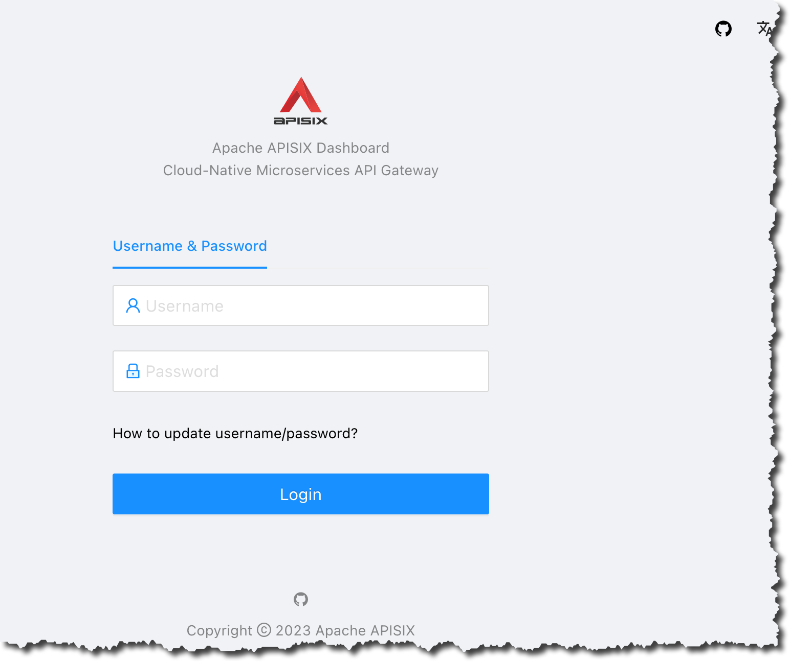

    Click the routes menu item to see the routes you created in step three.

    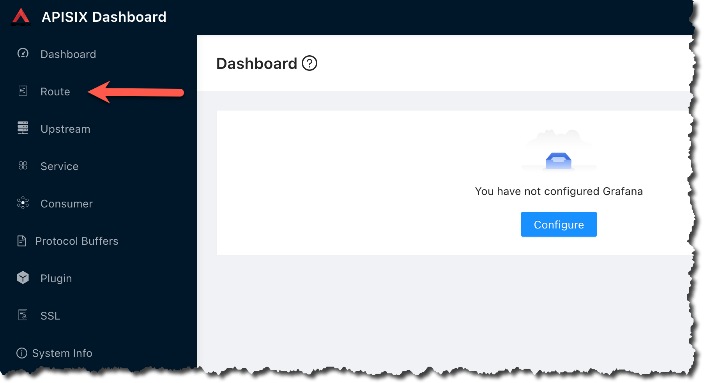

    Verify that you have three routes created

    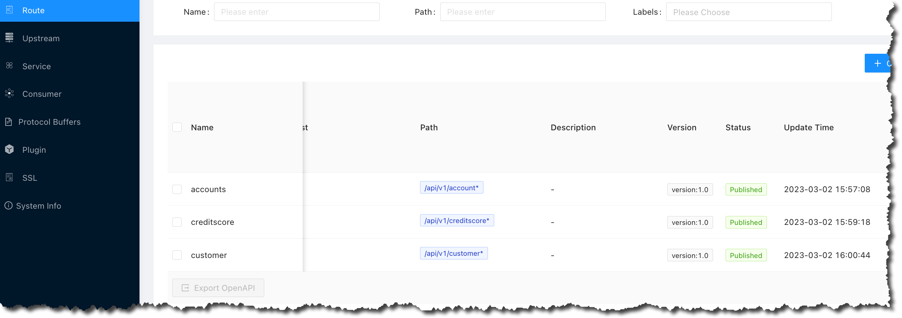

5. Verify the account service

   In the next two commands, you need to provide the correct IP address for the API Gateway in your backend environment. You can find the IP address using this command, you need the one listed in the `EXTERNAL-IP` column. In the example below the IP address is `100.20.30.40`

    ```shell
    $ <copy>kubectl -n ingress-nginx get service ingress-nginx-controller</copy>
    NAME                       TYPE           CLUSTER-IP      EXTERNAL-IP   PORT(S)                      AGE
    ingress-nginx-controller   LoadBalancer   10.123.10.127   100.20.30.40  80:30389/TCP,443:30458/TCP   13d
    ```

    Test the create account endpoint with this command, use the external IP address for your API Gateway. Make a note of the `accountID` in the output:

    ```shell
    $ <copy>curl -i -X POST \
      -H 'Content-Type: application/json' \
      -d '{"accountName": "Sanjay''s Savings", "accountType": "SA", "accountCustomerId": "bkzLp8cozi", "accountOtherDetails": "Savings Account"}' \
      http://API-ADDRESS-OF-API-GW/api/v1/account</copy>
    HTTP/1.1 201
    Date: Wed, 01 Mar 2023 18:35:31 GMT
    Content-Type: application/json
    Transfer-Encoding: chunked
    Connection: keep-alive

    {"accountId":24,"accountName":"Sanjays Savings","accountType":"SA","accountCustomerId":"bkzLp8cozi","accountOpenedDate":null,"accountOtherDetails":"Savings Account","accountBalance":0}
    ```

    Test the get account endpoint with this command, use the IP address for your API Gateway and the `accountId` that was returned in the previous command:

    ```shell
    $ <copy>curl -s http://API-ADDRESS-OF-API-GW/api/v1/account/24 | jq .</copy>
    {
      "accountId": 24,
      "accountName": "Sanjay's Savings",
      "accountType": "SA",
      "accountCustomerId": "bkzLp8cozi",
      "accountOpenedDate": null,
      "accountOtherDetails": "Savings Account",
      "accountBalance": 1040
    }
    ```

## (Optional) Task 6: Using Oracle Backend for Spring Boot VS Code plugin

1. If you have done the optional **Task 11** of **Lab. 2**, you could proceed doing the activities from **Task 3** to **Task 5** using **Oracle Backend for Spring Boot VS Code plugin**.
    If you don't see the plugin in the left bar, with the Oracle logo, as shown here:

    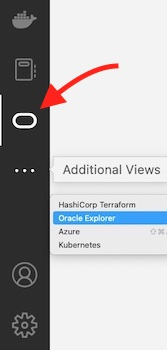

    click on **Additional Views** menu to select the **eBaaS Explorer**.

    The Oracle Backend for Spring Boot VS Code plugin will ask to specify the Kubernetes config file full path as shown here:

    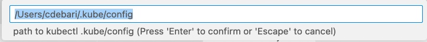

    By default it's shown the path in the user's Home directory **.kube/config** in which normally **kubectl** stores all the information regarding the K8S clusters configured. You could set the full path of another Kubernetes config file.
    If the file is correctly loaded, the plugin will show the list of contexts available in which select one:

    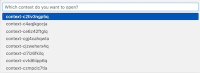

    In positive case, you should see a tree view with one node and the context chosen:

    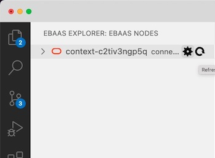

    If the file path it hasn't been correctly set, it will shown an error message:

    

    To restart the plugin and proceed again in Kubernetes config file setting, in command palette execute a **Reload Window** command:

    

2. How to access to cluster

    Until you create a dedicated ssh tunnel to the Kubernetes cluster, and you don't connect to Oracle Backend for Spring Boot admin services, you will not be able to browse resources included into the Oracle Backend for Spring Boot deployment. To do this, follow these steps:

    * Select the cluster and click on the wheel symbol to set the credentials:

        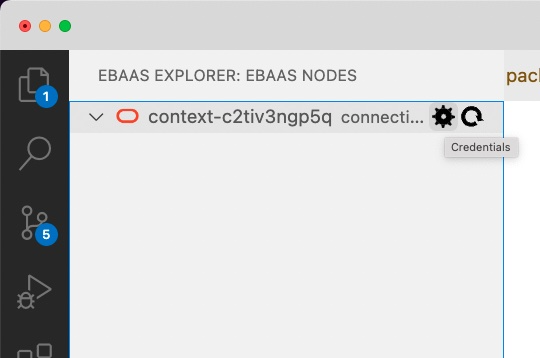

    * On top menu, it will be required the Oracle Backend for Spring Boot admin **password**:

        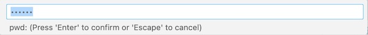

        and **admin** Oracle Backend for Spring Boot's user for the deployment:

        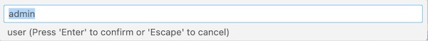

    * Two message boxes will confirm credentials have been set correctly:

        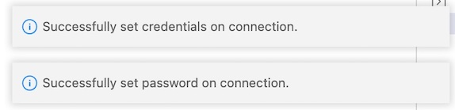

        **WARNING**: if you don't execute this steps and try to expand the kubernetes context, you will receive a message:

        

    * Select again the cluster and click the right mouse button and choose **Create tunnel** menu item. VS Code will open a new terminal that will try to open a tunnel to the Kubernetes cluster on a local port, starting from 8081:

        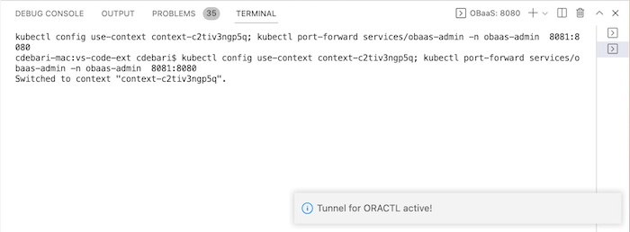

    * Before proceed to connection, please wait until the tunnel is established and the terminal shows a message like this:

        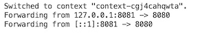

        **NOTE**: if the K8s cluster it's not related to an Oracle Backend for Spring Boot deployment, the tunnel creation will fail. In this case in command palette execute a window reload to chose another cluster. If you have any problem in connection, you could start another tunnel: the plugin will try on another local port to connect to the cluster.

    * Again select the cluster and by clicking the right mouse button choose **Connect** menu item. This will create a session with credentials set at the first step.

3. Explore resources

    As soon as completed the steps to create tunnel and you get connected to the backend, it's possible to expand or refresh the tree related to the deployment.

   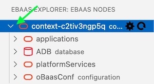

    You'll see four top classes of resources that can be exploded in underlying items:
    * **applications**: the list of applications deployed and the services holding
    * **ADB**: in this release we have one ADB in which are stored configuration and schema related to services deployed
    * **platformServices**: the list of Oracle Backend for Spring Boot deployed services, like Grafana, Spring, Apisix, Eureka and Jaeger.
    * **oBaasConf**: the list of keys defined by application, stored in the ADB provisioned and available to share configuration information among services in each application.

    Let's go to show the operations you can do on each item of browse tree.

    Open the list clicking on the arrow at the left of **applications**, and then expand the application about you want to know which services includes:

    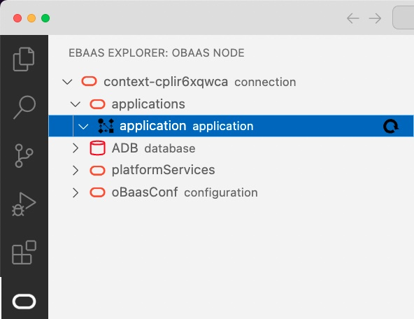

    it should be empty. If not, proceed to delete the full **application** and re-create it through the plug-in:

    * First, select the default **application** and with right-click on mouse, select **Delete application**:

        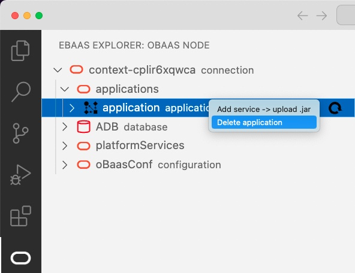

    * Wait a moment and refresh the content of **applications** leaf. When empty, select **applications** and with right-click on mouse, select **Add application**:

        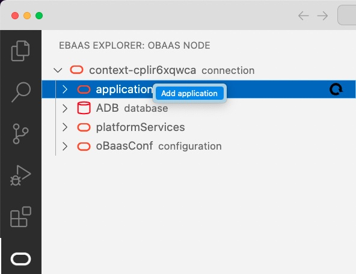

    * Fill in the command palette the (application name) with **application**:

        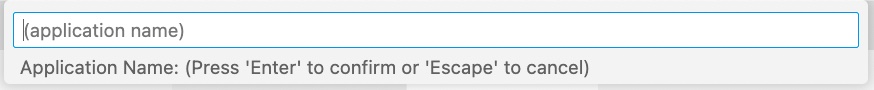

4. The four Spring Boot microservices deployment

    Let's start with the first service deployment:

    * Select **application** under **applications** and Right-click on mouse to select **Add service -> upload .jar**:

        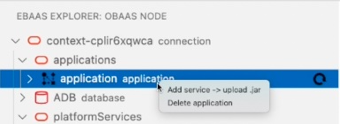

    * Look for the **accounts-0.0.1-SNAPSHOT.jar** file built previously:

        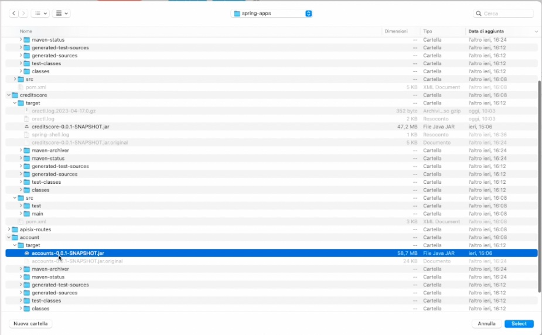

    * In the command palette will be asked all the parameters needed to upload the services, starting from binding, that for **account** service requires a **True** answer:

        

    and then:
    * **Service Name** : `account`
    * **DB User Password (for bind only)**:  `Welcome1234##`
    * **Spring Binding Prefix**: leave default `spring.datasource`
    * **Image Version**:  `0.0.1`
    * **Java Image**: leave default `ghcr.io/graalvm/jdk:ol7-java17-22.2.0`
    * **is it a redeploy**: **False**
    * **Add Health probe?**: **False**
    * **Service Port**: leave default `8080`
    * **Service Profile**: leave default `obaas`

    * You will see messages that confirm the deployment is started:

        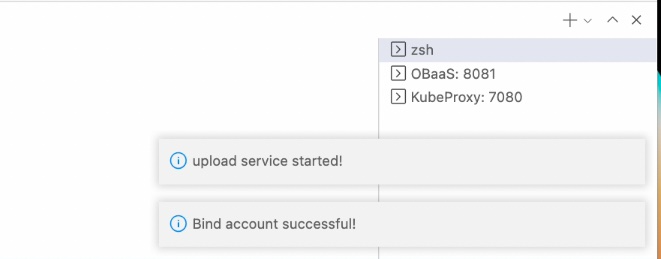

    * Finally you'll receive the message "**Service deployed successfully**":

        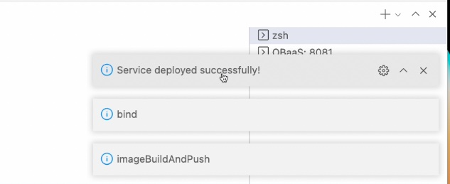

    * Refreshing the **application** leaf, you should see now:

        

    Let's start with the **customer** service deployment:

    * Select **application** under **applications** and Right-click on mouse to select **Add service -> upload .jar**.

    * Look for the **customer-0.0.1-SNAPSHOT.jar** file built previously:

    * In the command palette will be asked all the parameters needed to upload the services, starting from binding, that for **customer** service requires a **True** answer:

        

    and then:
    * **Service Name** : `customer`
    * **DB User Password (for bind only)**:  `Welcome1234##`
    * **Spring Binding Prefix**: leave default `spring.datasource`
    * **Image Version**:  `0.0.1`
    * **Java Image**: leave default `ghcr.io/graalvm/jdk:ol7-java17-22.2.0`
    * **is it a redeploy**: **False**
    * **Add Health probe?**: **False**
    * **Service Port**: leave default `8080`
    * **Service Profile**: leave default `obaas`

    * As before, you will see messages that will confirm the deployment is started and finally "**Service deployed successfully**".

    Finally, we'll deploy the services that don't require to be bound to a schema, the **creditscore** and **transfer**:

    * Select **application** under **applications** and Right-click on mouse to select **Add service -> upload .jar**.

    * Look for the **creditscore-0.0.1-SNAPSHOT.jar** file built previously:

    * In the command palette will be asked all the parameters needed to upload the services, starting from binding, that for **creditscore** service requires a **False** answer:

        

    and then:
    * **Service Name** : `creditscore`
    * **DB User Password (for bind only)**:  leave `null`
    * **Spring Binding Prefix**: leave default `spring.datasource`
    * **Image Version**:  `0.0.1`
    * **Java Image**: leave default `ghcr.io/graalvm/jdk:ol7-java17-22.2.0`
    * **is it a redeploy**: **False**
    * **Add Health probe?**: **False**
    * **Service Port**: leave default `8080`
    * **Service Profile**: leave default `obaas`

    * As before, you will see messages that will confirm the deployment is started and finally "**Service deployed successfully**".

    Proceed to the final CloudBank service deployment, for **transfer**:

    * Select **application** under **applications** and Right-click on mouse to select **Add service -> upload .jar**.

    * Look for the **transfer-0.0.1-SNAPSHOT.jar** file built previously:

    * In the command palette will be asked all the parameters needed to upload the services, starting from binding, that for **transfer** service requires a **False** answer:

        

    and then:
    * **Service Name** : `transfer`
    * **DB User Password (for bind only)**:  leave `null`
    * **Spring Binding Prefix**: leave default `spring.datasource`
    * **Image Version**:  `0.0.1`
    * **Java Image**: leave default `ghcr.io/graalvm/jdk:ol7-java17-22.2.0`
    * **is it a redeploy**: **False**
    * **Add Health probe?**: **False**
    * **Service Port**: leave default `8080`
    * **Service Profile**: leave default `obaas`

    * As before, you will see messages that will confirm the deployment is started and finally "**Service deployed successfully**".

    Now we have the three services up & running as you should see from VS Code plug-in:

    

5. Verify that the services are running properly by executing this command:

    ```shell
    $ <copy>kubectl get all -n application</copy>
    ```

    The output should be similar to this, all applications must have `STATUS` as `Running`

    ```text
    NAME                              READY   STATUS    RESTARTS   AGE
    pod/account-5cd5dbdd7f-m7zlf      1/1     Running   0          14m
    pod/creditscore-fcf8d985b-f8q4n   1/1     Running   0          5m37s
    pod/customer-6b6f58f59-f6vl9      1/1     Running   0          7m18s
    pod/transfer-f9c96cb56-6796s      1/1     Running   0          113s

    NAME                  TYPE        CLUSTER-IP       EXTERNAL-IP   PORT(S)    AGE
    service/account       ClusterIP   10.191.135.77    <none>        8080/TCP   19m
    service/creditscore   ClusterIP   10.191.68.122    <none>        8080/TCP   5m38s
    service/customer      ClusterIP   10.191.172.239   <none>        8080/TCP   7m19s
    service/transfer      ClusterIP   10.191.172.125   <none>        8080/TCP   114s

    NAME                          READY   UP-TO-DATE   AVAILABLE   AGE
    deployment.apps/account       1/1     1            1           19m
    deployment.apps/creditscore   1/1     1            1           5m39s
    deployment.apps/customer      1/1     1            1           7m20s
    deployment.apps/transfer      1/1     1            1           115s

    NAME                                    DESIRED   CURRENT   READY   AGE
    replicaset.apps/account-5cd5dbdd7f      1         1         1       19m
    replicaset.apps/creditscore-fcf8d985b   1         1         1       5m39s
    replicaset.apps/customer-6b6f58f59      1         1         1       7m20s
    replicaset.apps/transfer-f9c96cb56      1         1         1       115s
    ```

6. Expose the services using APISIX Gateway

    Execute the same actions as described in **Lab. 5, Task 5** except for the **step 4.**, that it could be executed in the following alternative way, accessing comfortably to the APISIX admin console straight from VS Code.

    * Select under **platformServices** the leaf **apisix console** and, with a right-click on mouse, select **open apisix console**:

        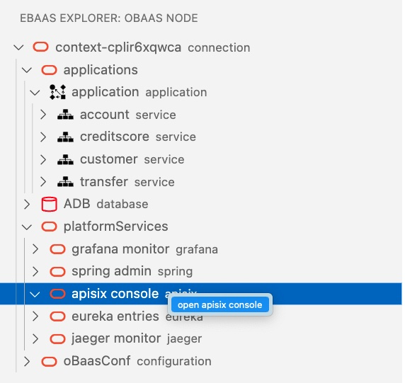

    * It will open a terminal window in which it will be started a tunneling to that service, that will end opening a message box with a button you can click to open the APISIX admin console in a new browser:

        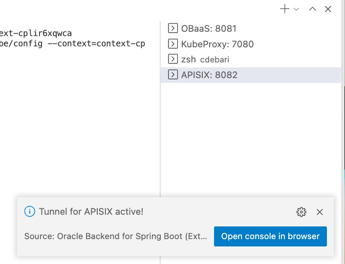

## Learn More

* [Oracle Backend for Spring Boot](https://oracle.github.io/microservices-datadriven/spring/)
* [Oracle Backend for Parse Platform](https://oracle.github.io/microservices-datadriven/mbaas/)
* [Kubernetes](https://kubernetes.io/docs/home/)
* [Apache APISIX](https://apisix.apache.org)
* [Oracle Cloud Infrastructure](https://docs.oracle.com/en-us/iaas/Content/home.htm)

## Acknowledgements

* **Author** - Andy Tael, Corrado De Bari, Mark Nelson, Developer Evangelists, Oracle Database
* **Contributors** - [](var:contributors)
* **Last Updated By/Date** - Andy Tael, June 2023
