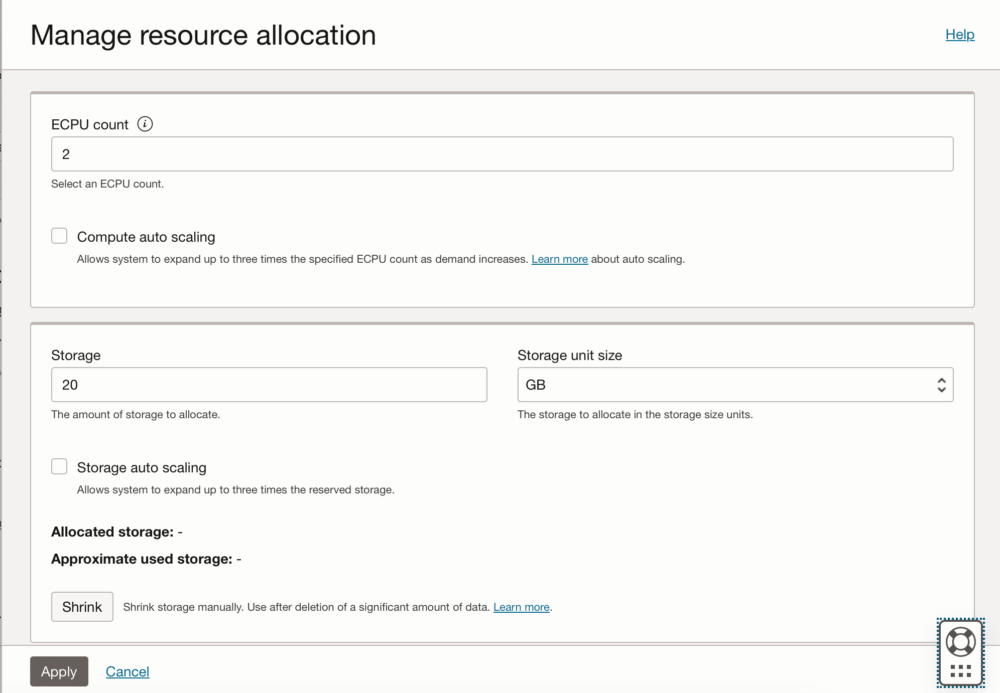

# Explore the Backend Platform

## Introduction

This lab walks you through various features of Oracle Backend for Spring Boot and Microservices, including Parse Platform, and shows you how to use them.

Estimated Time: 20 minutes

Quick walk through on how to explore backend platform.

[](videohub:1_r5to9bp7)

### Objectives

In this lab, you will:

* Review the components of the Oracle Backend for Spring Boot and Microservices
* Explore how microservice data is stored in the Oracle Autonomous Database
* Learn about the Spring Admin user interface
* Learn about Spring Eureka Service Registry
* Learn about APISIX API Gateway
* Learn about Spring Config Server
* Learn about the observability tools included in Oracle Backend for Spring Boot and Microservices
* Learn about the tracing tools included in Oracle Backend for Spring Boot and Microservices

### Prerequisites

This lab assumes you have:

* An Oracle Cloud account
* All previous labs successfully completed
* Deployed the full CloudBank Application

## Task 1: Explore the Kubernetes cluster

Oracle Backend for Spring Boot and Microservices includes a number of platform services which are deployed into the Oracle Container Engine for Kubernetes cluster.  You configured **kubectl** to access your cluster in an earlier lab.  In this task, you will explore the services deployed in the Kubernetes cluster.  A detailed explanation of Kubernetes concepts is beyond the scope of this course.

1. Explore namespaces

   Kubernetes resources are grouped into namespaces.  To see a list of the namespaces in your cluster, use this command, your output will be slightly different:

    ```shell
    $ <copy>kubectl get ns</copy>
      NAME                              STATUS   AGE
      admin-server                      Active   4h56m
      apisix                            Active   4h56m
      application                       Active   4h57m
      azn-server                        Active   4h56m
      cert-manager                      Active   4h59m
      coherence                         Active   4h56m
      conductor-server                  Active   4h56m
      config-server                     Active   4h55m
      default                           Active   5h8m
      eureka                            Active   4h57m
      grafana                           Active   4h55m
      ingress-nginx                     Active   4h57m
      kafka                             Active   4h56m
      kaniko                            Active   5h1m
      kube-node-lease                   Active   5h8m
      kube-public                       Active   5h8m
      kube-state-metrics                Active   4h57m
      kube-system                       Active   5h8m
      metrics-server                    Active   4h57m
      obaas-admin                       Active   4h55m
      observability                     Active   4h55m
      open-telemetry                    Active   4h55m
      oracle-database-exporter          Active   4h55m
      oracle-database-operator-system   Active   4h59m
      otmm                              Active   4h55m
      prometheus                        Active   4h57m
      vault                             Active   4h54m
    ```

   Here is a summary of what is in each of these namespaces:

      * `admin-server` contains Spring Admin which can be used to monitor and manage your services
      * `apisix` contains the APISIX API Gateway and Dashboard which can be used to expose services outside the cluster
      * `application` is a pre-created namespace with the Oracle Database wallet and secrets pre-configured to allow services deployed there to access the Oracle Autonomous Database instance
      * `cert-manager` contains Cert Manager which is used to manage X.509 certificates for services
      * `cloudbank` is the namespace where you deployed the CloudBank sample application
      * `conductor-server` contains Netflix Conductor OSS which can be used to manage workflows
      * `config-server` contains the Spring CLoud Config Server
      * `eureka` contains the Spring Eureka Service Registry which is used for service discovery
      * `grafana` contains Grafana which can be used to monitor and manage your environment
      * `ingress-nginx` contains the NGINX ingress controller which is used to manage external access to the cluster
      * `kafka` contains a three-node Kafka cluster that can be used by your application
      * `obaas-admin` contains the Oracle Backend for Spring Boot and Microservices administration server that manages deployment of your services
      * `observability` contains Jaeger tracing which is used for viewing distributed traces
      * `open-telemetry` contains the Open Telemetry Collector which is used to collect distributed tracing information for your services
      * `oracle-database-operator-system` contains the Oracle Database Operator for Kubernetes which can be used to manage Oracle Databases in Kubernetes environments
      * `otmm` contains Oracle Transaction Manager for Microservices which is used to manage transactions across services
      * `parse-dashboard` contains the Parse Dashboard
      * `parse` contains the Parse Server
      * `prometheus` contains Prometheus which collects metrics about your services and makes the available to Grafana for alerting and dashboards
      * `vault` contains HashiCorp Vault which can be used to store secret or sensitive information for services, like credentials for example

   Kubernetes namespaces contain other resources like pods, services, secrets and config maps.  You will explore some of these now.

2. Explore pods

   Kubernetes runs workloads in "pods."  Each pod can container one or more containers.  There are different kinds of groupings of pods that handle scaling in different ways.  Use this command to review the pods in the `apisix` namespace:

    ```shell
    $ <copy>kubectl -n apisix get pods</copy>
      NAME                                READY   STATUS    RESTARTS        AGE
      apisix-558f6f64c6-ff6xf             1/1     Running   0               4h57m
      apisix-dashboard-6f865fcb7b-n76c7   1/1     Running   4 (4h56m ago)   4h57m
      apisix-etcd-0                       1/1     Running   0               4h57m
      apisix-etcd-1                       1/1     Running   0               4h57m
      apisix-etcd-2                       1/1     Running   0               4h57m
    ```

   The first pod listed is the APISIX API Gateway itself.  It is part of a Kubernetes "deployment".  The next pod is running the APISIX Dashboard user interface - there is only one instance of that pod running.  And the last three pods are running the etcd cluster that APISIX is using to store its state.  These three pods are part of a "stateful set".

   To see details of the deployments and stateful set in this namespace use this command:

    ```shell
    $ <copy>kubectl -n apisix get deploy,statefulset</copy>
    NAME                               READY   UP-TO-DATE   AVAILABLE   AGE
    deployment.apps/apisix             3/3     3            3           6d18h
    deployment.apps/apisix-dashboard   1/1     1            1           6d18h
    
    NAME                           READY   AGE
    statefulset.apps/apisix-etcd   3/3     6d18h
    ```

   If you want to view extended information about any object you can specify its name and the output format, as in this example:

    ```shell
    $ <copy>kubectl -n apisix get pod apisix-etcd-0 -o yaml</copy>
    ```

3. Explore services

   Kubernetes services are essentially small load balancers that sit in front of groups of pods and provide a stable network address as well as load balancing.  To see the services in the `apisix` namespace use this command:

    ```shell
    $ <copy>kubectl -n apisix get svc</copy>
      NAME                        TYPE        CLUSTER-IP     EXTERNAL-IP   PORT(S)             AGE
      apisix-admin                ClusterIP   10.96.26.213   <none>        9180/TCP            4h59m
      apisix-dashboard            ClusterIP   10.96.123.62   <none>        80/TCP              4h59m
      apisix-etcd                 ClusterIP   10.96.54.248   <none>        2379/TCP,2380/TCP   4h59m
      apisix-etcd-headless        ClusterIP   None           <none>        2379/TCP,2380/TCP   4h59m
      apisix-gateway              NodePort    10.96.134.86   <none>        80:32130/TCP        4h59m
      apisix-prometheus-metrics   ClusterIP   10.96.31.169   <none>        9091/TCP            4h59m
    ```

   Notice that the services give information about the ports.  You can get detailed information about a service by specifying its name and output format as you did earlier for a pod.

4. Explore secrets

   Sensitive information in Kubernetes is often kept in secrets that are mounted into the pods at runtime.  This means that the container images do not need to have the sensitive information stored in them.  It also helps with deploying to different environments where sensitive information like URLs and credentials for databases changes based on the environment.

   Oracle Backend for Spring Boot and Microservices creates a number of secrets for you so that your applications can securely access the Oracle Autonomous Database instance.  Review the secrets in the pre-created `application` namespace using this command. **Note**, the name of the secrets will be different in your environment depending on the application name you gave when deploying the application.

    ```shell
    $ <copy>kubectl -n application get secret</copy>
      NAME                        TYPE                             DATA   AGE
      account-db-secrets          Opaque                           4      57m
      admin-liquibasedb-secrets   Opaque                           5      56m
      checks-db-secrets           Opaque                           4      57m
      customer-db-secrets         Opaque                           4      56m
      encryption-secret-key       Opaque                           1      5h1m
      public-key                  Opaque                           1      5h1m
      registry-auth               kubernetes.io/dockerconfigjson   1      5h
      registry-login              Opaque                           5      5h
      registry-pull-auth          kubernetes.io/dockerconfigjson   1      5h
      registry-push-auth          kubernetes.io/dockerconfigjson   1      5h
      testrunner-db-secrets       Opaque                           4      56m
      tls-certificate             kubernetes.io/tls                5      5h
      zimbadb-db-secrets          Opaque                           5      5h
      zimbadb-tns-admin           Opaque                           9      5h
    ```

   Whenever you create a new application namespace with the CLI and bind it to the database, these secrets will be automatically created for you in that namespace.  There will two secrets created for the database, one contains the credentials to access the Oracle Autonomous Database.  The other one contains the database client configuration files (`tnsadmin.ora`, `sqlnet.ora`, the keystores, and so on). The name of the secret depends on the application name you gave (or got autogenerated) during install, in the example above the application name is `zimba`.

   You can view detailed information about a secret with a command like this, you will need to provide the name of your secret which will be based on the name you chose during installation (your output will be different). Note that the values are uuencoded in this output:

    ```shell
    $ <copy>kubectl -n application get secret zimbadb-db-secrets -o yaml</copy>
      apiVersion: v1
      data:
      db.name: xxxxxxxxxx
      db.password: xxxxxxxxxx
      db.service: xxxxxxxxxx
      db.username: xxxxxxxxxx
      secret: xxxxxxxxxx
      kind: Secret
      metadata:
      creationTimestamp: "2024-05-08T16:38:06Z"
      labels:
         app.kubernetes.io/version: 1.2.0
      name: zimbadb-db-secrets
      namespace: application
      resourceVersion: "3486"
      uid: 66855e8d-22a5-4e24-b3df-379dd033ed1f
      type: Opaque
    ```

   When you deploy a Spring Boot microservice application into Oracle Backend for Spring Boot and Microservices, the pods that are created will have the values from this secret injected as environment variables that are referenced from the `application.yaml` to connect to the database.  The `xxxxxx-tns-admin` secret will be mounted in the pod to provide access to the configuration and keystores to allow your application to authenticate to the database.

## Task 2: Explore the Oracle Autonomous Database instance

Oracle Backend for Spring Boot and Microservices includes an Oracle Autonomous Database instance.  You can manage and access the database from the OCI Console.

1. View details of the Oracle Autonomous Database

   In the OCI Console, in the main ("hamburger") menu navigate to the **Oracle Database** category and then **Oracle Autonomous Database**.  Make sure you have the correct region selected (in the top right corner) and the compartment where you installed Oracle Backend for Spring Boot and Microservices (on the left hand side pull down list).  You will a list of Oracle Autonomous Database instances (you will probably only have one):

   

   Click on the database name link to view more information about that instance.  ON this page, you can see important information about your Oracle Autonomous Database instance, and you can manage backups, access and so on.  You can also click on the **Performance Hub** button to access information about the performance of your database instance.

   

   You can manage scaling from here by clicking on the **Manage scaling** button which will open this form where you can adjust the OCPU and storage for the Autonomous Database instance.  

   

2. Explore Oracle Backend for Spring Boot and Microservices database objects

   Click on the **Database Actions** button and select SQL to open a SQL Worksheet.  

   

   Depending on choices you made during installation, you may go straight to SQL Worksheet, or you may need to enter credentials first.  If you are prompted to login, use the username `ADMIN` and obtain the password from Kubernetes with this command (make sure to change the secret name to match the name you chose during installation):

    ```shell
    $ <copy> kubectl -n application get secret obaasdevdb-db-secrets -o jsonpath='{.data.db\.password}' | base64 -d</copy>
    ```

   

   In the SQL Worksheet, you can the first pull down list in the **Navigator** on the left hand side to see the users and schema in the database.  Choose the **CONFIGSERVER** user to view tables (or other objects) for that user.  This is the user associated with the Spring Config Server.

   Execute this query to view tables associated with various Spring Boot services and the CloudBank:

    ```sql
    <copy>select owner, table_name
   from dba_tables
   where owner in ('ACCOUNT', 'CUSTOMER', 'CONFIGSERVER', 'AZNSERVER')</copy>
    ```  

   

   Feel free to explore some of these tables to see the data.

## Task 3: Explore Spring Admin

Oracle Backend for Spring Boot and Microservices includes Spring Admin which provides a web user interface for managing and monitoring Spring applications.

1. Connect to Spring Admin

   Oracle Backend for Spring Boot and Microservices does not expose management interfaces outside the Kubernetes cluster for improved security.  Oracle recommends you access these interfaces using **kubectl** port forwarding, which creates an encrypted tunnel from your client machine to the cluster to access a specific service in the cluster.

   Open a tunnel to the Spring Admin server using this command:

    ```shell
    <copy>kubectl -n admin-server port-forward svc/admin-server 8989</copy>
    ```

    Open a web browser to [http://localhost:8989](http://localhost:8989) to view the Spring Admin web user interface.

    Click on the **Wallboard** link in the top menu to view the "wallboard" which shows all the discovered services.  Spring Admin discovers services from the Spring Eureka Service Registry.

   

   Each hexagon represents a service.  Notice that this display gives you a quick overview of the health of your system.  Green services are healthy, grey services have reduced availability and red services are not healthy.  You can also see information about how many instances (i.e. pods) are available for each service.

2. View information about a service

   Click on the **Customer** service.  You will see a detail page like this:

   

   On this page, you can see detailed information about service's health, and you can scroll down to see information about resource usage.  The menu on the left hand side lets you view additional information about the service including its environment variables, the Spring beans loaded, its Spring configuration properties and so on.  You can also access metrics from this interface.

3. View endpoints

   Click on the **Mappings** link on the left hand side menu.  This page shows you information about the URL Path mappings (or endpoints) exposed by this service.  You will notice several endpoints exposed by Spring Actuator, which enables this management and monitoring to be possible.  And you will see your service's own endpoints, in this example the ones that start with `/api/v1/...`:

   

## Task 4: Explore Spring Eureka Service Registry

Spring Eureka Service Registry is an application that holds information about what microservices are running in your environment, how many instances of each are running, and on which addresses and ports.  Spring Boot microservices register with Eureka at startup, and it regularly checks the health of all registered services.  Services can use Eureka to make calls to other services, thereby eliminating the need to hard code service addresses into other services.

1. Start a port-forward tunnel to access the Eureka web user interface

   Start the tunnel using this command.  You can run this in the background if you prefer.

    ```shell
    $ <copy>kubectl -n eureka port-forward svc/eureka 8761:8761</copy>
    ```

   Open a web browser to [http://localhost:8761](http://localhost:8761) to view the Eureka web user interface.  It will appear similar to the image below.

   

   Notice that you can see your own services like the Accounts, Credit Score and Customer services from the CloudBank sample application, as well as platform services like Spring Admin, the Spring Config server and Conductor.

## Task 5: Explore APISIX API Gateway

Oracle Backend for Spring Boot and Microservices includes APISIX API Gateway to manage which services are made available outside the Kubernetes cluster.  APISIX allows you to manage many aspects of the services' APIs including authentication, logging, which HTTP methods are accepted, what URL paths are exposed, and also includes capabilities like rewriting, filtering, traffic management and has a rich plugin ecosystem to enhance it with additional capabilities.  You can manage the APISIX API Gateway using the APISIX Dashboard.

1. Access the APISIX Dashboard

   Start the tunnel using this command.  You can run this in the background if you prefer.

    ```shell
    $ <copy>kubectl -n apisix port-forward svc/apisix-dashboard 8081:80</copy>
    ```

   Open a web browser to [http://localhost:8081](http://localhost:8081) to view the APISIX Dashboard web user interface.  It will appear similar to the image below.

   If prompted to login, login with username `admin` and password `admin`.  Note that Oracle strongly recommends that you change the password, even though this interface is not accessible outside the cluster without a tunnel.

   Open the routes page from the left hand side menu.  You will see the routes that you defined in earlier labs:

   

1. View details of a route

   Click on the **Configure** button next to the **account** route.  The first page shows information about the route definition.  Scroll down to the **Request Basic Define** section.  Notice how you can set the host, port, paths, HTTP Methods and other information for the API.

   

   Click on the **Next** button to move to the **Define API Backend Server** page where you can set the routing/load balancing algorithm, retries, timeout and so on.  On this page you will notice that the upstream service is defined using **Service Discovery** and the discovery type is **Eureka**.  The **Service Name** specified here is the key used to look up the service in the Spring Eureka Service Registry.  APISIX will route to any available instance of the service registered in Eureka.

   

   Click on the **Next** button to move to the **Plugin Config** page.  The routes in the CloudBank sample do not use any of the plugins, however you can scroll through this page to get an idea of what plugins are available for your services.

   

   > **Note**: You can find detailed information about the available plugins and how to configure them in the [APISIX documentation](https://apisix.apache.org/docs/apisix/getting-started/) in the **Plugins** section.

## Task 6: Explore Spring Config Server

The Spring Config Server can be used to store configuration information for Spring Boot applications, so that the configuration can be injected at runtime.  It organized the configuration into properties, which are essentially key/value pairs.  Each property can be assigned to an application, a label, and a profile.  This allows a running application to be configured based on metadata which it will send to the Spring Config Server to obtain the right configuration data.

The configuration data is stored in a table in the Oracle Autonomous Database instance associated with the backend.

1. Look at the configuration data

    Execute the query below by pasting it into the SQL worksheet in Database Actions (which you learned how to open in Task 2 above) and clicking on the green circle "play" icon.  This query shows the externalized configuration data stored by the Spring Config Server.

    ```sql
    <copy>select * from configserver.properties</copy>
    ```  

   

   In this example you can see there is an application called `fraud`, which has two configuration properties for the profile `kube` and label `latest`.

## Task 7: Explore Grafana

Grafana provides an easy way to access the metrics collected in the backend and to view them in dashboards.  It can be used to monitor performance, as well as to identify and analyze problems and to create alerts.

1. Explore the pre-installed Spring Boot Dashboard

    Get the password for the Grafana admin user using this command (your output will be different):

    ```shell
    $ <copy>kubectl -n grafana get secret grafana -o jsonpath='{.data.admin-password}' | base64 -d</copy>
    fusHDM7xdwJXyUM2bLmydmN1V6b3IyPVRUxDtqu7
    ```

   Start the tunnel using this command.  You can run this in the background if you prefer.

    ```shell
    $ <copy>kubectl -n grafana port-forward svc/grafana 8080:80</copy>
    ```

   Open a web browser to [http://localhost:8080/grafana/](http://localhost:8080/grafana/) to view the Grafana web user interface.  It will appear similar to the image below.  Log in with the username **admin** and the password you just got.

   

   After signing in you will get to the Grafana homepage.

   

   On the left, click on Dashboards to set the list of pre-installed dashboards.

   

    click on the link to **Spring Boot 3.x Statistics** to see Spring Boot information.

   The Spring Boot Dashboard looks like the image below.  Use the **Instance** selector at the top to choose which microservice you wish to view information for.

   

   Feel free to explore the other dashboards that are preinstalled.

## Task 8: Explore Jaeger

Jaeger provides a way to view the distributed tracing information that is automatically collected by the backend.  This allows you to follow requests from the entry point of the platform (the API Gateway) through any number of microservices, including database and messaging operations those services may perform.

1. View a trace

   Start the tunnel using this command.  You can run this in the background if you prefer.

    ```shell
    $ <copy>kubectl -n observability port-forward svc/jaegertracing-query 16686</copy>
    ```

   Open a web browser to [http://localhost:16686](http://localhost:16686) to view the Jaeger web user interface.  It will appear similar to the image below.

   

   Select one of the Cloudbank services for example `account` and an operation for example `http get /api/v1/account/{account}`. Click on the **Find traces** button to find a trace, open any one and explore the details.

   

   Click on one of the traces to explore the trace.

   

## Learn More

* [Oracle Backend for Spring Boot and Microservices](https://oracle.github.io/microservices-datadriven/spring/)
* [Oracle Backend for Parse Platform](https://oracle.github.io/microservices-datadriven/mbaas/)

## Acknowledgements

* **Author** - Mark Nelson, Andy Tael, Developer Evangelist, Oracle Database
* **Contributors** - [](var:contributors)
* **Last Updated By/Date** - Andy Tael, May 2024
