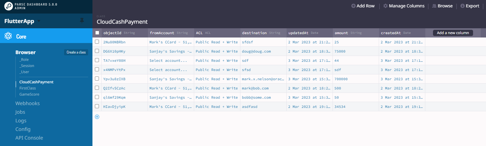

# Extend the CloudBank mobile application

## Introduction

This lab walks you through extending the CloudBank mobile application to add a new "Cloud Cash" feature.  This feature will allow users to instantly send cash to anyone.  In the mobile application, the user will select their account, and enter the email address of the person they wish to send cash to, and the amount.  The mobile app will use the Parse APIs to create a document in the backend database.  A Payment microservice will pick up this request and process it.

The CloudBank mobile application is written in [Flutter](https://flutter.dev) which is a very popular open-source framework that allows you to build apps for any screen from a single code base.

Estimated Time: 30 minutes

### Objectives

In this lab, you will:
* Explore the existing CloudBank mobile application
* Extend the CloudBank mobile application to add the "Cloud Cash" feature

### Prerequisites

This lab assumes you have:
* An Oracle Cloud account
* All previous labs successfully completed
* Completed the optional **Install Flutter** task in the **Setup your Development Environment** lab

## Task 1: Obtain a copy of the CloudBank mobile application

The sample CloudBank mobile application is provided as a starting point.  It already has basic functionality implemented.

1. Clone the source code repository

   Use the following command to make a clone of the source code repository into a suitable location.  **Note**: If you do not have git installed, you can also download a zip from that URL and unzip it into a new directory.

    ```
    $ <copy>git clone TODO/TODO</copy>
    ```   

## Task 2: Run the application as-is against your environmnet

1. Update the application to point to your Oracle Backend for Spring Boot instance

   Open the `main.dart` file in Visual Studio Code and update the following two lines of code. 

    ```
    <copy>const ServerUrl = "1.2.3.4";
    const keyApplicationId = 'APPLICATION_ID';</copy>
    ```

   You need to provide the correct IP address for your environment.  You can find the IP address using this command:
   
    ```
    $ <copy>kubectl -n ingress-nginx get service ingress-nginx-controller</copy>
    NAME                       TYPE           CLUSTER-IP      EXTERNAL-IP   PORT(S)                      AGE
    ingress-nginx-controller   LoadBalancer   10.123.10.127   100.20.30.40  80:30389/TCP,443:30458/TCP   13d
    ```

   You need the address listed under `EXTERNAL-IP`.

   The value for `APPLICATION_ID` was provided in the summary at the end of the apply/install log, it is called **parse_application_id** and is a alphanumeric string.  You were asked to keep keep a copy of that information at the end of the **Provision an instance** lab.  If you do not have it, you can go to the OCI Console and navigate to the main ("hamburger") menu then **Developer Services** and **Stacks** under the **Resource Manager** heading.  Make sure you have the right compartment (left hand side drop down) and region (top right).  Open your stack and then open the apply job and scroll to the end of the log.

1. Build and run the application

   In Visual Studio Code, select the target platform in the lower right corner.  The first time you do this it may say **No device**.

   

   Select the device you want to run the application on.  If you can use a mobile device emulator (or a real device) that will probably give you the best experience.  If you cannot, then **Chrome** is a good second choice. 

   
   
   
   Open a new terminal in Visual Studio Code and run the application with this command: 

    ```
    $ <copy>flutter run</copy>
    ```    

   Select the target platform if prompted.  After a short time the application will start and you will see the login screen:

   

   Log in with the pre-created user `mark` with password `welcome1`.  You will see a list of accounts (yours may be slightly different):

   


## Task 3: Create an intial placeholder user interface for the **Cloud Cash** feature

1. Create the new Cloud Cash Screen

   Create a new Dart file in `lib/screens` called `cloudcash.dart` with this content:

    ```dart
    <copy>
    import 'package:flutter/material.dart';
    import 'package:go_router/go_router.dart';

    class CloudCash extends StatefulWidget {
      const CloudCash({Key? key}) : super(key: key);

      @override
      State<CloudCash> createState() => _CloudCashState();
    }

    class _CloudCashState extends State<CloudCash> {
      @override
      Widget build(BuildContext context) {
         return Scaffold(
            appBar: AppBar(title: const Text("Cloud Cash")),
            body: Center(
            child: Container(
               height: 50,
               padding: const EdgeInsets.fromLTRB(10, 0, 10, 0),
               child: ElevatedButton(
                  child: const Text('Send Cash Now'),
                  onPressed: () => GoRouter.of(context).go('/home'),
               ),
            ),
            ),
         );
      }
    }    
    </copy>  
    ```

    This will create a new screen with an "AppBar" with the title "Cloud Cash" and a single button labeled "Send Cash Now" that will just return to the home page when pressed.  This screen will look like this: 

    

1. Update the app navigaton to add the new screen

   Open the file `lib/main.dart` and add a new `import` statement to include that file we just created.  Then scroll down to the route definitions, and add one more entry to create a route for the new Cloud Cash screen:

    ```dart
    <copy>
    import 'package:loginapp/screens/cloudcash.dart';

    // ...

    GoRoute(
      path: '/cloudcash',
      builder: (context, state) => const CloudCash(),
    ),
    </copy>
    ```

1. Update the home page to add a new card for the Cloud Cash feature

  Open the file `lib/home.dart` and find the line `// ADD CLOUD CASH CARD HERE`.  You need to add a new `Card` component at that point, simliar to the others that you see already in that file.  This new card will tell the user about the Cloud Cash feature and include a button to allow them to navigate to the new Cloud Cash screen.

    ```dart
    <copy>
    Card(
      child: Column(
      mainAxisSize: MainAxisSize.min,
      children: <Widget>[
         ListTile(
            leading: const Icon(Icons.currency_exchange),
            title: Row(
               mainAxisAlignment: MainAxisAlignment.spaceBetween,
               children: const [
                  Text('Cloud Cash'),
               ],
            ),
            subtitle: const Text('Instantly send cash to anyone'),
         ),
         Row(
            mainAxisAlignment: MainAxisAlignment.end,
            children: <Widget>[
               TextButton(
                  child: const Text('SEND CASH NOW'),
                  onPressed: () =>
                     GoRouter.of(context).go('/cloudcash'),
                  ),
                  const SizedBox(width: 8),
               ],
            ),
         ],
      ),
    ),
    </copy>
    ```
   
   This card should look like this: 

   

   When the user touches **SEND CASH NOW** the app will navigate to the new screen.

1. Run and test the application

   At this point, you have done enough to be able to run the application again and navigate from the home page to the new Cloud Cash page and back.  Note that you cannot simply refresh since the routes are loaded at startup time and are not dynamic.  Hit Ctrl+C (or equivalent) to stop the application and then start it again with th command `flutter run`.

   Login and then click on the "Send Cash Now" link the in the Cloud Cash card.  You will see the new Cloud Cash page.  Click on the button to return to the home screen.

## Task 4: Build the real user interface for the **Cloud Cash** feature

1. Review the design for the Cloud Cash feature

   Here is what this screen should look like when it is finished: 

   

   The first field - the drop down selection list - will let the user choose which account they want to send funds from.  You will need to make a REST call to get a list of accounts for the current user.  You wrote an API to provide that information in an earlier lab! 

   Then there is a field to enter the email address of the recipient - this will be used by Cloud Bank to work out who to send the money to.  And a field to specify how much money to send.  And finally, a button to submit the request.  When the user clicks on the button, you will use the Parse APIs to create a new Cloud Cash payment request document.  A backend service will pick up that request and start the process that actually transfers the money.  You wrote most of that in the "Manage Saga Transactions across Microservices" lab!  

1. Create the main UI components of the screen

   Update `cloudcash.dart` to add the input boxes and button. If you are familiar with Flutter, feel free to skip to the code below!

   In Flutter, the screen layout is created in the `build` method which accepts a `BuildContext` as input and returns a `Widget`.  If you want to create an entire screen, then you can return a `Scaffold` from this method.  If you were create a reusable componeent that could be placed on different screens, then you would most likely return a `Wrap` instead - this is a non-visual component that contains one to many other components.  But in this case, you want to return an entire screen, so `Scaffold` is the best choice. 

    > **Note**: This example uses the [Material](https://docs.flutter.dev/development/ui/widgets/material) library, so some of the information presented here is specific to Material applications.

   A `Scaffold` has an `appBar` property which controls the bar at the top of the screen which typically contains a title, and often also contains an icon to access a global menu (sometimes called a "hamburger").  It also has a `body` property which contains the component (and that components children) that make up the main part of the screen.  In this example we use the `Center` component as the root or base component.  It centers its children on the screen.

   Put a `Container` in the `Center` and a `ListView` in the `Container`.  A `ListView` displays it children in a list, typically horizontally, and if the list is too long to fit on the screen, it handles scrolling for you automatically - so a `ListView` is a very common component for laying out a screen in a mobile application. 

   Inside the `ListView` put some more `Container`s and in those `Container`s put the actual `TextFields` which are used for input. 

   Of course, at this point, you need some state!  Notice that the `CloudCash` class extends `StatefulWidget` - this allows you to have state in this class.  Also notice that you can override the `createState()` method to control what state you require.  As you can see in the code below, a second cladd `_CloudCashState` is created, which extends `State<?>` and inside that class you can create stateful object, such as the two `TextEditingController`s that are defined, one for each of the two fields.

   If you look again at the `TextField`s in the `build()` method, you will notice that they each have a `controller` property which points to the appropriate one of these two conrtollers.  This is how the link is established so that whatever a user enters in those controls will be stored in the state.

   Finally, notice that the `ElevatedButton` in the last `Container` has an `onPressed` property.  In that property there is a call to a function called `processCloudCash` which is defined later in that same class.  Right now, that function just logs a message.  Later, you will update that function to make a REST call and give the user feedback about what happened.

    ```dart
    <copy>import 'package:flutter/material.dart';
    import 'package:go_router/go_router.dart';

    class CloudCash extends StatefulWidget {
      const CloudCash({Key? key}) : super(key: key);

      @override
      State<CloudCash> createState() => _CloudCashState();
   }

   class _CloudCashState extends State<CloudCash> {
      TextEditingController destinationController = TextEditingController();
      TextEditingController amountController = TextEditingController();

      @override
      Widget build(BuildContext context) {
         return Scaffold(
            appBar: AppBar(title: const Text("Cloud Cash")),
            body: Center(
               child: Container(
                  padding: const EdgeInsets.all(16),
                  child: ListView(
                     children: [
                        Container(
                           alignment: Alignment.center,
                           padding: const EdgeInsets.all(10),
                           child: const Text(
                              'Send cash to anyone instantly',
                              style: TextStyle(fontSize: 20),
                           ),
                        ),
                        Container(
                           padding: const EdgeInsets.all(10),
                           child: TextField(
                              controller: destinationController,
                              decoration: const InputDecoration(
                              border: OutlineInputBorder(),
                              labelText: 'Email address of recipient',
                              ),
                           ),
                        ),
                        Container(
                           padding: const EdgeInsets.fromLTRB(10, 10, 10, 0),
                           child: TextField(
                              controller: amountController,
                              decoration: const InputDecoration(
                              border: OutlineInputBorder(),
                              labelText: 'Amount to send',
                              ),
                           ),
                        ),
                        const SizedBox(
                           height: 20,
                        ),
                        Container(
                           height: 50,
                           padding: const EdgeInsets.fromLTRB(10, 0, 10, 0),
                           child: ElevatedButton(
                              child: const Text('Send Cash Now'),
                              onPressed: () => processCloudCash(),
                           ),
                        ),
                     ],
                  ),
               ),
            ),
         );
      }

      processCloudCash() async {
         print("do something");
      }
    }</copy>
    ```

## Task 5: Add the account selector and wire it up to the Account microservice

For the account selector field, you need to get a list of accounts by calling the accounts API you created in an earlier lab.  You will need to extract some data and format it for display.  You will need to add the `intl` library for currency formatting. 

1. Create a currency formatter

   Add the `intl` library with this command:

    ```
    $ <copy>dart pub add intl</copy>
    ```
   
   In the `cloudcash.dart` file, add a new import and create a currency formatter:

    ```dart
    <copy>import 'package:intl/intl.dart';
    
    // this goes at the top level, not inside a class:
    final formatCurrency = new NumberFormat.simpleCurrency();</copy>
    ```

   You will use this later to format the account balances.

1. Create a class to hold the data from the REST API

   Define a new class in `cloudcash.dart` to hold the data retrieved from the REST API.  Here is the code for this new class:

    ```dart
    <copy>class Accounts {
      final List<dynamic> accounts;

      const Accounts({
         required this.accounts,
      });

      List getAccounts() {
         return accounts;
      }

      factory Accounts.fromJson({required accounts}) {
         return Accounts(
            accounts: accounts,
         );
      }
   }</copy>
   ```

   You will store the result from calling the API in a `List<dynamic>` which means you do not need to define the entire data structure.  The `fromJson` method in this class will handle conversion of the JSON data to a Dart class.

1. Create the state needed for the drop down selector UI component

   Define a variable to hold the list of accounts using this code, at the top level, not inside a class:

    ```dart
    <copy>List<String> accountList = <String>[
      "Select account...",
    ];</copy>
    ```

   Update your `_CloudCashState` class to add a new variable to hold the data received from the API call, note that this will be a `late Future<Accounts>`.  Add a new `String` to hold the current value of the drop down and set the initial value to the first item in the list, i.e. **Select account...**.  Add an overriden `initState()` method in which you call `super.initState()` and then ivoke the API to get the data for that future.  You will write that `fetchData()` method next.  Here is the code so far:

    ```dart
    <copy>class _CloudCashState extends State<CloudCash> {
      late Future<Accounts> futureData;

      TextEditingController destinationController = TextEditingController();
      TextEditingController amountController = TextEditingController();
      String accountDropdownValue = accountList.first;

      @override
      void initState() {
         super.initState();
         futureData = fetchData();
      }</copy>

      // ...
    ```

1. Use the Accounts REST API to get list of accounts

   Create the `fetchData()` method in the same class.  Note that it is an `async` method and returns a `Future<Account>`.  In this method, use the http libraries' `get` method to invoke the API.  This returns a response object which contains the HTTP Status Code, body, and so on.  YOu should check the status code to see if the API call was successful, and if so, decode/convert the body into a variable, and then use your `Accounts.fromJson` method to convert that into your `Accounts` object.

   The REST endpoint needs the customer ID, which you can get from the `creds` object's `objectID` property as shown in the code sample below.  You will need to make a couple of other small updates to pass the credentials into this widget.  Here is the code for the `fetchData()` function: 

    ```dart
      <copy>Future<Accounts> fetchData() async {
             String accountsUrl =
               '${widget.creds.backendUrl}/api/v1/account/getAccounts/${widget.creds.objectID}';
             final response = await http.get(Uri.parse(accountsUrl));

         if (response.statusCode == 200) {
            // If the server did return a 200 OK response,
            // then parse the JSON.
            var accounts = jsonDecode(response.body);
            print(accounts);
            return Accounts.fromJson(accounts: accounts);
         } else {
            // If the server did not return a 200 OK response,
            // then throw an exception.
            throw Exception('Failed to retrieve Account List');
         }
      }</copy>
    ```

   To accept the credentials in this widget, you will need to update the `CloudCash` class to have a `creds` property and update the constructor.  The updated code is as follows:

    ```dart
    <copy>class CloudCash extends StatefulWidget {
      final Credentials creds;

      const CloudCash({Key? key, required this.creds}) : super(key: key);

      @override
      State<CloudCash> createState() => _CloudCashState();
    }</copy>
    ```

   You will also need to update the route you added to the Cloud Cash card in `home.dart` to pass `creds` in the constructor:

    ```dart
     <copy>MaterialPageRoute(
      builder: (context) => CloudCash(creds: creds),</copy>
    ```       

   Now you will have access to the credentials to get the customer ID.

1. Add a UI component to display the drop down selector on the screen

   In the `build()` method, insert a new `Container` between the existing first container ("Send cash to anyone instantly") and the second container ("Email address of recipient").  This new `Container` should contain a `FutureBuilder<Accounts>`.  A `FutureBuilder` lets you deal with data that may not be present yet.  Set the `future` property to your `futureData` variable.  In the `buidler`, which receives `context, snapshot`, check if `snapshot.hasData` to see if the future has completed yet.  If this is `true` then you can expect to have the data available to render the UI.  If it is not `true`, you can check if `shapshot.hasError` if you want to handle errors or just return a generic error.

   If the future has completed, you can check `snapshot.data` to get access to the data.  You will need to iterate through the results and use them to populate the drop down list, you will do that in a moment, the code is commented out in the example below.

   The builder should then return a `DropDownButton<String>` with its `value` property set to the `accountDropdownValue` state variable you created earlier.  In the `onChanged` property you need to update the state to the currently selected value.  The `Items` property should point at the list of values you want displayed in the drop down.  You created a variable to hold these values earlier and pre-populated it with one value (**Select account...**).  

   With this done, you can restart the application and test the new screen.  The drop down box will not populate yet, but you will see it on the screen.  Here is the code so far:

    ```dart
    <copy>Container(
      padding: const EdgeInsets.all(10),
      child: FutureBuilder<Accounts>(
         future: futureData,
         builder: (context, snapshot) {
            if (snapshot.hasData) {
               List<dynamic> data = snapshot.data!.accounts;
               // grab the account details and put them into the list
               //data.forEach(updateAccountList);

               return DropdownButton<String>(
                  value: accountDropdownValue,
                  icon: const Icon(Icons.arrow_drop_down),
                  isExpanded: true,
                  elevation: 16,
                  style: const TextStyle(color: Colors.deepPurple),
                  underline: Container(
                     height: 2,
                     color: Colors.deepPurpleAccent,
                  ),
                  onChanged: (String? value) {
                     setState(() {
                        accountDropdownValue = value!;
                     });
                  },
                  items: accountList
                        .map<DropdownMenuItem<String>>((String value) {
                     return DropdownMenuItem<String>(
                        value: value,
                        child: Text(value),
                     );
                  }).toList(),
               );
            } else if (snapshot.hasError) {
               return Text('${snapshot.error}');
            } else {
               return Text('unknown error');
            }
         },
       ),
    ),</copy>
    ```

1. Populate the drop down list with the data from the REST API

   The last step is to populate the drop down list with the data you got back from the REST API.  Uncomment this line in the `FutureBuilder`.  This will call the `updateAccountList` method once for each item in `data`, i.e., once for each account.

    ```dart
    <copy>data.forEach(updateAccountList);</copy>
    ```

   Now, you need to write that method.  It should accept the account as an argument and extract the `accountName` and `accountBalance` fields and format them into a string that you can display in the drop down list.  This is where you will want to use the currency formatter that you created earlier.  Make sure you only add the new entry if it does not already exist in the list.  Here is the code:

    ```dart
    <copy>updateAccountList(element) {
       String theValue =
          "${element['accountName'].toString()}  -  ${formatCurrency.format(element['accountBalance'])}";
       if (!accountList.contains(theValue)) {
          accountList.add(theValue);
       }
    }</copy>
    ```

   With this done, you can restart the application and test the Cloud Cash screen.  It will now populate the drop down list with the accounts names and balances.  Next, you need to handle the form submission.    


## Task 6: Handle the form submission

The final piece to complete the Cloud Cash feature is to handle the form submission when the user touches the **Send Cash Now** button.

1. Create the function to handle submission

   This function will use the Parse API to create a `CloudCashPayment` object in the backend.  You will set the `destination`, `amount`, and `fromAccount` fields with the data from the form, and then call the `save()` method to save the object in the backend.

    > **Note**: A Spring Boot microservice that you deployed in the **Deploy the full CloudBank application** lab will check for new requests every minute, and if it finds one, it will process it using the services you build in the **Manage Saga Transactions across Microservices** lab.

   Once you have saved the data, you want to tell the user.  This can be done with an `AlertDialog` which can tell them the process was saved.  When they click on the **OK** button, redirect them to the `Home` screen, passing the `creds` object back to it.

   Here is the code for the function:   

    ```dart
    <copy>processCloudCash(context, destination, amount, fromAccount) async {
      final creds = ModalRoute.of(context)!.settings.arguments as Credentials;

      var cloudCashPayment = ParseObject("CloudCashPayment");
      cloudCashPayment.set("destination", destination);
      cloudCashPayment.set("amount", amount);
      cloudCashPayment.set("fromAccount", fromAccount);
      var response = await cloudCashPayment.save();

      Widget okButton = TextButton(
         child: const Text("OK"),
         onPressed: () => Navigator.push(
            context,
            MaterialPageRoute(
               builder: (context) => const Home(),
               settings: RouteSettings(
                  arguments: creds,
               ),
            ),
         ),
      );

      // set up the AlertDialog
      AlertDialog alert = AlertDialog(
         title: const Text("Cloud Cash sent"),
         content:
            const Text("Thanks for using Cloud Cash, we've sent your payment!"),
         actions: [
            okButton,
         ],
      );

      // show the dialog
      showDialog(
         context: context,
         builder: (BuildContext context) {
         return alert;
         },
      );
    }</copy>
    ```   

    Now, all that remains is to update the `onPressed` property to make sure the data is passed into this udpated function.

1. Update the button to pass in the data

   You now need to update the button's `onPressed` property to pass in the data to this updated function.  You need to pass the context and then the destination email address, the amount and the source account.  Here is the updated code:

    ```dart
    <copy>onPressed: () {
      processCloudCash(context, destinationController.text,
      amountController.text, accountDropdownValue);</copy>
    ```

   That completes the Cloud Cash feature!  Well done!

## Task 7: Test the finished Cloud Cash feature

1. Test the app 

   Restart the application and navigate to the Cloud Cash screen.  Verify that you can select an acount and send a request.

1. Verify the Cloud Cash request in the backend

   Open a web browser to the Parse Dashboard.  The URL was provided in the log at the end of the stack apply.  See Task 2 in this Lab for details on how to get it. 

   Log in to the dashboard with the userid `ADMIN` (this is case sensitive) and the password you specified when you installed the backend stack.  Click on your application, and in the browser menu (on the left) click on the `CloudCashPayment` class to see the records.  You should see your payments, it will looks something like this:

   

## Learn More

* [Flutter](https://flutter.dev)
* [Parse Platform](https://parseplatform.org/)

## Acknowledgements
* **Author** - Doug Drechsel, Mark Nelson, Developer Evangelists, Oracle Database
* **Contributors** - [](var:contributors)
* **Last Updated By/Date** - Mark Nelson, March 2023
