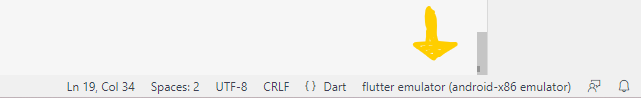
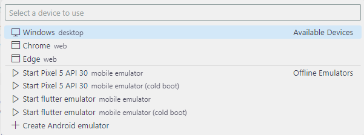
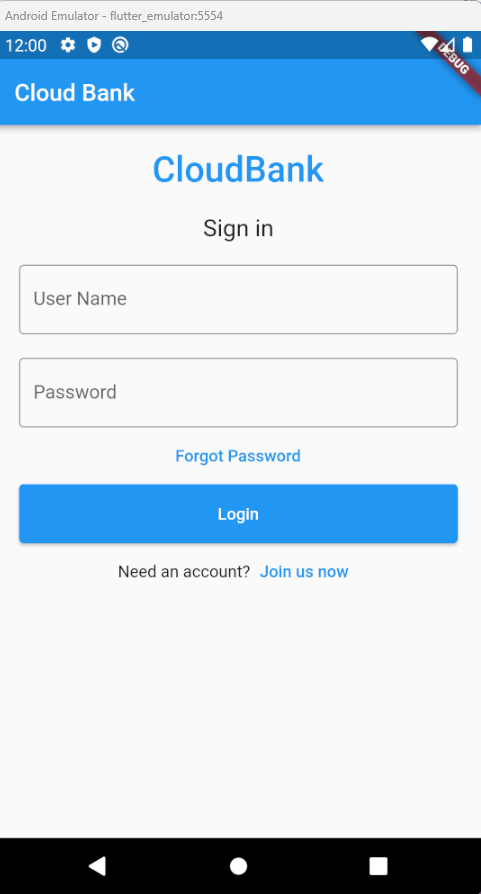
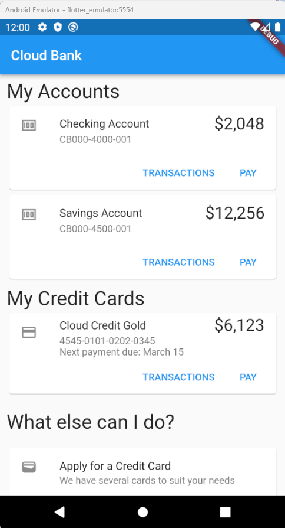
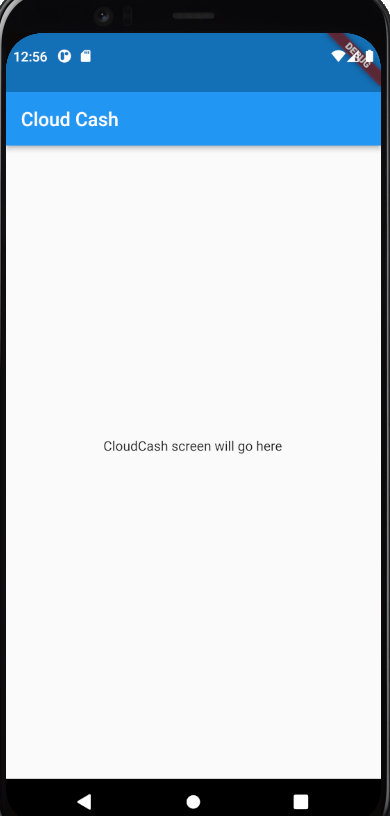
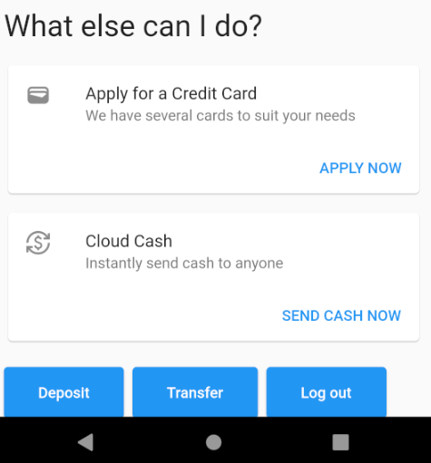

# Extend the CloudBank mobile application

## Introduction

This lab walks you through extending the CloudBank mobile application to add a new "Cloud Cash" feature.  This feature will allow users to instantly send cash to anyone.  In the mobile application, the user will select their account, and enter the email address of the person they wish to send cash to, and the amount.  The mobile app will use the Parse APIs to create a document in the backend database.  A Payment microservice will pick up this request and process it.

The CloudBank mobile application is written in [Flutter](https://flutter.dev) which is a very popular open-source framework that allows you to build apps for any screen from a single code base.

Estimated Time: 30 minutes

### Objectives

In this lab, you will:
* Explore the existing CloudBank mobile application
* Extend the CloudBank mobile application to add the "Cloud Cash" feature

### Prerequisites

This lab assumes you have:
* An Oracle Cloud account
* All previous labs successfully completed
* Completed the optional **Install Flutter** task in the **Setup your Development Environment** lab

## Task 1: Obtain a copy of the CloudBank mobile application

The sample CloudBank mobile application is provided as a starting point.  It already has basic functionality implemented.

1. Clone the source code repository

   Use the following command to make a clone of the source code repository into a suitable location.  **Note**: If you do not have git installed, you can also download a zip from that URL and unzip it into a new directory.

    ```
    $ <copy>git clone TODO/TODO</copy>
    ```   

Task 2: Run the application against your environmnet

1. Update the application to point to your Oracle Backend for Spring Boot instance

   Open the `main.dart` file in Visual Studio Code and update the following line of code. 

    ```
    <copy>const ServerUrl = "1.2.3.4";</copy>
    ```

   You need to provide the correct IP address for your environment.  You can find the IP address using this command:
   
    ```
    $ <copy>kubectl -n ingress-nginx get service ingress-nginx-controller</copy>
    NAME                       TYPE           CLUSTER-IP      EXTERNAL-IP   PORT(S)                      AGE
    ingress-nginx-controller   LoadBalancer   10.123.10.127   100.20.30.40  80:30389/TCP,443:30458/TCP   13d
    ```

   You need the address listed under `EXTERNAL-IP`.

1. Build and run the application

   In Visual Studio Code, select the target platform in the lower right corner.  The first time you do this it may say **No device**.

   

   Select the device you want to run the application on.  If you can use a mobile device emulator (or a real device) that will probably give you the best experience.  If you cannot, then **Chrome** is a good second choice. 

   
   
   
   Open a new terminal in Visual Studio Code and run the application with this command: 

    ```
    $ <copy>flutter run</copy>
    ```    

   Select the target platform if prompted.  After a short time the application will start and you will see the login screen:

   

   Log in with the pre-created user `mark` with password `welcome1`.  You will see a list of accounts (yours may be slightly different):

   


Task 3: Create the user interface for the **Cloud Cash** feature

1. Create the new Cloud Cash Screen

   Create a new Dart file in `lib/screens` called `cloudcash.dart` with this content:

    ```dart
    import 'package:flutter/material.dart';
    import 'package:go_router/go_router.dart';

    class CloudCash extends StatefulWidget {
      const CloudCash({Key? key}) : super(key: key);

      @override
      State<CloudCash> createState() => _CloudCashState();
    }

    class _CloudCashState extends State<CloudCash> {
      @override
      Widget build(BuildContext context) {
         return Scaffold(
            appBar: AppBar(title: const Text("Cloud Cash")),
            body: Center(
            child: Container(
               height: 50,
               padding: const EdgeInsets.fromLTRB(10, 0, 10, 0),
               child: ElevatedButton(
                  child: const Text('Send Cash Now'),
                  onPressed: () => GoRouter.of(context).go('/home'),
               ),
            ),
            ),
         );
      }
    }      
    ```

    This will create a new screen with an "AppBar" with the title "Cloud Cash" and a single button labeled "Send Cash Now" that will just return to the home page when pressed.  This screen will look like this: 

    

1. Update the app navigaton to add the new screen

   Open the file `lib/main.dart` and add a new `import` statement to include that file we just created.  Then scroll down to the route definitions, and add one more entry to create a route for the new Cloud Cash screen:

    ```dart
    import 'package:loginapp/screens/cloudcash.dart';

    // ...

    GoRoute(
      path: '/cloudcash',
      builder: (context, state) => const CloudCash(),
    ),
    ```

1. Update the home page to add a new card for the Cloud Cash feature

  Open the file `lib/home.dart` and find the line `// ADD CLOUD CASH CARD HERE`.  You need to add a new `Card` component at that point, simliar to the others that you see already in that file.  This new card will tell the user about the Cloud Cash feature and include a button to allow them to navigate to the new Cloud Cash screen.

    ```dart
    Card(
      child: Column(
      mainAxisSize: MainAxisSize.min,
      children: <Widget>[
         ListTile(
            leading: const Icon(Icons.currency_exchange),
            title: Row(
               mainAxisAlignment: MainAxisAlignment.spaceBetween,
               children: const [
                  Text('Cloud Cash'),
               ],
            ),
            subtitle: const Text('Instantly send cash to anyone'),
         ),
         Row(
            mainAxisAlignment: MainAxisAlignment.end,
            children: <Widget>[
               TextButton(
                  child: const Text('SEND CASH NOW'),
                  onPressed: () =>
                     GoRouter.of(context).go('/cloudcash'),
                  ),
                  const SizedBox(width: 8),
               ],
            ),
         ],
      ),
    ),
    ```
   
   This card should look like this: 

   

   TODO explain a bit more

1. Run and test the application

   At this point, you have done enough to be able to run the application again and navigate from the home page to the new Cloud Cash page and back.  Note that you cannot simply refresh since the routes are loaded at startup time and are not dynamic.  Hit Ctrl+C (or equivalent) to stop the application and then start it again with th command `flutter run`.

   Login and then click on the "Send Cash Now" link the in the Cloud Cash card.  You will see the new Cloud Cash page.  Click on the button to return to the home screen.

1. Create the main UI components of the screen

   TODO a thing

   The screen should look like this: 

   

   Create a new Dart file in the `lib/screens` directory called `cloudcash.dart` with this content:

   TODO TODO TODO not the final code TODO TODO TODO

    ```dart
    import 'package:flutter/material.dart';
    import 'package:parse_server_sdk_flutter/parse_server_sdk.dart';

    import 'package:go_router/go_router.dart';

    class CloudCash extends StatefulWidget {
      const CloudCash({Key? key}) : super(key: key);

      @override
      State<CloudCash> createState() => _CloudCashState();
      }

      class _CloudCashState extends State<CloudCash> {
      TextEditingController destinationController = TextEditingController();
      TextEditingController amountController = TextEditingController();

      @override
      Widget build(BuildContext context) {
         return Scaffold(
            appBar: AppBar(title: const Text("Cloud Cash")),
            body: Center(
            child: Container(
               padding: const EdgeInsets.all(16),
               child: ListView(
                  children: [
                  Container(
                        alignment: Alignment.center,
                        padding: const EdgeInsets.all(10),
                        child: const Text(
                        'Send cash to anyone instantly',
                        style: TextStyle(fontSize: 20),
                        )),
                  Container(
                     padding: const EdgeInsets.all(10),
                     child: TextField(
                        controller: destinationController,
                        decoration: const InputDecoration(
                        border: OutlineInputBorder(),
                        labelText: 'Email address of recipient',
                        ),
                     ),
                  ),
                  Container(
                     padding: const EdgeInsets.fromLTRB(10, 10, 10, 0),
                     child: TextField(
                        controller: amountController,
                        decoration: const InputDecoration(
                        border: OutlineInputBorder(),
                        labelText: 'Amount to send',
                        ),
                     ),
                  ),
                  const SizedBox(
                     height: 20,
                  ),
                  Container(
                        height: 50,
                        padding: const EdgeInsets.fromLTRB(10, 0, 10, 0),
                        child: ElevatedButton(
                        child: const Text('Send Cash Now'),
                        onPressed: () {
                           processCloudCash(context, destinationController.text,
                              amountController.text);
                        },
                        )),
                  ],
               ),
            ),
            ),
         );
      }

      processCloudCash(context, destination, amount) async {
         print("processCloudCash destination = $destination");
         print("processprocessCloudCashCCApplication amount = $amount");

         var cloudCashPayment = ParseObject("CloudCashPayment");
         cloudCashPayment.set("income", destination);
         cloudCashPayment.set("expenses", amount);
         var response = await cloudCashPayment.save();

         print("saved = $response");
         // set up the button
         Widget okButton = TextButton(
            child: const Text("OK"),
            onPressed: () => GoRouter.of(context).go('/home'),
         );

         // set up the AlertDialog
         AlertDialog alert = AlertDialog(
            title: const Text("Cloud Cash sent"),
            content:
               const Text("Thanks for using Cloud Cash, we've sent your payment!"),
            actions: [
            okButton,
            ],
         );

         // show the dialog
         showDialog(
            context: context,
            builder: (BuildContext context) {
            return alert;
            },
         );
      }
    }
    ```


1. Hook up the REST API to get list of accounts   

   TODO that thing

1. Create the function to handle submission

   TODO that thing

1. Run the app 

   TODO press 'r' and so on

Task 4: Verify the Cloud Cash request in the backend

   TODO that thing

## Learn More

*(optional - include links to docs, white papers, blogs, etc)*

* [URL text 1](http://docs.oracle.com)
* [URL text 2](http://docs.oracle.com)

## Acknowledgements
* **Author** - Mark Nelson, Developer Evangelist, Oracle Database
* **Contributors** - [](var:contributors)
* **Last Updated By/Date** - Mark Nelson, February 2023
