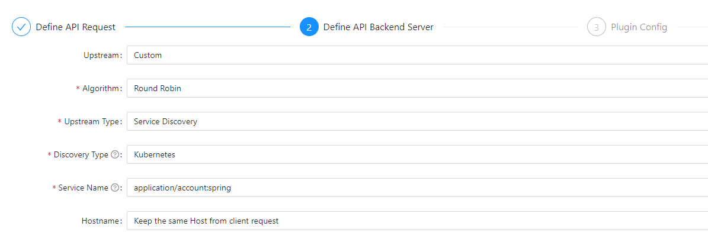

# Manage Saga Transactions across Microservices

## Introduction

This lab walks you through implementing the [Saga pattern](https://microservices.io/patterns/data/saga.html) using a [Long Running Action](https://download.eclipse.org/microprofile/microprofile-lra-1.0-M1/microprofile-lra-spec.html) to manage transactions across microservices.

Watch this short introduction video to get an idea of what you will be building: [](youtube:gk4BMX-KuaY)

Estimated Time: 30 minutes

Quick walk through on how to manage saga transactions across microservices.

[](videohub:1_cqlnw2s0)

### Objectives

In this lab, you will:

* Learn about the Saga pattern
* Learn about the Long Running Action specification
* Add new endpoints to the Account service for deposits and withdrawals that act as LRA participants
* Create a Transfer service that will initiate the LRA

### Prerequisites

This lab assumes you have:

* An Oracle Cloud account
* All previous labs successfully completed

## Task 1: Learn about the Saga pattern

When you adopt microservices architecture and start to apply the patterns, you rapidly run into a situation where you have a business transaction that spans across multiple services.  

### Database per service

The [Database per service](https://microservices.io/patterns/data/database-per-service.html) pattern is a generally accepted best practice which dictates that each service must have its own "database" and that the only way other services can access its data is through its public API.  This helps to create loose coupling between services, which in turn makes it easier to evolve them independently and prevents the creation of a web of dependencies that make application changes increasingly difficult over time.  In reality, this pattern may be implemented with database containers, or even schema within one database with strong security isolation, to prevent the proliferation of database instances and the associated management and maintenance cost explosion.

### Transactions that span services

The obvious challenge with the Database per service pattern is that a database transaction cannot span databases, or services.  So if you have a scenario where you need to perform operations in more than one service's database, you need a solution for this challenge.

A saga is a sequence of local transactions.  Each service performs local transactions and then triggers the next step in the saga.  If there is a failure due to violating a business rule (e.g. trying to withdraw more money than is in an account) then the saga executes a series of compensating transactions to undo the changes that were already made.

### Saga coordination

There are two ways to coordinate sagas:

* Choreography - each local transaction publishes domain events that trigger local transactions in other services
* Orchestration - an orchestrator (object) tells the participants what local transactions to execute

You will use the orchestration approach in this lab.

> **Note**: You can learn more about the saga pattern at [microservices.io](https://microservices.io/patterns/data/saga.html).

### The Cloud Cash Transfer Saga

In this lab you will implement a saga that will manage transferring funds from one user to another.  The CloudBank mobile application will have a feature called "Cloud Cash" that allows users to instantly transfer funds to anyone.  They will do this by choosing a source account and entering the email address of the person they wish to send funds to, and the amount.


When the user submits their request, a microservice will pick up the request and invoke the **Transfer** service (which you will write in this lab) to process the transfer.

A Cloud Cash Payment Request Processor service (which you installed in the **Deploy the full CloudBank application** lab) will look up the target customer using the provided email address and invoke the Transfer server that you will write in this lab, which will perform a withdrawal and a deposit.  Your Transfer service will need to coordinate these actions to make sure they all occur, and to perform compensation if there is a problem.

## Task 2: Learn about Long Running Actions

There are different models that can be used to coordinate transactions across services.  Three of the most common are XA (Extended Architecture) which focuses on strong consistency, LRA (Long Running Action) which provides eventual consistency, and TCC (Try-Confirm/Cancel) which uses a reservation model.  Oracle Backend for Spring Boot includes [Oracle Transaction Manager for Microservices](https://www.oracle.com/database/transaction-manager-for-microservices/) which supports all three of these options.

In this lab, you will explore the Long Running Action model.  In this model there is a logical coordinator and a number of participants.  Each participant is responsible for performing work and being able to compensate if necessary.  The coordinator essentially manages the lifecycle of the LRA, for example by telling participants when to cancel or complete.


You will create the **Transfer service** in the diagram above, and the participant endpoints in the Account service (**deposit** and **withdraw**).  Oracle Transaction Manager for Microservices (also known as "MicroTx") will coordinate the LRA.

You will implement the LRA using the Eclipse Microprofile LRA library which provides an annotation-based approach to managing the LRA, which is very familiar for Spring Boot developers.  

> **Note**: The current version of the library (at the time of the Level Up 2023 event) uses JAX-RS, not Spring Boot's REST annotations provided by `spring-boot-starter-web`, so until a version of the library with better support for Spring is available, we will need to do a little extra work to use JAX-RS.

The main annotations used in an LRA application are as follows:

* `@LRA` - Controls the life cycle of an LRA.
* `@Compensate` - Indicates that the method should be invoked if the LRA is cancelled.
* `@Complete` - Indicates that the method should be invoked if the LRA is closed.
* `@Forget` - Indicates that the method may release any resources that were allocated for this LRA.
* `@Leave` - Indicates that this class is no longer interested in this LRA.
* `@Status` - When the annotated method is invoked it should report the status.

If you would like to learn more, there is a lot of detail in the [Long Running Action](https://download.eclipse.org/microprofile/microprofile-lra-1.0-M1/microprofile-lra-spec.html) specification.

### Keeping track of local transactions made in an LRA

Microservices are often designed to be stateless, to push all the state into the datastore.  This makes it easier to scale by running more instances of services, and it makes it easier to debug issues because there is no state stored in process memory.  It also means you need a way to correlate transactions with the LRA they were performed by.

You will add a `JOURNAL` table to the account microservice's database.  This table will contain the "bank account transactions" (deposits, withdrawals, interest payments, etc.) for this account (not to be confused with "database transactions" as in the two-phase commit protocol).  The account service will track LRA's associated with each journal entry (bank account transaction) in a column in the journal table.

As LRA is an eventual consistency model, the approach you will take in the account service will be to store bank account transactions as "pending" in the journal table.  Pending transactions will not be considered when calculating the account balance until they are finalized ("completed").  When the LRA reaches the "complete" phase, the pending transactions will be considered finalized and the account balance will be updated to reflect those transactions.

> **Note**: Unlike Java Transaction Architecture (JTA) where "in-doubt" tables are created automatically to keep track of pending transactions, LRA is only concerned with the orchestration of the API calls, so participants need to track transactions themselves.  In this lab you will use the journal table both to store the transactions and to track the lRA.  Of course, this could also be done with separate tables if desired.

You will now start implementing the Cloud Cash Payment LRA.

## Task 3: Prepare to add LRA participant endpoints to the Account Service

You will update the Account service that you built in the previous lab to add some new endpoints to perform deposits and withdrawals.  These new endpoints will be LRA participants.

1. Add new dependencies to the Maven POM

  Open the `pom.xml` in your `accounts` project and add these new dependencies to the list.  These add support for Jersey and JAX-RS services and the LRA client libraries themselves.

    ```xml
    <copy>
    <dependency>
        <groupId>org.springframework.boot</groupId>
        <artifactId>spring-boot-starter-jersey</artifactId>
    </dependency>
    <dependency>
        <groupId>org.eclipse.microprofile.lra</groupId>
        <artifactId>microprofile-lra-api</artifactId>
        <version>1.0</version>
    </dependency>
    <dependency>
        <groupId>org.jboss.narayana.rts</groupId>
        <artifactId>narayana-lra</artifactId>
        <version>5.13.1.Final</version>
    </dependency>
    <dependency>
        <groupId>jakarta.enterprise</groupId>
        <artifactId>jakarta.enterprise.cdi-api</artifactId>
        <version>2.0.2</version>
    </dependency>
    </copy>
    ```  

   You will use JAX-RS because the current versions of the LRA libraries require it, as noted earlier.

1. Update the service discovery for the Account application

   The updated Account application with JAX-RS will not coexist with the Eureka client, so you need to remove it.  You are using a version of the LRA client library that only works with JAX-RS, which imposes some limitations.  When a new version of the library with Spring REST support is available, these limitations will be removed.

   To remove the Eureka client from the Account application:

    * Update the `pom.xml` to remove the dependency for `spring-cloud-starter-netflix-eureka-client`.
    * Remove the `@EnableDiscoveryClient` annotation on the `AccountsApplication` class.
    * Remove the `eureka` configuration from `src/main/resources/application.yaml`.

   In Task #9 in this Lab you will also need to update the APISIX route to use Kubernetes service discovery instead of Eureka.

1. Update the Spring Boot application configuration file

  Update your Account service's Spring Boot configuration file, `application.yaml` in `src/main/resources`.  You need to add the `jersey` section under `spring`, and also add a new `lra` section with the URL for the LRA coordinator.  The URL shown here is for the Oracle Transaction Manager for Microservices that was installed as part of the Oracle Backend for Spring Boot.  **Note**: This URL is from the point of view of a service running it the same Kubernetes cluster.  

    ```yaml
    <copy>
    spring:
      application:
        name: accounts
      jersey:
        type: filter
    lra:
      coordinator:
        url: http://otmm-tcs.otmm.svc.cluster.local:9000/api/v1/lra-coordinator
    </copy>
    ```  

1. Create the Jersey configuration

  Create a new Java file called `JerseyConfig.java` in `src/main/java/com/examples/accounts`.  In this file, you need to register the URL handlers and LRA filters, which will process the LRA annotations, create a binding, and configure the filters to forward on a 404 (Not Found).  Note that you have not created the Deposit or Withdraw services yet, so you may see an error to that effect in your IDE.  Don't worry, you will create them soon!  Here is the code to perform this configuration:

    ```java
    <copy>
    package com.example.accounts;
     
    import javax.ws.rs.ApplicationPath;

    import org.glassfish.hk2.utilities.binding.AbstractBinder;
    import org.glassfish.jersey.server.ResourceConfig;
    import org.glassfish.jersey.servlet.ServletProperties;
    import org.springframework.stereotype.Component;

    import com.example.accounts.services.DepositService;
    import com.example.accounts.services.WithdrawService;

    import io.narayana.lra.client.internal.proxy.nonjaxrs.LRAParticipantRegistry;
    
    @Component
    @ApplicationPath("/")
    public class JerseyConfig extends ResourceConfig {
    
        public JerseyConfig()  {
            register(DepositService.class);
            register(WithdrawService.class);
            register(io.narayana.lra.filter.ServerLRAFilter.class);
            register(new AbstractBinder(){
                @Override
                protected void configure() {
                    bind(LRAParticipantRegistry.class)
                        .to(LRAParticipantRegistry.class);
                }
            });
            property(ServletProperties.FILTER_FORWARD_ON_404, true);
        }
    }
    </copy>
    ```

1. Create the Application Configuration class

   Create a new Java file called `ApplicationConfig.java` in `src/main/java/com/example/account`.  The ApplicationConfig class reads configuration from `application.yaml` and injects the LRA client bean into the application.  Here is the code for this class:

    ```java
    <copy>package com.example.accounts;

    import java.net.URISyntaxException;
    import java.util.logging.Logger;

    import org.springframework.beans.factory.annotation.Value;
    import org.springframework.context.annotation.Bean;
    import org.springframework.context.annotation.Configuration;

    import io.narayana.lra.client.NarayanaLRAClient;

    @Configuration
    public class ApplicationConfig {
        private static final Logger log = Logger.getLogger(ApplicationConfig.class.getName());

        public ApplicationConfig(@Value("${lra.coordinator.url}") String lraCoordinatorUrl) {
            log.info(NarayanaLRAClient.LRA_COORDINATOR_URL_KEY + " = " + lraCoordinatorUrl);
            System.getProperties().setProperty(NarayanaLRAClient.LRA_COORDINATOR_URL_KEY, lraCoordinatorUrl);
        }

        @Bean
        public NarayanaLRAClient NarayanaLRAClient() throws URISyntaxException {
            return new NarayanaLRAClient();
        }
    }</copy>
    ```

1. Create the Journal repository and model

   Create a new Java file called `Journal.java` in `src/main/com/example/accounts/model` to define the model for the journal table.  There are no new concepts in this class, so here is the code:

    ```java
    <copy>package com.example.accounts.model;

    import javax.persistence.Column;
    import javax.persistence.Entity;
    import javax.persistence.GeneratedValue;
    import javax.persistence.GenerationType;
    import javax.persistence.Id;
    import javax.persistence.Table;

    import lombok.Data;
    import lombok.NoArgsConstructor;

    @Entity
    @Table(name = "JOURNAL")
    @Data
    @NoArgsConstructor
    public class Journal {

        @Id
        @GeneratedValue(strategy = GenerationType.IDENTITY)
        @Column(name = "JOURNAL_ID")
        private long journalId;

        // type is withdraw or deposit
        @Column(name = "JOURNAL_TYPE")
        private String journalType;

        @Column(name = "ACCOUNT_ID")
        private long accountId;

        @Column(name = "LRA_ID")
        private String lraId;

        @Column(name = "LRA_STATE")
        private String lraState;

        @Column(name = "JOURNAL_AMOUNT")
        private long journalAmount;

        public Journal(String journalType, long accountId, long journalAmount, String lraId, String lraState) {
            this.journalType = journalType;
            this.accountId = accountId;
            this.lraId = lraId;
            this.lraState = lraState;
            this.journalAmount = journalAmount;
        }
    }</copy>
    ```

   Create a new Java file called `JournalRepository.java` in `src/main/java/com/example/accounts/repository` and define the JPA repository interface for the Journal.  You will need to add one JPA method `findJournalByLraIdAndJournalType()` to the interface.  Here is the code:

    ```java
    <copy>package com.example.accounts.repository;

    import com.example.accounts.model.Journal;
    import org.springframework.data.jpa.repository.JpaRepository;

    import java.util.List;

    public interface JournalRepository extends JpaRepository<Journal, Long> {
        Journal findJournalByLraIdAndJournalType(String lraId, String journalType);
    }</copy>
    ```

   That completes the JPA configuration.

## Task 4: Create the basic structure of the Deposit service

The Deposit service will process deposits into bank accounts.  In this task, you will create the basic structure for this service and learn about the endpoints required for an LRA participant, what HTTP Methods they process, the annotations used to define them and so on.  You will implement the actual business logic in a later task.

1. Create the Deposit service and scaffold methods

   Create a new directory in `src/main/java/com/example/accounts` called `services` and in that directory create a new Java file called `DepositService.java`.  This will be a Spring Boot component where you will implement the deposit operations.  Since the LRA library we are using only works with JAX-RS, you will be using JAX-RS annotations in this service, as opposed to the Spring Boot "web" REST annotations that you used in the previous lab.  You can mix and match these styles in a single Spring Boot microservice application.

   Start by setting up endpoints and methods with the appropriate annotations.  You will implement the logic for each of these methods shortly.  Here is the class definition and all the imports you will need in this section, plus the logger and a constant `DEPOSIT` you will use later.  Notice that the class has the `@RequestScoped` annotation which tells Spring to create an instance of this class for each HTTP request (as opposed to for a whole session for example), the Spring Boot `@Component` annotation which marks this class as a bean that Spring can inject as a dependency when needed, and the `@Path` annotation to set the URL path for these endpoints.

    ```java
    <copy>package com.example.accounts.services;

    import java.util.logging.Logger;

    import static org.eclipse.microprofile.lra.annotation.ws.rs.LRA.LRA_HTTP_CONTEXT_HEADER;
    import static org.eclipse.microprofile.lra.annotation.ws.rs.LRA.LRA_HTTP_ENDED_CONTEXT_HEADER;
    import static org.eclipse.microprofile.lra.annotation.ws.rs.LRA.LRA_HTTP_PARENT_CONTEXT_HEADER;

    import javax.enterprise.context.RequestScoped;
    import javax.ws.rs.Consumes;
    import javax.ws.rs.GET;
    import javax.ws.rs.HeaderParam;
    import javax.ws.rs.POST;
    import javax.ws.rs.PUT;
    import javax.ws.rs.Path;
    import javax.ws.rs.Produces;
    import javax.ws.rs.QueryParam;
    import javax.ws.rs.core.MediaType;
    import javax.ws.rs.core.Response;

    import org.eclipse.microprofile.lra.annotation.AfterLRA;
    import org.eclipse.microprofile.lra.annotation.Compensate;
    import org.eclipse.microprofile.lra.annotation.Complete;
    import org.eclipse.microprofile.lra.annotation.ParticipantStatus;
    import org.eclipse.microprofile.lra.annotation.Status;
    import org.eclipse.microprofile.lra.annotation.ws.rs.LRA;
    import org.springframework.stereotype.Component;
    import org.springframework.transaction.annotation.Transactional;
    
    import com.example.accounts.model.Account;
    import com.example.accounts.model.Journal;

    @RequestScoped
    @Path("/deposit")
    @Component
    public class DepositService {
         private static final Logger log = Logger.getLogger(DepositService.class.getName());
         private final static String DEPOSIT = "DEPOSIT";
    }</copy>
    ```

1. Create the LRA entry point

   The first method you need will be the main entry point, the `deposit()` method.  This will have the `@POST` annotation so that it will respond to the HTTP POST method.  It will have the `@Produces` annotation with the value `MediaType.APPLICATION_JSON` so that the response will contain JSON data and have the HTTP `Content-Type: application/json` header.  It has the `@Transactional` annotation, which declares to Spring that this is a transaction boundary and tells Spring to inject various behaviors related to transaction management and rollback.  And finally, it has the `@LRA` annotation.

   In the `@LRA` annotation, which marks this as an LRA participant, the `value` property is set to `LRA.Type.MANDATORY` which means that this method will refuse to perform any work unless it is part of an LRA.  The `end` property is set to `false` which means that successful completion of this method does not in and of itself constitute successful completion of the LRA, in other words, this method expects that it will not be the only participant in the LRA.

   The LRA coordinator will pass the LRA ID to this method (and any other participants) in an HTTP header.  Notice that the first argument of the method extracts that header and maps it to `lraId`.  The other two arguments are mapped to HTTP Query parameters which identify the account and amount to deposit.  For now, this method will just return a response with the HTTP Status Code set to 200 (OK).  You will implement the actual business logic shortly.

    ```java
    <copy>
    /**
    * Write journal entry re deposit amount.
    * Do not increase actual bank account amount
    */
    @POST
    @Path("/deposit")
    @Produces(MediaType.APPLICATION_JSON)
    @LRA(value = LRA.Type.MANDATORY, end = false)
    @Transactional
    public Response deposit(@HeaderParam(LRA_HTTP_CONTEXT_HEADER) String lraId,
            @QueryParam("accountId") long accountId,
            @QueryParam("amount") long depositAmount) {
        return Response.ok().build();
    }
    </copy>
    ```

1. Create the LRA complete endpoint

   Each LRA participant needs a "complete" endpoint.  This `completeWork` method implements that endpoint, as declared by the `@Complete` annotation.  Note that this responds to the HTTP PUT method, and it produces JSON and extracts the LRA ID from an HTTP header as in the previous method.

    ```java
    <copy>
    /**
    * Increase balance amount as recorded in journal during deposit call.
    * Update LRA state to ParticipantStatus.Completed.
    */
    @PUT
    @Path("/complete")
    @Produces(MediaType.APPLICATION_JSON)
    @Complete
    public Response completeWork(@HeaderParam(LRA_HTTP_CONTEXT_HEADER) String lraId) throws Exception {
        return Response.ok().build();
    }
    </copy>
    ```

1. Create the LRA compensate endpoint

   Next, you need a compensate endpoint.  This `compensateWork` method is similar to the previous methods and is marked with the `@Compensate` annotation to mark it as the compensation handler for this participant.

    ```java
    <copy>
    /**
    * Update LRA state to ParticipantStatus.Compensated.
    */
    @PUT
    @Path("/compensate")
    @Produces(MediaType.APPLICATION_JSON)
    @Compensate
    public Response compensateWork(@HeaderParam(LRA_HTTP_CONTEXT_HEADER) String lraId) throws Exception {
        return Response.ok().build();
    }
    </copy>
    ```

1. Create the LRA status endpoint

   Next, you need to provide a status endpoint.  This must respond to the HTTP GET method.

    ```java
    <copy>
    /**
    * Return status
    */
    @GET
    @Path("/status")
    @Produces(MediaType.TEXT_PLAIN)
    @Status
    public Response status(@HeaderParam(LRA_HTTP_CONTEXT_HEADER) String lraId) throws Exception {
        return AccountTransferDAO.instance().status(lraId, DEPOSIT);
    }
    </copy>
    ```

1. Create the "after" LRA endpoint

   Finally, you need an "after LRA" endpoint that implements any clean up logic that needs to be run after the completion of the LRA. This method is called regardless of the outcome of the LRA and must respond to the HTTP PUT method and is marked with the `@AfterLRA` annotation.

    ```java
    <copy>
    /**
    * Delete journal entry for LRA
    */
    @PUT
    @Path("/after")
    @AfterLRA
    @Consumes(MediaType.TEXT_PLAIN)
    public Response afterLRA(@HeaderParam(LRA_HTTP_ENDED_CONTEXT_HEADER) String lraId, String status) throws Exception {
        return Response.ok().build();
    }
    </copy>
    ```

## Task 5: Create an Account/Transfer Data Access Object

The Data Access Object pattern is considered a best practice and it allows separation of business logic from the persistence layer.  In this task, you will create an Account Data Access Object (DAO) that hides the complexity of the persistence layer logic from the business layer services.  Additionally, it establishes methods that can be reused by each business layer service that needs to operate on accounts - in this lab there will be two such services - deposit and withdraw.

1. Create the DAO class

   Create a new Java file called `AccountTransferDAO.java` in `src/main/java/com/example/accounts/services`.  This class will contain common data access methods that are needed by multiple participants.  You will implement this class using the singleton pattern so that there will only be one instance of this class.

   Here is the code to set up the class and implement the singleton pattern:

    ```java
    <copy>package com.example.accounts.services;

    import javax.ws.rs.core.Response;

    import java.util.List;

    import org.eclipse.microprofile.lra.annotation.ParticipantStatus;
    import org.slf4j.Logger;
    import org.slf4j.LoggerFactory;
    import org.springframework.stereotype.Component;

    import com.example.accounts.model.Account;
    import com.example.accounts.model.Journal;
    import com.example.accounts.repository.AccountRepository;
    import com.example.accounts.repository.JournalRepository;

    @Component
    public class AccountTransferDAO {
        private final Logger log = LoggerFactory.getLogger(this.getClass());

        private static AccountTransferDAO singleton;
        final AccountRepository accountRepository;
        final JournalRepository journalRepository;

        public AccountTransferDAO(AccountRepository accountRepository, JournalRepository journalRepository) {
            this.accountRepository = accountRepository;
            this.journalRepository = journalRepository;
            singleton = this;
            System.out.println(
                    "AccountTransferDAO accountsRepository = " + accountRepository + ", journalRepository = " + journalRepository);
        }

        public static AccountTransferDAO instance() {
            return singleton;
        }

    }</copy>
    ```

1. Create a method to get the LRA status as a String

   Create a `getStatusString` method which can be used to get a String representation of the LRA participant status.

    ```java
    <copy>public static String getStatusString(ParticipantStatus status) {
        switch (status) {
            case Compensated:
                return "Compensated";
            case Completed:
                return "Completed";
            case FailedToCompensate:
                return "Failed to Compensate";
            case FailedToComplete:
                return "Failed to Complete";
            case Active:
                return "Active";
            case Compensating:
                return "Compensating";
            case Completing:
                return "Completing";
            default:
                return "Unknown";
        }
    }</copy>
    ```

1. Create a method to get the LRA status from a String

   Create a `getStatusFromString` method to convert back from the String to the enum.

    ```java
    <copy>public static ParticipantStatus getStatusFromString(String statusString) {
        switch (statusString) {
            case "Compensated":
                return ParticipantStatus.Compensated;
            case "Completed":
                return ParticipantStatus.Completed;
            case "Failed to Compensate":
                return ParticipantStatus.FailedToCompensate;
            case "Failed to Complete":
                return ParticipantStatus.FailedToComplete;
            case "Active":
                return ParticipantStatus.Active;
            case "Compensating":
                return ParticipantStatus.Compensating;
            case "Completing":
                return ParticipantStatus.Completing;
            default:
                return null;
        }
    }</copy>
    ```

1. Create a method to save an account

   Create a method to save an account in the account repository.

    ```java
    <copy>public void saveAccount(Account account) {
        log.info("saveAccount account" + account.getAccountId() + " account" + account.getAccountBalance());
        accountRepository.save(account);
    }</copy>
    ```

   Create a method to return the correct HTTP Status Code for an LRA status.

    ```java
    <copy>public Response status(String lraId, String journalType) throws Exception {
        Journal journal = getJournalForLRAid(lraId, journalType);
        if (AccountTransferDAO.getStatusFromString(journal.getLraState()).equals(ParticipantStatus.Compensated)) {
            return Response.ok(ParticipantStatus.Compensated).build();
        } else { 
            return Response.ok(ParticipantStatus.Completed).build();
        }
    }</copy>
    ```

1. Create a method to update the LRA status in the journal

   Create a method to update the LRA status in the journal table during the "after LRA" phase.

    ```java
    <copy>public void afterLRA(String lraId, String status, String journalType) throws Exception {
        Journal journal = getJournalForLRAid(lraId, journalType);
        journal.setLraState(status);
        journalRepository.save(journal);
    }</copy>
    ```

1. Create methods to manage accounts

   Create a method to get the account for a given account ID.

    ```java
    <copy>Account getAccountForAccountId(long accountId) {
        Account account = accountRepository.findByAccountId(accountId);
        if (account == null)
            return null;
        return account;
    }</copy>
    ```

   Create a method to get the account that is related to a journal entry.

    ```java
    <copy>Account getAccountForJournal(Journal journal) throws Exception {
        Account account = accountRepository.findByAccountId(journal.getAccountId());
        if (account == null) throw new Exception("Invalid accountName:" + journal.getAccountId());
        return account;
    }</copy>
    ```

   Update `AccountRepository.java` in `src/main/java/com/example/accounts/repositories` to add these extra JPA methods.  Your updated file should look like this:

    ```java
    <copy>package com.example.accounts.repository;

    import java.util.List;

    import org.springframework.data.jpa.repository.JpaRepository;

    import com.example.accounts.model.Account;

    public interface AccountRepository extends JpaRepository<Account, Long> {   
        List<Account> findByAccountCustomerId(String customerId); 
        List<Account> findAccountsByAccountNameContains (String accountName);
        Account findByAccountId(long accountId);
    }</copy>
    ```

1. Create methods to manage the journal

   Back in the `AccountTransferDAO`, create a method to get the journal entry for a given LRA.

    ```java
    <copy>    Journal getJournalForLRAid(String lraId, String journalType) throws Exception {
        Journal journal = journalRepository.findJournalByLraIdAndJournalType(lraId, journalType);
        if (journal == null) {
            journalRepository.save(new Journal("unknown", -1, 0, lraId,
                    AccountTransferDAO.getStatusString(ParticipantStatus.FailedToComplete)));
            throw new Exception("Journal entry does not exist for lraId:" + lraId);
        }
        return journal;
    }</copy>
    ```

   Create a method to save a journal entry.

    ```java
    <copy>public void saveJournal(Journal journal) {
        journalRepository.save(journal);
    }
    </copy>
    ```

   This completes the Data Access Object, now you can start implementing the actual business logic for the services.

## Task 6: Implement the deposit service's business logic

The deposit service will be responsible for depositing funds into accounts.  It will be an LRA participant, and so it will need to implement the LRA lifecycle actions like complete, compensate, and so on. A significant amount of the logic will be shared with the withdrawal service, so you will also create a separate class for that shared logic, following the Data Access Object pattern, to keep the business layer separate from the persistence layer.

1. Implement the business logic for the **deposit** method.

   This method should write a journal entry for the deposit, but should not update the account balance.  Here is the code for this method:

    ```java
    <copy>@POST
    @Path("/deposit")
    @Produces(MediaType.APPLICATION_JSON)
    @LRA(value = LRA.Type.MANDATORY, end = false)
    public Response deposit(@HeaderParam(LRA_HTTP_CONTEXT_HEADER) String lraId,
                            @QueryParam("accountId") long accountId,
                            @QueryParam("amount") long depositAmount) {
        log.info("...deposit " + depositAmount + " in account:" + accountId +
                " (lraId:" + lraId + ") finished (in pending state)");
        Account account = AccountTransferDAO.instance().getAccountForAccountId(accountId);
        if (account == null) {
            log.info("deposit failed: account does not exist");
            AccountTransferDAO.instance().saveJournal(
                new Journal(
                    DEPOSIT, 
                    accountId, 
                    0, 
                    lraId,
                    AccountTransferDAO.getStatusString(ParticipantStatus.Active)
                )
            );
            return Response.ok("deposit failed: account does not exist").build();
        }
        AccountTransferDAO.instance().saveJournal(
            new Journal(
                DEPOSIT, 
                accountId, 
                depositAmount, 
                lraId,
                AccountTransferDAO.getStatusString(ParticipantStatus.Active)
            )
        );
        return Response.ok("deposit succeeded").build();
    }</copy>
    ```

1. Implement the **complete** method

  This method should update the LRA status to **completing**, update the account balance, change the bank transaction (journal entry) status from pending to completed and the set the LRA status to **completed**.  Here is the code for this method:

    ```java
    <copy>@PUT
    @Path("/complete")
    @Produces(MediaType.APPLICATION_JSON)
    @Complete
    public Response completeWork(@HeaderParam(LRA_HTTP_CONTEXT_HEADER) String lraId) throws Exception {
        log.info("deposit complete called for LRA : " + lraId);

        // get the journal and account...
        Journal journal = AccountTransferDAO.instance().getJournalForLRAid(lraId, DEPOSIT);
        Account account = AccountTransferDAO.instance().getAccountForJournal(journal);

        // set this LRA participant's status to completing...
        journal.setLraState(AccountTransferDAO.getStatusString(ParticipantStatus.Completing));
        
        // update the account balance and journal entry...
        account.setAccountBalance(account.getAccountBalance() + journal.getJournalAmount());
        AccountTransferDAO.instance().saveAccount(account);
        journal.setLraState(AccountTransferDAO.getStatusString(ParticipantStatus.Completed));
        AccountTransferDAO.instance().saveJournal(journal);
        
        // set this LRA participant's status to complete...
        return Response.ok(ParticipantStatus.Completed.name()).build();
    }</copy>
    ```  

1. Implement the **compensate** method

   This method should update both the deposit record in the journal and the LRA status to **compensated**.  Here is the code for this method:

    ```java
    <copy>
    @PUT
    @Path("/compensate")
    @Produces(MediaType.APPLICATION_JSON)
    @Compensate
    public Response compensateWork(@HeaderParam(LRA_HTTP_CONTEXT_HEADER) String lraId) throws Exception {
        log.info("deposit compensate called for LRA : " + lraId);
        Journal journal = AccountTransferDAO.instance().getJournalForLRAid(lraId, DEPOSIT);
        journal.setLraState(AccountTransferDAO.getStatusString(ParticipantStatus.Compensated));
        AccountTransferDAO.instance().saveJournal(journal);
        return Response.ok(ParticipantStatus.Compensated.name()).build();
    }
    </copy>
    ```

1. Implement the **status** method

   This method returns the LRA status.  Here is the code for this method:

    ```java
    <copy>@GET
    @Path("/status")
    @Produces(MediaType.TEXT_PLAIN)
    @Status
    public Response status(@HeaderParam(LRA_HTTP_CONTEXT_HEADER) String lraId) throws Exception {
        return AccountTransferDAO.instance().status(lraId, DEPOSIT);
    }</copy>
    ```

1. Implement the **after LRA** method

   This method should perform any steps necessary to finalize or clean up after the LRA.  In this case, all you need to do is update the status of the deposit entry in the journal.  Here is the code for this method:

    ```java
    <copy>@PUT
    @Path("/after")
    @AfterLRA
    @Consumes(MediaType.TEXT_PLAIN)
    public Response afterLRA(@HeaderParam(LRA_HTTP_ENDED_CONTEXT_HEADER) String lraId, String status) throws Exception {
        log.info("After LRA Called : " + lraId);
        AccountTransferDAO.instance().afterLRA(lraId, status, DEPOSIT);
        return Response.ok().build();
    }</copy>
    ```

   That completes the implementation of the deposit service.

## Task 7: Create the Withdraw service

Next, you need to implement the withdraw service, which will be the second participant in the transfer LRA.

1. Implement the withdraw service

  Create a new Java file called `WithdrawService.java` in `src/main/java/com/example/accounts/services`.  This service is very similar to the deposit service, and no new concepts are introduced here.  Here is the code for this service:

    ```java
    <copy>package com.example.accounts.services;

    import static org.eclipse.microprofile.lra.annotation.ws.rs.LRA.LRA_HTTP_CONTEXT_HEADER;
    import static org.eclipse.microprofile.lra.annotation.ws.rs.LRA.LRA_HTTP_ENDED_CONTEXT_HEADER;
    import static org.eclipse.microprofile.lra.annotation.ws.rs.LRA.LRA_HTTP_PARENT_CONTEXT_HEADER;

    import java.util.logging.Logger;

    import javax.enterprise.context.RequestScoped;
    import javax.ws.rs.Consumes;
    import javax.ws.rs.GET;
    import javax.ws.rs.HeaderParam;
    import javax.ws.rs.POST;
    import javax.ws.rs.PUT;
    import javax.ws.rs.Path;
    import javax.ws.rs.Produces;
    import javax.ws.rs.QueryParam;
    import javax.ws.rs.core.MediaType;
    import javax.ws.rs.core.Response;

    import org.eclipse.microprofile.lra.annotation.AfterLRA;
    import org.eclipse.microprofile.lra.annotation.Compensate;
    import org.eclipse.microprofile.lra.annotation.Complete;
    import org.eclipse.microprofile.lra.annotation.ParticipantStatus;
    import org.eclipse.microprofile.lra.annotation.Status;
    import org.eclipse.microprofile.lra.annotation.ws.rs.LRA;
    import org.springframework.stereotype.Component;

    import com.example.accounts.model.Account;
    import com.example.accounts.model.Journal;

    @RequestScoped
    @Path("/withdraw")
    @Component
    public class WithdrawService {
        private static final Logger log = Logger.getLogger(WithdrawService.class.getName());
        public static final String WITHDRAW = "WITHDRAW";

        /**
        * Reduce account balance by given amount and write journal entry re the same.
        * Both actions in same local tx
        */
        @POST
        @Path("/withdraw")
        @Produces(MediaType.APPLICATION_JSON)
        @LRA(value = LRA.Type.MANDATORY, end = false)
        public Response withdraw(@HeaderParam(LRA_HTTP_CONTEXT_HEADER) String lraId,
                @QueryParam("accountId") long accountId,
                @QueryParam("amount") long withdrawAmount) {
            log.info("withdraw " + withdrawAmount + " in account:" + accountId + " (lraId:" + lraId + ")...");
            Account account = AccountTransferDAO.instance().getAccountForAccountId(accountId);
            if (account == null) {
                log.info("withdraw failed: account does not exist");
                AccountTransferDAO.instance().saveJournal(
                        new Journal(
                                WITHDRAW,
                                accountId,
                                0,
                                lraId,
                                AccountTransferDAO.getStatusString(ParticipantStatus.Active)));
                return Response.ok("withdraw failed: account does not exist").build();
            }
            if (account.getAccountBalance() < withdrawAmount) {
                log.info("withdraw failed: insufficient funds");
                AccountTransferDAO.instance().saveJournal(
                        new Journal(
                                WITHDRAW,
                                accountId,
                                0,
                                lraId,
                                AccountTransferDAO.getStatusString(ParticipantStatus.Active)));
                return Response.ok("withdraw failed: insufficient funds").build();
            }
            log.info("withdraw current balance:" + account.getAccountBalance() +
                    " new balance:" + (account.getAccountBalance() - withdrawAmount));
            account.setAccountBalance(account.getAccountBalance() - withdrawAmount);
            AccountTransferDAO.instance().saveAccount(account);
            AccountTransferDAO.instance().saveJournal(
                    new Journal(
                            WITHDRAW,
                            accountId,
                            withdrawAmount,
                            lraId,
                            AccountTransferDAO.getStatusString(ParticipantStatus.Active)));
            return Response.ok("withdraw succeeded").build();
        }

        /**
        * Update LRA state. Do nothing else.
        */
        @PUT
        @Path("/complete")
        @Produces(MediaType.APPLICATION_JSON)
        @Complete
        public Response completeWork(@HeaderParam(LRA_HTTP_CONTEXT_HEADER) String lraId) throws Exception {
            log.info("withdraw complete called for LRA : " + lraId);
            Journal journal = AccountTransferDAO.instance().getJournalForLRAid(lraId, WITHDRAW);
            journal.setLraState(AccountTransferDAO.getStatusString(ParticipantStatus.Completed));
            AccountTransferDAO.instance().saveJournal(journal);
            return Response.ok(ParticipantStatus.Completed.name()).build();
        }

        /**
        * Read the journal and increase the balance by the previous withdraw amount
        * before the LRA
        */
        @PUT
        @Path("/compensate")
        @Produces(MediaType.APPLICATION_JSON)
        @Compensate
        public Response compensateWork(@HeaderParam(LRA_HTTP_CONTEXT_HEADER) String lraId) throws Exception {
            log.info("Account withdraw compensate() called for LRA : " + lraId);
            Journal journal = AccountTransferDAO.instance().getJournalForLRAid(lraId, WITHDRAW);
            journal.setLraState(AccountTransferDAO.getStatusString(ParticipantStatus.Compensating));
            Account account = AccountTransferDAO.instance().getAccountForAccountId(journal.getAccountId());
            if (account != null) {
                account.setAccountBalance(account.getAccountBalance() + journal.getJournalAmount());
                AccountTransferDAO.instance().saveAccount(account);
            }
            journal.setLraState(AccountTransferDAO.getStatusString(ParticipantStatus.Compensated));
            AccountTransferDAO.instance().saveJournal(journal);
            return Response.ok(ParticipantStatus.Compensated.name()).build();
        }

        @GET
        @Path("/status")
        @Produces(MediaType.TEXT_PLAIN)
        @Status
        public Response status(@HeaderParam(LRA_HTTP_CONTEXT_HEADER) String lraId) throws Exception {
            return AccountTransferDAO.instance().status(lraId, WITHDRAW);
        }

        /**
        * Delete journal entry for LRA
        */
        @PUT
        @Path("/after")
        @AfterLRA
        @Consumes(MediaType.TEXT_PLAIN)
        public Response afterLRA(@HeaderParam(LRA_HTTP_ENDED_CONTEXT_HEADER) String lraId, String status) throws Exception {
            log.info("After LRA Called : " + lraId);
            AccountTransferDAO.instance().afterLRA(lraId, status, WITHDRAW);
            return Response.ok().build();
        }

    }</copy>
    ```  

   That completes the implementation of the deposit service, and with that you are also done with the modifications for the Account Spring Boot microservice application to allow it to participate int he LRA.  Next, you will create the Transfer Spring Boot microservice application.

## Task 8: Create the Transfer Service

Now, you will create another new Spring Boot microservice application and implement the Transfer Service.  This service will initiate the LRA and act as the logical coordinator - it will call the deposit and withdraw services you just implemented to effect the transfer to process the Cloud Cash Payment.

1. Create the project

  Create a new directory called `transfer` in your `cloudbank` directory, i.e. the same directory where your `accounts` project is located.  In this new `transfer` directory, create a new file called `pom.xml` for your Maven POM.  This project is similar to the accounts project, there are no new concepts introduced here.  Here is the content for the POM file:

    ```xml
    <copy><?xml version="1.0" encoding="UTF-8"?>
    <project xmlns="http://maven.apache.org/POM/4.0.0" xmlns:xsi="http://www.w3.org/2001/XMLSchema-instance"
        xsi:schemaLocation="http://maven.apache.org/POM/4.0.0 https://maven.apache.org/xsd/maven-4.0.0.xsd">
        <modelVersion>4.0.0</modelVersion>
        <parent>
            <groupId>org.springframework.boot</groupId>
            <artifactId>spring-boot-starter-parent</artifactId>
            <version>2.7.8</version>
            <relativePath/>
        </parent>
        <groupId>com.example</groupId>

        <artifactId>transfer</artifactId>
        <version>0.0.1-SNAPSHOT</version>
        <name>transfer</name>
        <description>Transfer Service</description>

        <properties>
            <java.version>17</java.version>
            <spring-cloud.version>2021.0.5</spring-cloud.version>
            <oracle.jdbc.version>21.8.0.0</oracle.jdbc.version>
        </properties>

        <dependencies>
            <dependency>
                <groupId>org.springframework.boot</groupId>
                <artifactId>spring-boot-starter-web</artifactId>
            </dependency>
            <dependency>
                <groupId>org.springframework.boot</groupId>
                <artifactId>spring-boot-starter-jersey</artifactId>
            </dependency>
            <dependency>
                <groupId>org.eclipse.microprofile.lra</groupId>
                <artifactId>microprofile-lra-api</artifactId>
                <version>1.0</version>
            </dependency>
            <dependency>
                <groupId>org.jboss.narayana.rts</groupId>
                <artifactId>narayana-lra</artifactId>
                <version>5.13.1.Final</version>
            </dependency>
            <dependency>
                <groupId>jakarta.enterprise</groupId>
                <artifactId>jakarta.enterprise.cdi-api</artifactId>
                <version>2.0.2</version>
            </dependency>
            <dependency>
                <groupId>org.projectlombok</groupId>
                <artifactId>lombok</artifactId>
                <optional>true</optional>
            </dependency>
        </dependencies>

        <build>
            <plugins>
                <plugin>
                    <groupId>org.springframework.boot</groupId>
                    <artifactId>spring-boot-maven-plugin</artifactId>
                </plugin>
            </plugins>
        </build>
    </project></copy>
    ```

1. Create the Spring Boot application configuration

   In the `transfer` project, create new directories `src/main/resources` and in that directory create a new file called `application.yaml`.  This will be the Spring Boot application configuration file.  In this file you need to configure the endpoints for the LRA participants and coordinator.

    ```yaml
    <copy>
    server:
      port: 8080
    
    account:
      deposit:
        url: http://account.application:8080/deposit/deposit
      withdraw:
        url: http://account.application:8080/withdraw/withdraw
    transfer:
      cancel:
        url: http://transfer.application:8080/cancel
        process:
          url: http://transfer.application:8080/processcancel
      confirm:
        url: http://transfer.application:8080/confirm
        process:
          url: http://transfer.application:8080/processconfirm
    lra:
      coordinator:
        url: http://otmm-tcs.otmm.svc.cluster.local:9000/api/v1/lra-coordinator
    </copy>
    ```

1. Create the Spring Boot Application class

   Create a new directory called `src/main/java/com/example/transfer` and in that directory, create a new Java file called `TransferApplication.java`.  This will be the main application file for the Spring Boot application.  This is a standard application class, there are no new concepts introduced.  Here is the content for this file:

    ```java
    <copy>package com.example.transfer;

    import org.springframework.boot.SpringApplication;
    import org.springframework.boot.autoconfigure.SpringBootApplication;

    @SpringBootApplication
    public class TransferApplication {

        public static void main(String[] args) {
            SpringApplication.run(TransferApplication.class, args);
        }
    }</copy>
    ```

1. Create the Application Configuration class

   The ApplicationConfig class reads configuration from `application.yaml` and injects the LRA client bean into the application. Create a new Java file called `ApplicationConfig.java` in `src/main/java/com/example/transfer`. Here is the content for this file:

   This provides the information necessary to locate the LRA coordinator.

    ```java
    <copy>package com.example.transfer;

    import org.springframework.beans.factory.annotation.Value;
    import org.springframework.context.annotation.Configuration;

    import io.narayana.lra.client.NarayanaLRAClient;

    @Configuration
    public class ApplicationConfig {
        static String accountWithdrawUrl;
        static String accountDepositUrl;
        static String transferCancelURL;
        static String transferCancelProcessURL;
        static String transferConfirmURL;
        static String transferConfirmProcessURL;

        public ApplicationConfig(@Value("${lra.coordinator.url}") String lraCoordinatorUrl,
                @Value("${account.withdraw.url}") String accountWithdrawUrl,
                @Value("${account.deposit.url}") String accountDepositUrl,
                @Value("${transfer.cancel.url}") String transferCancelURL,
                @Value("${transfer.cancel.process.url}") String transferCancelProcessURL,
                @Value("${transfer.confirm.url}") String transferConfirmURL,
                @Value("${transfer.confirm.process.url}") String transferConfirmProcessURL) {
            System.getProperties().setProperty(NarayanaLRAClient.LRA_COORDINATOR_URL_KEY, lraCoordinatorUrl);
            this.accountWithdrawUrl = accountWithdrawUrl;
            this.accountDepositUrl = accountDepositUrl;
            this.transferCancelURL = transferCancelURL;
            this.transferCancelProcessURL = transferCancelProcessURL;
            this.transferConfirmURL = transferConfirmURL;
            this.transferConfirmProcessURL = transferConfirmProcessURL;
        }
    }</copy>
    ```

1. Create the Jersey Config

   Next, you need to create the Jersey Config file, as you did for the Account service earlier. This file registers the URL handlers and LRA filters and sets the filters to forward on 404 (Not Found). There are no new concepts introduced. Here is the code for this class:

    ```java
    <copy>package com.example.transfer;

    import io.narayana.lra.client.internal.proxy.nonjaxrs.LRAParticipantRegistry;
    import org.glassfish.hk2.utilities.binding.AbstractBinder;
    import org.glassfish.jersey.server.ResourceConfig;
    import org.glassfish.jersey.servlet.ServletProperties;
    import org.springframework.stereotype.Component;

    import javax.ws.rs.ApplicationPath;

    @Component
    @ApplicationPath("/")
    public class JerseyConfig extends ResourceConfig {

        public JerseyConfig()  {
            register(TransferService.class);
            register(io.narayana.lra.filter.ServerLRAFilter.class);
            register(new AbstractBinder(){
                @Override
                protected void configure() {
                    bind(LRAParticipantRegistry.class)
                        .to(LRAParticipantRegistry.class);
                }
            });
            property(ServletProperties.FILTER_FORWARD_ON_404, true);
        }

    }</copy>
    ```

1. Create the Transfer service

   You are now ready to implement the main logic for the Cloud Cash Payment/transfer LRA.  You will implement this in a new Java file called `TransferService.java` in `src/main/java/com/example/transfer`.  Here are the imports you will need for this class and the member variables.  Note that this class has the `@ApplicationScoped` and `@Path` annotations, as you saw previously in the Account project, to set up the URL context root for the service.

    ```java
    <copy>package com.example.transfer;

    import static org.eclipse.microprofile.lra.annotation.ws.rs.LRA.LRA_HTTP_CONTEXT_HEADER;

    import java.net.URI;
    import java.net.URISyntaxException;
    import java.util.logging.Logger;

    import javax.annotation.PostConstruct;
    import javax.enterprise.context.ApplicationScoped;
    import javax.ws.rs.HeaderParam;
    import javax.ws.rs.NotFoundException;
    import javax.ws.rs.POST;
    import javax.ws.rs.Path;
    import javax.ws.rs.Produces;
    import javax.ws.rs.QueryParam;
    import javax.ws.rs.client.ClientBuilder;
    import javax.ws.rs.client.Entity;
    import javax.ws.rs.client.WebTarget;
    import javax.ws.rs.container.ContainerRequestContext;
    import javax.ws.rs.core.Context;
    import javax.ws.rs.core.MediaType;
    import javax.ws.rs.core.Response;
    import javax.ws.rs.core.UriInfo;

    import org.eclipse.microprofile.lra.annotation.ws.rs.LRA;

    import io.narayana.lra.Current;

    @ApplicationScoped
    @Path("/")
    public class TransferService {

        private static final Logger log = Logger.getLogger(TransferService.class.getSimpleName());
        public static final String TRANSFER_ID = "TRANSFER_ID";
        private URI withdrawUri;
        private URI depositUri;
        private URI transferCancelUri;
        private URI transferConfirmUri;
        private URI transferProcessCancelUri;
        private URI transferProcessConfirmUri;
    
        @PostConstruct
        private void initController() {
            try {
                withdrawUri = new URI(ApplicationConfig.accountWithdrawUrl);
                depositUri = new URI(ApplicationConfig.accountDepositUrl);
                transferCancelUri = new URI(ApplicationConfig.transferCancelURL);
                transferConfirmUri = new URI(ApplicationConfig.transferConfirmURL);
                transferProcessCancelUri = new URI(ApplicationConfig.transferCancelProcessURL);
                transferProcessConfirmUri = new URI(ApplicationConfig.transferConfirmProcessURL);
            } catch (URISyntaxException ex) {
                throw new IllegalStateException("Failed to initialize " + TransferService.class.getName(), ex);
            }
        }

    }</copy>
    ```

1. Create the **transfer** endpoint

   This is the main entry point for the LRA.  When a client calls this method, a new LRA will be started.  The `@LRA` annotation with the `value` property set to `LRA.Type.REQUIRES_NEW` instructs the interceptors/filters to contact Oracle Transaction Manager for Microservices to start a new LRA instance and obtain the LRA ID, which will be injected into the `LRA_HTTP_CONTEXT_HEADER` HTTP header.  Note that the `end` property is set to `false` which means there will be other actions and participants before the LRA is completed.

   This method will accept three parameters from the caller, in JSON format in the HTTP body: `fromAccount` is the account from which the funds are to be withdrawn, `toAccount` is the account into which the funds are to be deposited, and `amount` is the amount to transfer.

   In the method body, you should first check if the `lraId` was set.  If it is null, that indicates that there was some error trying to create the new LRA instance, and you should return an error response and stop.

   After that, you want to perform the withdrawal, check if it worked, and if so, perform the deposit, and then check if that worked, and if so "complete" the LRA.  If there were any failures, compensate the LRA.

    ```java
    <copy>@POST
    @Path("/transfer")
    @Produces(MediaType.APPLICATION_JSON)
    @LRA(value = LRA.Type.REQUIRES_NEW, end = false)
    public Response transfer(@QueryParam("fromAccount") long fromAccount,
                            @QueryParam("toAccount") long toAccount,
                            @QueryParam("amount") long amount,
                            @HeaderParam(LRA_HTTP_CONTEXT_HEADER) String lraId)
    {
        if (lraId == null) {
            return Response.serverError().entity("Failed to create LRA").build();
        }
        log.info("Started new LRA/transfer Id: " + lraId);

        boolean isCompensate = false;
        String returnString = "";
        
        // perform the withdrawal
        returnString += withdraw(fromAccount, amount);
        log.info(returnString);
        if (returnString.contains("succeeded")) {
            // if it worked, perform the deposit
            returnString += " " + deposit(toAccount, amount);
            log.info(returnString);
            if (returnString.contains("failed")) isCompensate = true; //deposit failed
        } else isCompensate = true; //withdraw failed
        log.info("LRA/transfer action will be " + (isCompensate?"cancel":"confirm"));

        // call complete or cancel based on outcome of previous actions
        WebTarget webTarget = ClientBuilder.newClient().target(isCompensate?transferCancelUri:transferConfirmUri);
        webTarget.request().header(TRANSFER_ID, lraId)
                .post(Entity.text("")).readEntity(String.class);

        // return status
        return Response.ok("transfer status:" + returnString).build();

    }</copy>
    ```

1. Create a method to perform the withdrawal

   This method should perform the withdrawal by calling the Withdraw service in the Account Spring Boot application.  The `accountId` and `amount` need to be passed to the service, and you must set the `LRA_HTTP_CONTEXT_HEADER` to the LRA ID.  You can get the ID of the currently running LRA by calling `Current.peek()`.

    > **Note**: Normally the LRA interceptors would automatically add the header for you, however in the version of the library you are using in this lab, that insertion is not working, so you need to do it manually.

    ```java
    <copy>private String withdraw(long accountId, long amount) {
        log.info("withdraw accountId = " + accountId + ", amount = " + amount);
        WebTarget webTarget =
                ClientBuilder.newClient().target(withdrawUri).path("/")
                        .queryParam("accountId", accountId)
                        .queryParam("amount", amount);
        URI lraId = Current.peek();
        log.info("withdraw lraId = " + lraId);
        String withdrawOutcome =
                webTarget.request().header(LRA_HTTP_CONTEXT_HEADER, lraId)
                        .post(Entity.text("")).readEntity(String.class);
        return withdrawOutcome;
    }</copy>
    ```

1. Create a method to perform the deposit

   This method is similar the previous one, no new concepts are introduced here.

    ```java
    <copy>private String deposit(long accountId, long amount) {
        log.info("deposit accountId = " + accountId + ", amount = " + amount);
        WebTarget webTarget =
                ClientBuilder.newClient().target(depositUri).path("/")
                        .queryParam("accountId", accountId)
                        .queryParam("amount", amount);
        URI lraId = Current.peek();
        log.info("deposit lraId = " + lraId);
        String depositOutcome =
                webTarget.request().header(LRA_HTTP_CONTEXT_HEADER,lraId)
                        .post(Entity.text("")).readEntity(String.class);;
        return depositOutcome;
    }</copy>
    ```

1. Create a method to process the confirm action for this participant

   This participant does not need to take any actions for the confirm action, so just return a successful response.

    ```java
    <copy>@POST
    @Path("/processconfirm")
    @Produces(MediaType.APPLICATION_JSON)
    @LRA(value = LRA.Type.MANDATORY)
    public Response processconfirm(@HeaderParam(LRA_HTTP_CONTEXT_HEADER) String lraId) throws NotFoundException {
        log.info("Process confirm for transfer : " + lraId);
        return Response.ok().build();
    }</copy>
    ```

1. Create a method to process the cancel action for this participant

   This participant does not need to take any actions for the cancel action, so just return a successful response.

    ```java
    <copy>@POST
    @Path("/processcancel")
    @Produces(MediaType.APPLICATION_JSON)
    @LRA(value = LRA.Type.MANDATORY, cancelOn = Response.Status.OK)
    public Response processcancel(@HeaderParam(LRA_HTTP_CONTEXT_HEADER) String lraId) throws NotFoundException {
        log.info("Process cancel for transfer : " + lraId);
        return Response.ok().build();
    }</copy>
    ```

1. Create the confirm and cancel methods
  
   The logic demonstrated in these two methods would probably be in a client in a real-life LRA, but is included here for instructional purposes and convenience.

   The `transfer` method makes a REST call to confirm (or cancel) at the end of its processing.  The confirm or cancel method suspends the LRA (using the `NOT_SUPPORTED` `value` in the `@LRA` annotation).  Then the confirm or cancel method will make a REST call to `processconfirm` or `processcancel` which import the LRA with their `MANDATORY` annotation and then implicitly end the LRA accordingly upon returning.

    ```java
    <copy>@POST
    @Path("/confirm")
    @Produces(MediaType.APPLICATION_JSON)
    @LRA(value = LRA.Type.NOT_SUPPORTED)
    public Response confirm(@HeaderParam(TRANSFER_ID) String transferId) throws NotFoundException {
        log.info("Received confirm for transfer : " + transferId);
        String confirmOutcome =
                ClientBuilder.newClient().target(transferProcessConfirmUri).request()
                        .header(LRA_HTTP_CONTEXT_HEADER, transferId)
                        .post(Entity.text("")).readEntity(String.class);
        return Response.ok(confirmOutcome).build();
    }
    
    @POST
    @Path("/cancel")
    @Produces(MediaType.APPLICATION_JSON)
    @LRA(value = LRA.Type.NOT_SUPPORTED, cancelOn = Response.Status.OK)
    public Response cancel(@HeaderParam(TRANSFER_ID) String transferId) throws NotFoundException {
        log.info("Received cancel for transfer : " + transferId);
        String confirmOutcome =
                ClientBuilder.newClient().target(transferProcessCancelUri).request()
                        .header(LRA_HTTP_CONTEXT_HEADER, transferId)
                        .post(Entity.text("")).readEntity(String.class);
        return Response.ok(confirmOutcome).build();
    }</copy>
    ```

   That completes the Transfer service and application.

## Task 9: Deploy the Account and Transfer services to the backend

The services are now completed and you are ready to deploy them to the Oracle Backend for Spring Boot.

> **Note**: You already created the Kubernetes secrets necessary for the account service to access the Oracle Autonomous Database in a previous lab, and the Transfer service does not need access to the database.  You also created the journal table that is needed by the update account application in the previous lab.

1. Update the APISIX route to use Kubernetes service discovery

   Open the `account` route that you created in the APISIX Dashboard. To access the APISIX Dashboard, start a tunnel using this command:

    ```shell
    $ <copy>kubectl -n apisix port-forward svc/apisix-dashboard 8090:80</copy>
    ```

   Then open your browser to [http://localhost:8090](http://localhost:8090) and navigate to the **Routes** page, log in with `admin`/`admin` if necessary.

   Click on the **Configure** button for the `account` route, then click on the **Next** button to get to the **Define API Backend Server** page.

   

   As shown in the image above, update the **Discovery Type** to **Kubernetes**, and set the **Service Name** to `application/account:spring`. Click **Next** to get tot the Plugin Config Page. Click **Next** and finally **Submit**.

1. Build the Account and Transfer applications into JAR files

   To build a JAR file from the Account application, issue this command in the `account` directory.  Then issue the same command from the `transfer` directory to build the Transfer application into a JAR file too.

     ```shell
    $ <copy>mvn clean package -Dmaven.test.skip=true</copy>
    ```

   You will now have a JAR file for each application, as can be seen with this command (the command needs to be executed in the `parent` directory for the Account and Transfer applications):

    ```shell
    $ <copy>find . -name \*SNAPSHOT.jar</copy>
    ./accounts/target/accounts-0.0.1-SNAPSHOT.jar
    ./transfer/target/transfer-0.0.1-SNAPSHOT.jar
    ```

1. Deploy the Account and Transfer applications

  You will now deploy your updated account application and new transfer application to the Oracle Backend for Spring Boot using the CLI.  You will deploy into the `application` namespace, and the service names will be `account` and `transfer` respectively.  

  The Oracle Backend for Spring Boot admin service is not exposed outside of the Kubernetes cluster by default. Oracle recommends using a **kubectl** port forwarding tunnel to establish a secure connection to the admin service.

  Start a tunnel using this command:

    ```shell
    $ <copy>kubectl -n obaas-admin port-forward svc/obaas-admin 8080:8080</copy>
    ```
  
  Start the Oracle Backend for Spring Boot CLI using this command:

    ```shell
    $ <copy>oractl</copy>
    _   _           __    _    ___
    / \ |_)  _.  _. (_    /  |   |
    \_/ |_) (_| (_| __)   \_ |_ _|_

    09:35:14.801 [main] INFO  o.s.s.cli.shell.ShellApplication - Starting AOT-processed ShellApplication using Java 17.0.5 with PID 29373 (/Users/atael/bin/oractl started by atael in /Users/atael)
    09:35:14.801 [main] DEBUG o.s.s.cli.shell.ShellApplication - Running with Spring Boot v3.0.0, Spring v6.0.2
    09:35:14.801 [main] INFO  o.s.s.cli.shell.ShellApplication - The following 1 profile is active: "obaas"
    09:35:14.875 [main] INFO  o.s.s.cli.shell.ShellApplication - Started ShellApplication in 0.097 seconds (process running for 0.126)
    oractl:>
    ```

  Connect to the Oracle Backend for Spring Boot admin service using this command.  Hit enter when prompted for a password.  **Note**: Oracle recommends changing the password in a real deployment.

    ```shell
    oractl> <copy>connect</copy>
    password (defaults to oractl):
    using default value...
    connect successful server version:0.3.0
    oractl:>
    ```

  Run this command to redeploy your account service, make sure you provide the correct path to your JAR files.  **Note**: You must set **isRedeploy** to **true** since you are updating the existing deployment:

    ```shell
    oractl:> <copy>deploy --redeploy true --app-name application --service-name account --artifact-path /path/to/accounts-0.0.1-SNAPSHOT.jar --image-version 0.0.1</copy>
    uploading: account/target/accounts-0.0.1-SNAPSHOT.jar
    building and pushing image...
    creating deployment and service... successfully deployed
    oractl:>
    ```

   Run this command to redeploy your account service, make sure you provide the correct path to your JAR files.

    ```shell
    oractl:> <copy>deploy --app-name application --service-name transfer --artifact-path /path/to/transfer-0.0.1-SNAPSHOT.jar --image-version 0.0.1</copy>
    uploading: transfer/target/transfer-0.0.1-SNAPSHOT.jar
    building and pushing image...
    creating deployment and service... successfully deployed
    oractl:>
    ```

   Your applications are now deployed in the backend.

## Task 10: Run LRA test cases

Now you can test your LRA to verify it performs correctly under various circumstances.

1. Start a tunnel to access the transfer service

   Since the transfer service is not exposed outside the Kubernetes cluster, you will need to start a **kubectl** port forwarding tunnel to access its endpoints.

    > **Note**: If you prefer, you can create a route in the APISIX API Gateway to expose the service.  The service will normally only be invoked from within the cluster, so you did not create a route for it.  However, you have learned how to create routes, so you may do that if you prefer.

   Run this command to start the tunnel:

    ```shell
    $ <copy>kubectl -n application port-forward svc/transfer 7000:8080</copy>
    ```

   Now the transfer service will be accessible at [http://localhost:7000/api/v1/transfer](http://localhost:7000/api/v1/transfer).

1. Check the starting account balances

   In several of the next few commands, you need to provide the correct IP address for the API Gateway in your backend environment.  Not the ones that use `localhost`, jsut those where the example uses `100.20.30.40` as the address. You can find the IP address using this command, you need the one listed in the `EXTERNAL-IP` column:

    ```shell
    $ <copy>kubectl -n ingress-nginx get service ingress-nginx-controller</copy>
    NAME                       TYPE           CLUSTER-IP      EXTERNAL-IP   PORT(S)                      AGE
    ingress-nginx-controller   LoadBalancer   10.123.10.127   100.20.30.40  80:30389/TCP,443:30458/TCP   13d
    ```

   Before you start, check the balances of the two accounts that you will be transferring money between using this command (make sure you are using the EXTERNAL-IP of your environment). Note that these accounts were created in an earlier step.

    ```shell
    $ <copy>curl -s http://100.20.30.40/api/v1/account/1 | jq ; curl -s http://100.20.30.40/api/v1/account/2 | jq</copy>
    {
        "accountId": 1,
        "accountName": "Andy's checking",
        "accountType": "CH",
        "accountCustomerId": "abcDe7ged",
        "accountOpenedDate": "2023-03-06T13:56:43.000+00:00",
        "accountOtherDetails": "Account Info",
        "accountBalance": -20
    }
    {
        "accountId": 2,
        "accountName": "Mark's CCard",
        "accountType": "CC",
        "accountCustomerId": "bkzLp8cozi",
        "accountOpenedDate": "2023-03-06T13:56:44.000+00:00",
        "accountOtherDetails": "Mastercard account",
        "accountBalance": 1000
    }
    ```

   Note that account 1 has -$20 in this example, and account 2 has $1,000.  Your results may be different.

1. Perform a transfer that should succeed

   Run this command to perform a transfer that should succeed.  Note that both accounts exist and the amount of the transfer is less than the balance of the source account.

    ```shell
    $ <copy>curl -X POST "http://localhost:7000/transfer?fromAccount=2&toAccount=1&amount=100"</copy>
    transfer status:withdraw succeeded deposit succeeded
    ```  

   Check the two accounts again to confirm the transfer behaved as expected:

    ```shell
    $ <copy>curl -s http://100.20.30.40/api/v1/account/1 | jq ; curl -s http://100.20.30.40/api/v1/account/2 | jq</copy>
    {
        "accountId": 1,
        "accountName": "Andy's checking",
        "accountType": "CH",
        "accountCustomerId": "abcDe7ged",
        "accountOpenedDate": "2023-03-06T13:56:43.000+00:00",
        "accountOtherDetails": "Account Info",
        "accountBalance": 80
    }
    {
        "accountId": 2,
        "accountName": "Mark's CCard",
        "accountType": "CC",
        "accountCustomerId": "bkzLp8cozi",
        "accountOpenedDate": "2023-03-06T13:56:44.000+00:00",
        "accountOtherDetails": "Mastercard account",
        "accountBalance": 900
    }
    ```

   Notice that account 2 now has only $900 and account 1 has $80.  So the $100 was successfully transferred as expected.

1. Perform a transfer that should fail due to insufficient funds in the source account

   Run this command to attempt to transfer $100,000 from account 2 to account 1.  This should fail because account 2 does not have enough funds.

    ```shell
    $ <copy>curl -X POST "http://localhost:7000/transfer?fromAccount=2&toAccount=1&amount=100000"</copy>
    transfer status:withdraw failed: insufficient funds
    ```

1. Perform a transfer that should fail due to the destination account not existing.

    ```shell
    $ <copy>curl -X POST "http://localhost:7000/transfer?fromAccount=2&toAccount=6799999&amount=100"</copy>
    transfer status:withdraw succeeded deposit failed: account does not exist%  
    ```

1. Access the applications logs to verify what happened in each case

   Access the Transfer application log with this command.  Your output will be different:

    ```shell
    $ <copy>kubectl -n application logs svc/transfer</copy>
    2023-03-04 21:52:12.421  INFO 1 --- [nio-8080-exec-3] TransferService                          : Started new LRA/transfer Id: http://otmm-tcs.otmm.svc.cluster.local:9000/api/v1/lra-coordinator/18a093ef-beb6-4065-bb6c-b9328c8bb3e5
    2023-03-04 21:52:12.422  INFO 1 --- [nio-8080-exec-3] TransferService                          : withdraw accountId = 2, amount = 100
    2023-03-04 21:52:12.426  INFO 1 --- [nio-8080-exec-3] TransferService                          : withdraw lraId = http://otmm-tcs.otmm.svc.cluster.local:9000/api/v1/lra-coordinator/18a093ef-beb6-4065-bb6c-b9328c8bb3e5
    2023-03-04 21:52:12.615  INFO 1 --- [nio-8080-exec-3] TransferService                          : withdraw succeeded
    2023-03-04 21:52:12.616  INFO 1 --- [nio-8080-exec-3] TransferService                          : deposit accountId = 6799999, amount = 100
    2023-03-04 21:52:12.619  INFO 1 --- [nio-8080-exec-3] TransferService                          : deposit lraId = http://otmm-tcs.otmm.svc.cluster.local:9000/api/v1/lra-coordinator/18a093ef-beb6-4065-bb6c-b9328c8bb3e5
    2023-03-04 21:52:12.726  INFO 1 --- [nio-8080-exec-3] TransferService                          : withdraw succeeded deposit failed: account does not exist
    2023-03-04 21:52:12.726  INFO 1 --- [nio-8080-exec-3] TransferService                          : LRA/transfer action will be cancel
    2023-03-04 21:52:12.757  INFO 1 --- [nio-8080-exec-1] TransferService                          : Received cancel for transfer : http://otmm-tcs.otmm.svc.cluster.local:9000/api/v1/lra-coordinator/18a093ef-beb6-4065-bb6c-b9328c8bb3e5
    2023-03-04 21:52:12.817  INFO 1 --- [nio-8080-exec-2] TransferService                          : Process cancel for transfer : http://otmm-tcs.otmm.svc.cluster.local:9000/api/v1/lra-coordinator/18a093ef-beb6-4065-bb6c-b9328c8bb3e5
    ```

   In the example output above you can see one what happened during that last test you ran a moment ago.  Notice that the LRA started, the withdrawal succeeded, then the deposit failed because the account did not exist.  Then you can see that the next action is cancel, and then the LRA being canceled/compensated.

 In this lab you have learned about the Saga pattern by implementing an account transfer scenarios.
 You did this by implementing the long running activity, including `transfer` and `account` services that connect to a coordinator, according to the Long Running Action specification.

## Learn More

* [Oracle Transaction Manager for Microservices](https://www.oracle.com/database/transaction-manager-for-microservices/)
* [Saga pattern](https://microservices.io/patterns/data/saga.html)
* [Long Running Action](https://download.eclipse.org/microprofile/microprofile-lra-1.0-M1/microprofile-lra-spec.html)
* [Oracle Backend for Spring Boot](https://oracle.github.io/microservices-datadriven/spring/)
* [Oracle Backend for Parse Platform](https://oracle.github.io/microservices-datadriven/mbaas/)

## Acknowledgements

* **Author** - Paul Parkinson, Mark Nelson, Andy Tael, Developer Evangelists, Oracle Database
* **Contributors** - [](var:contributors)
* **Last Updated By/Date** - Andy Tael, May 2023
